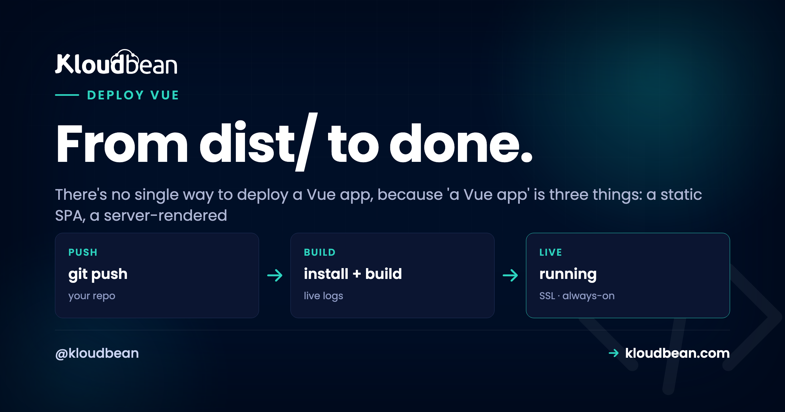

# How to Deploy a Vue App: It Depends on How You Built It

You built a Vue app, you're ready to ship, and the deploy guide you found doesn't match what your project actually produces. That's not you doing something wrong.

It's that "a Vue app" is really three different things, and each one deploys a completely different way. A client-side SPA is a pile of static files. A Nuxt app is a live Node server. A prerendered site is a folder of HTML. Send the wrong shape down the wrong path and you get 404s on refresh, blank pages, or a server bill for files that never needed a server. So the fastest way to deploy a Vue app is to name your shape first, then follow the short path for it.

> **Short answer:** Vue ships in three shapes. A client-side SPA (Vite) builds to static files in `dist/`: host them on object storage plus a CDN, and add a SPA fallback so route refreshes don't 404. A Nuxt SSR app is a live Node server (`node .output/server/index.mjs`): deploy it like any Node app on a port. A prerendered site (`nuxi generate`) is static HTML in `.output/public`. Match the shape to the target and Vue deploys in minutes.

## Three shapes, three deploy targets

Here's the whole decision on one screen. Find your row, then read the matching section below.

| Shape | Build output | What runs | Hosted on | Watch out for |
|---|---|---|---|---|
| **SPA (Vite)** | `dist/` static files | Nothing | Storage + CDN | Route refresh 404 |
| **Nuxt SSR** | `.output/server` | A Node process | A server, on a port | Must stay running |
| **Prerendered** | `.output/public` | Nothing | Storage + CDN | Rebuild to update |

Two of the three are just files, which is the cheap, easy path. Only Nuxt SSR needs a running server. That's the single most important fact here, so let's see it drawn out.

```
One Vue codebase, three shapes, three targets

                     SPA (Vite)      dist/           ->  Static host + CDN (+ SPA fallback)
  Your Vue app  -->  Nuxt SSR        .output/server  ->  Node process on a server (a port)
                     Prerendered     .output/public  ->  Object storage + CDN (no server)
```

## Not sure which you built? Look at the output

You don't have to guess. Run your build and look at what folder appears. The output tells you the shape:

```bash
npm run build

# SPA (Vite):        creates  dist/  with an index.html
# Nuxt (SSR):        creates  .output/server/index.mjs
# Nuxt (generate):   creates  .output/public/  (static HTML)
```

See a `dist/` folder with one `index.html`? You've got a single-page app, the most common Vue setup. See `.output/server`? That's Nuxt in SSR mode, a Node server. See `.output/public` full of HTML files? That's a prerendered static site. Now you know which path is yours.

## Shape 1: the SPA (this is most Vue apps)

Your build produces a `dist/` folder of static files. There's no server to run. These files just need to reach browsers fast, so the "host" is really static hosting plus a CDN. Set the build command to `npm run build`, point the platform at the `dist/` output, and you're live.

Because the output is just files, their natural home is object storage behind a CDN, which is cheap, fast, and effortless to scale. The files sit in a bucket, the CDN serves them from close to each visitor, and there's no app process to keep alive or patch.


One small win worth setting up while you're here: Vite adds a content hash to your built filenames (like `app.4f2a1c.js`). That means you can cache those hashed assets for a long time and only your `index.html` needs a short cache. New deploys change the hashed names, so browsers fetch the fresh files automatically without any stale-cache headaches. If you want the files in a bucket you fully control, here's the rundown on [S3-compatible object storage](https://www.kloudbean.com/blog/s3-compatible-object-storage/), and on pointing a [custom domain with free SSL](https://www.kloudbean.com/blog/custom-domain-and-ssl-for-your-app/) at it.

<!-- ADD IMAGE: your dist/ folder after npm run build, with the hashed asset filenames visible -->

## The bug that hits every SPA once: refresh a route, get a 404

This one catches nearly every SPA author exactly once, and it always shows up at the worst time. Vue Router in history mode gives you clean URLs like `/dashboard`:

```js
import { createRouter, createWebHistory } from 'vue-router';

const router = createRouter({
  history: createWebHistory(),  // clean URLs like /dashboard
  routes,
});
```

Click around inside the app and everything works, because Vue Router handles the navigation in the browser. But when a visitor **refreshes** on `/dashboard`, or opens a deep link to it directly, the request goes to the server. The server looks for a file at `/dashboard`, there isn't one (the only real file is `index.html`), and it returns a 404.

A pattern we see constantly: the app works flawlessly in dev, ships as static, and the first person to reload `/pricing` hits a 404 and files a bug. The fix is a **SPA fallback**: tell the host to serve `index.html` for any path it doesn't recognize, so Vue Router boots up and renders the right view. On Nginx that's one line:

```bash
# serve index.html for any path that isn't a real file
location / {
  try_files $uri $uri/ /index.html;
}
```

On a static host it's usually a single "redirect all unmatched routes to /index.html with a 200" rule. Set it once and refreshes stop breaking. Skip it and everything looks fine right up until the first hard refresh, which is exactly when a real user finds it. So do it on day one, not after the bug report.

<!-- ADD IMAGE: the 404 a Vue Router route shows on refresh before you add a SPA fallback -->

## Shape 2: Nuxt SSR (a live Node server)

If you chose server-side rendering, your app isn't a pile of static files. It's a live Node server that renders each page on request. So you deploy it the way you'd deploy any Node app:

```bash
npm run build                    # Nuxt/Nitro writes .output/
node .output/server/index.mjs    # boots the SSR server (reads PORT/HOST)
```

Connect the repo, set the build command, set the start command that boots the server, and make sure it listens on the assigned `$PORT`. It runs as an always-on process the platform keeps alive and restarts if it crashes. You get SSR's real benefits, faster first paint and better SEO for content pages, at the cost of running an actual server. That's a fair trade when you need it.


This is the same flow as the [deploy a Node app guide](https://www.kloudbean.com/blog/deploy-node-app-to-managed-cloud/), and it applies to Nuxt unchanged. The classic SSR pitfall is the port: if the process starts but you hard-coded a port instead of reading `$PORT`, requests never reach it and you get a 503. If that happens, here's the [503-after-deploy fix](https://www.kloudbean.com/blog/fix-503-after-deploying-your-app/). If you don't actually need server rendering, though, the SPA path above is simpler and cheaper. Don't run a server you don't need.

## Shape 3: prerendered with nuxi generate

If your Nuxt setup prerenders pages to HTML at build time, treat it like the SPA case:

```bash
npx nuxi generate     # prerenders your site to .output/public
# publish .output/public to object storage behind a CDN
```

Build, publish the output folder to object storage, serve over a CDN. You may not even need the SPA fallback rule, because every route already has its own real HTML file. This is the simplest shape of all: pure files, no server, no fallback logic. Worth choosing deliberately if your app is mostly content and you want the SEO of real HTML without running a process.

## The VITE_ env-var trap that catches everyone

Whatever shape you built, there's one Vue-specific gotcha around environment variables, and it burns people who assume env vars behave like they do on a backend. In a Vite-built Vue app, only variables prefixed `VITE_` reach your client code, and they're **baked into the JavaScript at build time**, not read at runtime:

```bash
# .env  (only VITE_-prefixed vars are exposed to the browser)
VITE_API_URL=https://api.example.com

# a value like DB_PASSWORD is NOT exposed to the client...
# ...but never make it a VITE_ var either, or it would be
```

```js
// anywhere in your Vue app
const apiUrl = import.meta.env.VITE_API_URL;
```

Two consequences follow, and both matter. First, anything `VITE_` ships to the browser in plain text, so it's public by definition. Putting a secret in a `VITE_` var is the mistake I hate finding in a code review, because by then it's already shipped to every visitor. Keep real secrets on your backend. Second, to *change* a `VITE_` value (say your API URL), you have to **rebuild**. Editing an environment value on the server after the build won't touch the already-compiled files. So a Vue frontend's env vars are build-time config, and changing them means a new build.


There's a fuller treatment of this in [environment variables done right](https://www.kloudbean.com/blog/environment-variables-done-right/), including how build-time and runtime config differ. For a Nuxt SSR app, server-only secrets live in runtime config and stay on the server, which is the other half of the story.

<!-- ADD IMAGE: your build-time VITE_ variables set in the dashboard before a deploy -->

## Talking to your API without CORS headaches

Most Vue apps call an API. If that API lives on a different domain, the browser enforces CORS and blocks the request unless the API explicitly allows your origin. You'll see it in the console as a blocked cross-origin request. Two clean ways around it. Serve the app and API under the **same domain** (frontend at `example.com`, API at `example.com/api`) so there's no cross-origin call at all. Or configure the API to send the right CORS headers for your frontend's origin. Same-domain is usually the least fuss and the fastest, since it sidesteps the extra preflight round-trips entirely. If you're hosting the SPA and a Node API together, this is a good reason to keep both on one platform. See [deploying a full-stack app to production](https://www.kloudbean.com/blog/deploy-fullstack-react-app-to-production/) for the same-domain pattern in practice.

> **Coming from Netlify or Vercel?** They auto-detect a Vite SPA and add the fallback rule for you, which is a nice touch. The tradeoff is a build-minute meter and less control over the box. On Kloudbean the SPA is your files in a bucket behind a CDN, and a Nuxt server is a real Node process you own, both in one dashboard with your databases and storage. Astro splits the same static-vs-server way, so if you run both, here's [deploying an Astro app](https://www.kloudbean.com/blog/deploy-astro-app/).

## So which shape should you build?

For most apps, build the SPA and ship static files. It's the cheapest, most reliable shape, and it scales for free on a CDN. Reach for Nuxt SSR when you genuinely need server rendering: content pages that live or die on SEO, or a slow first paint you have to fix. Reach for prerendering when the content is mostly fixed and you want real HTML without a running server. The good news is you're choosing a build mode, not a host. All three land comfortably on the same platform, so a change of heart later is a config change, not a migration. Set your build command, wire up [auto-deploy from GitHub](https://www.kloudbean.com/blog/ci-cd-auto-deploy-from-github/), and every push ships the right shape.

---

**Name your shape, then ship it.** Host a Vue SPA as static files or run a Nuxt server as a live process, both on Kloudbean, both in one dashboard. Start free at [kloudbean.com](https://www.kloudbean.com/), compare plans on [pricing](https://www.kloudbean.com/pricing/).

Static SPA hosting · Custom domain + SSL · Node process for SSR · Git auto-deploy · Live build logs · Free trial

## FAQ

**How do I deploy a Vue app?**
First decide what you built. A plain SPA builds to static files in `dist/`, which you publish to object storage behind a CDN with a SPA fallback rule. A server-rendered Nuxt app is a Node server, so you deploy it like any Node app with a build and start command bound to `$PORT`. A prerendered site is served as static files. The path depends on the shape.

**Why does my Vue app 404 when I refresh a page?**
Because Vue Router's history mode uses clean URLs, but the server has no real file at that path, so it returns 404. Add a SPA fallback that serves `index.html` for unrecognized routes, and Vue Router will render the correct view. On Nginx it's a one-line `try_files` rule; on a static host it's a redirect-all-to-index rule.

**Do I need a server to host a Vue app?**
Only if you use server-side rendering (Nuxt SSR). A standard client-rendered SPA is just static files and needs no app server. Object storage plus a CDN is enough, and it's cheaper and simpler to run.

**How do I deploy a Nuxt app?**
For SSR, run `npm run build` and start the server with `node .output/server/index.mjs`, bound to the assigned port. Deploy it as an application on a server the platform keeps running. For a static Nuxt site, run `npx nuxi generate` and publish the `.output/public` folder to object storage behind a CDN.

**Why don't my environment variable changes take effect in Vue?**
In a Vite-built app, `VITE_` variables are baked in at build time, not read at runtime. To change one, you must rebuild. Editing a value on the server after the build won't touch the compiled files, so a Vue frontend's env vars are build-time config.

**Can I put secrets in VITE_ environment variables?**
No. Any `VITE_` variable is compiled into the JavaScript and shipped to the browser in plain text, so it's public. Use `VITE_` vars only for non-secret config like an API base URL. Keep real secrets on your backend or, for Nuxt SSR, in server-only runtime config.

**How do I fix CORS errors between my Vue app and API?**
Either serve the frontend and API under the same domain (app at the root, API under `/api`) so there's no cross-origin request, or configure the API to send CORS headers that allow your frontend's origin. Same-domain is usually the simplest and avoids preflight round-trips.

**Static SPA or Nuxt SSR, which is faster?**
They're fast in different ways. A static SPA loads its shell instantly from a CDN, then renders in the browser. Nuxt SSR sends fully rendered HTML on the first request, which helps first paint and SEO on content pages, but it needs a running server. For most apps a CDN-served SPA is plenty; choose SSR when SEO or first paint is a real requirement.

**Can I host a Vue SPA and a Node API together?**
Yes, and it's a common setup. Serve the SPA's static files and run the API as a Node app on the same platform, ideally under one domain so you skip CORS entirely. Keeping both in one dashboard also means shared SSL, backups, and deploys.

---

*By Kloudbean · From dist/ to done.*
