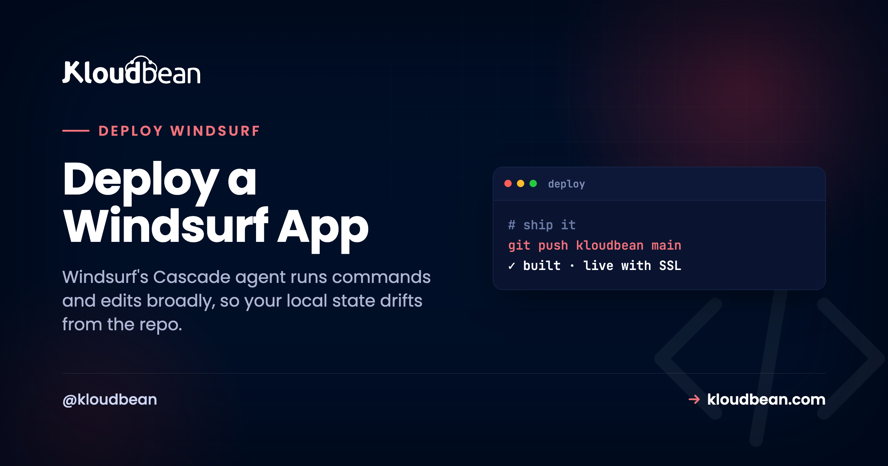

# Deploy a Windsurf App: Does It Build From a Clean Clone?

Windsurf is Codeium's agentic IDE, a VS Code fork where the Cascade agent writes and refactors real files across your project and runs terminal commands as it works. That leaves you with ordinary local code you own, in Git. It also leaves you a subtler problem than a browser builder does. To deploy a Windsurf app you need it to build somewhere that isn't your laptop, and your laptop has been quietly collecting state that Cascade created: a package it installed, a file it left untracked, an environment only you have.

So the question that actually predicts a clean deploy isn't "does it run for me?" It's "does it build from a fresh checkout of the repo?" Answer that first and the deploy is boring. This is a short readiness pass built around that one test, then the managed-server steps. For the shared basics every AI-built app needs (ports, env vars, databases), I'll point you at the pillar instead of repeating all of it here.

> **Short version:** Before deploying, prove the build is reproducible: clone your repo into a fresh folder, run a clean install, and build. If that works, the server will too. Commit your lockfile, pin your Node or Python version, then launch a server, connect the repo, set your build and start commands, and deploy.

## Why "it works in Cascade" isn't the same as deploying a Windsurf app

Cascade is powerful because it doesn't just suggest code, it acts. It installs packages, runs migrations, generates files, and edits across your project without waiting for you to type each command. Genuinely useful. The side effect is that your working directory slowly fills with state that isn't fully captured by what's committed to Git. A dependency the agent installed but never added to `package.json`. A build artifact sitting untracked. A tool that happens to be on your `PATH`. Every agentic tool leaves some version of this residue, which is why the first job when you [deploy a Claude Code app](https://www.kloudbean.com/blog/deploy-claude-code-app/) is reading the diff the agent left behind.

When you run the app locally, all of that invisible state is present, so it works. A server has none of it. It clones your repository into an empty directory and builds from exactly what's committed, nothing more. That's the whole gap in one sentence: local success proves the app runs in your accumulated environment, not that a clean machine can rebuild it. Reproduce it on your own terms first, or the server will do it for you at the worst moment.

<!-- ADD IMAGE: the bridge-from-preview-to-production diagram. A navy Windsurf/local tower on the left and a green-outlined Production tower on the right, joined by a bridge deck carrying five checked planks: secrets in env vars, a managed database, a real build step, a domain with SSL, and an always-on process. -->
*Diagram: a bridge from the Windsurf preview on your laptop to production. The deck carries the five checked planks that close the gap: secrets in env vars, a managed database, a real build step, a domain with SSL, and an always-on process.*

## The clean-room test

Here's the check that catches most of it before you touch a console. Clone your repo into a throwaway folder, somewhere it can't see your project's `node_modules` or `.env`, and build it the way the server will:

```
# pretend to be the server: a fresh clone, nothing borrowed
cd /tmp
git clone https://github.com/you/your-app.git clean-check
cd clean-check

# install strictly from the lockfile, then build and start
npm ci
npm run build
npm start
```

Two things make this honest. The `/tmp` location means the clone can't quietly reuse packages or config from your real project folder. And `npm ci` installs strictly from the lockfile and refuses to run if the lockfile is missing or out of sync, which is exactly the failure a server would hit. If this builds and starts, your deploy will too. If it doesn't, congratulations, you just found your deploy failure on your own machine, for free, with a real error message to read instead of a 503. Python's the same idea with a fresh virtualenv:

```
python -m venv .venv && source .venv/bin/activate
pip install -r requirements.txt
```

<!-- ADD IMAGE: a terminal running the clean-room test, git clone into /tmp then npm ci and npm run build finishing green -->

## The readiness checklist

The clean-room test surfaces most problems, but here's what it's really checking, so you know what to fix when a row fails.

| Check | How to confirm | Why it matters |
| --- | --- | --- |
| Lockfile committed | a `git ls-files` check shows the lockfile is tracked | A clean install reproduces the exact versions you tested |
| Runtime pinned | `engines` in `package.json`, a `.nvmrc`, or `runtime.txt` | The server builds on your version, not whatever's default |
| Builds without your .env | the clean clone builds with no secrets present | Missing config shows up now, not as a 503 later |
| Binds the assigned port | no hard-coded `3000` or `8000`; reads `process.env.PORT` | The platform picks the port; a fixed one never sees traffic |
| No global-only deps | the fresh `npm ci` has everything it needs | Cascade may have installed a tool globally that isn't in `package.json` |

The first two rows are worth doing deliberately. Commit the lockfile (`package-lock.json`, `pnpm-lock.yaml`, `yarn.lock`, or a pinned `requirements.txt`), and pin the runtime so the server doesn't quietly build on a different Node major than you did:

```
// package.json
{ "engines": { "node": "20.x" } }
```

## The quick fixes the clean room will flag

When the test fails, it's usually one of the same handful of things every AI-built app hits. Told briefly here, because the [deploy an AI-built app](https://www.kloudbean.com/blog/deploy-ai-built-app-to-production/) pillar covers each in depth:

- **A hard-coded port.** If Cascade wrote `app.listen(3000)`, change it to `process.env.PORT`. The full list of localhost assumptions is in the [localhost-trap writeup](https://www.kloudbean.com/blog/deploy-cursor-app/).
- **Local `.env` values.** They live on your machine; they have to be set on the server. The runtime-versus-build-time details are in [environment variables, done right](https://www.kloudbean.com/blog/environment-variables-done-right/).
- **A local or dev database.** Swap it for a managed one and point a connection string at it. See [adding a managed database](https://www.kloudbean.com/blog/add-managed-database-to-your-app/).

One nice trick that plays to Windsurf's strength: before you deploy, ask Cascade to run the clean-room test for you and report what broke. It can read your whole codebase, so it'll tell you the exact install, build, and start commands, which environment variables the code actually reads, and whether a port is hard-coded anywhere. That conversation removes most first-deploy surprises.

## Deploy it on a server you own

Clean clone builds green? Push it to GitHub and take it to production. In the [Kloudbean](https://www.kloudbean.com/) console, click **Add Server**, pick a **Cloud Provider**, choose the stack Cascade built in (Node.js for a Node, Next, or Vue app; a Python stack works too), pick the nearest datacenter, and give it 2–4 GB for build headroom. **Launch Now** gives you a configured server in a few minutes, runtime and process manager and firewall and SSL included.


Open the app, go to **Application Administration → Deploy Code**, connect GitHub, paste your repository URL, choose the branch, and **Clone Repository**. Fill the runtime fields with the exact commands that just worked in your clean-room test: **App Directory**, **Port**, **runtime version**, and your **Install / Build / Start** commands. Because you validated them against a fresh clone, they'll behave the same here. Click **Pull & Deploy** and the build log streams live.


If your app stores data, launch a managed **Postgres** or **MySQL** from **DBS → Launch Database** and import your local schema. Then, in **Runtime Configuration → Environment Variables**, paste your `.env` via **Paste .env Content**, convert to key/value, and set the real values, pointing the database URL at the instance you just launched.


Add your custom domain under **Domain Aliases**, point DNS at the server, install a free **Let's Encrypt** certificate, and turn on **automated deployment** so every push rebuilds and ships. Your loop becomes: build with Cascade, commit, push, and production updates itself, on [a server you own](https://www.kloudbean.com/blog/ci-cd-auto-deploy-from-github/). Whatever framework Cascade built in, the flow is identical; only the Install/Build/Start commands and runtime change.

<!-- ADD IMAGE: your Windsurf app live on its custom domain with the SSL padlock in the address bar -->

## If it 503s anyway

If you ran the clean-room test, a **503** is now unlikely, and when it happens it's almost always a missing environment variable or a database URL still pointing at your local machine. A 503 means the process isn't running, and the reason is written down. Go to **Application Administration**, then **Logs Viewer**, and open the **App Errors** tab, which is your `app.error.log`. Use the search box if you already have a guess. **App Info** (`app.info.log`) sits alongside it, and **Web Requests Logs** holds the access log for every request served. Those two files are also on disk at `/home/admin/hosted-sites/<app_system_user>/app-logs` if you prefer the File Manager. The full [503 playbook](https://www.kloudbean.com/blog/fix-503-after-deploying-your-app/) has the rest.

## deploy a Windsurf App will not fix everything

Kloudbean runs Linux stacks: Node, Python, PHP, Ruby, and Java, with frameworks like React, Next.js, Vue, Django, and Laravel on top. That spans what Windsurf typically builds. Premium and Enterprise carry Windows Server, and .NET runs on Linux regardless. "Managed" means the server, stack, SSL, backups, and patching are handled; you own and maintain the application. Since Cascade already hands you real, owned code, this is just the matching home for running it, and a full-stack build lands its front end, API, and database on [the one server](https://www.kloudbean.com/blog/host-app-api-and-database-on-one-server/).

**If it builds clean, it ships clean.** Take your Windsurf app to production at [kloudbean.com](https://www.kloudbean.com/), with a free trial and your first migration done for you. Plans on [pricing](https://www.kloudbean.com/pricing/).

## FAQ

**How do I deploy an app I built in Windsurf?**
Confirm the build is reproducible with the clean-room test, then push to GitHub and deploy on Kloudbean: launch a server, connect the repo in Deploy Code, set your install/build/start commands, add a database and environment variables, and point your domain with SSL. Windsurf produces standard code, so it deploys like any app.

**Why does my Windsurf app build locally but fail on the server?**
Because your local machine has state the repo doesn't. Cascade may have installed a package globally, left a dependency out of `package.json`, or built against a runtime version the server doesn't use. The server builds from a clean clone, so reproduce that: clone into a fresh folder, run `npm ci`, and build. Whatever fails there is your deploy bug.

**What is the clean-room test?**
Cloning your repo into an empty folder (like `/tmp`), running a strict install (`npm ci` or `pip install -r requirements.txt`), and building. It mimics exactly what the server does, so it catches missing lockfiles, unpinned runtimes, and global dependencies before you deploy rather than after.

**Do I need to export anything from Windsurf?**
No. Windsurf edits real local files, so there's nothing to export. Your code is already on your machine and, ideally, in Git. Push it to GitHub and deploy from there.

**Does it matter which framework Cascade used?**
Not for the flow. Node, Next.js, Vue, and Python all deploy the same way through Deploy Code. Only the install, build, and start commands and the runtime version differ, which is exactly what your clean-room test already confirmed.

**How do my environment variables get to the server?**
You move them. Paste your local `.env` into Runtime Configuration, Environment Variables using the Paste .env Content tab, convert to key/value, and save. Point the database values at your new managed database, and never commit the `.env` itself.
