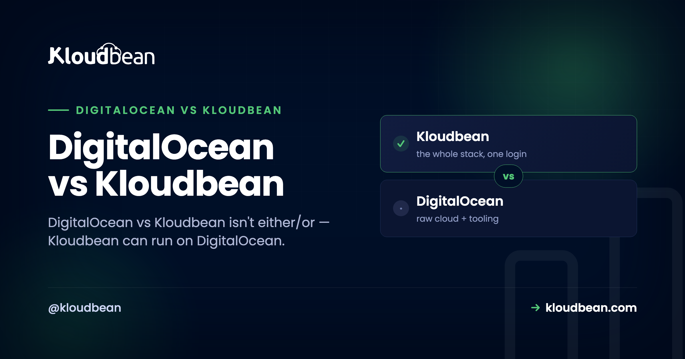

# DigitalOcean vs Kloudbean: Which Should Host Your App?

Let's be fair to DigitalOcean up front, because it earned it. It made cloud hosting approachable for a whole generation. Predictable pricing, documentation that actually teaches, a droplet you can spin up in a minute. So a DigitalOcean vs Kloudbean piece has an odd twist to get out of the way immediately: these two aren't really rivals, because Kloudbean can run on DigitalOcean. DigitalOcean is one of the seven clouds Kloudbean deploys to. The honest question isn't "which company wins." It's whether you want to manage a droplet yourself, or have that same droplet managed for you.

> **Short answer:** DigitalOcean vs Kloudbean isn't either/or. Kloudbean can provision and manage a server on DigitalOcean's own infrastructure, so the real comparison is a raw droplet you run yourself versus the same DigitalOcean box with a managed layer on top. On a raw droplet you own the OS patching, firewall, web stack, SSL, backups, deploy pipeline, and monitoring. With Kloudbean managing it, those are handled and you just ship. Raw DO wins on price and total control if you have the ops time. Kloudbean wins if you'd rather build product than run a server.

## The twist: this comparison runs on the same infrastructure

Most "X vs Y" hosting pieces pit two networks against each other. This one can't, honestly, because the two options can share a network. DigitalOcean sells you infrastructure: a droplet is a clean Linux virtual machine at a fair price, and their managed databases, Spaces object storage, and load balancers are solid building blocks if you want to assemble a stack yourself. Kloudbean sells you a managed layer, and it will happily put that layer on a DigitalOcean droplet.

So the catch that trips people up in a "DigitalOcean alternative" search is that Kloudbean isn't an alternative to DigitalOcean's hardware. It's an alternative to doing the server administration yourself. Same infrastructure underneath, different amount of work landing on you. That reframes the whole decision from "whose cloud" to "who does the ops."

| Raw droplet: you manage | Kloudbean on DigitalOcean: handled |
| --- | --- |
| OS patching, firewall, web server, SSL renewal, backups, deploy pipeline, monitoring | The same jobs, handled for you |

*The box underneath is the same DigitalOcean droplet either way. The only thing that changes is the stack of responsibilities above it, and whether they land on you or get handled.*

## DigitalOcean vs Kloudbean: who does what

A droplet is an empty Linux box. That's its strength and its bill of chores. Everything above the operating system is your job, forever, not just on day one. Here's the same server run two ways, task by task.

| The job | Raw DigitalOcean droplet | Kloudbean on DigitalOcean |
| --- | --- | --- |
| OS + security patching | You, indefinitely | Handled |
| Firewall | You configure and maintain it | Configured (Shorewall + Fail2ban) |
| Web server / reverse proxy | You install and tune it | Set up for you |
| SSL + renewal | You run certbot, and remember to renew | Free SSL, auto-renewed |
| Backups | You script them, or pay for snapshots | Automatic backups |
| Deploy pipeline | You build it (SSH, scripts, or your own CI) | Connect a repo, Pull and Deploy |
| Monitoring | You wire it up | Built in |
| Databases | Install and secure yourself, or add DO's managed DB | Launch a managed DB on the same box |

Neither column is wrong. The left is what you sign up for with a raw droplet, and plenty of developers do it well and enjoy it. The right is what a managed layer folds into the plan. The choice is really about which of those two lists you want to own.

## The first hour, two ways

The clearest way to feel the difference is a fresh deploy. On a raw droplet, "deploy" starts with a checklist that has nothing to do with your app yet.

```
# a raw droplet starts empty. a rough first hour:
apt update
apt upgrade -y
ufw allow OpenSSH
ufw allow 'Nginx Full'
ufw enable
apt install -y nginx postgresql
# install Node, write the reverse-proxy config, set up pm2...
certbot --nginx -d yourdomain.com   # then remember to renew it later
```

That's satisfying if server work is your thing. If it isn't, it's a wall of chores between you and a running app. With Kloudbean managing a droplet, the same first hour is a form. And this is the screen where the "not either/or" point stops being abstract: you pick DigitalOcean as the cloud provider, on the same infrastructure you'd have rented directly.


Then deploying your code is connecting a repo instead of scripting it by hand.


The database lands on the same server too, which is the honest answer to the "managed DigitalOcean hosting" question. Instead of standing up Postgres by hand or paying for DO's managed database as a separate product across the network, you launch one on the box.


You can launch Postgres, MySQL, MariaDB, Redis, MongoDB, or Elasticsearch next to the app, reached over the local network. There's more on that in the [app, API, and database on one server](https://www.kloudbean.com/blog/host-app-api-and-database-on-one-server/) guide.

<!-- ADD IMAGE: A raw droplet SSH session mid-setup (apt, ufw, certbot) next to the DigitalOcean control panel, to show the hands-on side fairly. -->

## The part that outlasts setup

Setup is the part everyone compares, and it's the part that matters least six months in. A server isn't a one-time build. It's a standing responsibility. And the droplets that get people into trouble are almost never hacked in some clever way. It's an expired SSL certificate that took the site down on a Sunday. A disk that filled up with logs nobody rotated. A security update that sat unapplied for the better part of a year because everything seemed fine. Boring failures, every one, and all of them the kind that stay invisible until the exact moment they aren't.

Here's where I'll take a side. A raw droplet is the right tool when running the server is part of the project, when you want that control and you'll actually keep up with it. But the common mistake isn't picking a droplet. It's picking a droplet and then treating it like it's managed: set up once, patched never, backed up "eventually." If the server is just the place your product happens to live, paying so you never have to think about the patch cadence is usually the better trade. That's the argument we make at more length in [managed vs unmanaged hosting](https://www.kloudbean.com/blog/managed-vs-unmanaged-hosting/) and [the real cost of an unmanaged VPS](https://www.kloudbean.com/blog/the-real-cost-of-unmanaged-vps/).

## When a raw DigitalOcean droplet is the right call

This is a real choice, not a setup for a sales pitch, so here's the genuine case for going direct. Use a raw droplet when you're comfortable with server administration and you want the cheapest raw compute, when you actively want full control down to the OS and consider that part of the fun rather than a chore, or when you specifically want to wire together DigitalOcean's own building blocks like managed Kubernetes, Spaces, or their standalone managed database yourself. If your time is cheaper than your budget, or you simply enjoy the work, DigitalOcean direct is a fine, honest answer. No managed layer needed.

## When the managed layer wins (and the multi-cloud bonus)

Kloudbean is the better fit when you'd rather ship than administer, when you want the app, API, and database on one server with SSL and backups handled at a predictable price, or when you're deploying something from Lovable, Cursor, or Bolt and the last thing you want is to become a sysadmin to get it live. There's also a bonus a raw droplet can't give you: you're not married to DigitalOcean. Because Kloudbean runs on seven clouds, you can start on DigitalOcean today and move the same setup to AWS, Google Cloud, Linode, Vultr, UpCloud, or Lightsail later, behind one console, without relearning everything. You keep DO if you love it. You keep the exit if you don't. The same raw-versus-managed tradeoff plays out on Google's cloud too, which I walk through in [Google Cloud vs Kloudbean](https://www.kloudbean.com/blog/gcp-vs-kloudbean/).

## A fair word on cost

Raw droplets are cheaper than a managed server, and they should be. You're supplying labor that a managed plan builds in. The honest frame is total cost, not the sticker. A droplet's monthly price is low, but the hours you spend configuring, securing, and maintaining it are real, and so is the risk of getting SSL or backups wrong at the worst time. A managed server costs a bit more and buys that time and risk back. If your schedule is tighter than your budget, managed wins. If your budget is tighter than your schedule, or the ops are genuinely fun for you, the droplet wins. Both are legitimate.

## Where this approach runs out

Kloudbean runs Linux web stacks: Node, PHP, Python, Ruby, Java, and frameworks like React, Vue, Angular, Laravel, Django, and WordPress. Windows Server is a Premium and Enterprise option rather than a standard one, though .NET itself runs on Linux here. Standalone managed Kubernetes is also enterprise or custom rather than a default. "Managed" means Kloudbean runs the server, stack, SSL, patching, and backups; you still own your application and your data. That split is the whole point: you keep the app, someone else keeps the box healthy. And because it's standard Linux and standard code underneath, you can leave for a raw droplet, or anywhere else, whenever you want.

## Same infrastructure. Someone else keeps it healthy.

Run a managed server on DigitalOcean (or six other clouds) at [kloudbean.com](https://www.kloudbean.com/). One-click deploy, managed databases, free SSL, automatic backups, free migration, and a free trial. The full deploy walkthrough is [here](https://www.kloudbean.com/blog/deploy-ai-built-app-to-production/); plans on [pricing](https://www.kloudbean.com/pricing/).

## FAQ

**Is DigitalOcean vs Kloudbean an either/or choice?**
Not really. Kloudbean can provision and manage a server on DigitalOcean, which is one of its seven supported clouds. So you can have DigitalOcean's infrastructure and Kloudbean's managed layer at the same time. The real decision is whether you manage the droplet yourself or have it managed for you.

**Can I run Kloudbean on DigitalOcean's infrastructure?**
Yes. When you add a server, pick DigitalOcean as the cloud provider. You get DO's droplet underneath with Kloudbean's managed experience (one-click deploy, managed databases, free SSL, automatic backups, monitoring) on top.

**Is Kloudbean just a reseller of DigitalOcean?**
No. It's a managed hosting platform that can provision on seven clouds: DigitalOcean, AWS, AWS Lightsail, Google Cloud, Linode, Vultr, and UpCloud. DigitalOcean is one option. The value is the managed layer on top of whichever provider you pick, not reselling the raw compute.

**Is a DigitalOcean droplet cheaper than Kloudbean?**
On sticker price, yes, because you supply the setup and maintenance labor yourself. Kloudbean costs a bit more and does that work for you. The right answer depends on whether your time or your budget is the tighter constraint, and on how much you enjoy running servers.

**When should I just use a raw DigitalOcean droplet?**
When you're comfortable with server administration, want the cheapest raw compute, and will actually keep up with patching, SSL, and backups. Also when you want to assemble DigitalOcean's own pieces (managed Kubernetes, Spaces, standalone managed database) yourself. If ops is part of the project, go direct.

**How is this different from DigitalOcean App Platform?**
App Platform is DigitalOcean's PaaS: managed, but with PaaS-style pricing and build-and-runtime constraints. Kloudbean gives you a managed experience on a real server you can reason about, with the option to run on DigitalOcean or another cloud, and without per-resource metering shaping your architecture. If you found App Platform limiting, it's a natural DigitalOcean App Platform alternative.

**Do I get a database when I run Kloudbean on DigitalOcean?**
Yes. You launch a managed database (Postgres, MySQL, MariaDB, Redis, MongoDB, or Elasticsearch) on the same server as the app, backed up and reached over the local network. No standing one up by hand, and no separate metered database product across the network.

**Can I move off Kloudbean later?**
Yes. It runs standard Linux and standard code, so you're never trapped. You can move to a raw droplet you manage yourself, or to another host, whenever you want. The exit door is part of the design.
