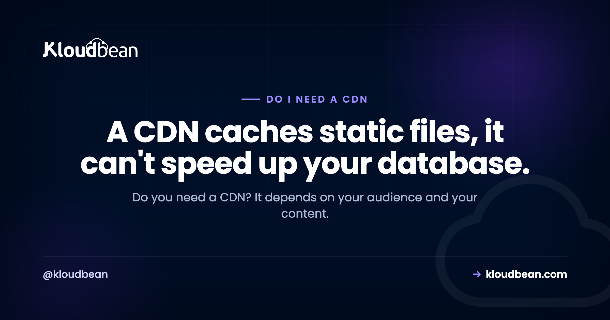

# Do I Need a CDN? An Honest Answer

By Kloudbean Engineering · A CDN caches static files, it can't speed up your database.

"Do I need a CDN?" usually gets a reflexive yes, as if every website is quietly losing out without one. The truth is calmer than that. A CDN is genuinely useful for some sites and close to pointless for others, and which camp you land in comes down to two things: where your visitors are, and what kind of content you serve. So let's skip the sales pitch and work out whether you actually need one.

> **The short answer.** It depends, mostly on two things: how spread out your audience is, and how much of your content is static. A CDN caches static files (images, video, CSS, JavaScript) at edge locations near your users, which cuts latency, takes load off your origin server, and softens traffic spikes. If your audience is global or your site is asset-heavy, it helps a lot. If you serve a small local audience or mostly dynamic, per-user pages, it does very little. A CDN speeds up static content. It can't speed up your database.

## The honest answer: it depends on two things

Most "do I need a CDN" advice skips the part that actually decides it. The answer isn't a universal yes or no. It turns on two questions, and once you answer them the rest falls into place.

The first is **where your visitors are**. A CDN's core trick is physical: it keeps copies of your files close to people, so bytes travel a shorter distance. If your users are scattered across continents, that distance is real and a CDN shrinks it. If nearly everyone who visits sits in the same region as your server, there's not much distance to cut, so there's not much to gain.

The second is **what your content is made of**. A CDN caches static things, files that look identical for every visitor. The more of your site is static, the more a CDN can do. The more of it is generated fresh for each user, the less a CDN touches. Answer those two honestly and you already know most of your answer. Is a CDN necessary for you, or just fashionable? That's the real question.

## What a CDN actually does

Quick version, because the mechanics have their own home. A CDN (content delivery network) is a fleet of servers spread across many locations, often called edge nodes or points of presence. It stores copies of your static files on those servers. When someone requests one, the copy is served from the location nearest them instead of from your single origin server far away.

That buys you a few real things. **Lower latency**, because a nearby server answers faster than a distant one. **Less origin load**, because cached requests never reach your server, freeing it for the work only it can do. **Spike absorption**, because the edge fleet soaks up bursts of traffic that would otherwise flood one machine. And a **basic buffer against floods**, since a large distributed network can absorb a lot before your origin feels it, though that isn't full protection on its own (more on that in [DDoS protection explained](https://www.kloudbean.com/blog/ddos-protection-explained/)).

Those are the CDN benefits worth caring about. If you want the full picture of caching, TTLs, and how the edge decides what to store, [how a CDN works](https://www.kloudbean.com/blog/cdn-explained/) covers the mechanics in depth. This page is about whether you need one, so let's stay on that.

## The one thing a CDN can't speed up

This is the part the reflexive "just add a CDN" crowd skips, and it's the most important thing on this page. A CDN caches content that's the same for everyone. It cannot cache a response that's unique to one user or that changes constantly.

Think about what that rules out. A logged-in dashboard is built fresh for each account. A personalized feed differs for every visitor. A shopping cart total, a search result tied to a user, most authenticated API calls, these are generated on the spot by your origin. A CDN can't hand out a cached copy of something that has to be computed per request, so those responses still travel to your origin every single time.

So a CDN is not a magic "make my app fast" button. If your app feels slow because of a heavy database query or slow server-side rendering, a CDN does nothing for that. You fix the origin: the query, the code, the server size. Reaching for a CDN to solve a dynamic-performance problem is a common and expensive mistake. Cache what everyone shares. What's unique per user is a different problem with a different fix.

<!-- ADD IMAGE: two request paths. A static file (image, CSS, JS) is served from the green CDN edge near the visitor, fast. A dynamic per-user request (dashboard, API) passes through the edge and travels on to the navy origin server every time. Brand colors navy #000f27, purple #4F1AF3, green #40b75f. -->

*A CDN answers static requests at the edge. Per-user responses can't be cached, so they still travel to your origin.*

## When you clearly need a CDN

There are situations where a CDN is an easy yes, and it's worth being just as clear about these as about the doubts.

**Your audience is spread across the world.** If people load your site from different continents, the distance to a single origin is a genuine drag. Edge nodes near your users cut that round trip, and the further-flung your audience, the bigger the win. This is the classic case a CDN was built for.

**Your site is heavy on images, video, or downloads.** Big static files are exactly what edge caching handles best. Serving them from the edge is faster for the visitor and takes a real load off your origin. If you keep those assets in [S3-compatible object storage](https://www.kloudbean.com/blog/s3-compatible-object-storage/), a CDN in front of the bucket is a natural pairing. Note that the two save you different things. The CDN saves the round trip; cheap or unmetered egress saves the bandwidth bill. Kloudbean's built-in S3-compatible buckets don't meter data transfer out, which changes the maths for a media-heavy site (that applies to the built-in S3 storage specifically, not to managed GCS buckets, which do bill egress and ingress). Read [zero-egress object storage](https://www.kloudbean.com/blog/zero-egress-object-storage/) if bandwidth is your actual pain rather than latency.

**You run a static site.** Marketing sites, documentation, blogs, and most JAMstack builds are nearly all static. When almost everything is cacheable, a CDN speeds up almost everything. For this kind of site the decision is close to automatic. It's also the case where the cost calculation is easiest: Kloudbean's static site hosting is free, with a custom domain and SSL included, so if you host the site there the only question left is whether the edge add-on is worth its own line. For a docs site with an international readership, usually yes.

**Your traffic is spiky.** Launches, campaigns, a post that takes off. If your traffic arrives in sudden waves, the edge fleet absorbs the surge and shields your origin from the worst of it. That protection alone can be worth it even for a regional audience.

## When a CDN barely matters yet

Now the other side, honestly, because a CDN you don't need is just spend and config with nothing to show for it.

**Your audience is small and local.** If nearly all your visitors are in one city or country and your server is near them already, there's little distance for a CDN to cut. A CDN for a small site with a regional audience is rarely wrong, but it's rarely the thing that moves the needle either. Your time is better spent elsewhere first.

**Your app is mostly dynamic and per-user.** If most requests return content built fresh for each user (a dashboard, an authenticated API, live data), the CDN mostly passes them through to your origin. You get the DDoS buffer and not much speed. When a dynamic app is slow under load, the fix is usually to scale the origin itself, which is where a [cloud load balancer](https://www.kloudbean.com/blog/cloud-load-balancer-explained/) and a bigger or better-tuned server do the real work.

**You're early and low-traffic.** If you're pre-launch or serving a handful of users a day, a CDN is premature. It's not harmful, it's just solving a problem you don't have yet. Ship, get real traffic, then add a CDN when the shape of that traffic tells you to. None of this means "never." It means "not the highest-value move right now."

## What a CDN caches, and what it can't

The whole decision really rides on one distinction: static versus dynamic. Here's the split in plain terms, because if you can sort your own content into these two columns, you've basically made the call.

| Type of content | Cached at the edge? | What that means for you |
| --- | --- | --- |
| Images, video, fonts | Yes | Served fast from a nearby location, big win if you have a lot |
| CSS and JavaScript files | Yes | Fewer round trips to your origin on every page load |
| Static and marketing pages, docs | Yes | Ideal fit, especially for a global audience |
| Logged-in dashboards | No | Built per user, so your origin serves them either way |
| Authenticated API responses | Usually no | The CDN passes them through, no speed gain |
| Live or changing data | No | Caching it would serve stale results, so it stays dynamic |

The pattern is simple. The more rows your site lives in at the top of that table, the more a CDN helps. If your traffic is mostly the bottom three rows, a CDN is a thin win for speed and you should look at your origin instead.

## A quick way to decide if you need a CDN

You don't need a long analysis. Find the row that sounds like you and you have your answer. When do I need a CDN? Roughly, when this table says yes.

| Your situation | Is a CDN worth it? |
| --- | --- |
| Global audience, asset-heavy site | Yes, a clear win |
| Static site, marketing site, or docs | Yes, easy and usually cheap |
| Spiky, campaign, or launch traffic | Yes, it absorbs the surge and shields your origin |
| Small audience, all near your server | Not yet, little distance to cut |
| Mostly dynamic, per-user app or API | Little speed gain, though the traffic buffer can still help |
| You just want the app to feel faster | Fix the origin and database first, then reconsider |

Practically, on most managed platforms this is a switch rather than a project. On Kloudbean it's the Cloudflare add-on: paid on standard plans, included for Enterprise accounts. That shape matters for the decision, because it means you're not committing to an architecture. You're turning something on and can turn it off if your traffic says it wasn't the problem.

One more honest note on the security angle. A CDN does add a basic buffer against traffic floods, and for a public site that alone can justify it. But treat that as a helpful side effect, not a security plan. If flood protection is your actual worry, read [DDoS protection explained](https://www.kloudbean.com/blog/ddos-protection-explained/) and decide on that basis rather than assuming a CDN has it fully covered.

## The threshold: add a CDN the day one of these turns true

If you want one line to carry away, make it this. Don't add a CDN because you have a website. Add it the day one of these four crosses over, and until then leave it alone.

1. **Your analytics show real traffic from more than one region.** Not "we might go global one day." Actual sessions from another continent, in numbers you'd miss if they bounced. That's the latency you'd be buying back.
2. **Static assets are a visible share of your page weight or your bandwidth bill.** Images, video, fonts, big JavaScript bundles. If you can see them in a waterfall or on an invoice, the edge has something to do.
3. **You've had a traffic spike that hurt.** A launch, a campaign, a post that travelled. One bad afternoon is enough evidence.
4. **You want the flood buffer specifically.** A legitimate reason on its own, even for a purely local audience. Just decide it on that basis rather than filing it under speed.

None of those true yet? You don't need a CDN. That's a real answer, not a hedge, and it's the answer for most sites in their first year.

Here's the trap on the other side of the threshold, and it's the expensive one: none of those four is "the app feels slow." If a logged-in page takes three seconds to render, that time is being spent in your origin, on a query or a template or a cold connection pool, and a CDN cannot cache a page built for one user. No CDN on earth fixes an unindexed query. You'd add a layer, pay for it, and watch the number not move. Fix the origin, then reconsider whether the edge has anything left to do.

And if you're weighing a bundled edge product rather than the CDN slice of one, [whether you actually need Cloudflare, feature by feature](https://www.kloudbean.com/blog/do-i-need-cloudflare/) takes it apart properly. There's a lot in those bundles you may never touch.

---

**Add a CDN when your site actually needs one.** Hosting a static site? Kloudbean includes free static hosting with a custom domain and SSL, and a Cloudflare CDN add-on for when edge caching is worth it. See [kloudbean.com](https://www.kloudbean.com/) and [pricing](https://www.kloudbean.com/pricing/).

## FAQ

**Do I need a CDN?**
It depends on two things: how spread out your audience is, and how much of your content is static. If your visitors are global or your site is heavy on images, video, or static pages, a CDN clearly helps. If your audience is small and local, or your app is mostly dynamic and per-user, it does very little for speed. Decide from those two facts, not from habit.

**Is a CDN necessary for a small website?**
Usually not on day one. A CDN's main benefit is cutting the distance between your files and faraway users, so a small site serving a local audience has little to gain. It isn't harmful, it's just rarely the thing that matters most early on. Get real traffic first, then add a CDN if your audience spreads out or your static assets grow.

**When do I need a CDN?**
Reach for a CDN when your audience is spread across regions, when your site is asset-heavy with images or video, when you run a mostly static site, or when your traffic arrives in spikes. Those are the cases where edge caching and origin offload pay off. If none of them describe you yet, a CDN can wait.

**Does a CDN make my app faster?**
It speeds up static content, not dynamic responses. A CDN serves cached files like images, CSS, and JavaScript from a location near the user, which is faster. But a logged-in dashboard or a per-user API call is built fresh by your origin every time, so a CDN can't cache it. If your app feels slow because of the database or server code, a CDN won't fix that.

**Do I need a CDN if my audience is all in one country?**
Often not, at least not for speed. If your server sits in or near that country, the distance a CDN would cut is already small. The one case where it still helps is spiky traffic or a basic buffer against floods, which a CDN provides even for a regional audience. For raw speed alone, though, a local audience gains little.

**Does a CDN help with dynamic or per-user content?**
Not for speed. A CDN caches content that's identical for everyone, so anything generated per user or per request, like a personalized feed or an authenticated API response, can't be cached and still travels to your origin. To make dynamic responses faster you work on the origin itself: the queries, the code, and the server size or scaling.

**Is a CDN worth it for a static site?**
Yes, usually. A static site is nearly all cacheable content, so a CDN can speed up almost every request and take load off your origin. It's often cheap or bundled with static hosting, and the setup is simple. For marketing sites, documentation, and blogs, a CDN is close to an automatic yes.

**Does a CDN protect against DDoS attacks?**
It adds a basic buffer, not full protection. A large distributed edge network can absorb a lot of junk traffic before your origin feels it, which helps. But that's a side benefit, not a complete defense. If flood protection is a real concern, plan for it directly rather than assuming a CDN has it handled.

**Do I need a CDN for my website if it's a personal blog or portfolio?**
Only if it helps a real audience. A personal blog or portfolio with a small, mostly local readership gains little from a CDN. If your writing reaches readers in many countries, or the site is image-heavy, then edge caching starts to pay off. Match the decision to who actually visits.

---

*Kloudbean Engineering · Cache what everyone shares. Fix the origin for everything that's unique per user.*
