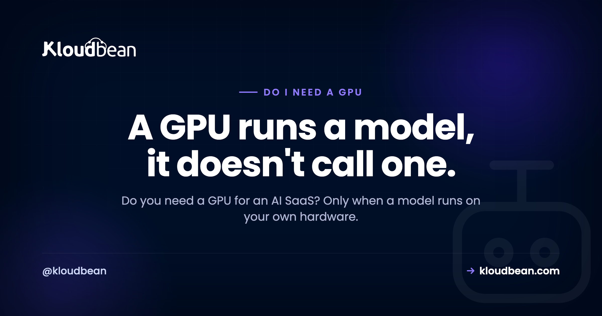

# Do I Need a GPU for an AI SaaS? A Clear Decision Map

By Kloudbean Engineering · A GPU runs a model, it doesn't call one.

You're building an AI SaaS, maybe scaffolded in Cursor or Lovable, and one worry keeps resurfacing: do I need a GPU for an AI SaaS, or are you about to pay for hardware you'll never touch? The honest answer splits along a single clean line. It depends on whether your app runs a model or just calls one. This is the whole map. Every common AI-SaaS workload, sorted into needs a GPU or doesn't, with the reason each way. No fear, no upsell, just the rule that settles it.

> **The short answer.** You need a GPU only when a model runs on your own hardware. Calling a hosted API (OpenAI, Anthropic, Gemini) needs none. Embeddings and retrieval for RAG through an API need none either, because the vector search runs on CPU in Postgres. Image and video generation through a hosted API also need no GPU. You do need one when you self-host an open LLM, run your own Stable Diffusion, or fine-tune or train a model. Most AI SaaS today call APIs, so most need no GPU at all.

## So, do I need a GPU for an AI SaaS?

Most likely no. Here's the part nobody says plainly: an AI SaaS is not automatically a GPU workload. The word "AI" describes what your product does for a user, not where the computation happens. And where the computation happens is the only thing a GPU cares about. If the heavy lifting, the model itself, runs on someone else's servers because you're calling an API, then your app is an ordinary web application. It wants a CPU, some memory, and a database. Not a GPU.

The confusion is understandable. "AI" and "GPU" get said in the same breath so often that they feel welded together. They aren't. A GPU is a tool for running a model's math quickly. If you never run a model, you never need the tool. So the useful question isn't "is this an AI app," it's "does a model run on my hardware." Answer that one and you've answered the GPU question for good.

## The one rule: run a model, or call one?

There's a single line that decides every case, and once you see it you can classify any workload yourself. You need a GPU when the model runs on your hardware. You don't when you call a model that runs on someone else's.

Calling a model means your code sends an HTTPS request to a provider (OpenAI, Anthropic, Google) carrying your prompt, and gets a response back. The weights, the GPUs, the whole serving stack, all of that lives on their side. Your server is just a client. It's the same shape as calling Stripe to take a payment. Running a model means you host the weights yourself and do the inference on a machine you rent or own. That's the moment a GPU stops being optional.

So the rule has nothing to do with how clever your product looks. A chatbot that calls GPT is "more AI" in a user's eyes than a script loading a small local model, yet only the second one needs a GPU. Match the hardware to where the model runs, not to how the feature is marketed.

## Which AI workloads need no GPU?

Start with the ones that don't, because that's most of them, and it's where teams waste the most money bracing for hardware they'll never boot.

- **Calling a hosted LLM API.** This is the big one. If your app calls OpenAI, Anthropic's Claude, or Google's Gemini, no GPU is involved on your side at all. The model runs on the provider. Your job is to run a normal web app, keep the API key safe on the backend, and stay on top of spend. The full version of this exact case is in [do I need AWS if I use the OpenAI API](https://www.kloudbean.com/blog/do-i-need-aws-if-using-openai-api/), and the two things that actually bite here are cost and keys, not hardware. Put a ceiling on usage using [rate limiting and cost control for AI APIs](https://www.kloudbean.com/blog/rate-limit-and-cost-control-for-ai-apis/).
- **Embeddings and RAG through an API.** Retrieval-augmented generation feels heavy, but the GPU-bound step, turning text into embeddings, is done by the API when you send text to an embeddings endpoint. What's left on your side is storing those vectors and searching them, and that runs on CPU. Postgres with pgvector handles it fine for most apps. [pgvector for AI apps](https://www.kloudbean.com/blog/pgvector-for-ai-apps/) walks through the setup. No GPU. What this workload actually wants is unglamorous: a managed Postgres with enough RAM to hold your index, automatic backups, and an app server beside it. That's a standard managed setup on Kloudbean or anywhere else, and it's the sizing decision that will affect your search latency far more than any hardware choice.
- **Image or video generation through a hosted API.** Generating an image or a clip is genuinely GPU-heavy work, but if you call a hosted service to do it, that work happens on their GPUs. You send a prompt, you get back a file or a URL. Your server never loads a diffusion model, so it never needs a GPU.

> **If your whole product is "call a model and show the result," you're an ordinary web app with one outbound call.** The real work isn't hardware, it's keeping the key off the client and capping spend. See [deploy an AI agent without exposing API keys](https://www.kloudbean.com/blog/deploy-ai-agent-without-exposing-api-keys/).

## Which AI workloads actually need a GPU?

Now the ones that do. The common thread is obvious once you're looking for it. In every case, a model runs on your machine.

- **Self-hosting an open LLM for inference.** If you run an open model (Llama, Mistral, and the like) yourself instead of calling an API, the weights have to load into GPU memory and the math runs on the GPU. It's a real decision with real tradeoffs, and it's mostly a memory question: can the model fit, and how much context and concurrency can it serve. [Self-host an LLM](https://www.kloudbean.com/blog/self-host-an-llm/) covers the memory math and the serving options. Short version: yes, this needs a GPU. Getting hold of one is the easy part, incidentally: GPU instances are selectable in Kloudbean's server-size picker like any other size, and DeepSeek and Open WebUI install as one-click apps if you want a working chat interface in front of the model rather than a bare endpoint. Other or custom models get installed for you on request. Choosing which model, and sizing for your concurrency, is still yours.
- **Self-hosting Stable Diffusion (or similar) for images.** Same logic for image models. Running Stable Diffusion or a comparable model on your own box is GPU-bound. It technically runs on a CPU, just slowly enough that it isn't a product. If you self-host image generation, plan for a GPU.
- **Fine-tuning or training your own model.** Training, and to a lesser degree fine-tuning, does far more computation than inference. This is the most GPU-hungry item on the list and often wants more than one card. Most AI SaaS never do this. They call an API, or at most self-host an existing open model. But if you're actually training, a GPU isn't a question, it's the whole job.

Notice these are choices, not defaults. You reach for a GPU because you decided to run a model, usually for privacy, data residency, cost at steady high volume, or control. That's a legitimate reason. It's just not where most products start.

Data residency is the one that turns this from a preference into a requirement, and it's worth understanding the shape of it. If your rules say the data cannot leave a country, calling a hosted model API is off the table for that path, because the prompt leaves. Self-hosting is the only answer, and then the question becomes where the GPU sits. Kloudbean can pin a server to a chosen region across its seven clouds, in-Kingdom Dammam included, and on Enterprise the model can run inside a private network so the workload isn't reachable from the internet at all. Both the data and the model stay in region. That's a genuinely different product from "we promise not to train on your prompts."

## Every common AI-SaaS workload, mapped

Here's the whole map in one place. Find your workload and read across.

| Workload | GPU needed? | Why |
| --- | --- | --- |
| Call a hosted LLM API (OpenAI, Anthropic, Gemini) | No | The model runs on the provider's hardware; your app just sends HTTPS requests |
| Embeddings and RAG via an API | No | The API creates the embeddings; vector search runs on CPU in Postgres and pgvector |
| Image or video generation via a hosted API | No | Generation happens on the provider's GPUs; you receive a file or a URL |
| Speech to text or text to speech via an API | No | The audio model runs on the provider; your app sends and receives files |
| Self-host an open LLM (Llama, Mistral) for inference | Yes | The weights load into your GPU memory and run on your machine |
| Self-host Stable Diffusion for image generation | Yes | Diffusion inference is GPU-bound; on CPU it's too slow to ship |
| Fine-tune or train your own model | Yes | Training does far more compute than inference and needs GPUs, often several |

Read the table top to bottom and the pattern is just the rule again. Every "No" is a model running on someone else's hardware. Every "Yes" is a model running on yours.

<!-- ADD IMAGE: a two-column diagram. Left "Call a hosted API": your app (CPU) to a hosted model API, with a note that the model runs on the provider's GPU and your server only sends HTTPS requests, labelled No GPU. Right "Self-host a model": your app to your GPU server with model weights in GPU memory, labelled GPU required. Brand colors navy #000f27, purple #4F1AF3, green #40b75f. -->

*The question was never "is it AI." It's where the model actually runs.*

## Why teams buy a GPU they never use

A surprising number of AI SaaS teams provision a GPU before they've written a single line that needs one. Usually it's fear talking: "we're an AI company, so we need AI hardware." It feels responsible. It's just expensive. A GPU you're not running a model on is a costly idle server, nothing more.

The tell is simple. If you can't name the model weights that are loading onto that GPU, you don't need it yet. Calling an API from a GPU box doesn't make the API calls any quicker, because the work still happens on the provider's side. You'd be paying for a race car to sit parked in traffic.

My honest take: default to calling an API, and self-host only when a concrete reason forces your hand. Privacy rules that won't let data leave your own infrastructure. Data-residency requirements. Genuinely high, steady volume where per-token API pricing stops adding up. Those are real reasons. "It feels more serious" is not one.

## How to decide in a minute

You don't need a long deliberation. Walk this and you'll have your answer.

**Does a model run on your hardware?** If no, because you're calling an API for everything, you don't need a GPU. Done.

**If yes, is it inference or training?** Inference on a self-hosted model needs a GPU sized to the model. Training needs more, sometimes several cards. Either way the answer is yes.

**Not sure whether you're "running" a model?** Ask where the weights live. If they're downloaded onto a server you control and loaded into memory there, that's running. If you only ever hold an API key and hit an endpoint, that's calling. Running needs a GPU; calling doesn't.

One practical note: none of this is permanent. Plenty of products start by calling an API and later self-host a piece for cost or privacy. You add the GPU when you cross that line, not before. Starting without one is a reversible decision, so start simple.

## What guessing wrong costs you, in each direction

Both wrong answers have a price, and they're not the same price. Knowing which mistake is cheaper tells you which way to lean while you're still unsure.

**Guess "GPU" when you didn't need one, and you pay in money.** A GPU instance costs a multiple of an equivalent CPU server, every month, whether a model is loaded on it or not. Your API calls don't get faster, because that work never touched your hardware. It's a straightforward burn: you notice it on an invoice, you shut it down, and the money is gone but nothing else broke.

**Guess "no GPU" when you actually needed one, and you pay in time.** You discover it when a model you wanted to self-host runs at a few tokens a second on CPU, or won't fit in RAM at all. The cost is a rebuild of the inference layer, and a delay. Recoverable, but slower than reading an invoice.

So lean toward no GPU. The money mistake is louder and gets caught in a month; the time mistake only happens if you'd already committed to self-hosting, which is a decision you'd have made deliberately. Starting on CPU is also the reversible direction: you can size a server up when the workload changes, and on most platforms including this one that's self-serve. Worth knowing before you over-provision "to be safe": you can grow a server, but you can't shrink a disk you've already grown, so headroom on storage is a one-way door.

The honest limits on this, ours included. No platform makes a model fit in less memory than it needs. Quantisation and model choice do that, and both are your call. Nobody can tell you your tokens-per-second before you've picked a model, a context length, and a concurrency target, so treat any vendor quoting you a throughput number without those three as guessing. And the specific GPU types and pricing move around by cloud and region, so check the current options in the console rather than trusting a number in an article, including this one.

Pick the path that matches where your model runs, not the one that sounds most serious.

---

**Match the infrastructure to the workload.** Calling an API? A managed server runs it with a database, backups, and SSL. Self-hosting a model? A GPU server is there when you actually need one. Either way, one dashboard. See [kloudbean.com](https://www.kloudbean.com/) and [pricing](https://www.kloudbean.com/pricing/).

## FAQ

**Do I need a GPU for an AI SaaS?**
Usually not. You need a GPU only when a model runs on your own hardware. If your app calls a hosted API like OpenAI, Anthropic, or Gemini, the model runs on the provider's side and your app is an ordinary web application that needs no GPU. Most AI SaaS today work this way.

**Does my AI app need a GPU if it only calls an API?**
No. Calling an API means your server sends an HTTPS request and gets a response, and the model runs on the provider's GPUs, not yours. Your app is a normal web app with one outbound call. The work that matters is keeping your API key safe and capping spend, not buying hardware.

**Do I need a GPU for inference?**
Only if you run the model yourself. Inference on a model you self-host loads the weights into GPU memory and runs on the GPU, so yes. Inference through a hosted API runs on the provider's hardware, so no. The word inference doesn't decide it; where the model runs does.

**When do you need a GPU for AI?**
When a model runs on hardware you control. That means self-hosting an open LLM, running your own image model like Stable Diffusion, or fine-tuning or training a model. If you only call someone else's model through an API, you don't need one.

**Can I build an AI SaaS without a GPU?**
Yes, and most are. If your product calls hosted model APIs for text, embeddings, images, or audio, you can build and run the whole thing on ordinary servers with a database. Plenty of successful AI products never provision a single GPU.

**GPU or API for AI: which should I pick?**
Default to the API and self-host only when a concrete reason forces it: strict privacy, data residency, or steady high volume where per-token pricing stops adding up. APIs are simpler and need no GPU. Self-hosting gives you more control and needs one. Pick the reason first, then the hardware follows.

**Does RAG or embedding search need a GPU?**
No, not when the embeddings come from an API. The GPU-heavy step, turning text into vectors, happens on the provider's side. Storing and searching those vectors runs on CPU, and Postgres with pgvector handles it well for most apps.

**Does image or video generation need a GPU?**
It depends where the generation runs. Through a hosted image or video API, no, because the provider's GPUs do the work and you receive a file. If you self-host a model like Stable Diffusion, then yes, because that generation is GPU-bound on your own machine.

**Will adding a GPU make my API-based app faster?**
No. If your app calls a hosted model, the heavy work happens on the provider's servers, so a GPU on your side sits idle. It adds cost without adding speed. A GPU only helps when your own code runs a model on it.

---

*Kloudbean Engineering · Size the hardware to the workload, not to the hype.*
