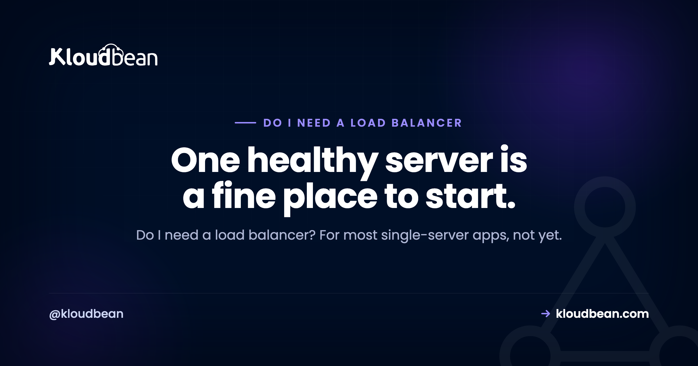

# Do I Need a Load Balancer? When to Add One (and When Not To)

By Kloudbean Engineering · One healthy server is a fine place to start.

You are running a single server, the app is up, and some post online told you that serious setups put a load balancer in front of everything. So you are asking the honest question: do I need a load balancer? For most single-server apps the answer is not yet, and adding one too early just hands you another moving part to maintain. This guide covers what a load balancer actually does, why one healthy server is usually fine early on, and the two real triggers that mean it is finally time to add one.

> **The short, useful version.** For most single-server apps, not yet. A load balancer spreads incoming traffic across two or more app servers and health-checks them, so it only earns its place once you have a second server. Add one when you outgrow a single box (horizontal scaling) or cannot tolerate one going down (high availability). Before that, make the server bigger.

## What does a load balancer actually do?

A load balancer sits in front of your app servers and shares the incoming requests between them. That is the core job, but it does four useful things once you look closely.

First, it spreads traffic. Requests arrive at the balancer, and it hands each one to a server behind it, so no single box carries the whole load.

Second, it health-checks. The balancer pings each server on a schedule, and if one stops responding it quietly stops sending traffic there and keeps using the healthy ones. Your users never land on the dead box.

Third, it removes a single point of failure, but only if there are at least two servers behind it. With two healthy servers, one can reboot or fail and the app stays up. With one server behind it, you have removed nothing.

Fourth, it usually terminates SSL. The certificate lives on the balancer, which decrypts each request and forwards it on, so you manage certificates in one place instead of on every server.

Notice what is not on that list: it does not create capacity out of thin air. A balancer distributes work across the servers you give it. Give it one server and it distributes to one server. For the routing algorithms it uses, SSL termination, and the session trap that logs everyone out, the deep dive lives in [what a cloud load balancer actually does](https://www.kloudbean.com/blog/cloud-load-balancer-explained/).

Here is the mistake worth calling out right away: a load balancer in front of a single server is not high availability. It is one server with an extra component in front that can also break. It looks like a real setup and it feels safer, but nothing behind it is redundant.

## Why one healthy server is usually fine early

A single server handles a lot more than people expect. Most apps, for a long stretch of their life, run comfortably on one well-sized box. One server can even run several small apps side by side, which the guide to [hosting multiple apps on one server](https://www.kloudbean.com/blog/host-multiple-apps-one-server/) walks through.

Putting a load balancer in front of that one server does not make it faster or sturdier. It adds a component you now have to configure, monitor, and pay for, and it leaves you with exactly the same capacity and the same single point of failure you had before. That is effort spent on plumbing instead of on the app.

Early on, the things that actually protect you are boring. Good backups. Basic monitoring so you notice trouble before your users do. A server sized with a little headroom. Add infrastructure when a real need shows up, not because a diagram online happened to include a load balancer.

## Make the server bigger first: vertical scaling

When one server starts running hot, the simplest fix is usually to make it bigger, not to add more of them. That is vertical scaling: more CPU, more memory, on the same box. No traffic-splitting, no new component, no changes to your app.

Vertical scaling has a ceiling. You can only make one machine so large, and it is still one machine, so it is still a single point of failure. But that ceiling is higher than most people think, and plenty of apps live under it for years. One caveat worth knowing: on most platforms you can grow a disk but not shrink it again, so add storage in sensible steps rather than one giant jump.

You move past vertical scaling for one of two reasons. Either you run out of room to grow, or a single box (however large) becomes a risk you can no longer accept. Both of those lead to the same next step, and to a load balancer. The full trade-off between scaling up and scaling out is in [vertical vs horizontal scaling](https://www.kloudbean.com/blog/vertical-vs-horizontal-scaling/).

## The two real triggers for a load balancer

There are exactly two honest reasons to add a load balancer. Both of them need a second server.

**Trigger one is capacity**, also called horizontal scaling. One server can no longer keep up, and making it bigger has either run out or stopped being worth the cost. So you add more app servers to share the work. The moment more than one server is taking requests, something has to decide which request goes where. That something is a load balancer.

**Trigger two is high availability.** You cannot accept the app going dark when a server reboots, fails, or gets patched. So you run at least two servers and put a balancer in front, and if one drops out the other keeps serving. This is the redundancy people think they are buying when they add a balancer, and it only exists when there are two or more servers behind it. The concept, and how far it goes, is covered in [high availability explained](https://www.kloudbean.com/blog/high-availability-explained/).

The pattern underneath both triggers is the same. You need a second app server, and the load balancer is what lets two or more servers act like one address. No second server, no need for a balancer yet.

<!-- ADD IMAGE: one server (a single point of failure) versus a load balancer spreading traffic across two servers, showing that with two servers one can fail and the app stays up. Brand colors navy/purple/green. -->

*One server is a single point of failure. A load balancer in front of two servers means one can go down and users keep getting served.*

## One server or a load balancer? A quick decision table

Match your situation to the move. Most readers land in one of the first two rows.

| Your situation | What you actually need |
| --- | --- |
| One server, comfortable headroom | No load balancer. Keep monitoring and taking backups. |
| One server, starting to run hot | Vertical scaling first: resize the box bigger. |
| Vertical scaling maxed out or too costly | Add servers plus a load balancer (horizontal scaling). |
| Downtime is genuinely unacceptable | At least two servers behind a load balancer (high availability). |
| Traffic is spiky but one big server copes | No load balancer yet. Watch the peaks. |
| A contract or SLA requires redundancy | Two or more servers behind a load balancer. |

## Your app has to be stateless first

There is a prerequisite that trips people up the first time they go from one server to two. For a load balancer to send a request to either server safely, both servers have to be interchangeable. If a user's login session lives only in memory on server A, a request routed to server B logs them out. If an uploaded file was saved to server A's local disk, server B cannot find it.

So before you load-balance, session state moves to a shared store (a database or Redis, say), and file uploads move to object storage instead of local disk. Get this wrong and the symptom is unmistakable: users start getting logged out at random, or uploaded images vanish for half of them. It is the most common reason a freshly load-balanced app misbehaves, and it has nothing to do with the balancer itself.

## So, do I need a load balancer? A simple framework

Here is the whole decision in one line: add a load balancer when you have, or are about to have, a second app server, whether that is for capacity or for uptime. Not before.

Walk it through with one server:

- Comfortable, with headroom to spare? You do not need a load balancer. Keep an eye on it.
- Running hot? Scale it up first. Vertical scaling is the cheaper, simpler move.
- Outgrown the biggest sensible single server? Add servers and a load balancer. That is horizontal scaling.
- Downtime genuinely unacceptable? That is your reason to run two servers behind a balancer for high availability, even if one could handle the traffic on its own.

None of this is dogma. If you know a launch or a campaign is about to land and you want capacity and redundancy in place beforehand, standing up two servers and a balancer ahead of time is a deliberate, reasonable call. Planning ahead is fine. The mistake is adding a balancer by reflex, with a single server behind it, and believing you bought something you did not.

## Where a built-in load balancer fits

When you do hit one of those triggers, the last thing you want is to bolt on a separate load-balancing product and wire it up by hand. It helps a lot when the balancer is simply a feature you switch on next to your servers.

That is how it works on Kloudbean. The Flexible Load Balancer (FLB) is built in and can be enabled on any account when you need it, with application pools to group the servers it sends traffic to, SSL management handled in one place, and access logs so you can see what it is doing. Until you reach a trigger, you leave it off and run your single server. When capacity or availability makes it time, you turn it on.

---

**Reach a trigger? Turn the balancer on.** Kloudbean's Flexible Load Balancer is built in, so when a second server makes sense you enable it instead of assembling it: application pools, SSL management, and access logs included. See [kloudbean.com](https://www.kloudbean.com/) and [pricing](https://www.kloudbean.com/pricing/).

Built-in load balancer · Application pools · SSL management · Access logs · Managed databases · Automatic backups · Free SSL

## FAQ

**Do I need a load balancer for a small app?**
Usually not. A small app on one healthy, well-sized server doesn't need a load balancer, and adding one just gives you another component to run without adding capacity or redundancy. Revisit the question when you add a second server, either for more capacity or so the app survives one box going down.

**When do I need a load balancer?**
When you've got more than one app server, or you're about to. That happens for two reasons: you've outgrown a single server and are scaling out (horizontal scaling), or you can't tolerate downtime and want at least two servers so one can fail (high availability). Both need something to spread traffic, and that's the load balancer.

**Is a load balancer necessary for a single server?**
No. With one server behind it, a load balancer doesn't add capacity and doesn't remove the single point of failure, because that one server is still the only thing serving requests. It just adds cost and a moving part. It earns its place once there are two or more servers to balance across.

**What does a load balancer actually do?**
It spreads incoming requests across two or more app servers, health-checks each one and routes around any that stop responding, and often terminates SSL so certificates live in one place. With at least two healthy servers behind it, it also removes the single point of failure that one server represents.

**Should I scale up or add a load balancer first?**
Scale up first, in most cases. Making one server bigger (vertical scaling) is simpler than running several servers behind a balancer, with no traffic-splitting and no stateless refactor. Move to a load balancer and multiple servers when vertical scaling runs out, or when one server (however large) is a risk you can't accept.

**Does a load balancer make my app faster?**
Not on its own. A load balancer spreads load across servers, it doesn't speed up a single request. If your one server is overloaded, more servers behind a balancer can cut queuing, but a bigger server or a CDN for static files often helps more. Don't add one expecting a speed boost.

**Can a load balancer sit in front of just one server?**
It can, and people sometimes do it to prepare for a second server or to handle SSL in one place. But with a single server behind it you get no extra capacity and no redundancy, so it isn't high availability. It's one server with an extra component that can also fail.

**What is the difference between horizontal scaling and high availability?**
Horizontal scaling is about capacity: you add servers so the app handles more load. High availability is about uptime: you run more than one server so the app survives one of them failing. They often use the same setup, several servers behind a load balancer, but the reason differs.

**Do I need a load balancer if I use a CDN?**
They solve different problems. A CDN caches static content close to users and takes load off your server, but dynamic requests still hit your app. A load balancer spreads those dynamic requests across multiple app servers. A CDN can delay the day you need a balancer, but it won't replace one once you run more than one server.

---

*Kloudbean Engineering · Add the balancer when you add the second server, not before.*
