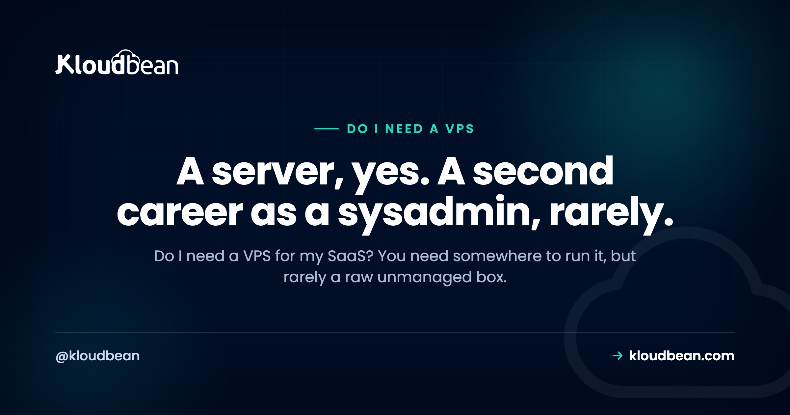

# Do I Need a VPS for My SaaS? An Honest Answer

By Kloudbean Engineering · A server, yes. A second career as a sysadmin, rarely.

You just built a SaaS, maybe with a lot of help from an AI coding tool, and now you need to put it somewhere real. Search around for an hour and the advice converges fast: get a VPS. Spin up a Linux box, SSH in, and congratulations, you're a backend engineer now. It's common advice, and for some people it's exactly right. But "do I need a VPS for my SaaS" is really two questions wearing one coat, and answering them separately saves a lot of pain. Here's the honest version, fair to every option, of what you actually need and what you can skip.

> **The short answer.** Yes and no. Your SaaS does need somewhere to run, that part isn't optional. But that somewhere rarely has to be a raw, unmanaged VPS you patch, secure, and babysit yourself. You've got three broad options: a raw VPS (full control, and every operational job is yours), a managed platform (a server without the sysadmin work), and serverless (great for stateless and bursty jobs, awkward for an always-on stateful app). Most solo founders and small teams end up happiest on a managed platform. Choose a raw VPS if you want full control, have the ops skills, or want the cheapest box and are happy to run it.

## Do I need a VPS for my SaaS, or just somewhere to run it?

There are two questions hiding inside that one, and they have different answers.

The first: does my SaaS need somewhere to run? Almost always yes. A SaaS is software that has to stay online, answer requests, and keep hold of its data around the clock. That needs a server running somewhere. There's no version of "launch a SaaS" that skips this part.

The second: does that somewhere have to be a raw VPS I rent, log into, and operate myself? Usually not. This is the question people skip, because "get a VPS" has been the stock answer for so long that it sounds like the answer to both. It isn't. It's one answer to the first question, and it happens to be the one with the most work attached.

So separate them. You need a place to run your app: settled. The open question is which kind of place, and a raw VPS is only one of three.

## What a VPS actually is

A VPS, a virtual private server, is a slice of a physical machine sold to you as though it were your own Linux box. You get root access, an IP address, and a bare operating system. Everything above that line is yours.

And I mean everything. You install the runtime. You configure the web server. You open and close firewall ports. You apply security patches. You set up backups, store them somewhere safe, and confirm they actually restore. You notice when the box falls over at 3am, and you're the one who logs in to bring it back. A VPS is not a "sign up and deploy" product. It's raw compute with an operating system, and the rest is a job.

That's a real feature if control is what you're after. It's a real burden if you never set out to become a systems administrator. Both can be true depending on who you are, which is exactly why the honest answer to "do I need one" is "it depends on you," not a flat yes.

## The three ways to run a SaaS

Drop the brand names and there are three broad shapes for running a SaaS. Almost everything on the market is a version of one of these.

- **A raw VPS.** You rent a Linux box and own every layer above the hypervisor. Lowest sticker price, most control, most ongoing work.
- **A managed platform.** You get a server where the provider handles the operating system, the stack, SSL, patching, and backups, while you keep your app code and your data. Less fiddling with the box, far less operational load. The part worth checking when you compare these is whose cloud you end up on. Kloudbean provisions onto seven (AWS, Lightsail, GCP, Linode, Vultr, DigitalOcean, UpCloud) from one dashboard, so the managed layer and the provider choice are separate decisions rather than a single lock-in.
- **Serverless.** You hand the provider your functions and it runs them on demand, scaling up under load and down to nothing when idle. Almost no server to operate, but a different programming model with real edges.

No option is right for everyone. The useful question isn't "which is best," it's "which trade do I actually want to make," because each one weighs the same two things against each other: control and operational burden.

## What running a raw VPS puts on your plate

Let me be concrete and fair about the work, because the sticker price hides most of it. When you run a raw VPS, these jobs are yours, and not just on setup day. They're ongoing, for as long as the box exists.

- **Patching.** Security updates for the OS and every package you installed, on a schedule, ideally before someone else finds the hole you didn't close.
- **Security.** Firewall rules, SSH hardening, banning brute-force attempts, watching auth logs, and locking down your database so it isn't hanging open to the internet.
- **Backups.** Setting them up, storing them off the machine, and testing a restore. That last part is the one people skip until the day they can't.
- **Uptime and monitoring.** Knowing the moment your app or the server goes down, and being the person who fixes it, whenever that happens to be.
- **The stack itself.** Installing and upgrading your language runtime, web server, and database, and keeping their config sane over time.

Read that list again and notice it's the same list every managed platform is selling. That's genuinely all "managed" means: those five jobs move. On Kloudbean, patching and the stack are handled, SSL is free and automatic, backups run automatically with on-demand ones when you want them, and the firewall and Fail2ban are already on when the server boots. Managed databases get IP allow-listing, so you whitelist your app server's address and nothing else can reach the database. That's the fifth bullet, which is the one people most often leave open on a self-built box.

None of this is beyond a competent developer. That's not the point. The point is it never stops, and every hour of it is an hour you didn't spend on the product people actually pay for. A cheap VPS has a real, low sticker price. The rest of the bill is paid in your time and attention, which is why [the real cost of an unmanaged VPS](https://www.kloudbean.com/blog/the-real-cost-of-unmanaged-vps/) is almost never just the monthly charge.

## When a raw VPS is genuinely the right call

This isn't an argument against VPSes. They're a solid, honest choice for the right person, and if one of these is you, pick one and don't look back.

- **You want full control.** You need a specific kernel setting, an unusual package, a custom network layout, or you simply prefer owning every layer of the machine.
- **You have the ops skills, or you want them.** If you're comfortable running Linux, a VPS is home. And if you're learning on purpose, it's an honest teacher. There's no faster way to understand servers than to run one.
- **You want the cheapest box and you're happy to operate it.** A small VPS has a low monthly price. If your time is worth less to you right now than the cash, and you accept the operational load, that trade is reasonable.
- **You want zero platform opinions.** Some people just prefer a blank box and their own choices, start to finish.

If that's you, a raw VPS isn't a mistake. It's a deliberate trade: more control and a lower sticker price, in exchange for owning all the operations. The clean way to think about that split is laid out in [managed vs unmanaged hosting](https://www.kloudbean.com/blog/managed-vs-unmanaged-hosting/), and the price side of it in [free tier vs cheap VPS](https://www.kloudbean.com/blog/free-tier-vs-cheap-vps/).

## Where serverless fits, and where it fights a SaaS

Serverless deserves a fair hearing too, because for the right workload it's genuinely great, and for the wrong one it's a quiet, ongoing source of friction.

It shines on stateless, bursty, event-driven work. An image thumbnailer that runs when a file lands. A webhook receiver. A scheduled job. An API with uneven, spiky traffic. You pay for what actually runs, it scales up on demand, and there's no server to patch. For those jobs, it's hard to beat.

It fights you when the thing you're hosting is an always-on, stateful web app, which most SaaS products are at their core. Cold starts add latency to the first request after a quiet spell. Long-lived connections like websockets and streaming are awkward to hold open. Anything that wants a persistent process or local state has to be bent around the model. And you still need a database somewhere, which is stateful and doesn't vanish just because your compute went serverless.

So the honest read: serverless is a fine tool for parts of a SaaS, and an awkward home for the always-on heart of one. The skill is knowing which part is which, and not forcing a whole app into a model built for short, stateless bursts. Both other options give you a persistent process, which is the thing that makes cold starts and websockets stop being a topic. A raw VPS gives you one because you're running the process. A managed platform (Kloudbean included) gives you one because your app is deployed as a long-lived service rather than a function.

## Which option fits which team

Here's the tradeoff in one view, then a plain read on who each option actually suits.

| | Raw VPS | Managed platform | Serverless |
| --- | --- | --- | --- |
| What you get | A bare Linux box | A server with the ops handled | Functions run on demand |
| Who operates it | You, all of it | The platform (you keep code and data) | The provider |
| Setup before launch | Install and configure everything | Connect a repo, deploy | Write functions, wire triggers |
| Cost shape | Low sticker price, your time on top | Flatter and more predictable | Pay per run, cheap when idle |
| Best for | Control and cheap compute, with ops skills | An always-on SaaS, small teams | Stateless, bursty, event-driven work |
| The catch | All operations are yours | Less low-level control of the box | Awkward for always-on stateful apps |

<!-- ADD IMAGE: a three-column diagram placing Raw VPS, Managed platform, and Serverless on a "more control on the left, less operational work on the right" axis. Show what each option leaves on your plate. Brand colors navy #000f27, purple #4F1AF3, green #40b75f. -->

*Control and operational burden move together. You cannot add control without adding work, and you cannot shed the work without giving up some control.*

And the shorter version, by who you are:

| Option | Who it fits |
| --- | --- |
| Raw VPS | You want full control, have (or want) the ops skills, or want the cheapest box and accept running it |
| Managed platform | You want a server for an always-on SaaS without doing the sysadmin work, and would rather spend your time on the product |
| Serverless | You have stateless, bursty, or event-driven pieces, and you aren't trying to host an always-on stateful core on it |

The pattern underneath all of it: control and operational burden are two ends of one line. Pick the point on that line that matches how you want to spend your days. This is the same call, one layer up, as [do I need AWS to launch a SaaS](https://www.kloudbean.com/blog/do-i-need-aws-to-launch-a-saas/). The tool isn't the goal. Shipping and running your product is.

## Start at the stage you're actually at, and move on a signal

You don't have to get this right once and forever. Treat it as stages, and let a real signal move you rather than a feeling that you should be doing something more sophisticated.

**Stage one, pre-launch or your first users.** One server, one database, deploy from Git, and nothing clever. Whether that server is managed or raw comes down to a single honest question: do you want to be the person who patches it? If yes, take the VPS and enjoy it. If no, take a managed one and stop thinking about it. There's no third answer at this stage, and both are fine.

**The signal to move on: you've spent a weekend on the server instead of the product.** Not "the server went down once." A pattern. When maintenance starts eating the time you meant to spend shipping, the operational load has outgrown what you wanted to carry, and that's the moment a managed platform pays for itself. Migration is easier to stomach than most people fear, and platforms often handle it for you (Kloudbean does it free for servers above 4GB, and there's a 3-day trial with one service if you want to try the shape before moving anything).

**Stage two, you have paying users and real traffic.** Now you want the boring reliability things: automatic backups you've actually tested restoring, staging so you're not testing in production, and a second pair of eyes when something breaks at an awkward hour. This is where being on a managed platform stops being about convenience.

**Stage three, only if you get there.** Multiple app servers behind a load balancer, read replicas, more clouds or regions. Most SaaS never need this, and reaching for it early is the most common form of infrastructure procrastination I see. Build it when a real number tells you to.

Now the part that no amount of hosting fixes, ours very much included. A managed platform takes over patching, the stack, SSL, backups, and the server. It does not touch your app. An unindexed query stays slow. A migration that locks a table locks it on any provider. An n+1 in your ORM is an n+1 forever until someone reads the code. If your product is slow or fragile because of decisions inside it, moving hosts moves the problem to a nicer dashboard and changes nothing else. Your code and your data are yours in every direction, including out, which is also what makes any of these stages reversible. If it helps to see what "managed" covers in detail before you decide, [what is a managed server](https://www.kloudbean.com/blog/what-is-a-managed-server/) lists the boundary properly.

<!-- cta:start -->
**Take it off localhost for good.**

Run the app as an always-on process with managed databases, Redis, object storage, and automatic backups beside it. Deploy from Git with live build logs, and keep the infrastructure someone else's problem.

- Managed databases
- Always-on processes
- Object storage
- Automatic backups
- Free SSL
- Git deploy
- Free migration

[Start free](https://console.kloudbean.com/register) · [See plans](https://www.kloudbean.com/pricing/)
<!-- cta:end -->

## FAQ

**Do I need a VPS for my SaaS?**
You need somewhere to run it, but rarely a raw, unmanaged VPS. A SaaS has to stay online and hold data, so it needs a server. Whether that server is a VPS you operate yourself, a managed platform, or serverless depends on your ops skills and how you want to spend your time. Most small teams do better on a managed platform.

**What is the difference between a VPS and managed hosting?**
A VPS is a bare Linux box: you install the stack, patch it, secure it, back it up, and keep it online. Managed hosting gives you a server where the provider does that operational work, while you keep your app code and data. Same job, very different amounts of it landing on you.

**Do I need a server for my SaaS?**
Yes, in some form. An always-on SaaS needs compute that stays running, answers requests, and stores data. What varies is whether you rent and run that server yourself (a VPS), let a platform run it (managed), or use functions that spin up on demand (serverless). The need for compute is constant. The amount of operating you do is the variable.

**Is a VPS or serverless better for a SaaS?**
Neither wins outright, it's about the workload. Serverless is great for stateless, bursty, event-driven pieces and scales to zero when idle. A VPS or a managed platform suits the always-on, stateful core that most SaaS apps have, where cold starts and the serverless model get awkward. Plenty of teams use serverless for specific jobs and a persistent server for the main app.

**Is a managed platform just a more expensive VPS?**
Not quite. A raw VPS usually has a lower sticker price, but the operational work (patching, security, backups, uptime) is yours and costs you time. A managed platform folds that work into the price. Compare the total, including your hours, not just the monthly charge, before you decide one is dearer.

**When should I choose a raw VPS?**
When you want full control of the machine, when you have the ops skills or want to build them, or when you want the cheapest possible box and you're happy to run it. Those are all good reasons. If none of them is true and you just want your SaaS online, the operational load of a raw VPS is a cost without a matching benefit.

**Can I start on a managed platform and move to a VPS later?**
Yes. Your app is your own code and your data is portable, so moving between a managed platform and a raw VPS is a normal path in either direction. Starting managed doesn't lock you in. If you later want full control, or you develop the appetite for the ops work, you migrate then, with a running product behind the decision.

**Is serverless cheaper than a VPS for a SaaS?**
Sometimes, for the right shape of work. Serverless can be very cheap for spiky or low-traffic jobs because you pay per run and nothing when idle. For an always-on app with steady traffic, a persistent server is often simpler and more predictable, and re-architecting a stateful app to fit serverless can cost more effort than it saves. Match the tool to the workload.

**Do I need to know Linux to run a SaaS?**
Only if you choose to operate the server yourself. Running a raw VPS means real Linux administration: the shell, package management, firewalls, and logs. A managed platform removes most of that, so you can ship a SaaS without deep server skills. If you want to learn Linux, a VPS is a good teacher. If you just want to launch, you can skip it for now.

---

*Kloudbean Engineering · Match the option to your ops appetite, not to the number of knobs it has.*
