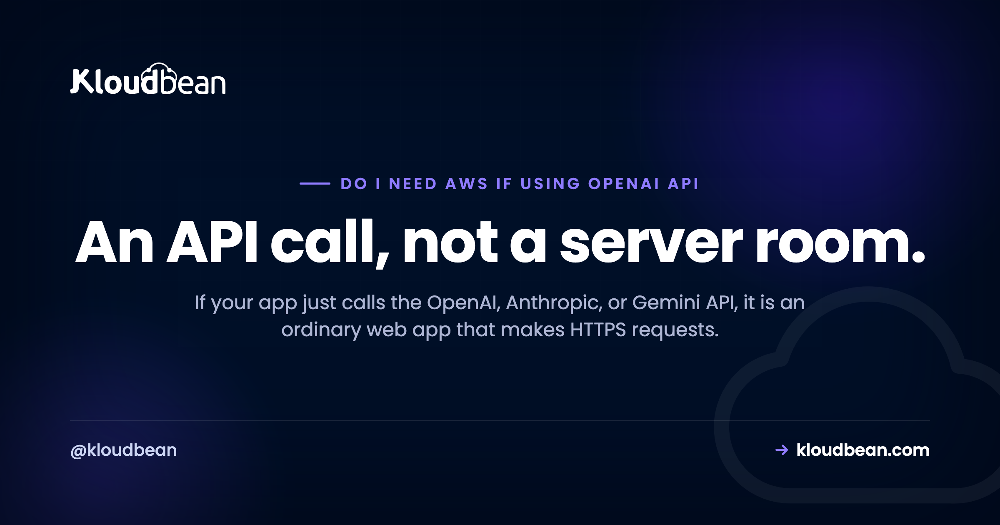

# Do I Need AWS If I Use the OpenAI API? (No, and Here Is Why)

By Kloudbean Engineering · An API call, not a server room.

You wired up the OpenAI API, or maybe Anthropic's Claude or Google's Gemini, and now something (a tutorial, a Reddit thread, a nervous voice in your head) is telling you that shipping it means AWS, a machine-learning pipeline, and a GPU. You almost certainly don't need any of that. This is an honest look at what an app that calls a hosted model API actually requires, why so many people overbuild it, and the one situation that genuinely changes the answer.

> **The short, useful version.** No. If your app calls the OpenAI, Anthropic, or Gemini API, it is an ordinary web app making HTTPS requests. You need a normal server, a database, a safe place for the API key, and a spend limit. No AWS, no ML infrastructure, no GPU. A GPU only matters if you self-host your own model, which is a separate decision.

## So do I need AWS to call the OpenAI API?

No. Not for this, anyway. When your app calls the OpenAI API, the heavy part, the model itself, runs on OpenAI's servers. Your code sends a normal HTTPS request carrying your prompt, waits, and gets text back. That is the whole interaction. It is the same shape as calling Stripe for a payment or a mail provider to send an email. You're a client of someone else's service.

So the thing you have to host is not "an AI model." It is a perfectly ordinary web app that happens to make one more outbound API call. Any host that can run a Node, Python, PHP, Ruby, or Go app can run it. AWS can do that, sure. So can plenty of simpler options. The AI part isn't what decides where the app lives.

## Using AI and running AI are two different things

Most of the confusion comes from squashing two very different things into one word: AI.

Using a model means calling an API that someone else hosts. You send text, you get text, you pay per token. OpenAI, Anthropic, and Google all work this way. Your server never loads a model, never touches a GPU, and never sees the billions of parameters doing the work.

Running a model means you host the model weights yourself and do the inference on your own hardware. That needs a GPU, a serving stack, and real capacity planning.

These get blurred because both get called "AI apps," and because a lot of older tutorials were written for the second world and quietly assume you're living in it. If a guide opens by telling you to spin up a training platform or a GPU instance just to call an API, it is answering a question you didn't ask.

<div class="note">
<strong>Coming from a tutorial that mentions SageMaker, Vertex AI, or a GPU instance?</strong> Check what it is actually doing. If your code calls <code>api.openai.com</code>, you are using a model, not running one, and none of that machinery applies to you.
</div>

## What your AI app actually is under the hood

Here is the real data flow, and it is refreshingly boring.

The browser sends the user's message to your backend. Your backend attaches your secret API key and forwards the request to the model API over HTTPS. The model API does the expensive thinking on the vendor's hardware and streams tokens back to your server, which relays them to the browser as they arrive. Four hops, all of them ordinary HTTPS.

<!-- ADD IMAGE: request-flow diagram. Browser -> your backend (holds the API key) -> model API (OpenAI/Claude/Gemini) -> tokens streamed back to the browser. Make clear the browser never sees the key and there is no GPU on your side. Brand colors navy/purple/green. -->

*The browser talks to your server, and your server talks to the model. The key stays on the server, and nothing on your side needs a GPU.*

The important detail is that the browser never talks to the model API directly. It talks to your server, and your server talks to the model. That is not an accident. It is the whole reason you need a backend at all, which we'll get to.

And calling the API really is just an HTTPS POST. Strip away the SDK and it looks like this:

```bash
# "Calling the OpenAI API" is just one HTTPS POST from your server
curl https://api.openai.com/v1/chat/completions \
  -H "Authorization: Bearer $OPENAI_API_KEY" \
  -H "Content-Type: application/json" \
  -d '{"model":"gpt-4o-mini","messages":[{"role":"user","content":"Hello"}]}'
```

That's it. If your server can make that request, it can run an "AI app." No special runtime, no model download, no GPU driver.

## What you actually need to ship it

Four things, none of them exotic.

**A normal server** (or container) to run your backend. Whatever your language wants: Node, Python, Ruby, PHP, Go. The API call isn't CPU-heavy on your side. Your server mostly waits on the network while the model thinks, so a small instance handles a surprising amount of traffic.

**A database**, if your app has state. Chat history, users, saved outputs. This is a plain Postgres or MySQL decision and has nothing to do with AI.

**Somewhere safe for the API key.** An environment variable or secret store, injected at runtime, never committed to git, never shipped to the browser. Getting this right is most of the security story, and [environment variables done right](https://www.kloudbean.com/blog/environment-variables-done-right/) covers the mechanics.

**A spend limit.** This is the one people skip and regret. A metered API means a bug, a runaway loop, or an abusive user can rack up a real bill fast. Set a hard cap on the provider's dashboard and add your own rate limiting in front of the endpoint. [Rate limiting and cost control](https://www.kloudbean.com/blog/rate-limit-and-cost-control-for-ai-apis/) walks through both.

Notice what's missing from that list: a GPU, a model server, an ML pipeline, a data-labeling tool, a vector database (unless you're doing retrieval, which is its own topic). For a plain app that calls the OpenAI API, you provision none of it.

## Calling a hosted API vs self-hosting a model

The clearest way to see why the requirements differ so much is to put them side by side. Same feature for the user, completely different infrastructure underneath.

<table class="cmp">
  <thead><tr><th></th><th>Calling a hosted API (OpenAI, Claude, Gemini)</th><th>Self-hosting your own model</th></tr></thead>
  <tbody>
    <tr><td>Compute you run</td><td>A normal server, any small VM</td><td>A GPU server sized to the model</td></tr>
    <tr><td>GPU</td><td>None</td><td>Required</td></tr>
    <tr><td>Special AI infra</td><td>None</td><td>A serving stack (Ollama, vLLM), drivers</td></tr>
    <tr><td>Who runs the model</td><td>The API vendor</td><td>You</td></tr>
    <tr><td>You pay</td><td>Per token, metered</td><td>Flat cost for the GPU box</td></tr>
    <tr><td>The hard part</td><td>An HTTPS call and a spend cap</td><td>GPU memory math, serving, updates</td></tr>
    <tr><td>Does data leave your server?</td><td>Yes, to the vendor</td><td>No, it stays on your box</td></tr>
  </tbody>
</table>

Read the table as a fork, not a ranking. The left column is where the large majority of apps live and should live. The right column is a deliberate choice you make for specific reasons, and it comes with real work.

## Where does the API key go?

On the server. Always. This is the one rule that matters more than the rest combined.

If you put your OpenAI key in frontend code, in a React component, in a mobile app bundle, anywhere the browser can reach it, it is public. People can and do pull keys out of shipped JavaScript, and a leaked key is someone else spending your money. That is exactly why the browser talks to your backend instead of the model. Your server is the trusted place that holds the key and adds it to the outbound request.

```js
// server.js  the key lives here, on the server, never in the browser
import OpenAI from "openai";
const client = new OpenAI({ apiKey: process.env.OPENAI_API_KEY });

app.post("/api/chat", async (req, res) => {
  const stream = await client.chat.completions.create({
    model: "gpt-4o-mini",
    messages: req.body.messages,
    stream: true,
  });
  res.setHeader("Content-Type", "text/event-stream");
  for await (const part of stream) {
    res.write(part.choices[0]?.delta?.content ?? "");
  }
  res.end();
});
```

The pattern is always the same. Key in an environment variable, request built on the server, response streamed back to the client. If you also want auth, per-user quotas, or logging, the backend is where they go. [Deploy an AI agent without exposing API keys](https://www.kloudbean.com/blog/deploy-ai-agent-without-exposing-api-keys/) goes deeper if your app does more than a single call.

## The one thing that changes the answer: self-hosting a model

There is exactly one situation where the boring answer flips: when you decide to run the model yourself instead of calling someone's API.

Maybe your data can't leave your network for privacy or residency reasons. Maybe you want a specific open model like Llama or Mistral. Maybe you're at steady, heavy volume where a flat compute cost beats a per-token bill. All legitimate. And every one of them means you now need a GPU, because that is what does the inference the API vendor used to do for you.

That is a genuinely different project: sizing GPU memory, picking a serving engine, keeping the model updated. It isn't harder in a scary way, it is just a different set of decisions, and [self-hosting an LLM](https://www.kloudbean.com/blog/self-host-an-llm/) is the guide for it. The thing to get right is to make that choice on purpose. Don't buy a GPU because a tutorial implied an AI app needs one. Buy it because you specifically decided to host the model.

## When a big cloud like AWS really is the right call

To be fair to AWS and the other hyperscalers, there are good reasons to pick one. Just make sure it is a real reason and not reflex.

**You want the cloud's own AI service.** AWS Bedrock, Google Vertex AI, and Azure's OpenAI offering let you call models through that cloud's own APIs and billing, sometimes with models you can't get elsewhere, and with data staying inside that cloud's boundary. If you specifically want Bedrock, then yes, you want AWS. That is choosing their AI service on purpose, which is a completely different thing from assuming you need AWS just to make an HTTPS call.

**The rest of your stack already lives there.** If your team runs on one cloud and knows it well, keeping the app next to everything else is a sound call. Familiarity is a legitimate reason.

**You're self-hosting a model and want their GPU instances.** Back to the previous section.

What isn't a good reason: "it's an AI app, so it needs AWS." That sentence has the causation backwards. The AI runs on the vendor's servers. Your app is a web app.

## So where should you host it?

Anywhere that runs your language and lets you set environment variables. That is the honest answer. A plain VPS, a platform-as-a-service, or a managed host all work, because you are deploying a normal web app. Pick on the usual merits: how much you want to manage, price, region, and how it handles your database. [Deploy an AI-built app to production](https://www.kloudbean.com/blog/deploy-ai-built-app-to-production/) and [picking a host for an AI SaaS](https://www.kloudbean.com/blog/best-hosting-for-ai-saas/) compare the trade-offs if you want a fuller walk-through.

Kloudbean is one managed option here. It runs your Node or Python backend on a managed server, gives you a managed database, and lets you keep secrets as environment variables, so the API-key discipline above is built into the workflow rather than bolted on afterward. If you later decide to self-host a model, managed GPU servers are a separate path on the same platform, so that door stays open. But treat that as a footnote to the real point: an app that calls the OpenAI API is a web app, and you should host it like one.

<div class="cta">
  <p style="margin:0 0 .4em; font-weight:600; font-size:19px">Shipping an app that calls a model API?</p>
  <p style="margin:0 0 .5em">It is a normal web app, so host it like one. Kloudbean runs your Node or Python backend on a managed server, with a managed database, free SSL, and environment variables for your API keys. If you later self-host a model, managed GPU servers are there too.</p>
  <p style="margin:0">Managed servers · Managed databases · Free SSL · Environment variables for secrets · Managed GPU when you need it. See <a href="https://www.kloudbean.com/">kloudbean.com</a> and <a href="https://www.kloudbean.com/pricing/">pricing</a>.</p>
</div>

## FAQ

<div class="faq">

**Do I need AWS to use the OpenAI API?**
No. Calling the OpenAI API is an outbound HTTPS request, so any host that runs your backend can do it. AWS works, but so does a small VPS, a platform-as-a-service, or a managed host. Pick your host on the usual merits, price, region, and how much you want to manage, not on the fact that the app uses AI.

**Do I need a GPU to call the OpenAI API?**
No. The model runs on OpenAI's hardware, not yours, so your server never touches a GPU. A GPU only becomes relevant if you decide to self-host your own model instead of calling a hosted API, which is a separate project with its own sizing and serving work.

**Where can I host an app that uses the OpenAI API?**
Anywhere that runs your language and lets you set environment variables for the API key. It is a normal web app, so a VPS, a PaaS, or a managed platform all work. Choose based on your database needs, region, and how much of the server you want to manage yourself.

**Is an app that calls the OpenAI API an AI app or a normal web app?**
Technically both, but for hosting purposes it is a normal web app that makes one extra API call. The AI runs on the vendor's servers. Your side is ordinary request-and-response code, which is why it needs no special infrastructure.

**Can I call the OpenAI API directly from the browser?**
You should not. Anything in the browser is visible to users, so your API key would be exposed and someone could spend your money. Route the call through your backend, keep the key in a server-side environment variable, and have the server talk to the model.

**What is the difference between using a model and hosting a model?**
Using a model means calling an API someone else hosts and paying per token, with no GPU on your side. Hosting a model means running the weights on your own hardware, which needs a GPU and a serving stack. Most apps use a model. Hosting one is a deliberate choice for privacy, control, or heavy steady volume.

**Do I need AWS Bedrock or SageMaker for an AI app?**
Only if you specifically want them. Bedrock is a way to call models through AWS, and SageMaker is for training and hosting your own. If you are just calling the OpenAI, Anthropic, or Gemini API, you need neither. Reach for them when you want that cloud's own AI service on purpose, not by default.

**What do I actually need to deploy an app that uses the OpenAI or Anthropic API?**
Four things: a normal server for your backend, a database if your app has state, a safe place for the API key such as an environment variable, and a spend limit to stop runaway costs. No GPU, no ML pipeline, no special AI infrastructure.

**When would I actually need AWS for an AI app?**
When you want an AWS service for a real reason: Bedrock for its model access, tight integration with a stack already on AWS, or GPU instances because you have chosen to self-host a model. If none of those is true, using AWS because the app calls a model is solving a problem you do not have.

</div>

---

*Kloudbean Engineering · Using a model is an API call. Running one is a GPU decision.*
