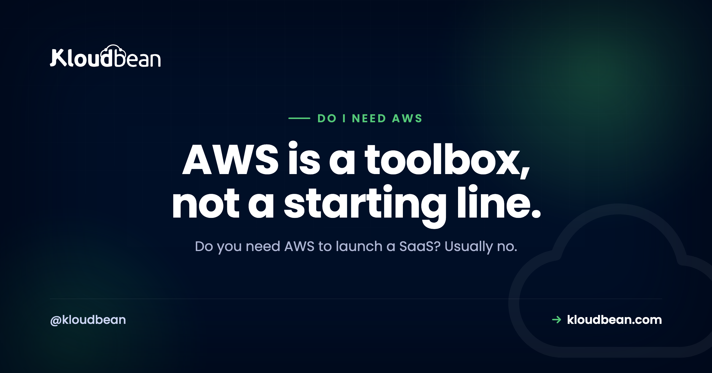

# Do I Need AWS to Launch a SaaS? An Honest Answer

By Kloudbean Engineering · AWS is a toolbox, not a starting line.

Ask an AI assistant where to deploy your new SaaS and it will almost always say AWS. It's the default answer everywhere, so it feels like the safe one. But "safe" and "right for you" are different things, and for most people launching a first SaaS, reaching straight for raw AWS is a way to spend your first two weeks learning cloud jargon instead of shipping. So here's the honest version, with no vendor cheerleading, of when you actually need AWS and when you very much don't.

> **The short answer.** No, most new SaaS products do not need raw AWS. AWS is a huge toolbox you assemble and operate yourself, which is powerful at scale but slow and costly to run when you're small. To launch, you really need a server for your app, a database, a place for secrets, and backups. Reach for AWS when a specific service, your team's skills, or a customer requirement actually calls for it.

## The honest answer: probably not, not yet

Here's the thing people rarely say out loud: AWS is not a hosting product you sign up for and deploy to. It's a catalog of building blocks, hundreds of them, that you're expected to wire together and run yourself. EC2 for servers, RDS for databases, VPC for networking, IAM for permissions, S3 for storage, and a long tail of the rest. That flexibility is exactly why big engineering teams love it. It's also exactly why it's the wrong first tool for one person trying to get a product in front of users.

When your goal is "launch," the winning move is to remove decisions, not add them. Raw AWS adds them. You'll pick an instance type, configure a network, set up security groups, wire IAM roles, and figure out deployments, all before a single user sees your app. None of that work is your product. It's undifferentiated setup that a managed platform already did for you.

So the default answer you keep hearing is not wrong for everyone. It's just answering a different question. AWS answers "what can scale a large engineering org to millions of users." Most founders are asking "how do I get this live this week." Those are not the same question, and the second one rarely needs AWS.

## What people actually mean by "AWS"

Part of the confusion is that "AWS" gets used to mean three different things, and lumping them together is what makes the decision feel scary.

There's **raw infrastructure**: EC2 servers, VPCs, load balancers, IAM. This is the powerful, complicated part you operate yourself. There's **managed building blocks**: RDS (databases), S3 (storage), and similar, which take one piece off your plate but still sit inside all the account and networking complexity. And there's **AWS as a brand of credibility**, the vague sense that "real" companies run on AWS, which is more vibe than requirement.

When someone asks "do I need AWS," they almost always mean the first one, the raw infrastructure. And the answer to that is the clearest no of the three. You may well end up using an S3-compatible bucket or a managed Postgres somewhere. That's not the same as needing to run your app on hand-configured EC2 inside a VPC you set up yourself.

## What launching a SaaS actually requires

Strip the branding away and a typical SaaS needs a short, boring list. Once you see how short it is, the "do I need AWS" question mostly answers itself.

- **A place to run your app.** A server that keeps your backend process alive and reachable. One is plenty to start.
- **A database.** Almost always PostgreSQL or MySQL, ideally managed so you're not babysitting it. On a managed platform this is a picker rather than a project. Kloudbean offers seven engines (PostgreSQL, MySQL, MariaDB, Redis, Memcached, MongoDB, Elasticsearch) with automatic backups already on, which is roughly the RDS decision minus the account setup around it.
- **Somewhere for secrets.** API keys and credentials kept out of your code, in environment variables or a secrets store.
- **File storage, sometimes.** If users upload files, an S3-compatible bucket. Plenty of SaaS apps don't need this on day one.
- **A domain with SSL.** Your custom domain and an HTTPS certificate, which most platforms now handle for you.
- **Backups.** Automatic, and tested at least once, so a bad day is recoverable.

That's the real list. Notice what's not on it: Kubernetes, a hand-built VPC, autoscaling groups, a service mesh, or five AWS certifications. You can add sophistication later when a real problem demands it. Orchestration in particular tends to arrive years before it is needed, and [the honest case for running Kubernetes on a SaaS](https://www.kloudbean.com/blog/do-i-need-kubernetes-for-my-saas/) is worth reading before you commit to it. The [reference architecture for an AI app](https://www.kloudbean.com/blog/ai-app-reference-architecture/) covers how these pieces fit together, and the honest truth is they fit on a single server for a long time.

## When you genuinely do need AWS

To be fair to AWS, because this isn't a hit piece, there are real situations where it's the right call, and pretending otherwise would be dishonest.

Choose AWS when you have a **team that already knows it**. Existing expertise is a legitimate reason. Fighting a tool your engineers don't know, to save money you're not yet spending, is false economy. Choose it when you need a **specific AWS service** with no good equivalent elsewhere, a particular managed queue, an ML service, or a compliance feature a customer contractually requires. Choose it when an **enterprise buyer's procurement** literally mandates a named cloud, which happens in regulated deals. And choose it when you have **genuine hyperscale**, the kind where fine-grained control over dozens of services earns its keep.

If one of those is true for you, use AWS and don't feel bad about the complexity. It's buying you something real. If none of them is true, the complexity is a cost with no matching benefit, and you're paying it out of your launch runway.

## Raw AWS versus a managed platform

The actual tradeoff is control versus time, and it helps to see it plainly rather than as a brand loyalty test.

| | Raw AWS | Managed platform |
| --- | --- | --- |
| Setup before launch | Instances, VPC, IAM, deploys | Connect a repo, deploy |
| Who operates it | You | The platform |
| Flexibility | Very high, every knob | High enough for most apps |
| Learning curve | Steep | Gentle |
| Best for | Teams with cloud skills, at scale | Founders and small teams shipping now |
| The risk | Complexity and bill-shock | Outgrowing it eventually |

Neither column is "better" in the abstract. If you're a platform team running many services at scale, the left column is your world and a managed platform would feel constraining. If you're trying to launch, the right column gets you live faster and keeps your attention on the product. Most people reading this are in the second case, which is why the honest recommendation leans that way, not because AWS is bad. If you want that table filled in with two named products rather than two categories, [the Kloudbean vs AWS head-to-head](https://www.kloudbean.com/blog/kloudbean-vs-aws/) goes row by row, including where AWS is the better answer.

One thing worth clearing up before you treat this as a fork in the road: the right column usually runs on the left column's metal. Kloudbean provisions across seven clouds and AWS and AWS Lightsail are two of them, so "I skipped AWS" often just means "I didn't hand-configure AWS." Same data centres, different amount of work on your desk.

<!-- ADD IMAGE: a simple two-column diagram. Left "Raw AWS": a stack of boxes labelled EC2, VPC, IAM, RDS, security groups, deploy pipeline, all of which you configure. Right "Managed platform": one box "your app + managed database" with "connect repo, deploy" beside it. Brand colors navy #000f27, purple #4F1AF3, green #40b75f. -->

*The real difference isn't power, it's how much you assemble yourself before you can ship.*

## The hidden cost of defaulting to AWS

The reason "just use AWS" deserves a second look is that its costs are the kind you don't see until they've already landed.

The first is **time**. Every hour spent on IAM policies and VPC subnets is an hour not spent on your product or your customers. Early on, your time is the scarcest thing you have, and raw infrastructure is very good at eating it.

The second is **bill surprise**. AWS bills per service, per resource, with data-transfer charges that are easy to trigger and hard to predict. It's genuinely common to spin up resources for a test, forget them, and get a bill that has nothing to do with how many users you served. This is why [the real cost of an unmanaged setup](https://www.kloudbean.com/blog/the-real-cost-of-unmanaged-vps/) is rarely just the sticker price.

The third is **operational risk**. On raw infrastructure, patching, backups, security hardening, and uptime are your job. Miss one and it's your outage. That's a fair trade when you have a team to carry it, and a heavy one when it's just you at 2am. A [managed server](https://www.kloudbean.com/blog/what-is-a-managed-server/) exists precisely to take that weight off a small team. Concretely, on Kloudbean that means patching, automatic backups and free SSL are already someone's job, and you lock the database down by whitelisting your app server's IP rather than hand-building a network to hide it in.

## A quick way to decide

You don't need a long deliberation. Run through this and you'll have your answer in a minute.

**Do you (or your team) already know AWS well?** If yes, and you're comfortable operating it, use it. Your existing skill is worth more than any theoretical simplicity. If no, keep going.

**Does a specific customer, regulation, or service force a named cloud?** If yes, that requirement decides for you. If no, keep going.

**Are you trying to launch and iterate quickly with a small team?** If yes, a managed platform will get you there faster and let you move to raw AWS later if you ever genuinely outgrow it. Moving up is a normal, well-trodden path, so you're not painting yourself into a corner by starting simple.

That last point matters, so sit with it: starting on a managed platform does not lock you out of AWS forever. Your app is still your code and your data. If you hit the scale or the specific need that justifies raw AWS, you migrate then, with revenue and a team to back the move. Choosing simple now is reversible. Burning your launch on infrastructure you didn't need is not.

## So who ends up holding each job?

Strip the brand argument out and this decision is really about one thing: which of these jobs sits on your desk on launch day. Read down the list and count how many you want to own while you're also writing the product.

| The job | Raw AWS | Managed platform | Can a host ever take it? |
| --- | --- | --- | --- |
| OS patching and kernel updates | You | The platform | Yes |
| Database setup, backups, restores | You, or partly RDS | The platform | Yes |
| SSL certificates and renewals | You | The platform | Yes |
| Firewall and access rules | You, via security groups and IAM | The platform, with IP allow-listing you control | Mostly |
| Deploy process | You build it | Connect the repo, push | Yes |
| Sizing and cost control | You, across many line items | You, across few | Shared |
| Your schema, indexes, and slow queries | You | You | No |
| Your app code and its bugs | You | You | No |
| Your OpenAI, Stripe, and vendor bills | You | You | No |

The last three rows are the honest part, and they don't move. No host fixes them, Kloudbean included. If your app leaks memory, your one unindexed query melts the database under real traffic, or your model usage triples the week you get on Product Hunt, the hosting choice is irrelevant to all three. Changing clouds to fix an application problem is the most common wasted migration there is.

Everything above those rows, though, is genuinely tradeable, and that's the entire decision. Kloudbean holds the top six on any of seven clouds, AWS and Lightsail among them, which is why "not raw AWS" doesn't have to mean "not AWS." Migration onto a server above 4GB is free, and there's a 3-day trial for one service if you'd rather test the shape than read about it. And if you eventually want the AWS console in your own hands, the bottom three rows walk over with you, because they were always yours. The step-by-step of getting live either way is in [deploying an AI-built app to production](https://www.kloudbean.com/blog/deploy-ai-built-app-to-production/).

---

**Ship the product, not the infrastructure.** If you want a server, a managed database, backups, and SSL without assembling raw cloud yourself, that's what Kloudbean is for. See [kloudbean.com](https://www.kloudbean.com/) and [pricing](https://www.kloudbean.com/pricing/).

## FAQ

**Do I need AWS to launch a SaaS?**
Usually no. AWS is a large toolbox of infrastructure services you assemble and operate yourself, which is powerful at scale but heavy for a small team trying to launch. To get live you need a server, a database, secrets management, SSL, and backups, all of which a managed platform provides without the raw-cloud setup. Reach for AWS when a real requirement calls for it.

**Is AWS overkill for a small SaaS?**
For most small SaaS products, yes. The parts of AWS that make it powerful, fine-grained control over servers, networking, and dozens of services, are the same parts that make it slow and complex to run solo. If you don't have a team that knows it or a specific need for one of its services, that power is a cost without a matching benefit early on.

**What do I actually need to launch a SaaS?**
A place to run your app, a database (usually PostgreSQL or MySQL), somewhere to keep secrets out of your code, a custom domain with SSL, and automatic backups. If users upload files, add object storage. That short list is the real requirement. Kubernetes, a hand-built network, and autoscaling are things you add later if a genuine problem appears.

**Is AWS cheaper than a managed platform?**
Not necessarily, and often not for a small team once you count your time. AWS bills per service with data-transfer charges that are hard to predict, and the operational work of running it yourself is a real cost. A managed platform usually has flatter, more predictable pricing. Compare total cost including your hours, not just the headline compute price.

**Can I move to AWS later if I outgrow my host?**
Yes. Your application is your own code and your data is portable, so moving to raw AWS later is a normal path when you hit the scale or specific need that justifies it. Starting on a managed platform is a reversible decision. That's the point: choose the simple option now and migrate when there's a concrete reason, with a team and revenue behind the move.

**Do investors or customers expect me to be on AWS?**
Rarely, and almost never at launch. Investors care that your product works and grows, not which cloud runs it. Some enterprise customers have procurement rules that name a cloud, and that's a real requirement to honor when it appears. But the vague sense that serious companies must be on AWS is branding, not a technical or commercial necessity.

**Is using OpenAI or Stripe the same as needing AWS?**
No. Calling an external API like OpenAI or Stripe just means your app makes HTTPS requests to their service, which any host can do. It says nothing about needing AWS. Your app is a normal web application that happens to call an API. You need a server to run it and a key kept safely on the backend, not a hyperscaler account.

**Do I need a VPC and IAM to launch?**
No. A VPC (a private network you configure) and IAM (fine-grained permissions) are AWS constructs you manage when you run raw infrastructure there. On a managed platform, the equivalent isolation and access control are handled for you. They're useful tools at scale, but they are not prerequisites for launching a SaaS, and setting them up by hand is a common early time sink.

**What is the simplest way to launch a SaaS without AWS?**
Put your app on a managed server, attach a managed database, keep your secrets in environment variables, point your domain at it with SSL, and turn on automatic backups. Deploy from your Git repo. That gets you a production SaaS without operating raw cloud, and you can add storage, caching, or more servers later as real needs appear.

---

*Kloudbean Engineering · Start with what a launch needs. Add cloud complexity only when a real problem asks for it.*
