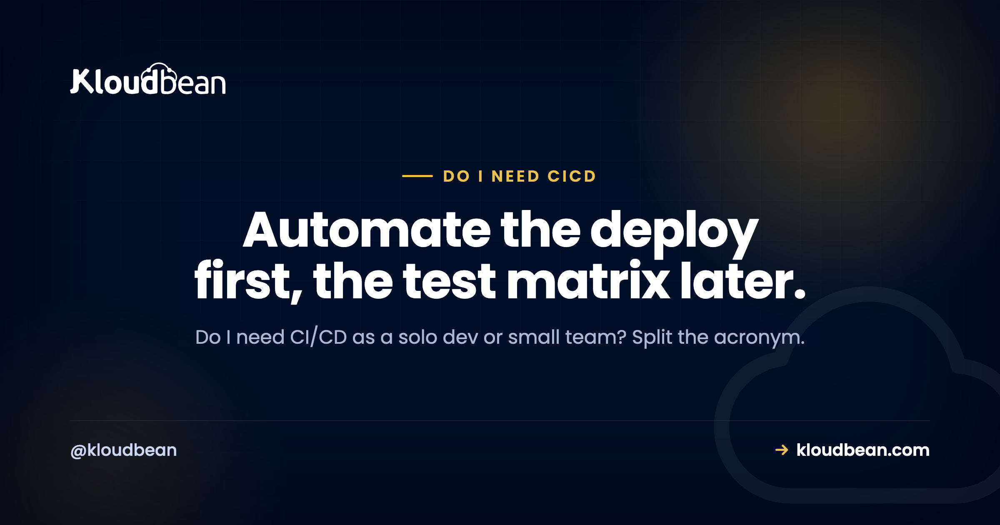

# Do I Need CI/CD? An Honest Answer

By Kloudbean Engineering · Automate the deploy first, the test matrix later.

Do I need CI/CD? It's one of the first questions a solo dev or small team hits once an app is real enough to deploy more than once. The usual answers sit at two extremes. One camp says stand up a full pipeline on day one. The other says it's enterprise theatre you can ignore until you're big. Both miss the one distinction that answers the whole thing. So here's the honest version, split into the two halves that actually matter.

> **The short answer.** Split the acronym. CD, automatically deploying on every push, is worth it almost immediately, even solo, because manual deploys are where silly, expensive mistakes live. CI, automatically building and testing on every push, pays off once you have real tests and more than one person committing. So adopt push-to-deploy now, add automated testing as your code and team grow. You rarely need a heavy enterprise pipeline early.

## The honest answer: automate deploys now, scale testing later

Most people treat CI/CD as one big scary block you either have or don't. That framing is the reason the question feels hard. In practice it's two separate jobs bolted together with a slash, and they earn their keep at very different times.

The deploy half pays off almost the moment you have a second deploy. The testing half pays off later, when there's enough code and enough people that mistakes slip through the cracks in your head. Lumping them together makes you think you must buy the whole thing at once, so you either over-build a pipeline you don't need yet or skip the part that would've saved you last Tuesday.

So the real answer to "do I need CI/CD" is not yes or no. It's "yes to the deploy automation now, and yes to the testing automation when your project actually has something to test and someone to protect." Get that order right and the rest is detail.

## CI and CD: one acronym, two different jobs

Because the terms get used interchangeably, let's pin them down. They're genuinely different machines that happen to share a slash.

**CI, continuous integration**, means every push triggers an automated build and test run. The point is to catch integration problems early, before a broken change piles onto another broken change. CI is only as useful as the tests it runs. No tests, nothing to integrate-check, and CI is an empty ceremony.

**CD** is the one people conflate, because it stands for two related things. **Continuous delivery** keeps every change built, tested, and in a deployable state, then a human clicks to release. **Continuous deployment** goes one step further and ships to production automatically once the checks pass, no human gate. For a solo dev, "push-to-deploy" (you push, it builds, it goes live) is usually continuous deployment in its simplest form.

When someone asks "is CI/CD necessary," they're often really asking about CD, the deploy automation, because that's the part they touch every day. And that's the half with the clearest early payoff. You'll likely use an S3-compatible bucket or a managed database regardless. That's not the same as needing a multi-stage test pipeline to ship a one-line fix.

## Why automated deploy is worth it almost immediately

Here's the part I'll take a firm position on: some form of automated deploy is worth setting up early, even for a solo project, and it's the single highest-return piece of the whole CI/CD conversation.

Think about what a manual deploy actually is. It's a checklist you run from memory, usually at the worst possible time. Build the app, upload the files, run the database migration, restart the process, clear the cache, check it came back. Miss one step, do them out of order, or fat-finger a command over SSH, and production breaks in a way that has nothing to do with your code. That's not a skill issue. It's a design issue. Humans are bad at running the same fiddly checklist perfectly every time.

Push-to-deploy removes that whole class of mistakes. When "deploy" means "git push," the steps run the same way every single time, in the same order, whether it's a Tuesday afternoon or 2am after a hotfix. A few things you get almost for free:

- **Repeatability.** The deploy is code, not memory. It can't skip a step because you were tired.
- **Sane rollbacks.** If a release goes wrong, you redeploy the previous commit instead of reconstructing what the server looked like an hour ago. This is the foundation that makes [zero-downtime deployments](https://www.kloudbean.com/blog/zero-downtime-deployments/) even worth attempting.
- **A clean Git story.** Deploys map to commits and branches, so you always know exactly what's live. It pairs well with tidy branch habits, like knowing how to [delete and rename Git branches](https://www.kloudbean.com/blog/git-delete-and-rename-branch/) without leaving stale mess behind.
- **Less fear.** Boring deploys mean you ship small changes often, which is safer than saving up a scary big release.

None of that needs a test suite, a team, or a fancy tool. It just needs "when I push, the right thing happens." That's why the deploy half of CI/CD is the early win, and honestly the one I'd set up before writing much else.

## When you actually need CI (the automated-testing half)

CI is the other half, and it's genuinely worth waiting for. Not forever. Just until you have something for it to do.

Automated testing on every push starts earning its keep when a few things become true. You have **real tests** worth running, not zero. You have **more than one person** pushing code, so "it works on my machine" stops being a reliable check. Your **codebase is big enough** that you can't hold the whole thing in your head anymore, so a change in one place quietly breaks another. Or you **ship often enough** that catching regressions by hand is a tax you keep paying.

If none of those are true yet, a full CI setup is mostly decoration. And here's the anti-pattern I see constantly: someone wires up an elaborate multi-stage pipeline, matrix builds across five versions, lint gates, coverage thresholds, before they've written a single test. It looks professional and catches nothing. A pipeline with no tests is a very fast way to deploy bugs.

My honest take: one smoke test that boots the app and hits the health endpoint catches more real outages than a ten-stage pipeline with an empty test folder. Start there. Add tests where things actually break, wire CI to run them, and let the pipeline grow to match the risk. The order is tests first, then CI around them, not the reverse.

## Manual deploy vs push-to-deploy vs a full pipeline

It helps to see the three options side by side, because "do I need CI/CD" is really a choice among these, not a yes or no.

| | Manual deploy | Push-to-deploy (CD) | Full pipeline (CI + CD) |
| --- | --- | --- | --- |
| What happens on a change | You build and copy files by hand | git push builds and deploys for you | Push runs tests, then deploys if green |
| Setup effort | None, until it bites | Small, mostly one-time | Larger, grows with your test suite |
| Main risk it removes | Nothing | Human error in the deploy steps | Shipping a change that breaks something |
| Good fit | A throwaway experiment | Almost any living project | Real tests and/or a team |
| Where it's overkill | Anything you maintain | Rarely | A tiny solo app with no tests yet |

Notice the middle column is a fit for almost everything real. The right column is where you head as tests and teammates appear. The left column is fine for a weekend throwaway and a bad idea for anything you plan to keep. Most people asking this question belong in the middle, moving rightward over time.

<!-- ADD IMAGE: a simple pipeline diagram. Left "Manual deploy": a messy stack of hand-run steps (build, SSH, copy, migrate, restart) with a red "one missed step breaks prod" note. Right "Push-to-deploy": git push -> build -> deploy -> live, with a dashed "add tests here (CI)" gate between build and deploy. Brand colors navy #000f27, purple #4F1AF3, green #40b75f. src -> images/cicd-flow.png -->

*The choice isn't pipeline or nothing. It's how much you automate, and in what order.*

## The hidden cost of skipping automated deploy

The reason "you don't need CI/CD yet" is bad advice for most people is that the cost of manual deploys is invisible right up until it lands on you.

The first cost is **error**. Every manual deploy is a fresh chance to skip a migration, restart the wrong process, or deploy from the wrong branch. It won't happen most times. It'll happen on the deploy that matters, under pressure, and it'll be your outage.

The second cost is **fear**, which is sneakier. When deploying is risky and manual, you deploy less. You batch up changes into big releases because each release is scary, which makes each release bigger and scarier. Automated deploy breaks that loop by making shipping boring.

Now the other direction, because over-building has a cost too. If you spend your first week configuring a pipeline with test matrices and staging gates for an app that has no users and no tests, you've spent your scarcest resource, time, on infrastructure that isn't protecting anything yet. The honest position cuts both ways: don't skip automated deploy, and don't gold-plate automated testing before there's something to test.

## When do I need CI/CD? A quick way to decide

You don't need a long deliberation. Run through three questions and you'll have your answer.

**Do you deploy this project more than once?** If yes, set up push-to-deploy now. It's the cheap, high-return half, and it's worth it whether you're a team of one or ten. If it's a genuine throwaway, skip everything and move on.

**Do you have tests, and is more than one person committing?** If yes to either, add CI so those tests run automatically on every push. If you have no tests and it's just you, write a smoke test or two first, then wire CI around them. CI without tests is a no-op.

**How often do you ship, and how bad is a bad deploy?** The more often you release, and the more it hurts when something breaks, the more a real pipeline (staging, gates, automated checks) pays for itself. A low-traffic side project needs far less than a paid product real people depend on.

That's the framework: team size, test coverage, and release frequency. Push-to-deploy answers the first question for nearly everyone. The testing and gating grow to match the other two. When you're ready for the mechanics, the [step-by-step guide to auto-deploying from GitHub](https://www.kloudbean.com/blog/ci-cd-auto-deploy-from-github/) covers the actual setup, so this page can stay about the decision.

## Where this leaves Kloudbean

If your decision lands where most do, "I want push-to-deploy now, and room to add tests later," that's a setup any decent managed platform should make trivial. On Kloudbean, the managed CI/CD does exactly that shape: connect a Git repo and it builds and deploys on every push, with deployment history and live build logs in the console so you can see what shipped and when. That's the deploy half handled without you scripting servers by hand. Useful to know, and secondary to the real point here, which is the decision itself. If you're deploying something built with an AI tool, the same thinking applies in [deploying an AI-built app to production](https://www.kloudbean.com/blog/deploy-ai-built-app-to-production/).

---

**Make deploys boring, then make them safe.** If you want push-to-deploy from a Git repo, with deployment history and live build logs, that's built into Kloudbean's managed CI/CD. See [kloudbean.com](https://www.kloudbean.com/) and [pricing](https://www.kloudbean.com/pricing/).

## FAQ

**Do I need CI/CD as a solo developer?**
You need the CD half, automated deploy, almost right away, even solo. Manual deploys are error-prone, and push-to-deploy removes a whole class of mistakes while making rollbacks sane. The CI half, automated testing, matters less until you have tests worth running. So a solo developer should set up push-to-deploy first and add testing automation as the project grows.

**Is CI/CD necessary for a small project?**
Automated deploy is worth it for any small project you actually maintain and deploy more than once. A full test-and-gate pipeline usually isn't necessary early, because there's little to test and only one person shipping. Start with push-to-deploy, then add CI when you have real tests or a second contributor. Necessary is the wrong lens; think about what each half prevents.

**What is the difference between CI and CD?**
CI, continuous integration, automatically builds and tests your code on every push to catch breakage early. CD, continuous delivery or deployment, automatically gets a passing change ready to release or all the way to production. In short, CI is about proving a change is good, and CD is about shipping it without manual steps. They're separate jobs that are often set up together.

**Is CI/CD worth it if I have no tests yet?**
The deploy half is still worth it with zero tests, because push-to-deploy prevents manual deploy mistakes regardless of testing. The CI half is not worth much yet, since automated testing has nothing to run. The better move is to write a smoke test or two first, then wire CI around them. Do not build a pipeline that gates on an empty test suite.

**When do I need CI (automated testing)?**
You need CI once you have real tests, more than one person committing, a codebase too large to hold in your head, or a release cadence where catching regressions by hand becomes a tax. Any one of those is a good trigger. Before then, automated testing on every push mostly adds ceremony. Add it when it starts protecting something real.

**Does push-to-deploy make rollbacks easier?**
Yes, and that's one of its biggest benefits. When deploys map to commits, rolling back is redeploying a previous known-good commit instead of reconstructing server state from memory. That turns a stressful incident into a routine action. It also makes zero-downtime strategies practical, because the deploy process is repeatable and versioned.

**Can automated deploy cause an outage?**
It can, if a bad change ships automatically with nothing checking it. That's exactly why you add CI, automated tests, as a gate once you have tests to run. Push-to-deploy without any checks is faster than manual and still human-proof on the steps, but it will happily deploy a broken commit. The fix is tests plus a gate, not going back to manual.

**Do I need Jenkins or a big CI tool to start?**
No. A heavy standalone CI server is rarely the right starting point for a solo dev or small team. Most managed platforms and Git hosts can build and deploy on push with almost no setup, which covers the early, high-value case. Reach for a larger, self-run CI tool only when your testing and build needs genuinely outgrow the simpler option.

**Is continuous deployment the same as continuous delivery?**
Not quite. Continuous delivery keeps every change built, tested, and ready to release, with a human clicking to ship to production. Continuous deployment removes that human click and releases automatically once checks pass. Both are the CD in CI/CD, and the right one depends on how much you want automated versus gated for your particular project.

---

*Kloudbean Engineering · Automate the boring deploy today. Add the test gates when you have tests and teammates to protect.*
