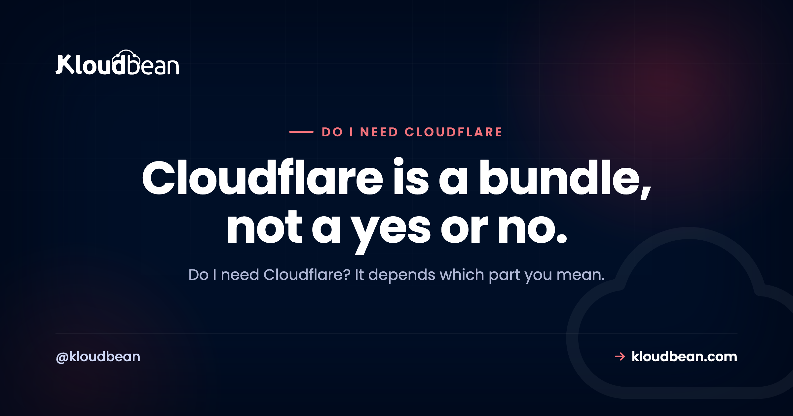

# Do I Need Cloudflare? An Honest, Feature-by-Feature Answer

By Kloudbean Engineering · Cloudflare is a bundle, not a yes or no.

Do I need Cloudflare? It's one of those questions where the honest reply is another question: which part of Cloudflare do you mean? Cloudflare isn't a single feature. It's a stack of them sold together, and most of the confusion comes from treating one yes-or-no answer as if it covers all of them at once. So let's pull the bundle apart, piece by piece, so you can see what you'd actually be switching on and whether you need it.

> **The short answer.** Cloudflare is a bundle: managed DNS, CDN caching, DDoS protection, a WAF, and SSL. The real question is which of those you need. For most small public sites the free plan is worth turning on (managed DNS, basic CDN, a DDoS buffer) with little downside, so it's often worth a try. You rarely need the paid tiers unless you have a specific WAF, performance, or enterprise requirement. And if your host already handles SSL, caching, and basic protection, or your tool is internal with no public exposure, you may not need it at all.

## The honest answer: it depends which part you mean

There's no clean yes or no, because Cloudflare packs at least five separate jobs into one signup: managed DNS, a CDN for caching, DDoS protection, a web application firewall (the WAF), and SSL certificates. When someone says you "need Cloudflare," they're really recommending some subset of those, usually without saying which one.

So here's the position, plainly. For most small and mid-sized public sites, the free plan is worth turning on. You get managed DNS, basic CDN caching, and a DDoS buffer, with very little downside. That's genuinely useful, and it's free, which is a rare pairing. Credit where it's due: Cloudflare's free tier is a real gift to the small web.

What you almost certainly don't need early on are the paid tiers. Those exist for deeper WAF rules, finer performance tuning, and enterprise features. Paying for them before you've hit the problem they solve is buying a ceiling you're nowhere near. And there are real situations where you can skip Cloudflare completely. We'll get to those.

## What does Cloudflare actually do?

Before you can decide, you need to see the parts. A clean way to define it: Cloudflare is a service that sits between your visitors and your server, bundling several jobs into one layer that your traffic passes through. Each job is worth understanding on its own.

- **Managed DNS.** It hosts your domain's DNS records and answers lookups from a fast global network. If you're fuzzy on what that means, here's [what DNS is and how a lookup works](https://www.kloudbean.com/blog/dns-explained/). Reliable, quick-to-edit DNS is the piece almost everyone benefits from.
- **CDN caching.** It stores copies of your static files at locations near your visitors, so a page in Sydney isn't fetched all the way from a server in Virginia. Here's [what a CDN actually does](https://www.kloudbean.com/blog/cdn-explained/). Great for a global audience or heavy static content, less critical for a small local site.
- **DDoS protection.** It absorbs and filters flood traffic before it reaches your server, so an attack aimed at knocking you offline hits Cloudflare's capacity instead of yours. This is [how a DDoS flood works](https://www.kloudbean.com/blog/ddos-protection-explained/) and why a buffer in front helps.
- **A WAF (web application firewall).** It inspects requests and blocks common attacks like SQL injection and cross-site scripting before they reach your app. Here's [what a WAF blocks](https://www.kloudbean.com/blog/what-a-waf-does/). This is the piece that mostly lives behind the paid tiers.
- **SSL/TLS.** It can issue and terminate the HTTPS certificate for your domain at its edge, so browsers show the padlock. Useful, unless your host already hands you free SSL, in which case it's redundant.

Read that list again and a pattern jumps out. Some of these you want almost always (DNS). Some depend on your audience (CDN). Some depend on your risk (DDoS, WAF). And one you might already have (SSL). That's why "do I need Cloudflare" can't have a single answer.

## Where Cloudflare actually sits

The mental model that makes the rest easy: Cloudflare is a layer in front of your server, not a replacement for it. You point your domain at Cloudflare, and Cloudflare forwards clean traffic to your origin. Every feature in the bundle does its job at that hop, before a request ever reaches your app.

<!-- ADD IMAGE: diagram of the request path. Visitor -> Cloudflare edge (DNS, CDN cache, DDoS filter, WAF, SSL) -> your origin server. Brand colors navy #000f27, purple #4F1AF3, green #40b75f. -->

*Cloudflare proxies your traffic. Your server still runs your app, it just stops being the first thing the public internet touches.*

## Which Cloudflare feature solves which need

Instead of asking "do I need Cloudflare," ask "which of these needs do I actually have." Map each feature to the problem it solves and the decision turns concrete.

| Cloudflare feature | What it actually does | You need it if |
| --- | --- | --- |
| Managed DNS | Hosts your DNS records, resolves lookups from a global network | You want reliable, quick-to-edit DNS (nearly everyone) |
| CDN caching | Caches static files at edge locations near visitors | You have a global audience or heavy static content |
| DDoS protection | Absorbs and filters flood traffic before your server sees it | You are a plausible target or have been hit before |
| WAF | Screens malicious requests (SQLi, XSS, bad bots) by rule | You run a public app with logins, forms, or payments |
| SSL/TLS | Issues and terminates the HTTPS certificate at the edge | Your host does not already give you free SSL |
| The free plan | Bundles managed DNS, basic CDN, a DDoS buffer, shared SSL | You want the basics at no cost (most small sites) |

If you scan that and only the DNS row feels like a clear yes, that's a completely normal result for a small site. It means the free plan covers you and you can stop there.

## Do I need Cloudflare for a small site?

For a typical small site or blog, turning on the free plan is a reasonable default. It gives you solid managed DNS, some caching, and a DDoS cushion, and it costs nothing. The main downside is one more account in front of your domain, which can add a step when you're debugging DNS or caching. That's a small price, and usually worth paying.

The paid tiers are a different question. Here's roughly where the line sits:

| | Free plan | Paid tiers |
| --- | --- | --- |
| Managed DNS | Yes | Yes |
| CDN caching | Yes, basic | Yes, with finer control |
| DDoS protection | Yes | Yes, plus more controls |
| SSL certificate | Yes, shared | Yes, more options |
| WAF | Very limited | Full managed and custom rules |
| Caching and performance rules | Minimal | Configurable |
| Typical fit | Most small sites | Public apps needing WAF depth or tuning |

Notice what's driving the paid column: a real WAF, fine caching control, and performance features. If you don't yet have the kind of public, attackable app that needs a tuned WAF, you're not the customer those tiers were built for. Start free. Upgrade when a concrete need shows up, not before.

## When you can skip Cloudflare

Being fair to Cloudflare doesn't mean everyone should run it. A few cases where you can comfortably pass:

- **Internal tools with no public exposure.** An admin panel behind a VPN or an IP allow-list isn't facing the open internet, so the DDoS and WAF value mostly evaporates. Locking down access does more than a CDN would.
- **Your host already covers the basics.** If your platform gives you free SSL, sensible caching, and baseline protection, the overlap with Cloudflare's free tier shrinks. You might still want its DNS or global CDN, but "I have no protection at all" isn't your situation.
- **Tiny, local, low-stakes sites.** A brochure site for a local business with a handful of daily visitors gains little from a global edge network. Adding Cloudflare isn't wrong, it's just not solving a problem you have.

None of these mean Cloudflare is bad. They mean the specific value it adds is small for your case, and simplicity has its own worth.

## When Cloudflare is genuinely worth the paid tiers

On the other side, there are clear moments to pay. Reach for the paid plans when you run a **public app that handles logins, forms, or payments** and you want a real managed WAF screening requests. Reach for them when you have a **global audience and static-heavy pages** where fine caching control measurably improves load times. Reach for them if you've **been attacked before** or are a plausible target, and the baseline mitigation isn't enough. And reach for them when a **compliance or enterprise requirement** calls for specific edge controls or logging.

In those cases the paid tiers buy something concrete, and the money is well spent. The mistake isn't paying Cloudflare. It's paying before you have the problem.

## Deciding about do I Need Cloudflare without ceremony

You can settle this in about a minute.

**Is your site public-facing at all?** If it's an internal tool behind access controls, you probably don't need Cloudflare. Lock down access instead. If it's public, keep going.

**Does your host already give you SSL, caching, and basic protection?** If yes, you might only want Cloudflare for DNS or a global CDN, if anything. If no, the free plan fills real gaps.

**Do you handle logins, payments, or sensitive data, or are you a likely target?** If yes, the paid WAF and deeper protection start to earn their cost. If no, the free plan is almost certainly enough.

Run those three and you'll land on one of three honest outcomes: skip it, use the free plan, or pay for a specific need. All three are correct answers for the right site.

## What your host might already cover

Here's the part people forget: some of what you'd reach to Cloudflare for might already be handled wherever your app runs. A good managed host gives you free SSL out of the box and applies baseline server hardening, so you're not starting from a wide-open box that badly needs a shield.

Kloudbean is one example. Every Kloudbean server comes with free SSL and baseline hardening (a Shorewall firewall plus Fail2ban) as standard, so the "I have zero protection" starting point isn't where you begin. If you do want Cloudflare's edge on top, it's available as a paid add-on on any plan, and included for Enterprise. Two honest caveats, though: Cloudflare isn't unique to Kloudbean (plenty of hosts resell it), and it isn't free for everyone here (the add-on is paid outside Enterprise). The useful takeaway is simpler than any sales pitch. Check what your host already gives you before assuming you must bolt Cloudflare on.

<!-- cta:start -->
**Ship the app, not the infrastructure.**

Servers, managed databases, object storage, and a built-in load balancer live behind one login, on the cloud and region you pick. The stack, SSL, patching, and backups are handled for you.

- Seven cloud providers
- Managed databases
- Object storage
- Automatic backups
- Free SSL
- Git deploy
- Free migration assistance

[Start free](https://console.kloudbean.com/register) · [See plans](https://www.kloudbean.com/pricing/)
<!-- cta:end -->

## FAQ

**Do I need Cloudflare for my website?**
It depends what you want from it. Cloudflare bundles managed DNS, CDN caching, DDoS protection, a WAF, and SSL. For most small public sites the free plan is worth turning on for the DNS and DDoS buffer alone, with little downside. You don't need it for an internal tool, and you may not need it if your host already handles SSL and basic protection.

**Is Cloudflare necessary?**
No, it isn't strictly necessary for most sites to function. Your site works without it. Cloudflare adds convenience, caching, and a layer of protection. Whether that's worth it depends on your audience, your risk, and what your host already provides. Necessary is the wrong word. Useful for many, optional for all, is closer to the truth.

**What does Cloudflare actually do?**
It sits between your visitors and your server as a proxy layer. In that layer it resolves DNS, caches static content through a CDN, filters flood traffic with DDoS protection, screens malicious requests with a WAF, and can handle your SSL certificate. It's five jobs bundled into one signup, which is why the answer to needing it is never a simple yes.

**Is the Cloudflare free plan enough?**
For a lot of small and mid-sized sites, yes. The free plan covers managed DNS, basic CDN caching, a DDoS buffer, and shared SSL. The paid tiers mainly add a deeper WAF, finer caching and performance control, and enterprise features. If you don't have a specific need for those, the free plan is usually enough. Start there and upgrade only when a real problem appears.

**Do I need Cloudflare if my host already gives me SSL?**
Not for the SSL. If your host issues free SSL, that part of Cloudflare is redundant. You might still want Cloudflare for its managed DNS or a global CDN. But free SSL from your host removes one of the common reasons people add Cloudflare in the first place.

**Does Cloudflare make my site load faster?**
It can, for the right site. Its CDN caches static files close to visitors, which cuts distance-related delay for a global audience. For a small site whose visitors sit near the server already, the speed gain is minor. Caching helps most when you have static content and geographically spread users. It's not a magic speed switch for every site.

**Can I use Cloudflare with any hosting provider?**
Generally yes. Cloudflare works at the DNS and proxy layer, so it sits in front of almost any host. You point your domain's DNS at Cloudflare and it forwards traffic to your origin server. That's also why it isn't exclusive to any one platform. Many hosts even resell Cloudflare as an add-on.

**Do I need the paid Cloudflare plans?**
Usually not, at least not early. The paid tiers are built for deeper WAF rules, fine caching and performance control, and enterprise features. If you run a public app with logins or payments, or you're a likely attack target, they start to earn their cost. If you're a small site, the free plan almost certainly covers you.

**Will Cloudflare protect me from every attack?**
No, and any honest answer says so. Cloudflare's DDoS protection and WAF stop a large class of common attacks at the edge, which is valuable. But they don't fix insecure code, weak passwords, leaked credentials, or application logic flaws. Cloudflare is one layer. Secure your app, your secrets, and your server too.

---

*Kloudbean Engineering · Turn on the parts you need. Skip the parts you don't.*
