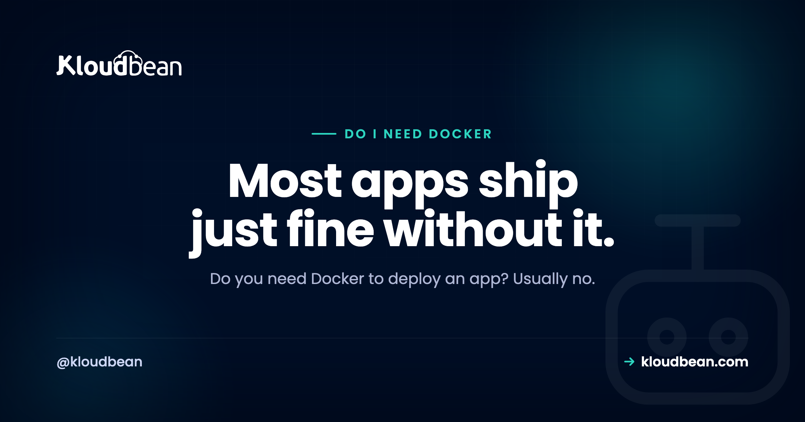

# Do I Need Docker to Deploy an App? Usually Not

By Kloudbean Engineering · Most apps ship just fine without it.

You built something with Cursor, Lovable, or Bolt, it runs fine on your laptop, and now every deploy tutorial and half of Reddit insists you containerize it first. Before you lose an afternoon to a Dockerfile, answer the question people actually paste into Google: do I need Docker to deploy an app? Short version, no. Not to ship. This guide covers what Docker really solves, what it quietly costs a solo builder, and the handful of cases where it genuinely earns its keep.

> **The short version.** No, you don't need Docker to deploy an app. Most managed platforms build and run a normal Node or Python app straight from Git, with no Dockerfile at all. Docker starts to pay off when you have fiddly system dependencies, a team that needs identical environments, or several services to wire together. For one AI-built app, skip it and ship.

## So, do I need Docker to deploy an app?

Let's separate two things that get tangled together. Deploying means getting your code running on a server the internet can reach, with your environment variables set and a process that stays up. Docker is one way to package that code. It is not the deployment itself, and it is not required for one.

The confusion is understandable. Docker shows up in nearly every modern tutorial, so it starts to feel like a law of physics. It isn't. Plenty of production apps serving real users ship without a single Dockerfile, and your AI-built app is almost certainly one of them.

So the honest answer to "do I need Docker to deploy an app" is no, you don't, at least not to get live. Whether you *should* is the more interesting question, and it depends entirely on your situation. Let's do that part properly.

## What Docker actually solves

Before knocking Docker off its pedestal, give it a fair hearing. It solves real problems, and it solves them well.

First, a reproducible environment. A Docker image bundles your code with the exact runtime version, system libraries, and OS packages it needs. The thing that runs in production is the thing you built and tested. No drift.

Second, it kills "works on my machine". When every developer, your CI pipeline, and the server all run the identical image, the classic "but it runs locally" bug largely disappears. That's a real relief on a team.

Third, it packages system-level dependencies. Some apps lean on native tools: ffmpeg for video, ImageMagick for images, a headless Chromium for Playwright, a specific libpq or GDAL build. Installing those by hand on a fresh server is fiddly and easy to get subtly wrong. A Dockerfile bakes them in once, and they travel with the app.

There's also isolation and portability, which flow from the same idea. The container carries its own little world, so it runs the same wherever containers run. None of this is marketing. If your app has these needs, Docker is a good answer.

## What Docker costs you (the part tutorials skip)

Here's what the enthusiastic tutorials tend to leave out. Docker is not free. You pay for it in time and complexity, and for a solo or non-expert builder that bill can be steep.

You have to write and maintain a Dockerfile. A working one is easy. A *good* one, small base image, correct layer ordering so the cache actually helps, a non-root user, multi-stage builds to keep the image lean, is a skill you pick up over weeks, not minutes.

You have to build and store images. That means build time on every change, a container registry to push to, and image sizes that balloon if you're not careful. A sloppy image can be many times larger than it needs to be.

And you've added a whole layer to learn and debug. When something breaks, you're no longer just debugging your app. You're also debugging the container: port mapping, mounted volumes, how environment variables get passed in, why the build works locally but not in CI. Every one of those is a new failure mode.

My honest take? For a first deploy of a single app, that tax rarely pays for itself. You wanted to ship a product, not become a container engineer this week.

## How platforms deploy without a Dockerfile

So if not Docker, then what? The answer most managed platforms reach for is a build system that reads your project and figures it out.

You push to Git. The platform detects a Node or Python app, installs your dependencies, runs your build command, and starts the process your config points to. No Dockerfile, no image to manage, nothing for you to hand-write. It's the same push-to-deploy loop that [continuous deployment from GitHub](https://www.kloudbean.com/blog/ci-cd-auto-deploy-from-github/) is built around.

Here's the nuance worth holding onto: many of these platforms *do* run your app in a container behind the scenes. The difference is that they build and manage it, and you never see it. "No Docker for you" means "no Dockerfile to write and maintain", not "no containers anywhere". That distinction is the whole reason this decision exists.

In practice, the work on your side looks like this.

```bash
# Deploy without Docker: push, and the platform builds and starts it
git add .
git commit -m "ship it"
git push origin main
```

The platform reads your start command and dependency list, and that's usually all it needs to ship the app.

```json
{
  "scripts": {
    "build": "vite build",
    "start": "node server.js"
  }
}
```

## Two paths to production, side by side

The two routes look like this. One is a straight line. The other has more boxes, and each box is a thing you own and can break.

<!-- ADD IMAGE: an inline SVG diagram. Top row (green accent): "Deploy from Git" as three boxes, git push -> platform installs deps, builds and starts it -> app is live, labelled "you write app code, that's all". Bottom row (purple accent): "Deploy with Docker" as five boxes, write Dockerfile -> build image -> push to registry -> run container -> app is live, labelled "more control, more to maintain". Brand colors navy #000f27, purple #4F1AF3, green #40b75f. -->

*Same destination. The Git path is fewer steps you own; the Docker path trades extra steps for extra control.*

| | Deploy from Git | Deploy with Docker |
| --- | --- | --- |
| What you write | App code and a start command | App code, plus a Dockerfile |
| What builds it | The platform, from your repo | You build an image, then run it |
| Learning curve | Low | Moderate to steep |
| Best for | One standard app, solo or small team | Complex environments, teams, many services |
| Where it bites | Less control over the exact image | More moving parts to maintain and debug |

## When Docker genuinely earns its place

Now the fair flip side. There are real situations where I'd reach for Docker without hesitating. Use Docker if:

- Your app needs fiddly native or system dependencies your host can't easily provide. If you're fighting to get ffmpeg, GDAL, or a specific system library onto the server, a Dockerfile ends that fight for good.
- You need exact parity across a team, or across dev, CI, and production. When "works on my machine" is costing real hours, one shared image is worth the setup.
- You have several services that run together. An app plus a background worker plus a queue plus a database is where docker compose shines, because it declares every piece and how they connect in one file.
- You want portability between hosts. An image runs the same on anything that runs containers, which keeps you from being welded to one provider's build system.
- Your app already ships as an image. If upstream hands you a container, run the container. Don't fight it.

Notice the pattern. Docker earns its place when the environment is complicated, the team is bigger than one, or you're juggling several moving parts. That's exactly when reproducibility stops being a nice-to-have.

## When to skip Docker

And the mirror image. Skip Docker if:

- You're shipping one Node or Python app with standard dependencies.
- You're solo, or on a small team, and nobody's a container expert.
- Your host already deploys from Git, so the reproducibility problem is mostly handled for you.
- You mainly want the thing live so you can iterate on the actual product.

That covers the large majority of AI-built and vibe-coded apps. If your app talks to a database and an API and renders some pages, you're in skip-it territory. And you can always add Docker later, the day one of the "use Docker if" points comes true. Adding it when you need it is easy. Adopting it before you need it just slows you down.

| Your situation | Docker? | Why |
| --- | --- | --- |
| One AI-built Node or Python app, standard deps | Skip it | A Git deploy already gives you a repeatable build |
| Native deps like ffmpeg, GDAL, headless Chromium | Use Docker | Bakes the exact system libraries into the app |
| A team hitting works-on-my-machine bugs | Use Docker | One image, identical everywhere |
| App plus worker plus queue plus database | Use Docker (Compose) | Declares each service and how they connect |
| You expect to move between hosts | Lean Docker | The image runs the same wherever containers run |
| You just want it live today | Skip it | A Dockerfile is one more thing to write, build, and debug |

## A Dockerfile is not magic, here is one

To demystify it, here's a minimal Dockerfile for a Node app. It's genuinely not scary. But read it for what it is: one more file you now own, keep updated, and debug when it misbehaves.

```dockerfile
# A minimal Node Dockerfile: not scary, but one more file to own
FROM node:lts-slim
WORKDIR /app
COPY package*.json ./
RUN npm ci --omit=dev
COPY . .
EXPOSE 3000
CMD ["node", "server.js"]
```

That's the deal in a nutshell. Real control, real power, and real maintenance. If you decide you *do* want containers, the practical side of running them is covered in [Docker container hosting](https://www.kloudbean.com/blog/docker-container-hosting/), and the question of whether you then need an orchestrator on top is [Kubernetes vs Docker](https://www.kloudbean.com/blog/kubernetes-vs-docker/). Most small apps don't.

## The verdict: use Docker if, skip it if

So, do you need Docker to deploy an app? No. You need a place to run your code and a way to get it there. Docker is one way to package that code, and a good one when your situation calls for it, but it's optional, not mandatory.

Use it when the environment is genuinely complicated, when a team needs identical setups, or when you're running several services at once. Skip it when you're one person shipping one app and you just want users on it. And remember you can start simple and add Docker the moment a real reason shows up. That's not a compromise. It's the sensible order.

One more thing, because it trips people up constantly. If your app runs locally but falls over on the server, that's almost never a Docker problem. It's usually config, and [why your AI app works locally but not in production](https://www.kloudbean.com/blog/why-my-ai-app-works-locally-but-not-in-production/) walks through the usual suspects. Getting an AI-built app live end to end is covered in [deploy your AI-built app to production](https://www.kloudbean.com/blog/deploy-ai-built-app-to-production/).

<div class="cta">
<!-- cta:start -->
**Prototype to production, without the babysitting.**

Run the app as an always-on process with managed databases, Redis, object storage, and automatic backups beside it. Deploy from Git with live build logs, and keep the infrastructure someone else's problem.

- Managed databases
- Always-on processes
- Object storage
- Automatic backups
- Free SSL
- Git deploy
- Free migration

[Start free](https://console.kloudbean.com/register) · [See plans](https://www.kloudbean.com/pricing/)
<!-- cta:end -->

## FAQ

**Do I need Docker to deploy an app?**
No. Deploying just means getting your code running on a reachable server, and Docker is only one way to package it. Most managed platforms build and run a normal Node or Python app straight from a Git push, with no Dockerfile at all. Reach for Docker when your situation calls for it, not by default.

**Do I need Docker for my SaaS?**
Not to launch. A typical SaaS built as one app with a database and an API deploys fine from Git without Docker. Docker becomes worth it once you are running several services together, need identical environments across a team, or depend on native system libraries. Until then it is optional.

**Can I deploy a Node or Python app without Docker?**
Yes, and most people do. Managed platforms detect the framework, install your dependencies, run the build, and start the process, all from a Git push. You provide a start command and your dependency list, and the platform handles the rest. No Dockerfile required.

**What does Docker actually solve?**
Three real things. It gives you a reproducible environment so production matches what you built, it ends works-on-my-machine bugs by running the same image everywhere, and it packages fiddly system dependencies like ffmpeg or a headless browser so you are not installing them by hand. Those are genuine wins when you need them.

**When should I use Docker?**
Use Docker when the environment is complicated or the team is bigger than one. Concretely: fiddly native dependencies, exact parity across dev, CI, and production, several services that run together, or portability between hosts. If none of those apply, you can skip it and add it later the day one becomes true.

**Do I need Docker for an AI or vibe-coded app?**
Usually not. An app built with Cursor, Lovable, or Bolt is generally a standard Node or Python project, which deploys straight from Git. Containerizing it first mostly adds work without adding value. Ship it the simple way, then reach for Docker only if a real need appears later.

**Does Docker make my app run faster?**
No. Docker is about packaging and consistency, not speed. A containerized app runs at roughly the same speed as the same app running directly on the server. The value is fewer environment surprises, not more performance. Choose it for reproducibility, never for a speed boost.

**Is Docker hard to learn if I am not a DevOps engineer?**
A basic Dockerfile is approachable in an afternoon. A good one, small, cached well, secure, and lean, takes real practice. The bigger cost is the new debugging surface: container networking, volumes, and build quirks are extra things that can break. For a solo builder shipping one app, that curve often is not worth it yet.

**Do managed platforms use Docker behind the scenes?**
Often, yes. Many platforms run your app inside a container that they build and manage for you. The point is that you never write or maintain the Dockerfile. So no Docker for you means no container work on your plate, not that containers are absent entirely.

---

*Kloudbean Engineering · Use Docker when it earns its place, skip it when it doesn't.*
