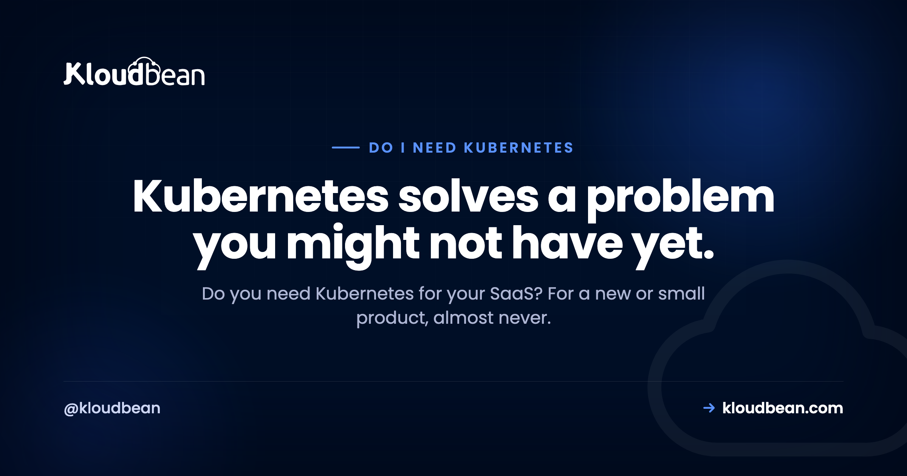

# Do I Need Kubernetes for My SaaS? An Honest Answer

By Kloudbean Engineering · Kubernetes solves a problem you might not have yet.

Ask an AI assistant or a Reddit thread how to run your SaaS and Kubernetes shows up fast. It runs a big chunk of the internet, so it sounds like the serious, grown-up choice. But "what runs Google" and "what your product needs this month" are different questions. For a new or small SaaS, standing up Kubernetes is usually a way to inherit a second full-time job you didn't ask for. So here's the honest version, fair to Kubernetes, of when you actually need it and when you really don't.

> **The short answer.** No. A new or small SaaS almost never needs Kubernetes. Kubernetes orchestrates many containers across many machines: self-healing, rolling deploys, service discovery, and scaling a whole fleet. Most young products are one app and one database on a single server, so there's little for it to coordinate, and operating it well is a full-time skill. Reach for Kubernetes when you actually have a fleet to run and a team to run it.

## The honest answer: almost always no, not yet

Let me say the quiet part first. Most startups do not need Kubernetes. Not because it's bad software, it's genuinely good at its job, but because its job is coordinating many services across many machines, and a young SaaS rarely has either. At launch you usually have one app process, one database, and maybe a background worker. There's almost nothing there to orchestrate.

When your goal is to ship and find users, the smart move is to remove moving parts, not add a distributed system underneath your app. Kubernetes adds a lot of moving parts. You gain a control plane, worker nodes, a networking layer, ingress, and a pile of YAML, all before a single customer notices. None of that is your product.

So the reflexive "just use Kubernetes" advice isn't wrong for everyone. It's answering a different question, the one about running a large fleet, and quietly assuming you have the team to operate it. Most founders are asking how to get live and stay up without a platform team. That question rarely points at a cluster.

## What Kubernetes actually does

It helps to know what you'd be signing up for, because the features are genuinely useful once you need them. Kubernetes is a container orchestrator. You hand it containers and a description of the state you want, and it works to keep reality matching that description across a group of machines.

Concretely, it gives you self-healing (it restarts crashed containers and reschedules work off a dead node), rolling updates and rollbacks (ship a new version gradually, back it out if it misbehaves), service discovery and internal load balancing (services find and talk to each other as they move around), and fleet scaling (add or remove copies of a service and pack them onto machines efficiently). It does all of this declaratively, constantly reconciling toward the state you asked for.

If the container basics feel fuzzy, [Kubernetes vs Docker](https://www.kloudbean.com/blog/kubernetes-vs-docker/) separates the two cleanly: Docker packages and runs one container, Kubernetes coordinates a whole fleet of them. You can, and probably should, use containers long before you ever need the orchestrator on top.

## Why most small SaaS do not have that problem yet

Look back at that feature list and notice something. Every item is an answer to a problem of scale or of many services. Now hold it against a typical early SaaS.

Self-healing across a fleet? You have one app, and a plain process manager will restart it if it crashes. Rolling deploys across nodes? Your platform's Git deploy already ships new versions for you. Service discovery? You have one service, so there's nothing to discover. Fleet scaling and bin-packing? You have a single server that's barely warm. You'd be paying the full price of the machinery to solve problems you don't have.

Here's my honest take after watching this play out many times: a single well-sized server handles real, paying traffic for far longer than people expect. The instinct to build it "like the big companies" on day one is the most expensive instinct in early SaaS. Scale the product first. Scale the infrastructure when the product forces you to, and not a day sooner.

The reason that works is that the useful pieces of the orchestrator have plain equivalents at your size. Process supervision is one of them: on Kloudbean, a Node app runs under PM2 with multiple processes, so a crash restarts and a multi-core box gets used, no scheduler involved. Rolling out a new version is a Git push through managed CI/CD. Neither is as clever as Kubernetes. Both are enough when there's one app to keep alive.

## The real cost of running Kubernetes

Kubernetes isn't priced mainly in dollars. It's priced in attention. Running it well is effectively a full-time operational discipline: cluster upgrades, node patching, the networking layer and ingress, storage classes, RBAC, secrets, health probes, resource limits, and the monitoring to see it all. Someone has to own that, and it's real work whether or not you have users yet.

Then there's the complexity budget. Every team has a finite tolerance for moving parts, and a cluster spends a big chunk of it up front. Each new abstraction is one more thing that can break, and one more layer to rule out when something does. An outage on a single server is basically "is my app up." An outage on Kubernetes can be your app, or a crash-looping pod from an over-aggressive liveness probe, or a failed rollout, or cluster DNS, or a node that got evicted under memory pressure.

The failure mode I've seen most: a solo founder spends launch month fighting TLS and ingress inside a cluster instead of talking to customers. The app was ready. The platform underneath it was the thing that wasn't. That's a self-inflicted wound, and it's common precisely because the tooling makes it easy to start before you should. The sting is that ingress and TLS are solved problems one layer down: a managed host issues and renews the certificate for you (free SSL on Kloudbean, nothing to configure) and the launch month goes to the product instead.

## When you genuinely do need Kubernetes

To be fair, because this isn't a hit piece, there are real situations where Kubernetes is the right call and skipping it would be the mistake.

Reach for it when you're running many services, a real microservice architecture, whose deploys and discovery have become painful to coordinate by hand. Reach for it when you have a platform or infrastructure person or team whose actual job is to own it. That's the big one, and honestly the deciding one. Reach for it when you genuinely run multi-region or multi-cluster and want one consistent way to deploy everywhere. Reach for it when your load is bursty and uneven enough that automated [autoscaling](https://www.kloudbean.com/blog/autoscaling-explained/) across a fleet earns its keep. And reach for it when your organisation has standardised on it and cross-cloud portability genuinely matters to you.

The signals that you've grown into it tend to arrive together: many services instead of one app, a person who owns infrastructure full-time, and a single server or a small pool that can no longer absorb your traffic or your release cadence. The clearest tell of all is when you catch yourself re-implementing pieces of Kubernetes by hand, hand-rolled health checks, deploy scripts that juggle replicas, ad hoc service discovery. At that point the real thing will pay for itself. The verdict is simple: choose Kubernetes when you have a fleet to run and a team to run it. If neither is true yet, you're buying a solution ahead of the problem.

One practical note on how this gets sold, because it should inform your decision. Kubernetes and autoscaling are enterprise-shaped products, not standard-plan switches. On Kloudbean both live in the Enterprise package (Premium gets a limited subset of Kubernetes features), and that pricing shape is an honest mirror of the operational reality: teams that genuinely need a cluster have a budget and an engineer for it. If you don't recognise yourself in that sentence, you have your answer, and it isn't a cluster.

## Kubernetes versus a single managed server

The real tradeoff is coordination power against operational weight. Seeing it side by side helps more than any rule of thumb.

| | Single managed server (or small pool) | Kubernetes cluster |
| --- | --- | --- |
| Built for | One app or a few, few machines | Many services across many machines |
| Who operates it | The platform, with light input from you | You, ideally a dedicated platform team |
| Setup before launch | Deploy your app | Cluster, networking, ingress, manifests |
| Self-healing | Process manager restarts the app | Built in across the whole fleet |
| Scaling | Resize the box, add a couple behind a load balancer | Orchestrated fleet scaling |
| Learning curve | Gentle | Steep, and ongoing |
| Best for | New and small SaaS | Large teams, many services, real scale |

Neither column is "better" in the abstract. If you run many services at scale with a team to match, the right column is your world and a single server would feel limiting. If you're launching or still small, the left column keeps you shipping and keeps outages boring. Most people reading this are in the second case, which is why the honest lean is that way, not because Kubernetes is bad.

The left column has more headroom than people credit it with, too. Resizing a server up is self-serve on Kloudbean, and putting two or three app servers behind the built-in Flexible Load Balancer is a subscription toggle rather than an architecture. One sizing warning while you're there: disk can grow but not shrink, so pick storage with a bit of slack and don't over-buy it either.

<!-- ADD IMAGE: a two-panel diagram. Left "Most small SaaS": one box "your app + managed database" on "one managed server", with a note that backups and SSL are handled and there is nothing to orchestrate. Right "A Kubernetes cluster": a control plane box above three worker nodes, each holding two or three pods, with a note about service discovery and self-healing. Brand colors navy #000f27, purple #4F1AF3, green #40b75f. -->

*Kubernetes earns its keep coordinating many containers across many machines. A new SaaS usually has one app on one, so there's little to orchestrate.*

## The decision, compressed

You don't need a week of deliberation. Three honest questions get you most of the way.

**Do you have a person or team whose real job is running infrastructure?** If no, stop here. Operating Kubernetes badly is worse than not running it at all, because now your outages have more causes and nobody to chase them. If yes, keep going.

**Do you have many services that must deploy and discover each other, or just one app and a database?** If it's one app, there's nothing for an orchestrator to orchestrate. If it's genuinely many, keep going.

**Is a single server, or a few behind a load balancer, actually failing to keep up?** If it's coping, adding Kubernetes solves a problem you don't have yet. If it truly can't handle your traffic or your release pace, that's a real signal.

It also helps to map the decision to where you actually are.

| Where you are | Sensible default |
| --- | --- |
| Solo founder or tiny team, one app | One managed server, deploy from Git |
| Small team, growing traffic, one or two services | Resize the server, or a small pool behind a load balancer |
| Several services, a dedicated infra owner, uneven load | Kubernetes starts to earn its keep |
| Many teams, many services, multi-region | Kubernetes, or a managed Kubernetes service, is the right tool |

And the reassuring part: starting simple is reversible. Containerise your app now, because that's good hygiene and it's most of the portability battle, and Kubernetes will be waiting when the signals actually show up. If all you need is to survive a deploy or a single-box failure, [high availability](https://www.kloudbean.com/blog/high-availability-explained/) is reachable with a small pool behind a load balancer long before you need a cluster. And if you're really just trying to run a few apps cheaply, putting [several apps on one server](https://www.kloudbean.com/blog/host-multiple-apps-one-server/) is the simpler answer. Choosing simple now doesn't lock you out of Kubernetes later. It just means you adopt it with a team and revenue behind the move.

## Find your symptom, then find the layer that actually fixes it

Nobody wants Kubernetes. They want a symptom to stop. Almost every time someone tells me they need a cluster, the pain they describe lives at a different layer, and the cheap fix at that layer is available today. So here's the map. Find your row.

| The symptom | What people reach for | Where the fix actually lives |
| --- | --- | --- |
| App died overnight and stayed dead | Self-healing pods | A process supervisor that restarts it (PM2, systemd) plus an alert that wakes you |
| Deploys drop requests for a few seconds | Rolling updates | Git-based deploys, and a second app server behind a load balancer if seconds matter |
| The box is running hot | Cluster scaling | Resize the server up first. It's one restart, and it buys most teams another year |
| Traffic triples for two hours a week | Autoscaling | Cache the expensive responses, size for the peak. True autoscaling is enterprise/custom territory, and it's cheaper to over-provision one box than to operate a cluster |
| Pages are slow even when idle | More replicas | The query. An index, an N+1, a missing cache. Replicas of slow code are just more slow code |
| Services can't find each other | Service discovery | Count your services. If the answer is one, this isn't your problem |
| Works locally, breaks in production | Kubernetes | Pin your runtime versions and your dependencies. That's the container half, not the orchestration half |
| A whole region could go down | Multi-cluster | Read replicas in another region. Note the primary database stays single-region regardless, so plan the failover, don't assume it |

Look at the right-hand column and notice something: not one of those fixes is Kubernetes, and most are an afternoon's work. That's the whole argument on this page in one table.

The row I want to underline is the slow-pages one, because it's where the most money gets wasted. No orchestrator makes an unindexed query fast. Neither does a bigger server, past a point, and neither does Kloudbean. If a page takes three seconds with one user on it, that time is being spent in your code or your database, and every layer of infrastructure you stack underneath it will be equally useless. Profile the request before you buy anything.

For the rows that are infrastructure, though, the cheap fix is the point. A managed server with a managed database, automatic backups, SSL and Git deploys covers rows one, two, three and seven without a control plane in sight, and the built-in load balancer covers row two properly when a blip actually costs you something. That's the setup most SaaS run on for years. If you genuinely arrive at rows six and eight, with the services and the team to match, Kubernetes is waiting, and on Kloudbean it's an Enterprise conversation rather than something you were supposed to figure out alone at launch. Containerise early, keep it boring, and let the symptom pick the layer.

---

**Run the SaaS, not a cluster.** If you need a managed server, a managed database, backups, and SSL, with room to add another app server behind a built-in load balancer as you grow, that's what Kloudbean is for. See [kloudbean.com](https://www.kloudbean.com/) and [pricing](https://www.kloudbean.com/pricing/).

## FAQ

**Do I need Kubernetes for my SaaS?**
Almost certainly not, at least not yet. Kubernetes orchestrates many containers across many machines, and a new or small SaaS is usually one app and one database on a single server. It solves problems of scale and coordination you probably don't have, while adding a full-time operational load. Reach for it when you have a fleet to run and a team to run it.

**Is Kubernetes overkill for a small SaaS?**
For most small SaaS, yes. The features that make Kubernetes powerful, self-healing across a fleet, service discovery, orchestrated scaling, only matter once you have many services and many machines. With one app and one database you pay the full complexity cost for almost none of the benefit. Simpler is genuinely better here.

**What does Kubernetes actually do?**
It's a container orchestrator. You describe the state you want and it keeps reality matching that across a group of machines: restarting crashed containers, rolling out new versions and rolling them back, letting services find each other, and scaling copies of a service up and down. That coordination is valuable when you have a fleet, and mostly idle when you have one app.

**When do you need Kubernetes?**
When you're running many services that need coordinated deploys and discovery, when you have a person or team whose job is to operate it, when you genuinely run multi-region, or when a single server and a small pool can no longer keep up. The deciding factor is usually the team. If nobody owns infrastructure full-time, you're not ready to run a cluster well.

**What are the alternatives to Kubernetes for a startup?**
Start with a single managed server and deploy from Git. When you need more, resize the server (vertical scaling) or put a few app servers behind a load balancer. Containerise your app for portability without adopting the orchestrator itself. Managed platforms handle deploys, backups, and SSL so you get most of the reliability without operating a cluster.

**Is Docker the same as Kubernetes?**
No. Docker packages and runs a single container, while Kubernetes coordinates many containers across many machines. You can use Docker on its own for a long time, and plenty of small apps never need more than that. Kubernetes sits on top of containers to orchestrate a fleet, which is a separate and much larger concern.

**Can I move to Kubernetes later if I outgrow my setup?**
Yes, and that's the normal path. If you containerise your app early, most of the migration work is already done, and you adopt Kubernetes when the real signals appear: many services, a dedicated infra owner, load a simpler setup can't absorb. Starting simple is a reversible decision, so there's no reason to pay the complexity cost before you have the problem.

**Does Kubernetes make my SaaS more reliable?**
Only if you can operate it well. In skilled hands it improves resilience through self-healing and rolling deploys. In unskilled hands it adds failure modes, misconfigured probes, broken ingress, cluster networking, that a single managed server would never have introduced. For a small team, a well-run simple setup is often more reliable than a poorly-run cluster.

**How many servers do I need before Kubernetes makes sense?**
There's no magic number, and counting servers is the wrong lens. The real triggers are many services that must be coordinated, a team to operate the cluster, and a workload a single server or small pool genuinely can't handle. If you're running a couple of machines and coping fine, you're not there yet. Let the pain, not a server count, tell you.

---

*Kloudbean Engineering · Reach for orchestration when you have a fleet to orchestrate, not before.*
