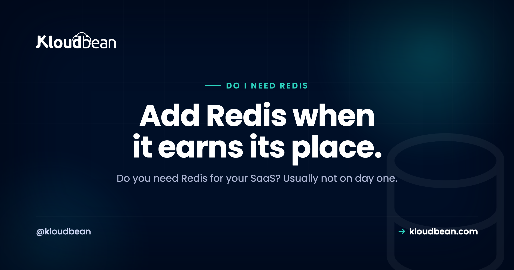

# Do I Need Redis for My SaaS? An Honest Answer

By Kloudbean Engineering · Add Redis when it earns its place.

Somewhere between your first deploy and your hundredth user, someone will tell you to add Redis. It's on every architecture diagram, so it starts to feel mandatory. But "common" and "necessary" are not the same thing, and for a lot of early products, Redis is a moving part you don't need yet. So here's the honest take on the question you actually typed into a search box, do I need Redis for my SaaS, with no hype: what Redis really is, what you can do without it, and the specific moments when it earns its place.

> **The short answer.** No, most new SaaS products don't need Redis on day one. Redis is a fast in-memory data store that shines at four jobs: caching expensive results, sharing sessions across servers, counting for rate limits, and brokering background jobs. Early on, a single server's memory or your existing database can cover those. Add Redis when you run more than one app server, a hot query is straining the database, you need rate limiting across instances, or you're adding background workers.

## The honest answer: probably not on day one

Redis gets reached for reflexively. It shows up in tutorials, boilerplates, and "production-ready" starter kits, so people add it before they have a reason to. That's backwards. Redis is a genuinely useful tool. But it's a tool for specific jobs, not a default ingredient every app must include.

Think about what a small SaaS actually runs on day one. One app server, one database, a domain with SSL, and backups. That stack serves real users and takes real money. Redis isn't on that list because nothing on that list needs it yet. Your database can store data, hold a session, and even act as a simple queue at small scale.

So the honest answer, before the details, is that most new SaaS products don't need Redis to launch. What you do need is to know the jobs Redis does well, so you can recognise the day one of them becomes a real problem. That day may come. It just usually isn't day one.

## What Redis actually is

Redis is a fast in-memory data store. Instead of keeping data on disk the way a traditional database does, it keeps data in your server's memory, which is why reads and writes are quick. It stores simple structures, strings, hashes, lists, sets, sorted sets, and counters, each under a key you choose.

The important part for this decision: Redis is usually not your system of record. It's a fast layer that sits next to your real database, not a replacement for it. Data in memory is volatile by nature, and while Redis does have persistence options, most teams treat it as a place where data can disappear and the app should still be fine. Your durable data, the users and orders and things you can't lose, stays in Postgres or MySQL.

If you want the deeper "which one stores what" version, that's its own topic, and there's a full walkthrough of [when to use Redis vs Postgres](https://www.kloudbean.com/blog/when-to-use-redis-vs-postgres/). Here we're answering a narrower question: do you need the extra moving part at all.

## The real jobs Redis does well

Redis isn't magic and it isn't general-purpose. It's very good at a small handful of jobs, and knowing them is how you'll spot when you need it.

- **Caching expensive results.** If a query or a computation is slow and the answer doesn't change every second, you can store the result in Redis and serve it from memory instead of recomputing it. That keeps load off your database.
- **Shared sessions.** When you run more than one app server behind a load balancer, a user's login session has to be readable by all of them. Redis is a common place to keep sessions so any server can serve any request.
- **Rate limiting.** Counting requests per user or per IP, and rejecting the ones over a limit, is a natural fit for Redis counters, especially when the count has to be shared across several servers.
- **A job queue broker.** Background workers that send email, process images, or run reports need somewhere to pick up jobs. Redis is a popular broker for queues like Celery, Sidekiq, RQ, and BullMQ.

Notice a theme. Three of those four jobs get harder the moment you have more than one server, and the fourth is about doing work outside the request. Hold that thought. It's the key to the whole decision.

## What you can do before you add Redis

Here's the part the boilerplates skip. For each of those jobs, there's usually a simpler option that works fine while you're small and on a single server.

For caching, one app server can hold results in its own memory, an in-process cache. No network hop, no extra service. It only breaks down when you have multiple servers that each keep their own copy, or when the cache needs to survive a restart. (And if a plain cache is genuinely all you'll ever need, it's worth seeing how [Redis vs Memcached](https://www.kloudbean.com/blog/redis-vs-memcached/) compare before you commit.)

For sessions, one server can keep them in its own memory or in a signed cookie. That works right up until you add a second server and a user's session vanishes half the time because it lived on the other one.

For rate limiting, a single server can count in memory. Again, that only falls apart when the count has to be shared across instances.

And for background jobs, your database can act as a queue at small scale. Postgres in particular does this well with SELECT ... FOR UPDATE SKIP LOCKED, which lets several workers pull jobs without stepping on each other. It's not as slick as a purpose-built broker, but it's real, it's durable, and it's one fewer service to run.

The pattern is clear. Postgres and a single server's memory can cover a surprising amount early on. My honest opinion: adding Redis before you've hit one of these walls is buying a fix for a problem you don't have yet.

## When you genuinely do need Redis

To be fair to Redis, and this isn't a case against it, there are clear moments when it stops being optional and becomes the right call.

The first, and most common: **you're running more than one app server.** The moment a load balancer sends requests to two or more servers, in-process memory stops working for anything shared. Sessions, caches, and counters all need to live somewhere every server can reach. Redis is the standard answer.

The second: **a hot query is straining your database.** If one expensive read runs constantly and your database is feeling it, caching that result in Redis takes the repeated load off. The signal here is a specific query you can name, not a vague wish to be faster. There's a practical [Redis caching guide](https://www.kloudbean.com/blog/redis-caching-guide/) for when you reach that point.

The third: **you need rate limiting across instances.** If you're protecting an API or a login endpoint and you have more than one server, a shared counter in Redis gives every server the same view of who's over the limit.

The fourth: **you're adding background jobs and need a broker.** Once you move real work out of the request cycle, sending email, generating exports, processing uploads, your worker library usually wants a broker. On Python, [Celery with Redis](https://www.kloudbean.com/blog/celery-with-redis/) is a common setup. On Node, [background jobs with BullMQ](https://www.kloudbean.com/blog/nodejs-background-jobs-bullmq/) use Redis underneath.

If one of these is true for you, add Redis and don't feel bad about the extra service. It's earning its place. If none of them is true yet, you're most likely fine without it.

## Redis or a simpler option: a decision table

Put it in a table. For each need, Redis usually helps, but there's often a simpler thing to reach for first while you're small and on one server.

| What you need | Does Redis help? | Simpler option first |
| --- | --- | --- |
| Cache a slow, repeated result | Yes, well | In-process cache on a single server |
| Share sessions across servers | Yes, a core use | One server's memory or a signed cookie, until you scale out |
| Rate limit across instances | Yes | An in-memory counter while you're on one server |
| Broker for background jobs | Yes | Your database as a queue (Postgres SKIP LOCKED) at small scale |
| Store your core, durable data | No, not its job | Postgres or MySQL, your system of record |
| Run heavy full-text search | Not its strength | A search engine such as Elasticsearch |

Read the middle column and it's tempting to add Redis for everything. Read the right column and you'll see why you can usually wait. The simpler option nearly always comes down to "you're on one server, so memory or the database is enough." Redis becomes the obvious choice the moment that stops being true.

<!-- ADD IMAGE: two-column decision diagram. Left "Signals you can wait": one app server, in-process cache is fine, the database handles the load, sessions live on one box. Right "Signals to add Redis": more than one app server, a hot query straining the DB, rate limits across instances, background jobs need a broker. Brand colors navy #000f27, purple #4F1AF3, green #40b75f. src -> images/redis-decision.png -->

*The trigger for Redis is almost always a second server or work that happens outside the request.*

## A quick way to decide

You don't need a long architecture review. Three questions usually settle it.

**Are you running more than one app server?** If yes, you need a shared place for sessions, caches, and counters, and Redis is the standard choice. If no, keep going.

**Is a specific, named query hurting your database?** If yes, caching that result in Redis is a targeted fix. If it's a vague "make it faster," hold off and measure first. If no, keep going.

**Are you adding background jobs or cross-instance rate limits?** If yes, a broker or a shared counter is a real need, and Redis fits both. If no, you can very likely ship without Redis today, and add it the day one of these turns true.

The good part about this order is that adding Redis later is easy. It's an extra service you point your app at, not a rewrite. So starting without it costs you nothing if the day never comes, and a small, well-understood change if it does.

## Where this leaves Kloudbean

If you do reach one of those triggers, the goal is to add Redis without turning it into a second operations project. On Kloudbean, [managed Redis](https://www.kloudbean.com/blog/managed-redis-hosting/) is one of the managed database engines you launch with a click, with automatic backups and controlled access, sitting alongside your managed server and your main database in the same dashboard. So the move stays small: when a real signal appears, you switch on managed Redis, point your app at it, and the platform handles the engine, patching, and backups while your data stays yours. That's the whole role Redis should play here, a fast layer you add when you need it, not a box you tick on day one.

---

**Add Redis when it earns its place.** When a hot query, a second server, or a background queue makes Redis the right call, managed Redis on Kloudbean is a click away, right next to your managed server and database. See [kloudbean.com](https://www.kloudbean.com/) and [pricing](https://www.kloudbean.com/pricing/).

## FAQ

**Do I need Redis for my SaaS?**
Usually not on day one. Redis is a fast in-memory data store that helps with caching, shared sessions, rate limiting, and background job queues. Early on, a single server's memory or your existing database can handle those jobs. Add Redis when you run more than one app server, a specific query is straining your database, or you're adding background workers.

**Is Redis necessary for a small app?**
For most small apps, no. The jobs Redis is built for either don't exist yet at small scale or can be handled by your database and a single server's memory. Redis becomes necessary when you outgrow one server or need to move work out of the request cycle. Until then it's an extra service to run for little benefit.

**When do I need Redis?**
You need Redis when one of a few clear signals appears: you run more than one app server and need shared sessions, a hot query needs caching to protect your database, you need rate limiting across instances, or you're adding background jobs and need a broker. If none of those is true yet, you can wait without worry.

**Do I need Redis or just Postgres?**
For a lot of early SaaS apps, just Postgres is enough. Postgres stores your durable data, can cache a computed value in a table, and can even run a simple job queue with SELECT FOR UPDATE SKIP LOCKED. Redis becomes worth adding once you have multiple servers or a measured hot path. If you want the deeper version, there's a full comparison of when to use Redis versus Postgres.

**Can Postgres do what Redis does?**
For some jobs, yes, at small scale. Postgres can cache a computed result in a table, store sessions, and run a basic job queue with SKIP LOCKED. What it doesn't do is serve those from memory the way Redis does, so under heavy, repeated load Redis takes real pressure off the database. Start with Postgres, and add Redis when the load is real.

**Do I need Redis for sessions?**
Only when you run more than one app server. With a single server, sessions can live in that server's memory or in a signed cookie. The moment a load balancer spreads requests across several servers, each one needs to read the same session, and a shared store like Redis solves that cleanly.

**Do I need Redis for background jobs?**
Often, but not always. Many background job libraries use Redis as their broker, so if you pick one of those, Redis comes with it. At small scale you can also run a queue on your database. If you already have Redis for another reason, using it as the broker is convenient; if you don't, check whether your database can carry the queue first.

**Is Redis a cache or a database?**
Both, in a sense, but it's best thought of as a fast in-memory store you use alongside your real database, not as your system of record. It can persist data, yet most teams treat Redis as a layer that can be lost without losing critical data. Your durable data belongs in Postgres or MySQL.

**What is the simplest way to add Redis when I need it?**
Use a managed Redis rather than installing and running it yourself. A managed database service lets you launch Redis with a click, with automatic backups and controlled access, and gives you a connection string to point your app at. That keeps Redis a small addition you switch on when a real signal appears, instead of another server to patch and maintain.

---

*Kloudbean Engineering · Reach for Redis when a real signal appears, not by default.*
