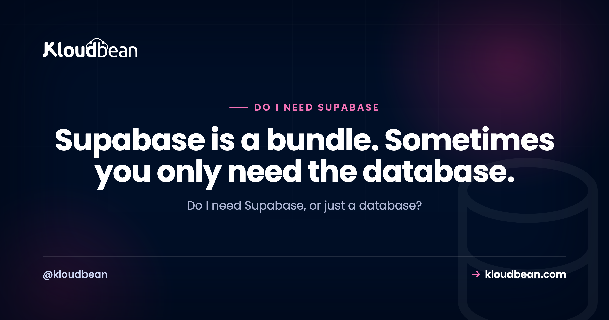

# Do I Need Supabase, or Just a Database? An Honest Answer

By Kloudbean Engineering · Supabase is a bundle. Sometimes you only need the database.

Ask an AI assistant how to build your app's backend and Supabase comes up almost instantly. It's the friendly default now, the thing everyone reaches for. And honestly, it's good. But popular and right-for-your-app aren't the same thing. A lot of people grab the whole Supabase bundle when what they actually needed was a database. So do I need Supabase, or just a database? Here's the honest version, fair to Supabase, of when you need the bundle and when a plain Postgres would do.

> **The short answer.** Maybe. Supabase is a backend-as-a-service: a Postgres database plus auth, auto-generated APIs, file storage, and realtime, all in one bundle. If you want those out of the box, especially for a frontend-heavy app or a fast prototype, it's a great fit. But if you already have a backend that does auth and serves its own API, you might only need a plain managed Postgres, and the rest of the bundle is surface you won't touch. Decide by what you'll actually use, not by the default.

## The honest answer: only if you'll use the bundle

Here's the thing people skip past. The real question isn't Supabase, yes or no. It's whether you need a backend-as-a-service or just a database.

Supabase bundles five things together. A Postgres database at the core, then authentication, auto-generated APIs, file storage, and realtime layered around it. If you'll use those extras, the bundle can save you weeks. If you already run a backend that handles auth and serves your own API, most of the bundle just sits there. You're really only using the Postgres inside it.

Neither situation is wrong. The mistake is picking Supabase by reflex, because it's what the tutorials use, instead of picking by what your app will actually touch. So let's open the box, then match what's inside it to what you've already got.

## What is Supabase, actually?

Supabase calls itself an open-source Firebase alternative, and that's fair. But underneath the branding it's five things stacked around one database:

- **PostgreSQL.** A standard Postgres database. This is the core, and it's plain Postgres, which matters later.
- **Auth.** Sign-up, login, sessions, password resets, and social providers, all managed for you.
- **Auto-generated APIs.** It reads your tables and exposes them as an API, so a frontend can talk to the database without you writing server code.
- **Storage.** Somewhere to keep user file uploads, with access rules.
- **Realtime.** Websocket subscriptions that push row changes to connected clients live.

The word that matters is *bundle*. You can lean on all five or just one. And because the core is ordinary PostgreSQL, choosing Supabase doesn't trap your data, which we'll come back to. When someone asks do I need Supabase, they usually mean do I need all five of those things at once. The answer depends entirely on which of them you'll actually use.

## What does your app actually need?

Go through the bundle piece by piece and be honest about what your app really uses. This is the whole decision, right here.

**A database.** Almost every app needs one. Yes.

**Auth.** Do you need user accounts and logins? If your framework already does auth, you've got this covered. Django and Rails ship with it, Laravel has it built in, Express has libraries like Passport or Lucia. If you've got a pure frontend and no server of your own, you don't have auth yet, and this is where Supabase genuinely helps.

**An API.** If you have a backend, it already serves your API. Supabase's auto-generated API mainly shines when you have no backend and want the frontend to talk straight to the database.

**File storage.** Only matters if users upload files. And object storage is a separate piece you can bolt onto any stack, Supabase or not. Kloudbean's built-in S3-compatible buckets are an example: they speak the AWS S3 SDK, so any library you'd already use works, and data transfer out of that built-in storage isn't metered, which matters if you're serving images or video. So "I need somewhere for uploads" on its own is not a reason to take the whole bundle.

**Realtime.** Only if your app is genuinely live: chat, collaborative editing, presence, a live dashboard. Most CRUD apps aren't, and that's fine.

See the pattern? A frontend-only app, say a React or Vue or Flutter build with no server of its own, gets huge value from the bundle, because Supabase becomes your entire backend. An app that already has a backend framework usually needs the database and not much else.

## When do you genuinely need Supabase?

To be fair to Supabase, because this isn't a takedown, there are clear cases where it's the right call and reaching for a plain database would be the mistake.

**You're frontend-heavy with no backend of your own.** This is the big one. Supabase lets a React, Vue, or Flutter app talk to a real Postgres database, with auth and APIs, without you writing and hosting a server. For solo builders and small teams, that's a real head start.

**You want auth handled.** Rolling your own authentication is easy to get subtly wrong. Supabase's is solid and quick to wire up.

**You want realtime without building it.** Websocket sync is genuine work. Supabase includes it.

**You're prototyping and want it all today.** Database, auth, storage, and an API in an afternoon. Hard to beat for speed.

If several of those describe you, use Supabase and don't second-guess it. It's a well-built product on a solid Postgres foundation, and the bundle is doing real work for you.

## Supabase bundle vs a plain database and your own backend

When you already have a backend, the tradeoff comes into focus. It isn't which tool is better. It's which shape fits what you've built.

| | Supabase (BaaS bundle) | Plain managed Postgres + your backend |
| --- | --- | --- |
| What you get | Database, auth, APIs, storage, realtime | Just the database; your backend does the rest |
| Best when | Frontend-heavy, no server of your own, fast prototype | You already run a backend framework |
| Auth | Included | Your framework or a library |
| Your API | Auto-generated from your tables | Your backend already serves it |
| Realtime | Included | You add it if you actually need it |
| What you operate | The whole bundle's surface | One database |
| The risk | Carrying surface you don't use | Building auth and APIs yourself, if you didn't have them |

Neither column wins in the abstract. If you have no backend, that left column is doing a lot for you, and building it all yourself would be the slow path. If you already have a backend, the extra services are surface you carry and reason about without getting much back. Match the tool to your situation, not to a leaderboard.

<!-- ADD IMAGE: a two-column diagram. Left "Supabase: a bundle on Postgres" with a purple PostgreSQL core box and four navy boxes around it (Auth, Auto APIs, Storage, Realtime). Right "Just a database" with the same purple PostgreSQL core plus one green box "your own backend: auth, API, and file uploads". Brand colors navy #000f27, purple #4F1AF3, green #40b75f. -->

*Supabase wraps auth, APIs, storage, and realtime around a Postgres core. If your backend already provides those, you may only need the core.*

## Is Supabase lock-in? Not really, it's Postgres

One fair point in Supabase's favour, and it takes the fear out of the whole decision: the core is standard PostgreSQL. Your tables, rows, schema, and indexes are plain Postgres. So choosing Supabase isn't a one-way door. If you outgrow the bundle, or decide you only wanted the database after all, you can move. The two honest ways to do that, migrate your data to a managed Postgres you run, or self-host the open-source Supabase stack, are laid out in the [Supabase alternative](https://www.kloudbean.com/blog/supabase-alternative/) guide. Starting on Supabase doesn't paint you into a corner. Worth knowing that both of those exits can land in the same place: on Kloudbean, managed PostgreSQL is one of seven managed engines and Supabase itself is a one-click app, so "I only wanted the database" and "I want the whole stack on infrastructure I control" aren't two different platform decisions.

Two related questions get tangled up with this one, so let's separate them.

First, Supabase Cloud versus self-hosting. That isn't a do-I-need-Supabase question, it's a where-does-it-run question: who operates the stack and where your data lives. It has its own honest comparison in [self-hosted Supabase vs Supabase Cloud](https://www.kloudbean.com/blog/self-hosted-supabase-vs-supabase-cloud/). Second, Supabase versus Firebase. If you're choosing between the two big backend-as-a-service options, the [Firebase alternative](https://www.kloudbean.com/blog/firebase-alternative/) piece walks through that tradeoff, including why leaving Firebase is more work than leaving Supabase (Firebase is NoSQL, Supabase is Postgres).

## A rule of thumb for do I Need Supabase, or Just a Database

You don't need a long deliberation. Find your situation in this table and you'll have your answer.

| Your situation | The fit |
| --- | --- |
| Frontend-only app, no server of your own | Supabase bundle. It becomes your backend. |
| Fast prototype; you want auth, an API, and storage now | Supabase bundle |
| Realtime is core to the product (chat, live docs) | Supabase, or build realtime yourself |
| You already have a backend (Django, Rails, Express, Laravel) doing auth and APIs | A plain managed Postgres |
| You mainly need a reliable database and nothing else | A plain managed Postgres |
| You want the database sitting next to your other apps, on infra you run | A plain managed Postgres |

If you want the one-line version: do you already have a backend that does auth and serves your API? If yes, you almost certainly need a database, not a backend-as-a-service. If no, and you'd rather not build and host one, the Supabase bundle is earning its keep. And because it's Postgres either way, you can change your mind later without a rewrite. The hands-on side of the plain-database route is in [adding a managed database to your app](https://www.kloudbean.com/blog/add-managed-database-to-your-app/).

## Count the pieces you'd actually use, then decide

Here's a tally that settles this faster than any comparison. Give yourself one point for each of the five pieces your app would genuinely lean on in the next three months. Not "might be nice." Would use.

1. **Postgres.** Everyone scores this one. It isn't information.
2. **Auth.** One point only if you have no auth today and no framework that ships it.
3. **Auto-generated APIs.** One point only if your frontend would talk to the database directly, with no server of yours in between.
4. **Storage.** One point only if users upload files and you'd rather not wire up a bucket yourself.
5. **Realtime.** One point only if live updates are part of the product, not a someday feature.

Now read your score. **One point** means you wanted a database, and the bundle is four services you'd be reasoning about for nothing. Take plain Postgres. **Two points** is the genuinely arguable middle, and I'd still lean plain database plus one library, because a single well-chosen auth library is smaller than a platform. **Three or more** and the bundle is doing real work. Take Supabase and stop deliberating, you're using what you're paying for.

One thing the tally can't score, and it's the sharpest edge in this whole decision: if you take point three, the auto-generated API, then your row-level security policies become your authorization layer. Get a policy wrong and a browser can read data it shouldn't, and no host closes that hole. Not Supabase Cloud, not a self-hosted stack, not us. Same goes for the boring stuff underneath. A missing index is a missing index on any of these, and every platform will run your slow query at full speed. Those two things are yours in every version of this decision, so factor them in before you pick the option with more surface.

Whichever number you landed on has somewhere to run. If it's a database, [managed PostgreSQL](https://www.kloudbean.com/blog/managed-postgresql-hosting/) sits in the same dashboard as your app server, backed up, with access locked to your app server's whitelisted IP. If it's the bundle on infrastructure you control, [self-host Supabase](https://www.kloudbean.com/blog/self-host-supabase/) covers the one-click route. And since it's Postgres underneath either way, a `pg_dump` is always your escape hatch, which is exactly why this decision deserves ten minutes rather than a week.

---

**Use what you'll use, nothing more.** If a plain managed Postgres is what your app needs, Kloudbean runs it with automatic backups, free SSL, and access locked to your app server. And if you want the full Supabase bundle self-hosted, it's a one-click app. See [kloudbean.com](https://www.kloudbean.com/) and [pricing](https://www.kloudbean.com/pricing/).

## FAQ

**Do I need Supabase?**
It depends on whether you'll use the whole bundle. Supabase is a backend-as-a-service: a Postgres database plus auth, auto-generated APIs, file storage, and realtime. If you want those out of the box, especially for a frontend-heavy app or a quick prototype, it's a great fit. If you already have a backend that handles auth and serves its own API, you probably need a plain managed Postgres instead.

**Is Supabase necessary, or can I just use Postgres?**
You can absolutely just use Postgres. Supabase is Postgres at its core, with extra services layered around it. If your app has its own backend doing auth and APIs, a plain managed Postgres covers what you need, and the rest of the bundle goes unused. Supabase earns its place mainly when you want it to be your backend.

**What is a backend-as-a-service?**
A backend-as-a-service, or BaaS, bundles the common backend pieces so you don't build them yourself: a database, authentication, an API layer, file storage, and often realtime updates. Supabase and Firebase are the well-known examples. The appeal is shipping without writing and hosting a server. The catch is that a BaaS is most valuable when you'd otherwise have no backend at all.

**Do I need Supabase or just a database?**
If you already have a backend framework like Django, Rails, Express, or Laravel that does auth and serves your API, you most likely need just a database. The auto-generated APIs, auth, and realtime in Supabase mainly help apps with no server of their own. Match the choice to what your app already provides.

**When should I use Supabase?**
Use Supabase when you're frontend-heavy with no backend of your own, when you want auth and an API without building them, when realtime sync is core to your product, or when you're prototyping and want everything in an afternoon. In those cases the bundle does real work. If none of that fits, a plain database is the simpler choice.

**Is Supabase good for a small SaaS?**
It can be excellent for a small SaaS, especially one that's frontend-heavy or moving fast, because it hands you auth, APIs, storage, and realtime on day one. The thing to watch is whether you're using most of the bundle. A small SaaS that already has a backend framework often needs the database more than the extras.

**Is Supabase lock-in?**
Not in the way people fear. The core is standard PostgreSQL, so your data stays portable. If you outgrow the bundle you can migrate the database to a managed Postgres you run, or self-host Supabase itself, since it's open source. Choosing Supabase is a reversible decision, not a one-way door.

**Supabase Cloud or self-hosted, which do I pick?**
That's a different question from whether you need Supabase at all. It's about who runs the stack and where your data lives. Supabase Cloud is the quickest and most hands-off, while self-hosting gives you data residency and control. Once you've decided you want Supabase, that hosting-model call has its own honest comparison.

**What replaces Supabase if I only need the database?**
A managed PostgreSQL. You get the same Postgres core without the extra services, your backend keeps doing auth and serving the API, and your data stays yours. It's the leaner option when you're really just using Supabase as a database, and moving is straightforward because both sides are plain Postgres.

---

*Kloudbean Engineering · Start from what your app already does. Add a backend-as-a-service only for the parts it doesn't.*
