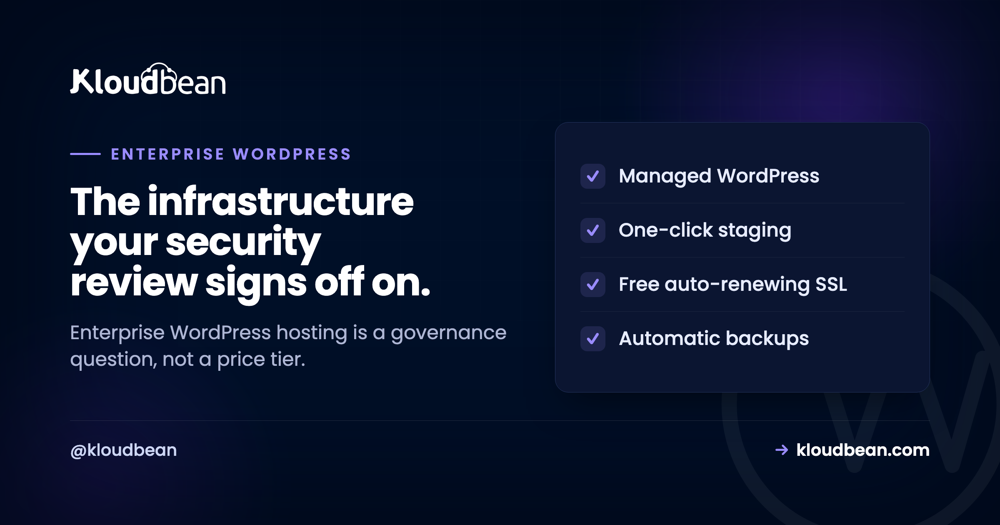

# Enterprise WordPress Hosting: What "Enterprise-Grade" Actually Means

Most of the time, "enterprise WordPress hosting" is sold as a bigger invoice with the word enterprise printed on it. But the people who actually have to sign off, the security team and the procurement team, don't care about the label. They care about four boring questions: who can touch this, can we prove who changed what, where does the data physically live, and does it stay up when it matters?

So this isn't a pitch about premium plans. It's about the governance and control that make a WordPress site something a regulated organisation can put its name behind. Get those right and "enterprise" is earned. Skip them and it's just decoration.

> **The short version:** Enterprise-grade means governance, not price: least-privilege access with subusers and UAC, an immutable audit trail of who changed what, deliberate region choice with private networking on Enterprise plans, hardening you inherit by default, and uptime on tier-1 cloud infrastructure. For heavier needs Kloudbean runs the enterprise path (Kubernetes, autoscaling, custom architectures) and works like your in-house infra team. Compliance stays shared: the platform secures the infrastructure, you own your application.

## Enterprise WordPress hosting is a governance word, not a price tier

A quick reframe, because it changes what you look for. Consumer hosting sells speed and convenience. Enterprise hosting sells control and evidence. The difference isn't a faster server. It's whether you can answer a security questionnaire without sweating, prove a change history to an auditor, and contain the blast radius when a contractor's laptop gets compromised.

Think of it as layers, not a single feature. Defense in depth, from the cloud edge all the way down to the audit log at the center. Each layer does a specific job, and each one is something a reviewer will ask about by name.

<!-- Inline SVG in the HTML version: nested defense-in-depth rings (tier-1 cloud region, VPC, hardened server, least-privilege access, WordPress + immutable audit trail at the core). -->

## Who can touch what

The first enterprise question is almost never about speed. It's access. In a real organisation, developers, editors, agencies, and contractors all need *some* reach into the site, and giving them all the same admin login is how you fail a security review before lunch.

The control here is **least privilege**: subusers with User Access Control, scoped per resource and per action, so each person gets exactly what their role needs and nothing more. A deploy engineer can ship without being able to delete a server. An editor can publish without seeing billing. Add social login (Google, GitHub, LinkedIn) so identity ties back to accounts you already govern, a **Basic Auth gate** in front of staging or internal environments, and **IP access control** to fence admin to known networks. That's the difference between "we think only the right people have access" and being able to show it.

<!-- ADD IMAGE: the User Access Control screen, a subuser with permissions scoped to one application and one action set. -->

## Proof of who changed what

Access control decides who *can* act. An audit trail records what they actually *did*. When something breaks at 2am, "who deployed that, and when?" needs an answer, not a shrug and a group chat. This is the control auditors lean on hardest, and the one consumer hosting almost never has.

Kloudbean's **Audit Trail** (an Enterprise feature) is an immutable, searchable, account-wide log of activity, with CSV export for the compliance folder. Immutable is the word that matters: a log someone can quietly edit isn't evidence. Being able to hand an auditor a clean export of who did what, across the whole account, is often the single thing that turns "we hope we're compliant" into "here, look."

<!-- ADD IMAGE: the Audit Trail view, a searchable activity log with a filter applied and a CSV export button. -->

## Where the data lives, and who can reach it

Regulated organisations often have hard rules about where data physically sits. An EU company may need EU-region hosting; a public-sector body may need a specific country. So region can't be assigned at random. It has to be a deliberate choice.

Because Kloudbean provisions on seven tier-1 clouds (AWS, AWS Lightsail, Google Cloud, DigitalOcean, Linode, Vultr, and UpCloud), you pick the provider and region on purpose to meet a [data-residency](https://www.kloudbean.com/blog/data-residency-explained/) requirement. By default the database is locked down with IP allow-listing, so only your app server can reach it, not the public internet where scanners look. And on Enterprise plans the whole site can sit on a [private network (VPC)](https://www.kloudbean.com/blog/what-is-a-vpc/), with the database and internal services off the public internet entirely. Data residency plus private networking is a combination most enterprise questionnaires ask about directly.

## The hardening you inherit

Some enterprise security is your job, and some you should get for free by showing up. On the platform side, every server comes with a **Shorewall firewall** and **Fail2ban** configured automatically, free SSL, and HttpOnly cookie sessions that harden against common XSS and CSRF tricks. For the edge, Cloudflare (including Cloudflare Enterprise edge caching) is available as an add-on, and it's included for Enterprise accounts.

Let me be honest about one thing, because it gets oversold across the industry. A firewall and Fail2ban plus an edge network is a strong baseline, not a magic shield. If you want to understand what a dedicated [web application firewall](https://www.kloudbean.com/blog/what-a-waf-does/) does and does not cover, read it as a layer in the stack, not a box you tick to be "secure." Real security is the whole set of layers in that diagram working together, plus the part you own on top.

## Staying up, and scaling the enterprise way

Enterprise traffic isn't a flat line. A launch, a press hit, a campaign, a filing deadline. The uptime foundation is the infrastructure itself: running on tier-1 cloud providers is what gives you a serious base to build on. On the promise side, don't accept a number on a slide. Ask what the SLA actually is and what stands behind it, because "we aim for high uptime" is a wish and "credits when we miss it" is a commitment. The explainer on [what a cloud SLA really promises](https://www.kloudbean.com/blog/cloud-sla-explained/) is worth a read before you sign anything.

For changing the site safely, you get **staging** for WordPress (and Laravel), so nobody edits production live. And when a workload genuinely needs more than a bigger server and a load balancer, that's the enterprise path: Kubernetes, autoscaling, and custom architectures, handled as a custom engagement rather than a self-serve toggle. This is where the "acts like your in-house infra and DevOps team" model earns its keep. If you want the general mechanics first, [scalable WordPress hosting](https://www.kloudbean.com/blog/scalable-wordpress-hosting/) covers the ordinary rungs, and [autoscaling explained](https://www.kloudbean.com/blog/autoscaling-explained/) is honest about when you actually need it. Most sites don't, and a good partner will tell you so.

<!-- ADD IMAGE: an overview of several enterprise WordPress environments (production, staging, regional) managed side by side. -->

## The enterprise review checklist

Here's the whole thing as the questionnaire it usually becomes. Judge a host on the middle column, not the word on the plan.

| Requirement | What to ask a host | How it works here |
| --- | --- | --- |
| **Access control** | Can I scope permissions per person, per resource? | Subusers plus UAC, social login, IP access control |
| **Audit trail** | Is there an immutable, exportable change log? | Audit Trail (Enterprise): searchable, CSV export |
| **Data residency** | Can I choose the exact region? | Seven tier-1 clouds, region chosen on provision |
| **Private networking** | Is the database off the public internet? | IP allow-listing on every plan, private networking (VPC) on Enterprise |
| **Hardening** | What's on by default? | Shorewall, Fail2ban, SSL, HttpOnly sessions |
| **Safe change** | Can we stage and roll back? | Staging for WordPress and Laravel |
| **Scale path** | What happens past one big server? | Load balancer, then enterprise k8s / custom |
| **Uptime** | What backs the SLA number? | Tier-1 cloud infrastructure foundation |

## The compliance line everyone blurs

Now the honest boundary, drawn plainly, because "enterprise" gets oversold and compliance is where it hurts most. Managed WordPress runs on a **Linux stack**, and the platform looks after the server, the web stack, SSL, backups, and patching. You still own the application: your themes, your plugins, your custom code, your content, and whatever that code does with user data.

Compliance is **shared**, and this trips up a lot of buyers. A platform being [SOC 2](https://www.kloudbean.com/blog/soc2-compliant-hosting/) aligned describes the host's controls and processes. It does not certify your plugin choices, your theme, or how your site handles personal data. The infrastructure controls (access, audit, region, hardening, backups) support your compliance work. They don't complete it. A confident host tells you exactly where its half stops and yours begins, and that clarity is itself a sign you're dealing with the real thing.

So judge the eight rows above, not the badge on the plan. A plan labelled "Enterprise" that can't show you an audit log or let you pick a region is a name. A setup that quietly does all of it is enterprise-grade whatever it's called. And if you run client sites rather than one org's estate, the [agency operations playbook](https://www.kloudbean.com/blog/agency-wordpress-hosting/) is the sibling to this one.

**WordPress your security review can sign off on.** Run enterprise WordPress with scoped access, an immutable audit trail, private networking, and region choice at [kloudbean.com](https://www.kloudbean.com/). Talk options on [pricing](https://www.kloudbean.com/pricing/).

Least-privilege access · Audit Trail · Region choice · Automatic backups · Free migration

## FAQ

**What makes WordPress hosting 'enterprise'?**
Governance and control, not price. Enterprise-grade WordPress hosting gives you least-privilege access, an immutable and exportable audit trail, deliberate region choice, private networking on Enterprise plans, hardening on by default, and uptime on serious infrastructure, plus a real path to scale. If a plan is labelled enterprise but can't show you an audit log or let you choose a region, the label is decoration.

**Does the host being SOC 2 aligned make my WordPress site compliant?**
No. A SOC 2 report describes the hosting platform's controls and processes. It doesn't certify your plugins, theme, custom code, or how your site handles user data. Compliance is shared: the host covers the infrastructure layer, and you own the application layer. The platform's certification supports your compliance work; it doesn't complete it.

**What is an audit trail and why does enterprise need one?**
An audit trail is an immutable, searchable record of who did what and when across the account. Enterprises need it because access control alone only decides who can act, not what they actually did. When there's an incident or an audit, an exportable log answers "who changed this?" with evidence instead of guesswork. Kloudbean provides this as an Enterprise feature with CSV export.

**How do you control who can change an enterprise WordPress site?**
With least-privilege access: subusers whose permissions are scoped per resource and per action through User Access Control. Each person gets only what their role requires. Social login ties identity to accounts you already govern, a Basic Auth gate protects staging and internal environments, and IP access control limits admin to known networks.

**Can I choose where my WordPress data is stored?**
Yes. Because provisioning runs on seven tier-1 clouds, you pick the provider and region deliberately to satisfy a data-residency rule, rather than being assigned one. By default the database is locked to your app server's IP so it isn't exposed publicly, and on Enterprise the whole site can sit on a private network (VPC). Region choice plus private networking is what most enterprise questionnaires ask about.

**Does enterprise WordPress hosting need a WAF?**
A web application firewall is one useful layer, not a complete answer. The baseline here is a Shorewall firewall and Fail2ban configured automatically, free SSL, and HttpOnly cookie sessions, with Cloudflare (including its enterprise edge) available as an add-on and included for Enterprise accounts. Treat a WAF as part of a defense-in-depth stack rather than a single box that makes a site "secure."

**How does enterprise WordPress handle huge traffic, and do you autoscale?**
The everyday path is right-sizing the server, caching, and adding nodes behind a load balancer. Autoscaling and Kubernetes exist, but as an enterprise and custom engagement, not a default self-serve toggle. That's deliberate: most sites are better served by caching and sensible sizing than by an autoscaling cluster they don't need.

**What uptime SLA should enterprise WordPress hosting offer?**
Ask two things: what the number is, and what backs it. A figure on a sales page is a wish; credits when the host misses it is a commitment. The real foundation is the infrastructure, and running on tier-1 cloud providers is what gives uptime a serious base. Read an SLA for what it actually promises before you rely on it.

**Is WordPress even appropriate for enterprise use?**
Yes, for a huge range of corporate sites, campaign estates, and content platforms, as long as the hosting brings enterprise governance around it. The honest caveat: it's a Linux and PHP stack, and you own the application layer (plugins, theme, code, and its compliance). WordPress plus enterprise-grade controls is a proven combination; WordPress on consumer hosting with the word enterprise attached is not.

**What does 'acts like your in-house infra team' mean?**
It means the platform and team handle the infrastructure work an internal DevOps group would otherwise own: provisioning, hardening, patching, backups, scaling, and custom architectures for the heavier cases. For enterprises and governments without a large internal ops team, that's the practical value: you get the outcomes without staffing the whole function.

---

*Kloudbean · The infrastructure your security review signs off on.*
