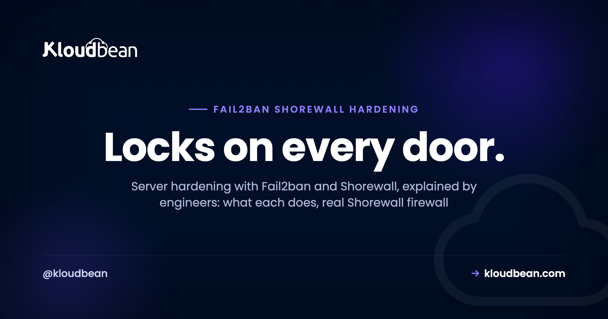

# Server Hardening With Fail2ban and Shorewall: the Baseline Every Linux Server Needs



Spin up a brand new Linux server, give it a public IP, and within minutes something you've never met is trying to log in as `root`. That isn't paranoia. It's the background noise of the internet.

Server hardening with Fail2ban and Shorewall is the two-part answer nearly every internet-facing box needs. One tool decides which ports the world can even reach. The other bans the IPs that sit there guessing passwords on the ports you have to leave open. Get both right and you shut out the overwhelming majority of automated attacks before they get anywhere. It's the cheapest, highest-leverage way to harden a Linux server, and it's the first thing I check on any box that faces the public.

> **Short version:** Shorewall is your firewall. It picks which ports are reachable (usually just SSH, HTTP, and HTTPS) and drops the rest. Fail2ban reads your auth logs and temporarily bans any IP that fails to log in too many times, which is how you ban brute force SSH bots without lifting a finger. Use both. The firewall closes the doors you don't need. Fail2ban guards the ones you can't close. Every Kloudbean managed server ships with both switched on.

## What Fail2ban and Shorewall actually do

Shorewall and Fail2ban get lumped together as "security stuff," but they solve different problems at different layers.

Shorewall (the Shoreline Firewall) isn't a firewall engine in its own right. The actual packet filtering on Linux is done by netfilter, driven by `iptables` (or `nftables` on newer systems). Shorewall sits on top of that. You describe your network in a few plain text files, zones, interfaces, a default policy, and a list of rules, and Shorewall compiles them down into the low-level firewall rules and loads them. So you get the reach of iptables without hand-writing chains you'll misread at 2am, which is exactly the trap Shorewall keeps you out of.

Fail2ban works one layer up, on your logs. It tails files like `/var/log/auth.log`, matches each line against filter patterns (a failed SSH password, a bad login to your app), and counts failures per IP address. Cross the threshold and Fail2ban runs an action, almost always "ban this IP," which in practice means inserting a temporary firewall rule that drops them. When the ban window expires, the rule comes back out. It's a feedback loop bolted onto the firewall.

Picture your server as a building. Shorewall decides which doors exist at all. Close port `3306` and there's no door there for anyone to try. But some doors stay open: SSH to manage the box, 80 and 443 to serve traffic. Fail2ban is the bouncer on those. It can't wall them up, so it watches who keeps rattling the handle with the wrong key and throws them out for a while. Firewall for the doors you don't use. Fail2ban for the ones you must keep open.

```
Internet traffic  (real visitors + bots probing every port)
        |
        v
Shorewall  ·  firewall over iptables / netfilter
   ACCEPT  net -> fw  tcp 22, 80, 443
   DROP    everything else  ·  3306, 25, 8080, ...
        |  (only open ports pass)
        v
Reachable services:  SSH 22  ·  HTTP 80  ·  HTTPS 443
        |  (every login attempt is logged)
        v
Fail2ban  ·  watches /var/log/auth.log
   5 failed logins within 10m  ->  ban that IP for 1h
        |
        v
Ban table: offender IPs dropped at the firewall
   (Fail2ban writes a firewall rule for the banned IP, feeding back up front)
```

*Traffic hits Shorewall first, so only 22, 80, and 443 are even reachable. Fail2ban then watches the logins on those open ports and, after too many failures, writes a firewall rule that drops the attacker. Two layers: one closes doors, the other guards the ones you keep open.*

| | Shorewall (firewall) | Fail2ban |
| --- | --- | --- |
| **Layer** | Network (L3/L4). Ports and packets. | Application and log. Reads auth events. |
| **What it blocks** | Whole ports and protocols you never want reachable. | Individual IPs abusing a port you keep open. |
| **When it acts** | Always, the same way, on every packet. | Reactively, only after repeated failures. |
| **Tuning surface** | Zones, policy, and rules files. | Jails: filter, `maxretry`, `findtime`, `bantime`. |
| **Fails at** | Attacks over ports that must stay open. | Ports it can't see, and one-shot distributed floods. |

They aren't an either/or. The firewall is your fixed policy, Fail2ban is the moving response on top of it. Run one without the other and you've left half the job undone.

## Shorewall: deciding which doors exist

People argue **iptables vs Shorewall** like it's a cage match. It isn't. Shorewall generates iptables rules under the hood, so choosing Shorewall is really choosing readable config over raw chains. On a server you actually have to maintain over time, readable wins. Every time.

A minimal setup lives in four files under `/etc/shorewall/`. First, define your zones, the firewall itself and the outside world:

```ini
# /etc/shorewall/zones
#ZONE   TYPE
fw      firewall
net     ipv4
```

Map the `net` zone to your network interface:

```ini
# /etc/shorewall/interfaces
#ZONE   INTERFACE   OPTIONS
net     eth0        tcpflags,nosmurfs,routefilter,logmartians
```

Set a default stance. The only sane default for traffic arriving from the internet is drop it:

```ini
# /etc/shorewall/policy
#SOURCE   DEST   POLICY   LOG
$FW       net    ACCEPT
net       $FW    DROP     info
net       all    DROP     info
all       all    REJECT   info
```

Then open exactly the ports you serve on, and nothing else:

```ini
# /etc/shorewall/rules
#ACTION   SOURCE   DEST   PROTO   DPORT
ACCEPT    net      $FW    tcp     22,80,443
```

Those Shorewall firewall rules say: from the internet to this firewall, allow TCP on 22, 80, and 443. Everything else hits the `DROP` policy and never gets a reply. Always check the config before you apply it, then load it:

```bash
sudo shorewall check
sudo shorewall reload
```

To see what's actually live, including the compiled rules and any dynamic bans sitting in front of them:

```bash
sudo shorewall status
sudo shorewall show
```

> **One rule you break once.** If you're editing rules over SSH, keep port 22 open or you'll drop your own connection mid-reload and lock yourself out. Better still, restrict 22 to your own IP range rather than the whole internet, which we'll get to below.

## Fail2ban: the SSH jail, up close

A **Fail2ban jail** is three things bolted together: a filter (the regex that recognises a failed attempt in a log), the log it reads, and the thresholds plus the action to take. The one everybody needs first is the **Fail2ban SSH jail**, because SSH on port 22 is the single most-probed service on the public internet. Leave a password-auth SSH server exposed and you'll see hundreds of attempts a day.

Don't edit `jail.conf` directly, since a package upgrade will happily overwrite it. Put your changes in `/etc/fail2ban/jail.local`, which overrides the defaults and survives updates:

```ini
# /etc/fail2ban/jail.local

[DEFAULT]
# never ban yourself: home, office, or VPN
ignoreip = 127.0.0.1/8 ::1 203.0.113.10
bantime  = 1h
findtime = 10m
maxretry = 5

[sshd]
enabled  = true
port     = ssh
backend  = systemd
maxretry = 5
findtime = 10m
bantime  = 1h
```

Three settings in that sshd jail do the heavy lifting, and once you get `maxretry`, `findtime`, and `bantime` straight, every other jail reads the same way:

- **`maxretry`**: how many failures are allowed before a ban. Five is a reasonable start; drop it to 3 if you only ever log in with keys.
- **`findtime`**: the window those failures must land in. Five strikes in 10 minutes trips the jail. Five spread over three days does not.
- **`bantime`**: how long the IP stays blocked. `1h` is a fine place to begin.

Reload the service, then check your jails with `fail2ban-client status`:

```bash
sudo systemctl reload fail2ban

sudo fail2ban-client status
Status
|- Number of jail:      1
`- Jail list:   sshd
```

Zoom into the SSH jail to see who's currently doing time:

```bash
sudo fail2ban-client status sshd
Status for the jail: sshd
|- Filter
|  |- Currently failed: 2
|  |- Total failed:     418
|  `- File list:        /var/log/auth.log
`- Actions
   |- Currently banned: 3
   |- Total banned:     128
   `- Banned IP list:   45.148.10.7 193.32.162.19 185.220.101.44
```

That `Total banned: 128` on a week-old server is normal, by the way. It's just bots, and the number climbing doesn't mean anyone's getting in.

## How to think about hardening (five moves, in order)

Tools are easy to install and easy to misapply. A simple mental model keeps you honest. Hardening is really five moves, and Fail2ban and Shorewall are only the first two.

1. **Shrink the attack surface.** Every open port is a door someone can try. Close the ones you don't serve on. This is the firewall's job, and it's the single highest-leverage thing you can do to a fresh server.
2. **Guard the doors you keep open.** SSH, HTTP, and HTTPS have to stay reachable, so let Fail2ban ban the IPs that abuse them. This is where you actually ban brute force SSH traffic instead of just hoping.
3. **Make the front door hard to force.** Ban rules slow a brute force. SSH keys end it. Turn off password auth entirely and there's nothing left to guess. Honestly, if you do one thing this week, do this one.
4. **Limit the blast radius.** If a login is stolen, how much can it touch? Give people and apps the least access that still lets them work.
5. **Be able to recover.** Assume something eventually gets through. Backups turn a breach or a fat-fingered command into an annoyance instead of a catastrophe.

Steps one and two are exactly what a good managed platform sets up for you. Here's that from a console instead of a config file, firewall rules on top and the ban list below:


*The same two layers in a dashboard: Shorewall inbound rules up top (22, 80, 443 open, database port whitelist-only) and Fail2ban's blocked IPs below, each with an unblock button.*

<!-- ADD IMAGE: a terminal running sudo fail2ban-client status sshd on your own server, showing the currently banned IP list -->

## Beyond the baseline: what a firewall and Fail2ban don't cover

Here's the honest part. Shorewall and Fail2ban are the baseline, the floor you build on, not the whole house. They handle network reachability and repeated auth failures. Plenty of real attacks look nothing like that. So round out the floor.

**Use SSH keys, then kill password login.** Fail2ban slows a brute force; a key ends the game, because there's no password to guess. Set that up before anything else if you've been putting it off. Our walkthrough is [SSH key authentication](https://www.kloudbean.com/blog/ssh-key-authentication/).

**Allowlist instead of chasing bans.** Better than banning bad IPs is only answering good ones. If SSH and your database port only need to reach your office or VPN, restrict them to that CIDR range. Kloudbean exposes this as IP Access Control (allow or deny by IP or CIDR), far cleaner than chasing individual bans.

**Give out the least access that works.** If one login is stolen, least privilege decides how bad the day gets. Don't hand everyone root. Subusers and User Access Control let you grant per-resource, per-action permissions, so a contractor can deploy one app and touch nothing else. The details are in [user access control explained](https://www.kloudbean.com/blog/user-access-control-explained/).


*Least privilege in practice: a subuser gets view and deploy on one app and nothing destructive, instead of full account access.*

**Keep your database off the public internet.** A database port facing the world is an accident waiting to happen. Put it on a private network so it answers your app servers and no one else. That's what a [VPC](https://www.kloudbean.com/blog/what-is-a-vpc/) is for.

**Add an application-layer guard.** Shorewall and Fail2ban work at the network and log level. They don't read HTTP payloads, so they won't catch SQL injection or a flood of requests that all look valid. That's a job for a WAF or a CDN like Cloudflare in front, which Kloudbean offers as an add-on. Start with [what a WAF actually does](https://www.kloudbean.com/blog/what-a-waf-does/), and send sane [security headers](https://www.kloudbean.com/blog/security-headers-guide/) while you're at it.

**Keep backups.** Hardening lowers the odds. Backups cover the day the odds lose. Automatic and tested at least once, they're the difference between a scare and an outage. Here's the [server backups guide](https://www.kloudbean.com/blog/server-backups-guide/).

### Tuning without locking yourself out

A word of caution, because Fail2ban will absolutely ban you if you give it the chance. Here's where people get burned:

- **Whitelist your own IP.** Add your home, office, or VPN address to `ignoreip` in the `[DEFAULT]` block. Fat-finger your password three times on a bad morning and you'll be glad it's there.
- **If you do get locked out**, connect from a different IP (a phone hotspot works) or your provider's web console, then lift the ban. On Kloudbean the blocked list is right in the dashboard with an unblock button.
- **Don't set `bantime` to a year.** Enormous ban windows pile up thousands of stale rules and can permanently block a shared NAT address that a real user sits behind months later. If you want repeat offenders punished harder, enable `bantime.increment = true` so bans grow each time the same IP returns.
- **Watch for false positives.** A monitoring probe or a misconfigured client can trip a jail. If a legit service keeps getting banned, add it to `ignoreip` rather than loosening the whole jail for everyone.
- **For the persistent ones**, the built-in `recidive` jail reads Fail2ban's own log and hands out long bans to IPs that keep getting banned across other jails.

Unbanning an address is a single command. Swap `sshd` for whichever jail caught it:

```bash
sudo fail2ban-client set sshd unbanip 1.2.3.4
```

<!-- ADD IMAGE: your jail.local open in an editor with ignoreip highlighted, so the reader sees exactly where their own IP goes -->

## How Kloudbean applies Fail2ban and Shorewall automatically

You can do all of this by hand, and on your own raw VPS you should. It's just fiddly to get right and easy to forget by server number nine. Kloudbean's take is that the baseline shouldn't be optional.

Every managed server, on any of the seven supported clouds (AWS, AWS Lightsail, Google Cloud, Linode, Vultr, DigitalOcean, and UpCloud), launches with Shorewall and Fail2ban already configured and running. Free SSL is issued for your domains. You don't install or wire anything up.


*Launch a server on any of the seven clouds and it comes up hardened: Shorewall and Fail2ban on by default, SSL ready for your domain.*

From the dashboard you can see which ports are open, watch the IPs Fail2ban has blocked, and lift a ban with one click. IP Access Control, subusers and UAC, private networking, and automatic backups all live in the same console, so the checklist above is a few toggles rather than a lost weekend.

What's still yours: your SSH keys and your application's own security. Managed means the server, firewall, ban rules, SSL, and patching are handled for you. It does not mean your code is automatically safe. Nobody's is, and any host that tells you otherwise is selling something.

---

**Every server should start hardened, not eventually.** Launch on [kloudbean.com](https://www.kloudbean.com/) and the baseline is already on, with free migration help and a free trial to start. Server sizes and plans are on [pricing](https://www.kloudbean.com/pricing/).

Firewall + Fail2ban on every server · Free SSL · IP access control · Automatic backups · Free migration · Free trial

## FAQ

**What's the difference between Fail2ban and a firewall?**
A firewall like Shorewall decides which ports are open or closed, and it applies that policy the same way to everyone, all the time. Fail2ban is reactive. It watches login activity on the ports you keep open and bans an IP only after it fails to authenticate too many times. The firewall sets the fixed policy; Fail2ban responds to behaviour. You want both.

**Does Fail2ban stop all attacks?**
No, and it isn't meant to. Fail2ban is very good at slowing brute force and credential stuffing against services like SSH. It does nothing about application-layer attacks such as SQL injection, or a distributed flood from thousands of IPs that each only try once. For those you need a WAF or a CDN like Cloudflare in front, plus solid application code.

**How do I unban my own IP?**
Run `sudo fail2ban-client set sshd unbanip` followed by your address, swapping `sshd` for whichever jail banned you. On Kloudbean you can also open the server's security panel, find the IP in the blocked list, and click unblock. To stop it recurring, add your address to `ignoreip` in the `[DEFAULT]` section of `jail.local`.

**Is Shorewall better than iptables?**
It's a bit of a false choice, because Shorewall generates iptables rules under the hood. Raw iptables gives you total control and zero guardrails, which is powerful and easy to get wrong. Shorewall gives you readable config files that compile down to the same rules, so it's usually the better pick for a server you maintain over months. Newer systems may use nftables, which Shorewall can also target.

**Do I still need Fail2ban and Shorewall if I have Cloudflare?**
They cover different layers, so yes. Cloudflare protects your web traffic at the edge and can absorb large floods. It doesn't guard your SSH port or ban an IP brute forcing your server login. Run the firewall and Fail2ban on the server itself, and put Cloudflare in front of your site. They complement each other rather than replace one another.

**What are good maxretry and bantime values for the SSH jail?**
A sensible starting point is `maxretry 5`, `findtime 10m`, and `bantime 1h`. That bans an IP after five failed logins inside ten minutes and holds the block for an hour. Tighten `maxretry` to 3 if you only log in with keys, and consider `bantime.increment` so repeat offenders get progressively longer bans instead of one huge fixed one.

**Does closing ports with Shorewall break my website?**
Only if you close a port your site actually uses. A normal web server needs 80 and 443 open to the world and 22 for you to manage it. As long as your rules accept those, visitors notice nothing. The usual mistake is forgetting a service you added later, like a database or a mail port, so check what you're running before you lock things down.

**Do bans survive a reboot?**
By default Fail2ban keeps its state in a small database and restores recent bans when it starts, and it re-applies the firewall rules at the same time. So a reboot won't quietly leave your ports wide open. If you want long-lived bans for persistent offenders, a longer `bantime` or the `recidive` jail handles that.

**Do I have to set any of this up on Kloudbean?**
No. Shorewall and Fail2ban are configured and running on every managed server from launch, and SSL is issued for your domains. You can view open ports, see blocked IPs, and unblock from the dashboard. Setting up SSH keys and hardening your own application code are still on you, which is true on every host.

---

*By Kloudbean Security · Locks on every door.*
