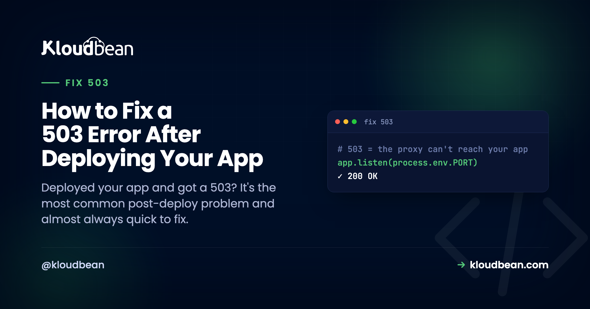

# How to Fix a 503 Error After Deploying Your App

You pushed your app, the build went green, you opened the URL, and there it is: **503 Service Unavailable**. No homepage. Just a blank wall from the server. If you built the thing in Lovable, Bolt, or Cursor and this is your first real deploy, it can feel like everything broke at the finish line. It didn't. A 503 right after deploy is the most common post-deploy problem there is, and most of the time it's a quick fix. This is the field guide to fix a 503 after deploy the fast way: what the error is actually telling you, and how to walk from symptom to cause in order instead of guessing.

> **The short version.** A 503 after deploy almost always means one thing: your app process isn't up and answering on the port the server expects. So read `app.error.log` first, don't guess. In practice the cause is usually small. The app isn't listening on `process.env.PORT`, or a required environment variable never got set on the server. Both are quick fixes once the log points at them. Work down the tree below and you'll normally have it in two or three checks.

## First move: read the log, don't guess

I'll say the thing most guides dance around. Most 503s are a config problem, not a code bug. That matters because it changes what you do first. You don't start editing your app. You start reading, because your app already wrote down why it wouldn't start. Two files hold almost the whole answer.

The first is your app's own error output. On a Kloudbean server it lives here:

```
/home/admin/hosted-sites/<app_system_user>/app-logs/app.error.log
```

If the app crashed on startup, the stack trace is sitting at the bottom of that file, usually naming the exact problem: a variable it couldn't read, a module it couldn't find, a database it couldn't reach. The second is **Build & Deployment History** in the console, which tells you whether the build even produced a runnable app and streams the full build log. Between those two, the cause is written down almost every time. The error is rarely silent. It's just in a file you haven't opened yet.


## The 503 decision tree: symptom to cause

Here's the whole diagnosis as one picture. Start at the top. At each checkpoint, a "yes" drops you down to the next question and a "no" branches off to the specific fix. Most apps fall out of the tree at the port check or the env-var check, which is exactly why those two sit near the top.

<!-- DIAGRAM: a top-to-bottom 503 decision tree. Spine of decision boxes: Did the build pass? -> Is the process up? -> On process.env.PORT? -> Are all env vars set? -> Does it boot clean? -> 200 (green). Each "no" branches right to a fix card: BUILD (read the build log; compile error, failed install, or out-of-memory, resize the box), START (Start must launch the server npm start, not rebuild or a dev command), PORT/most common (app.listen(process.env.PORT), never hard-code 3000), ENV/also common (set it in Runtime Config, redeploy; compare server vars vs local .env), BOOT (read app.error.log; it names the missing module, refused DB, or unrun migration). Caption: most apps fall out at PORT or ENV. -->

## The same tree, as a checklist

If you'd rather scan a table next to your terminal, here's the identical logic. Find the first "no" and you've found your 503.

| Checkpoint | What "no" means | The fix |
| --- | --- | --- |
| Build passed? | The deploy never produced a runnable app | Read the build log; fix the compile error, failed install, or out-of-memory. |
| Process up? | Build was fine, nothing is running | Point Start at your production server, not a build or dev command. |
| On `process.env.PORT`? | App runs but the server can't reach it | Listen on `process.env.PORT`. This is the single most common cause. |
| Env vars set? | App boots, then dies reading a missing value | Set the missing variable in Runtime Configuration and redeploy. |
| Boots clean? | Crashes on startup for some other reason | Read `app.error.log`; fix the exact line or missing dependency it names. |

## Did the build even pass? Build-time vs runtime

This is the first fork, and getting it right saves the most time. A 503 comes from one of two phases, and they're diagnosed in different files. A **build-time** failure means the deploy never produced a runnable app: a type error, a failed `npm ci`, or a build that ran out of memory on a small server. You diagnose that in the build log. A **runtime** failure means the build was fine but the app won't stay up, and that story is in `app.error.log`. So glance at Build & Deployment History first. If the build is red, stop, fix the build, and ignore everything else until it's green. If the build is green, the rest of the tree is yours.

## Is the process actually up? The Start command

Build and start are different jobs, and confusing them is a quiet source of 503s. A successful build compiles your app. The **Start** command is what actually launches the long-running server, and it has to do exactly that, nothing else. If your Start command re-runs the build, or runs a dev command that exits, or points at the wrong entry file, the deploy "succeeds" and then there's no server listening. For a Node app, Build is usually `npm run build` and Start is `npm start` (or `next start` for Next.js). Keep them distinct, and make sure Start boots a server that stays alive.

## Is it listening on process.env.PORT? The number-one cause

If you fix one thing, fix this. The platform assigns your app a port through the `PORT` environment variable, and your app must listen on it. When code hard-codes a literal port, the app starts up perfectly fine on the wrong number, the server checks the assigned port, finds nothing, and hands the browser a 503. Green logs, dead URL. The fix is one line:

```
// wrong: the platform can never reach this
app.listen(3000)

// right: bind to the port you're actually assigned
const port = process.env.PORT || 3000
app.listen(port, () => console.log('listening on ' + port))
```

The `|| 3000` fallback keeps it working on your laptop while doing the right thing in production. Frameworks read this port for you if you let them, so the mistake is usually a hard-coded number someone added on purpose. Search your code for the literal port and delete it.

## Is a required environment variable missing? The other number-one

Here's the grounded truth from watching a lot of these fail: the single most common 503 we see isn't in anyone's code at all. It's a missing environment variable. The app boots, immediately reaches for a `DATABASE_URL`, an API key, or a session secret that exists in your local `.env` but was never set on the server, and the process dies before it can answer a request. Build passed (the build never needed the value), app dead, 503 in the browser. The error log almost always names the key it wanted.

The fix is to set the missing variable in **Runtime Configuration → Environment Variables** and redeploy. The reliable way to catch these is to compare, side by side, every key in your local `.env` against what's set on the server. Whatever's on your machine but not on the box is your prime suspect. If env vars are new to you, the [environment variables done right](https://www.kloudbean.com/blog/environment-variables-done-right/) guide is worth ten minutes before you trust any deploy.


## Did it crash on boot? Read app.error.log

If the build passed, the port is right, and the env vars are set, and you're still getting a 503, the app is starting and then throwing. This is where the error log earns its keep. Open `app.error.log`, scroll to the **bottom** (the newest entry is where the fatal error lives), and read up from there. You don't need to understand the whole trace. You need two things: the error message and the file and line it points at.

A few messages come up constantly, and each maps to a real cause:

- `Cannot find module 'x'` means a package your code imports isn't in `package.json`. It was installed globally on your machine, so it worked locally and vanished on the server. Add it as a real dependency.
- `Error: connect ECONNREFUSED` means the app tried to reach a database or service and couldn't: wrong connection string, database not created yet, or a host it can't see.
- A crash pointing at a config line is usually a missing env var, the same cause as above, showing up from a different angle.

Treat the log as a message addressed to you, because it is. Modern runtimes write these in near-plain English on purpose.

<!-- ADD IMAGE: a terminal view of app.error.log with the fatal stack trace at the bottom highlighted, showing a real message like "Cannot find module" or "ECONNREFUSED" -->

### The migration that never ran

One boot crash deserves its own callout because the code is genuinely fine. You added a column, your new code queries it, you deploy, the build passes, the app boots, and then it throws the first time it hits that table because the database was never migrated. The fix is to make the migration part of the deploy so schema and code ship together, for example running `npx prisma migrate deploy` in your build or start step. If your database lives on the same server as the app, that whole change travels as one unit; the [managed database guide](https://www.kloudbean.com/blog/add-managed-database-to-your-app/) covers wiring it up.

## Where people get this wrong

The mistake I see most often: the build is green, so people keep re-reading the build log looking for the problem. It isn't there. A green build already did its job and moved on. The app died *after* the build, at startup, and that story is in a different file. When the build is green and the URL still 503s, close the build log and open `app.error.log`. Looking in the wrong window is the difference between a five-minute fix and a lost hour.

The other trap is trying to make the crash go away instead of reading it. Wrapping your startup in a giant try/catch so the process "boots" doesn't fix anything; now the app is up but every request 500s, and you've hidden the one message that told you why. Don't silence the crash. Let it print, read what it says, fix that.

## A diagnostic order of operations

Put together, this is the fastest path from 503 to fixed. It's the tree, in the order you actually run it:

1. **Open `app.error.log`.** If the app crashed, the reason is at the bottom. Jump to the matching branch above.
2. **Check Build & Deployment History.** If the build is red, nothing else matters until it's green.
3. **Confirm the app listens on `process.env.PORT`.** The most common single fix, and a one-liner.
4. **Compare env vars** on the server against your local `.env`, and set whatever's missing.
5. **Verify Build and Start** are correct and doing separate jobs.
6. **Redeploy and recheck,** with the log open as your guide.

Work it in order and you'll usually have the answer inside the first two or three steps, because the log named it before you started.

## Stop the next 503 before you push

Once you've cleared one, a thirty-second habit keeps the next deploy clean:

- Bind to `process.env.PORT`, never a hard-coded number.
- Check env parity: every key in your local `.env` is also set on the server.
- Everything your code imports is a real dependency in `package.json`.
- Run your production build locally first. If it fails on your machine, it'll fail on the server, and it's faster to fix locally.
- Make schema migrations ship with the code, so the app never boots against a database missing its columns.

None of that is heavy process. It turns "deploy and hope" into "deploy and know." The best 503 is the one you prevented before pushing.

## The honest limits

This tree covers the overwhelming majority of post-deploy 503s on a **Linux** app server, because those 503s nearly always reduce to "the app process isn't up and listening," and the logs say why. What it can't do is debug your application's own logic. If the app starts, listens, and still misbehaves, that's ordinary app debugging, not a deploy problem. And "managed" here means the platform keeps the server, the stack, and the web server healthy, while your code and its config (the port, the env vars, the Start command) are yours to get right. That's precisely where these 503s live, which is also why they're so fixable: the evidence is on a box you can read, every time. If you're still getting the app onto a server in the first place, the [deploy an AI-built app guide](https://www.kloudbean.com/blog/deploy-ai-built-app-to-production/) and the Node-specific [managed cloud walkthrough](https://www.kloudbean.com/blog/deploy-node-app-to-managed-cloud/) cover the full flow, and [auto-deploy from GitHub](https://www.kloudbean.com/blog/ci-cd-auto-deploy-from-github/) shows where in the pipeline this same failure tends to surface.

<!-- ADD IMAGE: a simple before/after — the browser showing 503 Service Unavailable, then the same URL returning the working app after the fix -->

**The log already knows. Go read it.** Deploy with logs you can actually open at [kloudbean.com](https://www.kloudbean.com/), with a free trial and your first migration done for you. The full deploy flow is in the [AI-built app guide](https://www.kloudbean.com/blog/deploy-ai-built-app-to-production/), and server sizes are on [pricing](https://www.kloudbean.com/pricing/).

## FAQ

**Why does my app show a 503 right after deploying?**
Because the app process isn't answering on the expected port. The web server is up but got nothing back from your app. Usually the app isn't listening on `process.env.PORT`, a required environment variable is missing, the Start command isn't launching a server, or the app crashed on startup. The error log names the specific cause.

**Where do I find the error that's causing the 503?**
Read `app.error.log` in your app's app-logs folder for runtime crashes, and Build & Deployment History for build failures. Between them they almost always name the exact problem, so open them before you touch any code.

**What's the single most common cause of a 503 after deploy?**
Not listening on the assigned port. Your app must use `process.env.PORT` rather than a hard-coded number; if it doesn't, the server can't reach it and returns a 503. A missing environment variable is a close second. Both are quick fixes.

**My build succeeded but I still get a 503, why?**
A green build means the app compiled, not that it stays running. Look in `app.error.log`, not the build log. The app is likely crashing on startup (a missing env var, a missing dependency, or a database it can't reach) or not listening on the right port.

**How do I fix a missing environment variable 503?**
Set the missing variable in Runtime Configuration → Environment Variables, then redeploy. Compare the server's variables against your local `.env` to find what didn't get copied across; the error log usually names the one it wanted.

**Is a 503 different from a 502 after deploy?**
Yes. A 503 usually means your app process isn't up or isn't answering on the expected port, so there's nothing to hand the request to. A 502 usually means the server did reach your app but got back an invalid or broken response. Both point you at the app process, and both are diagnosed the same way: read the app error log.

By Kloudbean · Managed multi-cloud hosting. Build. Deploy. Scale — Faster Than Ever.
