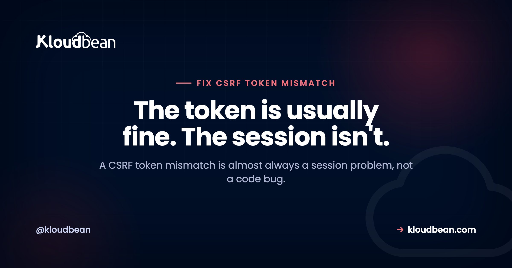

# CSRF Token Mismatch: How to Diagnose and Fix It by Cause

By Kloudbean Engineering · The token is usually fine. The session isn't.

A CSRF token mismatch is one of those errors people fix by trial and error, toggling settings until it stops, without ever knowing why. That works right up until it breaks again in production. This guide takes the other route: understand what a CSRF token really is, then diagnose the mismatch by its actual cause. Most of the time the token is doing its job and the session behind it is the real problem. Framework notes for Laravel, Django, and Express are near the end.

> **The short answer.** A CSRF token mismatch means the token sent with your request no longer matches the one tied to your session. Nine times out of ten the token is fine and the session is the culprit: it expired, its cookie got blocked, or a load balancer minted the token on a different node. Diagnose the session first, not the code.

## What is a CSRF token, and what does "mismatch" mean?

CSRF stands for cross-site request forgery. The attack is simple: you're logged into your bank in one tab, you visit a booby-trapped page in another, and that page quietly submits a form to your bank using your live session cookie. The bank sees a valid cookie and does what it's told. The CSRF token is the defense against that.

Here's how the token works. When the server renders a page with a form, it generates a random value, ties that value to your session, and drops a copy into the form as a hidden field. On any unsafe request (a POST, PUT, PATCH, or DELETE, the ones that change state) the server checks that the submitted token matches the one stored for your session. A forged page from another site can send your cookie, but it cannot read and copy that per-page token, so its request fails the check. That's the whole idea.

So a "mismatch" means exactly one thing: the token that arrived does not equal the token the server expected for your session. That happens when the token is stale, when it was never sent, or, most sneakily, when there's no session on this server to compare against. Keep that mental model close, because every fix below is really just "make the two tokens line up again."

<!-- ADD IMAGE: token round-trip diagram. Server issues token + sets session cookie (GET), browser POSTs cookie + token, server compares to the session token, match returns 200 and mismatch returns 419 or 403. Brand colors navy/purple/green. -->

*The token has to make a full round trip and come back attached to the same session it started on. Break any leg of that trip and you get a mismatch.*

## Why does a CSRF token mismatch happen?

There are only a handful of real causes. Learn them once and you'll recognise them on sight instead of guessing.

**The session or token expired.** This is the classic one. A login page sits open in a tab overnight, someone finally submits it, and the token that was valid hours ago no longer is. Laravel surfaces this as 419 Page Expired, which is just its friendly name for "your CSRF token expired." Same story if the user logged out and back in, or the server rotated sessions in between.

**A stale or cached form was served to a new session.** If a page with a form gets cached (by a CDN, a reverse proxy, or aggressive browser caching) then two different users, or the same user in two sessions, can be handed the same old token. When they submit, it belongs to nobody's current session. Authenticated pages with forms should not be cached, full stop.

**The cookie got blocked or never arrived.** The token is only half the pair. The session cookie is the other half, and if it doesn't come back with the request there's no session to compare the token to. Cookies go missing for boring, fixable reasons: the cookie is marked Secure but the site is served over plain http, SameSite is blocking it on a cross-site POST, or the cookie domain doesn't cover the subdomain you're posting to.

**The app is behind a load balancer with no shared session storage.** This is the intermittent one that drives people up the wall. The token gets minted on node A, the POST lands on node B, and node B has never heard of that session because sessions live in each node's own memory or local files. It works, then randomly fails, with no pattern the user can see.

**The token was never sent on an AJAX request.** Plain HTML forms include the hidden token automatically. A fetch or axios call does not, unless you add it. Miss that and every AJAX POST throws an invalid CSRF token error while your regular forms work perfectly, which is a very confusing state to debug.

**It isn't CSRF at all, it's CORS.** A surprising share of "CSRF" tickets are actually the browser blocking a cross-origin request under its CORS rules. The two get mixed up constantly because both involve requests, cookies, and the word "cross." They are different problems with different fixes, and there's a whole section on telling them apart below.

## How do you diagnose a CSRF token mismatch?

Don't start editing config. Start by narrowing the cause, in this order. Each question rules out a whole class of problem.

1. **Did the page sit open a while, or did the user just log in or out?** If yes, it's an expired session or token. Reloading the page to fetch a fresh token confirms it instantly.
2. **Is the session cookie actually in the request?** Open your browser dev tools, look at the failing request's headers, and check that the session cookie is being sent. If it's missing, your problem is the cookie, not the token, and steps 3 and 4 apply.
3. **Is the cookie Secure while the site is on http, or is SameSite blocking it?** A Secure cookie is silently dropped on a non-https page. A SameSite=Lax or Strict cookie won't ride along on a genuinely cross-site POST. Match the attributes to how you actually serve the site.
4. **Are you posting to a different domain or subdomain than the one that set the cookie?** If the cookie's domain doesn't cover where you're submitting, the browser won't send it. Widen the cookie domain to cover your subdomains.
5. **Is this an AJAX or fetch request?** If forms work but AJAX fails, the token isn't being attached to the request. Send it as a header.
6. **Does it fail only sometimes, or only under load?** That's the fingerprint of multiple nodes with no shared session store. One node has the session, another doesn't.
7. **Does the browser console show a CORS message?** If you see "blocked by CORS policy," stop. This is not a CSRF problem. Jump to the CSRF vs CORS section.

That order matters because it goes from cheapest to check to most involved. Here's the same logic as a lookup table you can scan when a ticket comes in.

| Symptom | Likely cause | Fix |
| --- | --- | --- |
| 419 Page Expired after a form sat open | Session or CSRF token expired | Reload for a fresh token; consider a longer session lifetime |
| Every user fails right after a deploy | App key or session secret changed, old sessions invalid | Keep a stable app key/secret; expect one round of re-logins after any rotation |
| Fine on http locally, fails on https (or the reverse) | Secure cookie dropped, or SameSite blocking it | Match cookie Secure and SameSite to your scheme and cross-site needs |
| No session cookie present in the request | Wrong cookie domain, or a third-party cookie was blocked | Set the cookie domain to cover your subdomains; keep form and submit same-site |
| Fails intermittently, only under load | Multiple nodes, no shared session store | Use a shared session store (Redis or a database) or enable sticky sessions |
| Only AJAX or fetch fails, forms are fine | Token not attached to the request | Send the token as a header (X-CSRF-TOKEN or X-CSRFToken) |
| Console says blocked by CORS policy | Not CSRF at all | Fix the CORS response headers on the server instead |

## CSRF vs CORS: which problem do you actually have?

These two get confused more than any other pair in web security, so let's draw a hard line. CSRF protection is your server checking that a state-changing request came from your own pages, using a token it can verify. CORS is the browser deciding whether one origin is allowed to read the response from another origin, using headers the server sends back. One is enforced by your server, the other by the browser. One rejects the request, the other blocks your JavaScript from reading the reply.

The tell is where the error shows up. A CSRF failure comes back from your server as a 419 or 403 with a token message in the body. A CORS failure shows up in the browser console with the phrase "blocked by CORS policy," often after a preflight OPTIONS request you didn't send on purpose. If the console is complaining, it's CORS. If your server logs are complaining, it's CSRF.

| | CSRF protection | CORS |
| --- | --- | --- |
| What it does | Blocks forged state-changing requests from other sites | Controls which origins may read a cross-origin response |
| Enforced by | Your server, which rejects the request | The browser, which blocks the read |
| Mechanism | A per-session token plus the session cookie | Response headers like Access-Control-Allow-Origin |
| Typical error | 419 Page Expired, or 403 invalid CSRF token | Console: blocked by CORS policy, often a preflight OPTIONS |
| Where you fix it | Token handling and session or cookie config | Allowed origins, methods, and headers on the server |

If you've landed here but the console is throwing origin errors, the fix you actually want is in the guide to [fixing CORS errors in production](https://www.kloudbean.com/blog/fix-cors-error-node-production/). Come back to this page once you've confirmed the request is reaching your server and being rejected there.

## Laravel: fixing 419 Page Expired

A CSRF token mismatch in Laravel almost always wears the 419 Page Expired mask. That page comes from the `VerifyCsrfToken` middleware when the `_token` field is missing, stale, or can't be matched to a session. Two things fix the large majority of cases: make sure every form actually includes the token, and make sure the session cookie survives the trip.

For Blade forms, the `@csrf` directive adds the hidden field for you. Forget it on a form and that form will fail every single time, which at least makes it easy to spot.

```blade
{{-- @csrf adds the hidden _token field to the form --}}
<form method="POST" action="/profile">
    @csrf
    <input name="name">
    <button>Save</button>
</form>
```

For AJAX, nothing adds the token for you, so put it in a meta tag and send it as a header on every request. This is the single most common cause of an invalid CSRF token on an otherwise healthy Laravel app.

```html
<!-- in your layout head -->
<meta name="csrf-token" content="{{ csrf_token() }}">
```

```js
// send the token on every axios request
axios.defaults.headers.common['X-CSRF-TOKEN'] =
  document.querySelector('meta[name=csrf-token]').content;
```

If the token is present and it still fails, the cookie is the suspect. Check your session config, because these settings decide whether the cookie comes back at all. Managing them cleanly is exactly what [good environment variable hygiene](https://www.kloudbean.com/blog/environment-variables-done-right/) is for.

```bash
# .env
SESSION_DRIVER=redis          # shared across nodes, not per-node files
SESSION_LIFETIME=120          # minutes before the token expires
SESSION_DOMAIN=.example.com   # a leading dot covers your subdomains
SESSION_SECURE_COOKIE=true    # required when you serve over https
```

One Laravel-specific trap: the default `file` session driver stores sessions on the local disk of one server. The moment you run more than one app node, that driver produces random 419s, because half the requests hit a node that never saw the session. Switch to `redis` or `database` before you scale out, not after the tickets arrive.

## Django: csrf_token and CSRF_TRUSTED_ORIGINS

Django ships CSRF protection on by default through `CsrfViewMiddleware`. In templates, the `` tag renders the hidden field. Leave it out of a POST form and you'll get a 403 with the reason "CSRF token missing or incorrect."

```html
<form method="post">
  
  <button>Save</button>
</form>
```

The setting people miss is `CSRF_TRUSTED_ORIGINS`. Since Django 4.0, a POST from a different origin over https (a separate frontend domain, say) needs that origin listed explicitly, scheme included, or the request is rejected even with a valid token. It's a frequent cause of "it works locally, breaks in production," because production is where the domains actually differ.

```python
# settings.py
CSRF_TRUSTED_ORIGINS = [
    "https://app.example.com",
    "https://www.example.com",
]
CSRF_COOKIE_SECURE = True      # only send the CSRF cookie over https
SESSION_COOKIE_SECURE = True
# CSRF_COOKIE_SAMESITE = "Lax" is the default; use "None" only cross-site, and then Secure is mandatory
```

For AJAX in Django, read the `csrftoken` cookie and send it back in the `X-CSRFToken` header. Same principle as Laravel: forms are handled for you, AJAX is not.

## Express and Node: sessions and the token

A quick heads-up for Node developers: the old `csurf` package is deprecated, so don't reach for it on a new build. Whatever library you pick, the underlying rule is unchanged. A CSRF token needs somewhere to be stored and compared, which for most apps means a session, and that session has to be reachable no matter which node handles the request.

```js
// a CSRF token needs a session to compare against.
// a per-node memory store breaks the moment you add a second node.
app.use(session({
  secret: process.env.SESSION_SECRET,        // stable and shared across nodes
  store: new RedisStore({ client: redis }),  // one store every node reads
  resave: false,
  saveUninitialized: false,
  cookie: { httpOnly: true, sameSite: "lax", secure: true },
}));
```

Two things here cause most Node CSRF grief. First, the default in-memory session store is per-process, so it cannot survive a restart or a second node, which is why the snippet points at a shared store. Second, `SESSION_SECRET` has to be stable and identical on every node; if it's generated at boot or differs between nodes, existing sessions become unreadable. Keep it out of your code and load it from config, the way [proper secrets management](https://www.kloudbean.com/blog/secrets-management/) handles any shared secret.

## Why do load balancers cause random CSRF mismatches?

This deserves its own section because it's the cause people never suspect and waste the most time on. When your app runs on a single server, the session that issued the token and the session that checks it are the same thing, so tokens always line up. Put two or more nodes behind a load balancer and that assumption quietly breaks.

The token gets minted on whichever node served the form. The POST, though, gets routed by the load balancer to whichever node is free, which might be a different one. If sessions live in each node's local memory or local files, the second node has no record of that session and the token matches nothing. The result is a mismatch that appears at random, more often under heavy traffic when requests spread across nodes, and never reproduces on your single-node laptop. Maddening.

There are two ways out. Sticky sessions pin each user to one node so their requests always come home, which works but concentrates load and falls over when that node restarts. The better fix is a shared session store: put sessions in Redis or a database that every node reads from, and it stops mattering which node handles the request because they all see the same session. A firewall or WAF in the path can add its own wrinkle by stripping headers or cookies, which is worth ruling out too; the guide on [what a WAF actually does](https://www.kloudbean.com/blog/what-a-waf-does/) covers that behaviour.

## How do you stop CSRF errors from coming back?

Fixing today's mismatch is one thing. Keeping it gone is about a few habits.

Use a shared session store from the start if there's any chance you'll run more than one node. Set your cookie attributes deliberately, matching Secure to https and choosing SameSite for how your site is actually used, and revisit them alongside your other [security headers](https://www.kloudbean.com/blog/security-headers-guide/) so the whole set is coherent. Don't cache authenticated pages that carry a form. Attach the token to every AJAX call in one place, an axios interceptor or a fetch wrapper, so no request can forget it. And handle the expired case gracefully: when a token expires, catch the 419 or 403 and prompt a refresh instead of dumping a raw error on the user.

One opinion worth stating plainly, because someone always suggests it: don't disable CSRF protection to make the error go away. It feels like a fix and it's actually removing a real defense against a real attack. If a specific stateless API endpoint genuinely doesn't need it, exempt that one route on purpose and document why. Turning the whole thing off is not a fix, it's a vulnerability with good PR.

---

**Running your app on more than one node?** A CSRF token only validates when every node shares the same session. Kloudbean's built-in Flexible Load Balancer fronts your app pool, and managed Redis gives those nodes one session store to read from, so a token minted on one node still checks out on another. See [kloudbean.com](https://www.kloudbean.com/) and [pricing](https://www.kloudbean.com/pricing/).

## FAQ

**What does a CSRF token mismatch actually mean?**
It means the token submitted with your request does not match the token the server stored for your session, so the server rejects the request. It's a safety check against forged cross-site requests. Most of the time the token itself is fine and the underlying session expired, was never created, or its cookie didn't arrive.

**Why do I keep getting 419 Page Expired in Laravel?**
419 Page Expired is Laravel's name for a failed CSRF check from the VerifyCsrfToken middleware. The usual causes are a form left open until the token expired, a missing @csrf directive, an AJAX call that didn't send the token header, or a session cookie that isn't coming back. Check those in that order.

**How do I fix an invalid CSRF token on AJAX or fetch requests?**
Plain forms include the token automatically but AJAX calls do not, so you have to attach it yourself. Put the token in a meta tag or read it from the cookie, then send it as a header (X-CSRF-TOKEN in Laravel, X-CSRFToken in Django) on every unsafe request. Setting it once in an axios interceptor covers all your calls.

**Can an expired session cause a CSRF token mismatch?**
Yes, and it's the most common cause. The token is tied to the session, so when the session expires the token becomes invalid with it. A page left open past the session lifetime, or a logout and re-login in another tab, both leave you holding a token that no longer matches. Reloading the page fetches a fresh one.

**Is a CSRF token mismatch the same as a CORS error?**
No, though they're constantly confused. CSRF is your server rejecting a request whose token it can't verify, and it shows up as a 419 or 403 from the server. CORS is the browser blocking a cross-origin request, and it shows up in the console as blocked by CORS policy. If the console is complaining, you have a CORS problem, not a CSRF one.

**Why does the error only happen behind a load balancer?**
Because the token is minted on one node and the POST can land on a different node. If sessions live in each node's local memory or files, the second node has no record of that session and the token matches nothing, so it fails at random. Fix it with a shared session store like Redis, or with sticky sessions.

**How do I set CSRF_TRUSTED_ORIGINS in Django?**
Add each origin, scheme included, to the CSRF_TRUSTED_ORIGINS list in settings.py, for example https://app.example.com. Since Django 4.0 a cross-origin POST over https needs its origin listed there or it's rejected even with a valid token. This is a frequent reason a form works locally but fails once your frontend and backend are on different domains.

**Do SameSite and Secure cookie settings cause CSRF token errors?**
They can, indirectly. A cookie marked Secure is dropped on a plain http page, and a SameSite Lax or Strict cookie won't be sent on a genuinely cross-site POST. Either way the session cookie goes missing, so there's no session to match the token against. Match the attributes to your scheme and to whether your requests are truly cross-site.

**Is it safe to just disable CSRF protection to make the error go away?**
No. Disabling it removes a real defense against cross-site request forgery and turns a nuisance into a vulnerability. If one stateless API route genuinely doesn't need token checking, exempt that single route on purpose and document the reason. Diagnose the real cause instead, which is usually a session or cookie issue you can fix properly.

---

*Kloudbean Engineering · Diagnose the session before you touch the token.*
