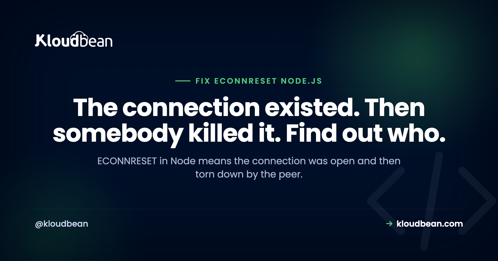

# ECONNRESET in Node.js: What It Means and How to Fix It
*By Kloudbean Engineering · The connection existed. Then somebody killed it. Find out who.*



If you're trying to fix ECONNRESET in Node.js, start with what the error actually proves. An ECONNRESET in Node means a connection was already established and then the peer on the other end sent a TCP RST, tearing it down while you were still using it. That's a completely different bug from `ECONNREFUSED`, where nothing ever answered and the connection never opened at all. So don't go hunting for a wrong hostname or a stopped service. Something accepted you, then hung up. Your job is to work out what, and why.

> **What does ECONNRESET mean in Node.js?**
> ECONNRESET means the peer sent a TCP reset on an already open connection, so your socket died mid-flight. The usual cause is a pooled or keep-alive socket the other side had quietly closed while your app still believed it was usable. Fix it by keeping your idle timeout shorter than the peer's, handling the socket `error` event, and retrying only idempotent requests.

## What ECONNRESET actually means

At the TCP level, a reset is a packet that says "this connection is over, right now, no negotiation." Not a polite FIN that closes the stream in an orderly way. A hard stop. When your Node process is reading from or writing to that socket at the moment the RST lands, libuv surfaces it as an `ECONNRESET` error and your promise rejects or your stream emits `error`.

The thing to hold onto: a reset can only happen on a connection that existed. Handshake completed, DNS resolved, port open, service there. That one fact rules out most of what people check first.

Two neighbours are worth naming once so you don't mix them up. [ECONNREFUSED](https://www.kloudbean.com/blog/fix-econnrefused-node/) means the connection was actively refused because nothing was listening, so it failed instantly. `ETIMEDOUT` means nothing answered within your time limit, so you never got a decision either way. ECONNRESET sits between them: you got in, and then you got thrown out.

## Read the error properly: read ECONNRESET vs write ECONNRESET

Node tells you more than most people notice. The message carries the syscall that failed, and that word is a real clue:

```text
Error: read ECONNRESET
    at TCP.onStreamRead (node:internal/stream_base_commons:217:20) {
  errno: -104,
  code: 'ECONNRESET',
  syscall: 'read'
}
```

**`read ECONNRESET`** means you were waiting on data when the reset arrived. You'd sent your request (or you were idle mid-connection) and were expecting a response. Typically the peer decided the connection was done before you did.

**`write ECONNRESET`** means you were pushing bytes when it died. You were mid-upload, mid-body, mid-query. That points at the peer rejecting what you were sending, or dying while receiving it. Note that a write to a socket the peer has already fully closed often surfaces as `EPIPE` instead, so seeing both in the same log usually means the same underlying event caught at slightly different moments.

You'll also see the phrase `socket hang up`, which Node reports as `ECONNRESET` from `http` when a response never completed. Same family, same investigation.

| Error | What happened at the TCP level | What it proves |
|---|---|---|
| `ECONNREFUSED` | Peer replied with RST to your SYN | Nothing was listening on that host and port |
| `ETIMEDOUT` | No reply at all inside the deadline | Packets are being dropped, or the peer is stuck |
| `ECONNRESET` | RST arrived on an established connection | The peer was there, accepted you, then tore it down |
| `EPIPE` | You wrote to a socket already closed at the other end | Same story as a reset, caught while writing |

<!-- ADD IMAGE: annotated terminal screenshot of a read ECONNRESET stack trace with code, errno and syscall circled. src -> images/econnreset-stack.png -->

## So who reset the connection?

This is the whole diagnosis. A reset always has an author, and there are only a few candidates. Work down them in this order.

1. A peer closed an idle socket your connection pool still thought was alive.
2. A proxy or load balancer in the middle hit its own idle timeout.
3. The server process crashed or restarted while your request was in flight.
4. You sent a body bigger than the peer was willing to accept.
5. TLS or protocol mismatch, so the peer gave up on the conversation.
6. A client simply hung up. Normal. Not your bug.

### 1. The stale pooled connection (start here)

Here's my honest opinion after enough of these: most ECONNRESET reports aren't a network fault at all. They're idle connection reuse. Check your pool's idle timeout before you go blaming the network, the cloud, or the database.

The mechanism is simple. Your pool opens a connection, uses it, and parks it as idle. The peer has its own idea of how long an idle connection should live, and it's often shorter than yours. So the peer closes or resets it. Your pool never noticed, because nobody was reading. The next request checks out that dead socket, writes to it, and gets a reset. Classic symptom: it happens on the first request after a quiet period, and never under sustained load.

The fix is a rule, not a magic number: **your idle timeout must be shorter than the peer's.** Then you close the socket while it's still yours to close.

```js
const { Pool } = require("pg");

const pool = new Pool({
  connectionString: process.env.DATABASE_URL,
  max: 10,
  // Retire idle clients before the database or any proxy does.
  idleTimeoutMillis: 30000,
  connectionTimeoutMillis: 5000,
});

// An idle client can die between queries. Without this listener,
// that error is unhandled and can take the process down.
pool.on("error", (err) => {
  console.error({ code: err.code, syscall: err.syscall }, "idle client error; pool will replace it");
});
```

The same trap exists for outbound HTTP. Node 19 and later enable keep-alive on the global agent by default, which is good for performance and means you now own the idle-socket problem whether you asked for it or not:

```js
const http = require("node:http");

const agent = new http.Agent({
  keepAlive: true,
  keepAliveMsecs: 1000,
  maxSockets: 50,
  // Drop the socket before the upstream's idle window closes.
  timeout: 25000,
});
```

To pick the number, find the peer's idle timeout and go under it. On a Node HTTP server the relevant knob is `server.keepAliveTimeout`, which defaults to 5 seconds. On MySQL it's `wait_timeout`. Behind nginx it's `keepalive_timeout`. Read the real value rather than guessing, then subtract a margin.

More on the pool side of this in [database connection pooling](https://www.kloudbean.com/blog/database-connection-pooling/).

### 2. A proxy or load balancer in the middle

Both ends can be healthy and you'll still get resets, because something between them decided the connection had gone stale. Load balancers, reverse proxies, NAT gateways and service meshes all keep their own idle timers.

The tell is that resets cluster around a suspiciously round duration. Quick requests are fine, requests that sit for slightly over a minute die. That's an intermediary, not your code. Keep your own client timeout below theirs so you fail predictably instead of getting reset, and stop holding sockets open through long silent gaps. If a request genuinely needs minutes, return a job ID and let the client poll. When these show up as gateway errors in the browser, [502 Bad Gateway with Node and nginx](https://www.kloudbean.com/blog/fix-502-bad-gateway-node-nginx/) is the proxy-facing half of the story.

### 3. The server crashed or restarted mid-request

When a process dies, the kernel resets its open connections, so every in-flight request becomes an ECONNRESET on the client side. If you're seeing resets and your app is also restarting, stop debugging sockets. You have a crash, and the reset is just the shrapnel.

Deploys do the same thing on purpose. A restart kills the old process, and anything it was serving gets cut off unless that process winds down properly: stop accepting new connections, drain what's in flight, then exit. That's what [graceful shutdown in Node.js](https://www.kloudbean.com/blog/graceful-shutdown-nodejs/) is for. If the restarts aren't deliberate, [why your Node app keeps crashing on deploy](https://www.kloudbean.com/blog/fix-node-app-crashing-on-deploy/) is the better thread to pull. Either way, tell a crash from a network event by timing: correlate reset timestamps against process start times and deploy history.

<!-- ADD IMAGE: diagram of the four reset authors, client, proxy, server process, database, with an RST arrow from each. src -> images/who-reset-it.png -->

### 4. The body was too big for the peer

Send an upload or a JSON payload past a limit and some peers respond with a status code, while others just stop reading and reset the connection. From your side that's a `write ECONNRESET` partway through a large request, and it reproduces reliably with the same file, which is the giveaway. It's a size problem, not a flake.

Check every limit on the path, because there's usually more than one: nginx `client_max_body_size` (default 1m, so this bites early), the `limit` option on Express body parsers, and whatever your upstream API enforces. Raise the one clipping you, or stop pushing large files through your app process and upload straight to object storage.

### 5. TLS or protocol mismatch

Talk plain HTTP to a TLS port, or offer a protocol version the peer won't accept, and the conversation ends abruptly. You get a reset, or a very confusing handshake error, because the peer is not going to explain itself to a client it doesn't understand. Quick check:

```bash
# Does TLS actually negotiate to this host and port?
openssl s_client -connect db.example.com:5432 -servername db.example.com

# Is the URL scheme wrong? http:// against a TLS-only port resets fast.
curl -v https://api.example.com/health
```

Usually it's one of two things: an `http://` URL against a TLS-only endpoint, or a client pinned to a TLS version the server has since disabled. Neither is a network problem.

### 6. The client just hung up

This one wastes a lot of debugging time. If a user closes a tab, kills the app, or loses signal mid-request, your server gets a reset. Nothing is broken. That's what leaving looks like at the TCP level. Client resets belong at `warn` or `info`, never `error`, and they should never page anyone. Node gives you a dedicated hook:

```js
server.on("clientError", (err, socket) => {
  // A client that vanished is not an incident. Log it and move on.
  if (err.code === "ECONNRESET" || !socket.writable) return;
  socket.end("HTTP/1.1 400 Bad Request\r\n\r\n");
});
```

The way to keep this separable is to log the fields rather than the prose, so you can filter inbound client resets out of your alerting without losing them entirely. [Structured logging in Node.js](https://www.kloudbean.com/blog/structured-logging-nodejs/) goes into how to shape that.

## Why an unhandled socket error crashes the process

An ECONNRESET on a socket is not a rejected promise you can ignore. Sockets are `EventEmitter` instances, and an `'error'` event with no listener gets thrown as an uncaught exception, which ends the process. That's how an app dies from a database connection dropping in the background while nobody was even querying it. So attach handlers to everything long-lived you own: servers, outbound requests, pools, Redis clients, raw `net` sockets.

```js
const net = require("node:net");

const socket = net.connect({ host: "127.0.0.1", port: 6379 });

socket.on("error", (err) => {
  if (err.code === "ECONNRESET") {
    // Expected: the peer tore down an established connection.
    logger.warn({ code: err.code, syscall: err.syscall }, "peer reset the connection");
    reconnectWithBackoff();
    return;
  }
  logger.error({ err }, "unexpected socket error");
});

// Outbound HTTP requests need the same treatment.
const req = http.request(options, handleResponse);
req.on("error", (err) => logger.warn({ code: err.code }, "request failed"));
req.end();
```

And a global safety net, purely so you find out about the ones you missed:

```js
process.on("uncaughtException", (err) => {
  logger.fatal({ err }, "uncaught exception, shutting down");
  // Log, then exit. Do not pretend the process is healthy.
  process.exit(1);
});
```

Note the exit. Staying alive after an uncaught exception leaves you running on unknown state, and the bug that follows is far harder to find than the crash you suppressed.

## Two anti-patterns to avoid

The first is the empty catch. Wrapping the call in `try { ... } catch (e) {}` makes the log noise stop, and that's all it does. You've converted a visible connection failure into silently missing data, and you've thrown away `code` and `syscall`, the two fields that would have told you who reset you. Handle it, classify it, log it. Don't swallow it.

The second is blanket auto-retry. Retrying a GET after a reset is fine. Retrying a POST that charges a card, sends an email, or inserts a row is how you get duplicates, because a reset gives you no information about whether the peer processed the request before the connection died. It might have committed and lost the response. Only retry when the operation is idempotent, or when you're carrying an idempotency key the peer honours.

```js
const IDEMPOTENT = new Set(["GET", "HEAD", "OPTIONS", "PUT", "DELETE"]);

function shouldRetry(err, method) {
  if (err.code !== "ECONNRESET") return false;
  return IDEMPOTENT.has(method); // POST needs an idempotency key, not a retry
}
```

| Symptom | Likely author of the reset | Fix |
|---|---|---|
| First request after an idle period fails | Stale pooled or keep-alive socket | Set your idle timeout below the peer's |
| Fails at a consistent round duration | Proxy or load balancer idle timer | Lower your client timeout, or make the work async |
| Bursts of resets at deploy time | Process restart cutting requests off | Drain in-flight requests on SIGTERM |
| Same large upload fails every time | Body size limit on a peer | Raise the limit or upload direct to storage |
| Fails immediately on connect, every time | TLS or scheme mismatch | Fix the scheme or the TLS version |
| Scattered inbound resets on your server | Clients disconnecting | Log at warn, do not alert |

## What to check when it only happens in production

Resets are awkward to debug remotely because the cause usually sits outside your code: an intermediary's timer, or a process that restarted. Two pieces of evidence settle most of them. Your app's own logs at the moment of the reset, streamed rather than fished out afterwards. And a straight answer to "did the process restart?", which turns a mysterious burst of resets into an obvious cause. Whatever platform you're on, make sure you can see both.

Practical note: On Kloudbean, app and build logs stream live in the console next to deployment history, and Node apps run as persistent processes under PM2, so a restart shows up as a restart instead of an unexplained wave of resets, and managed databases keep access controlled while you're poking at connection settings.

Also worth checking on the database side: whether the server-side idle or wait timeout is shorter than your pool's, which is the same rule from earlier applied to whatever you're connecting to. [Managed PostgreSQL hosting](https://www.kloudbean.com/blog/managed-postgresql-hosting/) covers where those settings live.

<!-- ADD IMAGE: screenshot of live streaming app logs beside deployment history, showing a restart lined up with a reset burst. src -> images/live-logs.png -->

## Related reading

The sibling error, when nothing was listening at all: [ECONNREFUSED in Node.js](https://www.kloudbean.com/blog/fix-econnrefused-node/). Connection layer: [database connection pooling](https://www.kloudbean.com/blog/database-connection-pooling/). Restart half: [graceful shutdown in Node.js](https://www.kloudbean.com/blog/graceful-shutdown-nodejs/) and [Node app crashing on deploy](https://www.kloudbean.com/blog/fix-node-app-crashing-on-deploy/). And to make any of this findable later, [structured logging in Node.js](https://www.kloudbean.com/blog/structured-logging-nodejs/).

**See the restart, and you've found the reset.** Run your Node app on Kloudbean with live app and build logs, deployment history, persistent processes under PM2, and managed databases in the same dashboard. Deploy from GitHub, from $8/mo. Start at [kloudbean.com](https://www.kloudbean.com/) or check [pricing](https://www.kloudbean.com/pricing/).

Live logs · Deployment history · Managed databases · Automatic backups · Free SSL · GitHub deploys

## FAQ

### What does ECONNRESET mean in Node.js?
It means the peer sent a TCP reset on a connection that was already established, so your socket was torn down while you were still using it. The connection existed, which rules out DNS problems and nothing-listening problems. Something accepted your connection and then ended it abruptly.

### What is the difference between read ECONNRESET and write ECONNRESET?
The syscall in the message tells you what your process was doing when the reset landed. `read ECONNRESET` means you were waiting for data, usually because the peer considered the connection finished before you did. `write ECONNRESET` means you were sending bytes, which points at the peer rejecting your payload or dying mid-receive.

### Is ECONNRESET the same as socket hang up?
They're the same underlying event seen from different layers. Node's `http` module reports `socket hang up` with the code `ECONNRESET` when a response never completed because the connection went away. Debug it the same way: work out who closed the connection and why.

### Why do I get ECONNRESET only on the first request after being idle?
That's the classic stale connection pattern. Your pool or keep-alive agent parked a socket as idle, the peer closed it on its own shorter timer, and your app didn't notice because nobody was reading. The next request writes to a dead socket and gets a reset. Set your idle timeout below the peer's.

### How do I stop ECONNRESET from crashing my Node process?
Attach an `error` listener to every socket, HTTP request, pool and client you keep around. Sockets are event emitters, and an `error` event with no listener is thrown as an uncaught exception, which ends the process. Add a top-level `uncaughtException` handler that logs and then exits, so you find the ones you missed.

### Should I retry a request that failed with ECONNRESET?
Only if the operation is idempotent. A reset gives you no information about whether the peer processed your request before the connection died, so retrying a POST that charges a card or inserts a row can create duplicates. Retry GET, HEAD and PUT freely; for writes, use an idempotency key the peer honours.

### Is ECONNRESET the same as ECONNREFUSED?
No, and the distinction saves you time. ECONNREFUSED means nothing was listening, so the connection never opened. ECONNRESET means a connection was established and then reset. ETIMEDOUT is a third case where nothing answered at all inside your deadline, so you got no decision either way.

### Can a load balancer or proxy cause ECONNRESET?
Yes, and it's easy to miss because both your client and your server look healthy. Proxies, load balancers and NAT gateways keep their own idle timers, and when one fires the connection is reset. The tell is that failures cluster around a consistent duration rather than a consistent request.

### Should I log client-side ECONNRESET as an error?
Not as an error, no. When a user closes a tab or loses signal mid-request, your server sees a reset, and that's just what leaving looks like at the TCP level. Log those at warn or info with the code and syscall attached so you can filter them out of alerting, and keep genuine errors loud.

*Kloudbean Engineering · A reset always has an author. Name it before you fix anything.*
