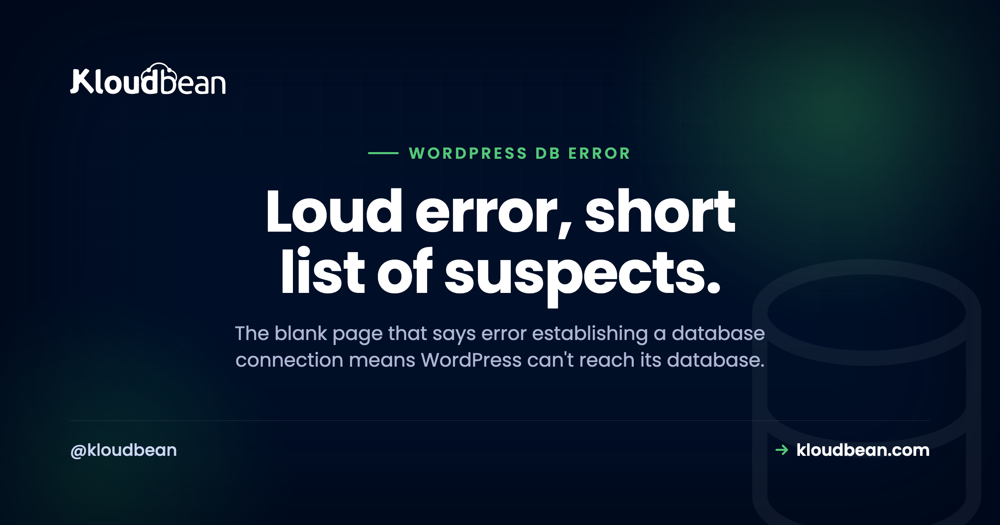

# Error Establishing a Database Connection in WordPress: A Fix-It Decision Tree

Your site is a blank white page with one sentence on it: *Error establishing a database connection.* No menu, no posts, no admin login. Just that line. It looks like everything is broken. It almost never is.

That message means one specific thing. WordPress itself ran fine, but it couldn't reach the database where all your content lives. The PHP worked. Your files are there. The database just didn't answer. And that's good news, because it shrinks the whole problem to a short list of causes you can walk in order. So let's walk it, calmly, from the most likely fix to the least.

> **Fastest triage:** Nine times out of ten it's wrong credentials in `wp-config.php`. Open that file and check `DB_NAME`, `DB_USER`, `DB_PASSWORD`, and `DB_HOST` against your real database. If the site only flickers the error under traffic, the database is hitting its connection limit. If the message names a specific table, it's corruption: run the built-in repair, or restore a backup.

## What "error establishing a database connection" actually means

WordPress keeps everything in a database, MySQL or MariaDB: your posts, pages, users, settings, plugin options, all of it. On every single page load it opens a connection to that database, asks for what it needs, and builds the page. This error means that connection failed. WordPress reached out and got nothing usable back.

Notice what it does not mean. It's usually not your theme, not a plugin, not a broken file. PHP is clearly running, or you'd see a different error (or a truly blank page). So you only have one question to answer: why can't WordPress reach its database? There are four common answers, and this tree walks them in the order they actually happen.

```
              "Database connection" error
                        |
                 DB reachable?  --no-->  Fix DB_HOST or start the DB
                        | yes
              Credentials match?  --no-->  Fix the wp-config.php credentials
                        | yes
               Too many conns?  --yes-->  Resize or use a managed DB
                        | no
                  Corrupted?  --yes-->  Repair, or restore a backup
```

## Cause 1: Wrong credentials in wp-config.php

This is the culprit the overwhelming majority of the time. WordPress reads four values from a file called `wp-config.php` to connect to its database. If any one of them is wrong, the connection fails and you get the error. Here's the block you're looking for:

```
define( 'DB_NAME', 'wordpress_db' );
define( 'DB_USER', 'wp_user' );
define( 'DB_PASSWORD', 'your-real-password' );
define( 'DB_HOST', 'localhost' );
```

Open `wp-config.php` in the root of your WordPress install and confirm all four match your actual database exactly. A single wrong character does it. This cause shoots to the top of the list if the error appeared right after you migrated the site, switched hosts, reset the database password, or edited that file. A credential quietly drifting out of sync is the number-one trigger there is. If you recently moved the site, the [zero-downtime migration guide](https://www.kloudbean.com/blog/how-to-migrate-hosting-zero-downtime/) covers keeping these in step.

<!-- ADD IMAGE: the wp-config.php file open in an editor with the four DB_ lines highlighted -->

## Cause 2: The wrong DB_HOST, or a database it can't reach

Often the one wrong value is `DB_HOST` specifically. Plenty of setups use `localhost`, where the database sits on the same box as the web server. But managed and cloud setups frequently put the database on its own host, so `DB_HOST` needs to be a private address or hostname like `10.0.0.5:3306`, not `localhost`. Point it at the wrong place and WordPress knocks on a door where nothing answers.

Don't guess whether the database is reachable. Test it with the same credentials WordPress is using:

```
# ask WordPress itself whether the database checks out
wp db check

# or test the raw connection directly
mysql -h 10.0.0.5 -u wp_user -p wordpress_db -e "SELECT 1;"
```

If that connects, your host and credentials are fine and the problem is elsewhere. If it hangs or refuses, the database is either down, or it's up but not reachable at the address you gave it (wrong host, blocked port, or an app-server IP that isn't allow-listed on the database). WP-CLI is the fastest tool for this kind of poke; the [WP-CLI guide](https://www.kloudbean.com/blog/wordpress-cli-guide/) has more of these.

<!-- ADD IMAGE: a terminal running wp db check and a mysql SELECT 1 test, both returning success -->

## Cause 3: The database is down or out of connections

Credentials are right, host is right, but the site still throws the error, especially under traffic? Now you're looking at capacity. A database allows only so many simultaneous connections. When a rush of visitors each needs one, you can exhaust the limit, and new page loads get turned away with this exact error. The tell is that it comes and goes: the site works, flashes the error under load, then works again. In the logs you'll often see the MySQL side of it:

```
ERROR 1040 (HY000): Too many connections
```

You can confirm how close you are to the ceiling:

```
SHOW VARIABLES LIKE 'max_connections';
SHOW STATUS LIKE 'Threads_connected';
```

The other version of this is a database that has simply stopped, crashed, run out of memory, or filled its disk, so it isn't accepting connections at all. Either way the answer isn't to keep refreshing and hoping. It's more capacity: a bigger database, or one that runs as its own managed service instead of scrapping for RAM on the same box as your web server.


This is the honest argument for a [managed MySQL database](https://www.kloudbean.com/blog/managed-mysql-hosting/). When the database isn't fighting your PHP for memory and is sized and kept running on its own, the "overwhelmed" and "down" causes largely stop happening. A lot of these incidents just quietly disappear.

## Cause 4: A corrupted database

Least common, but real. After an unclean shutdown, a disk problem, or a botched update, a database table can get corrupted. WordPress connects, but the data it reads back is damaged, so it reports the connection error, and here it will sometimes name a specific table. WordPress ships a repair tool for exactly this. Turn it on by adding one line to `wp-config.php`:

```
define( 'WP_ALLOW_REPAIR', true );
```

Then visit `https://yoursite.com/wp-admin/maint/repair.php` and run the repair. This part matters: **delete that line as soon as you're done**, because the repair page has no password and leaving it enabled is a real security hole. If repair fixes it, you're back. If it doesn't, stop fiddling and restore from a recent backup. Corruption is precisely the moment a good backup earns its keep, which is why the [backups guide](https://www.kloudbean.com/blog/server-backups-guide/) is worth reading before you need it, not after.

<!-- ADD IMAGE: the WordPress database repair page at /wp-admin/maint/repair.php with the repair buttons -->

## Read the symptom, skip the guessing

You don't have to try everything. The symptom usually points straight at the cause:

- **It started right after a change** (migration, host switch, password reset, an edit to `wp-config.php`). That's credentials or host. Causes 1 and 2. Start there.
- **It's intermittent and worse under traffic.** The database is running out of connections. Cause 3. You need capacity, not a config edit.
- **It followed a crash or bad update and mentions a table.** Corruption. Cause 4. Repair, then restore if repair fails.
- **The admin at `/wp-admin` also can't connect,** sometimes with a slightly different message hinting at a table. That's a lean toward corruption too.

A mistake we see often: someone whose site went down right after a migration spends an hour restarting services and resizing servers, when a single mistyped `DB_PASSWORD` in `wp-config.php` was the whole story. Match the symptom to the cause first. It saves the hour.

## Why this mostly stops happening on managed hosting

Once you've fixed it, the goal is to not see it again. A few of these causes basically evaporate on managed hosting, and it's worth being clear about which. When your database runs as a [managed service locked to your app server's IP](https://www.kloudbean.com/blog/add-managed-database-to-your-app/), the credentials are set once and don't drift, the database sits at a known host reachable only by your site, it's sized and monitored so it doesn't fall over under a spike, and it's backed up so corruption is a quick restore instead of a bad day. That takes Causes 2, 3, and much of 4 largely off the table.

Under the hood this is ordinary managed Linux hosting. The platform keeps the database service, the stack, SSL, and backups healthy, and you still own your content and your schema to export whenever you want. Managed hosting can't stop you mistyping a password during a migration. But it removes the infrastructure triggers, which are most of them, and it makes the restore fast when you do need one.

---

**A database that stays up under load.** Run WordPress on a managed database that's sized, monitored, and backed up, so most of these errors never start, and a restore is quick when one does. Start free at [kloudbean.com](https://www.kloudbean.com/), see [pricing](https://www.kloudbean.com/pricing/).

Managed MySQL & MariaDB · IP allow-listing · Automatic backups · Free migration · Free SSL

## FAQ

**What causes 'error establishing a database connection' in WordPress?**
WordPress couldn't reach its database. The usual causes, in order: wrong credentials in `wp-config.php` (most common, especially after a migration or password change), the wrong `DB_HOST` or a database it can't reach, the database being down or out of connections under load, and a corrupted database. The message tells you the connection failed, not that your files or theme are broken.

**How do I fix the WordPress database connection error?**
Start with the credentials in `wp-config.php`: check `DB_NAME`, `DB_USER`, `DB_PASSWORD`, and `DB_HOST` against your real database, since a mismatch is the top cause. If those are right, test whether the database is reachable and not out of connections. If it followed a crash and names a table, run WordPress's built-in repair, and restore from a backup if repair doesn't fix it.

**Where is wp-config.php and what do I check in it?**
It's in the root folder of your WordPress install, alongside wp-content and wp-admin. Check the four define lines for `DB_NAME`, `DB_USER`, `DB_PASSWORD`, and `DB_HOST`, and make sure each exactly matches your actual database. A single wrong character in the password or a stale host value is enough to throw the error.

**Why does the error come and go?**
Intermittent errors that get worse under traffic almost always mean the database is hitting its connection limit. A spike of visitors exhausts the available connections and new requests get refused, then things recover when the rush passes. That's a capacity signal: the database needs more resources or its own managed service, not a credentials change.

**What does 'Too many connections' mean?**
It's the MySQL error (ERROR 1040) behind many intermittent versions of this problem. The database has a `max_connections` limit, and once every slot is in use, new connections are rejected, which WordPress shows as the database connection error. You fix it with more capacity or connection reuse, not by refreshing until it clears.

**How do I repair a corrupted WordPress database?**
Add `define( 'WP_ALLOW_REPAIR', true );` to `wp-config.php`, visit `yoursite.com/wp-admin/maint/repair.php`, and run the repair. Then remove that line straight away, because the repair page is unauthenticated and a security risk if left on. If repair doesn't resolve it, restoring from a recent backup is the reliable fix.

**What should DB_HOST be set to?**
It depends on where your database lives. If the database is on the same server as WordPress, `localhost` is usually correct. If it runs on its own managed instance, `DB_HOST` needs to be the host or address your provider gives you, sometimes with a port like `10.0.0.5:3306`. The right value always comes from your host or database service.

**Can I still get into wp-admin when this happens?**
Usually not, because the admin needs the same database connection to load. Sometimes the login screen shows a slightly different message that hints at corruption specifically. If neither the front end nor the admin can connect, work the tree from the top: reachability and credentials first, then capacity, then corruption.

**Can managed hosting prevent this error?**
It prevents most versions of it. A managed database is sized, monitored, kept running, backed up, and locked to your app server's IP, so the "down," "overwhelmed," and "unreachable" causes largely disappear, and corruption becomes a quick restore. It can't stop a credential you type wrong during a migration, but that's the one cause left, and it's a one-line fix.

**Will I lose data, and how do backups help?**
A connection error by itself doesn't delete anything. Your data is still in the database; WordPress just can't reach it right now. The risk is real corruption, which is exactly what backups guard against. With recent, tested backups, even a genuinely damaged database is a restore away rather than a loss, which is why automatic backups matter here.

---

*By Kloudbean · Loud error, short list of suspects.*
