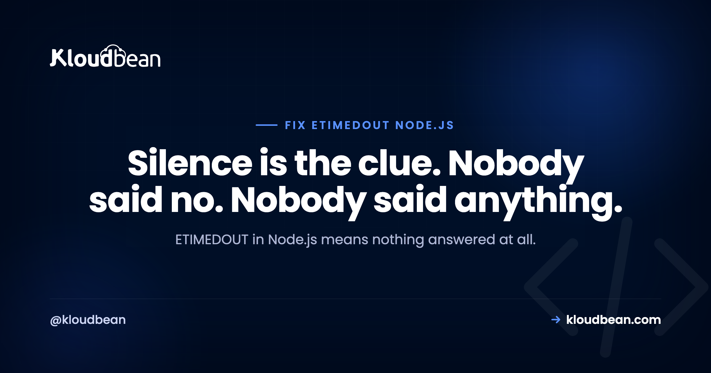
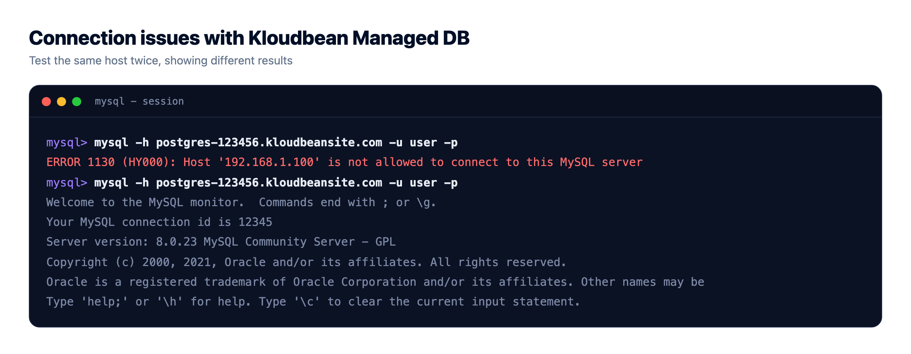
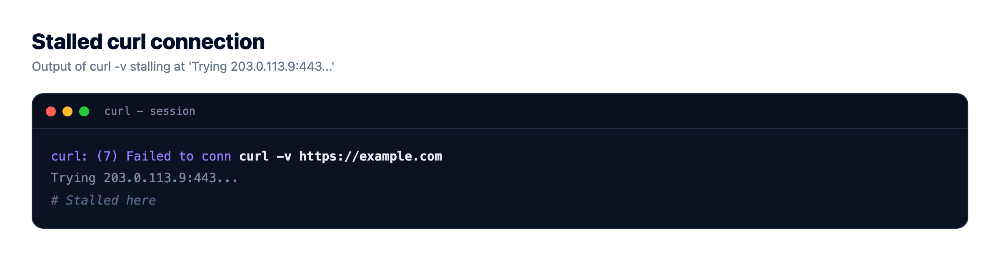
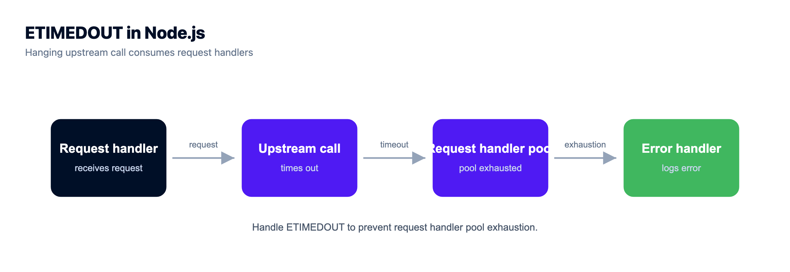

# ETIMEDOUT in Node.js: How to Fix connect ETIMEDOUT

*By Kloudbean Engineering · Silence is the clue. Nobody said no. Nobody said anything.*



Your app tries to reach a database, an internal service, or a third-party API, and eventually gives up with `Error: connect ETIMEDOUT 10.0.3.14:5432`. To fix ETIMEDOUT in Node you first have to read what it proves, and the ETIMEDOUT meaning is narrower than most people assume: nothing answered. Not "the service is broken," not "the credentials are wrong." Your packets went out and nothing came back. That silence is the most useful diagnostic signal you'll get all day, because it points away from your code and towards the network path.

> **What does ETIMEDOUT mean in Node.js?**
> ETIMEDOUT means your app sent packets to a host and port and received no reply before the clock ran out. A refused connection proves something answered and said no. A timeout proves nothing answered at all, which is nearly always a packet-level block: a firewall dropping traffic, the wrong port, or an address that isn't reachable. Test the path with `nc -zv` before touching your code.

## Silence versus refusal, and why the difference decides your next hour

TCP is chatty about failure when it's allowed to be. If you knock on a port where no process is listening, the machine sends back a RST packet, and Node hands you `ECONNREFUSED`. Something was there. It read your packet and rejected it. That's a fast, loud, informative no.

ETIMEDOUT is the opposite. You sent a SYN and never got a SYN-ACK or anything else. The kernel keeps retransmitting for a while, then gives up. Because you got no response, you learned almost nothing about the far end. You did learn something big about the middle: something between you and the peer is swallowing traffic, or the address you're aiming at isn't where you think it is.

The mechanism behind that is a firewall rule choice, and it's worth internalising because it explains most production timeouts:

- A **REJECT** (or `reject-with tcp-reset`) rule sends an explicit rejection. You get a refusal, fast.
- A **DROP** rule sends nothing. Your packet disappears into a black hole. You get a timeout, slowly.

Most cloud security groups, most default server firewalls, and Shorewall-style setups drop by default rather than reject, because dropping doesn't confirm to a scanner that the host exists. Which means: *if you're getting ETIMEDOUT on a port that should be open, a drop rule is the first thing to suspect, not the last.* ECONNRESET is a third animal again: [a connection that was established and then torn down mid-flight](https://www.kloudbean.com/blog/fix-econnreset-node/) points at idle timeouts, proxy limits or a peer that died, not at firewall rules.

| Error | What actually happened | What it proves | Where to look first |
|---|---|---|---|
| `ECONNREFUSED` | Peer replied with RST | Host reachable, nothing listening on that port | Is the service running, is the port right |
| `ETIMEDOUT` | No reply at all | Packets are being dropped, or the address is unreachable | Firewall or security group, allow-list, DNS, wrong host |
| `ECONNRESET` | Connection established, then killed | You reached the service and it or something in between cut the socket | Idle timeouts, proxy limits, peer crash, TLS mismatch |



## connect ETIMEDOUT is not the same as a Node request timeout

Two very different failures both end up looking like "it timed out," and conflating them sends people hunting in the wrong layer.

`connect ETIMEDOUT` comes from the operating system. The TCP handshake never completed. You never had a connection, so no bytes of your request were ever sent. The `syscall` field on the error object says `connect`, and the message carries the IP and port.

A **request or socket timeout** comes from your own client library. The handshake succeeded, your request went out, and then *you* decided to stop waiting. The peer is alive and reachable; it's just slow, or stuck, or it's the one waiting on something else. Axios raises this as `ECONNABORTED` with a "timeout of 5000ms exceeded" message; `undici` and `fetch` surface it as a `HeadersTimeoutError`, `BodyTimeoutError`, or an `AbortError` if you used a signal.

Read the error object rather than the string. It tells you which one you have:

```js
try {
  await callUpstream();
} catch (err) {
  console.error({
    code: err.code,        // ETIMEDOUT, ECONNABORTED, ECONNREFUSED, ECONNRESET
    syscall: err.syscall,  // "connect" means the handshake never completed
    address: err.address,  // the IP it actually tried
    port: err.port,
    cause: err.cause?.code // undici and fetch nest the real cause here
  });
}
```

If `syscall` is `connect`, stop reading your application code. It's a path problem. If there's no `connect` syscall and the code came from your HTTP client, it's a slowness problem, and the peer is where you look.

## Four commands, and what each one rules out

Run these from the machine that's failing, not from your laptop. That's the whole point: your laptop has a different network path, and a check that passes locally tells you nothing about production.

```bash
# 1. Can I complete a TCP handshake to that host and port at all?
nc -zv db.internal 5432
#    succeeded  -> the path is open; your problem is above TCP (auth, app, slowness)
#    refused    -> path is open, nothing listening on that port
#    hangs/times out -> packets are being dropped: firewall, security group, or allow-list

# 2. Same question when nc is not installed
timeout 5 bash -c '</dev/tcp/db.internal/5432' && echo open || echo "blocked or closed"

# 3. Where does the HTTP request actually stall?
curl -v --max-time 10 https://api.example.com/health
#    stops after "Trying 203.0.113.9:443..." -> handshake never completed, packet-level block
#    reaches "Connected to" then stalls    -> you got through; the peer is slow

# 4. Is the name resolving to an address that still exists?
dig +short api.example.com
dig +short db.internal
#    empty result   -> DNS problem, you would normally see ENOTFOUND instead
#    stale/odd IP   -> you are timing out against an address that moved
```

On a box where `nc` and `curl` are both missing, `telnet db.internal 5432` gives the same three outcomes: a blank cursor means the handshake worked, "Connection refused" means the service isn't there, hanging on "Trying..." means dropped packets.

Here's the discipline that saves time. Each result *eliminates* a layer. A successful `nc` permanently rules out firewalls for that host and port, so don't go back and re-check them. A hanging `nc` permanently rules out credentials, connection strings, ORM config, and pool settings, because none of those are involved before a handshake completes. People burn hours rotating database passwords over an ETIMEDOUT. The password was never sent.



## The real causes of connect ETIMEDOUT, and the fix for each

Ordered by how often they turn out to be the answer on a server that was working yesterday.

1. **A firewall or security group is dropping packets.** The classic. Someone tightened a rule, or the server was rebuilt with defaults, and the port your app needs is no longer allowed. Because the rule drops rather than rejects, you get silence. Fix: allow the source (your app server's IP, or its CIDR range) to the destination port, in every layer that exists. Cloud security group and host firewall are two separate gates and both must open.
2. **The database only accepts allow-listed addresses.** Most managed databases refuse traffic from unknown sources by silently dropping it, which is exactly why you get a timeout rather than an authentication error. Fix: add your app server's IP to the database's allow-list. This is the single most common cause of "the connection string is right and it still times out."
3. **Wrong port.** You're aiming at 3306 and it's 3307, or you're using the pooler port instead of the direct one. Sometimes this gives a refusal; when a drop rule covers everything but the real port, it gives a timeout instead. Fix: confirm the listening port on the peer with `ss -tlnp`.
4. **The provider blocks that outbound port.** Egress isn't always open. Port 25 is widely blocked for SMTP, and some networks restrict other ports outbound. Your app looks broken; it's the network policy. Fix: use the submission port your provider supports, or an API-based service instead of raw SMTP.
5. **DNS resolves to an unreachable or stale address.** The name resolves fine, so you don't get `ENOTFOUND`, but the IP behind it is old, is a private address you can't route to, or belongs to something that no longer exists. Fix: compare `dig` output against where the service actually lives. If resolution itself is dragging, [slow DNS lookups](https://www.kloudbean.com/blog/fix-slow-dns-lookup/) add latency on top of everything else.
6. **The peer is genuinely overloaded.** Its accept queue is full, or it's out of connections, so new handshakes go unanswered. Fix: this one is on the other side. Check the peer's own load and connection limits, and if it's your database, look at how many connections your app opens. Unbounded connection growth is what [connection pooling](https://www.kloudbean.com/blog/database-connection-pooling/) exists to prevent.

One more pattern, because it looks supernatural: works from your laptop, times out from the server. That's not a code difference. Different network, different rules. Test from the failing host and the mystery evaporates. If you need a temporary path in to prove the database is healthy, [an SSH tunnel](https://www.kloudbean.com/blog/what-is-an-ssh-tunnel/) is right for that check and wrong for production traffic.

## Set explicit timeouts, because a hung request is worse than a fast failure

Here's the opinion I'll defend: every outbound call should have an explicit timeout you chose. Node's defaults are not a plan. Left alone, a request can hang for a long time while holding a socket and often a database connection or an inbound request handler.

Think about what that costs. One upstream stops answering. Every inbound request that touches it parks and waits, and requests keep arriving, so in-flight handlers accumulate, all blocked on the same silence, all holding pool slots. Your health check still passes because the process is alive. Then the pool is exhausted and requests with nothing to do with the broken upstream start failing too. One slow dependency became a full outage, quietly.

A fast failure is a much better outcome. You can retry it, serve a fallback, degrade a feature, or return something the caller can act on. A request that's still waiting gives you nothing.

```js
// fetch / undici: bound the whole operation
const res = await fetch(url, { signal: AbortSignal.timeout(3000) });

// node:http and https: two separate timeouts, both matter
const req = https.request(url, { timeout: 3000 }, onResponse); // connect phase
req.setTimeout(5000, () => req.destroy(new Error("socket timeout"))); // idle socket

// axios
axios.get(url, { timeout: 3000 });

// pg: fail fast on connect, and do not let a query hang forever
new Pool({
  connectionTimeoutMillis: 3000,
  idleTimeoutMillis: 30000,
  statement_timeout: 10000
});
```

Note that `timeout` on `https.request` only covers the connect phase. If you don't also bound the socket, you've protected yourself from ETIMEDOUT and left the slow-peer case wide open. Two knobs, two failure modes.

## The anti-pattern: raising the timeout until the error stops

The error says timeout, so the instinct is to make the timeout bigger. It works, in the sense that the log line goes away. Then 3 seconds becomes 30, and 30 becomes 120, and you've quietly built something worse.

You didn't fix the cause. You converted a fast failure into a slow one and gave it more time to pile up. A 30 second timeout means each stuck request occupies a handler and a pool slot for 30 seconds. Under any real traffic, that's how a single dropped-packet rule takes down an entire service. And you've destroyed your own signal: the fast timeout was telling you exactly where to look.

Raise a timeout only when you have evidence the peer legitimately needs that long, a large export or a heavyweight report, and then raise it on that one call, not globally. If the number you need is "whatever makes the error disappear," it's a firewall rule, an allow-list, or a wrong address. Go find it.

The other half of this is visibility. Log the code, the syscall, the address and port on every failed outbound call, or you'll be guessing next time. [Structured logging](https://www.kloudbean.com/blog/structured-logging-nodejs/) makes the difference between "the API timed out" and "we timed out connecting to 10.0.3.14:5432 from web-2," which is a fix instead of a shrug.



## Timeouts to a database are usually a rule, not a bug

When the peer is a managed database, resist the urge to debug your ORM. Nothing in your ORM runs before a TCP handshake completes. If `nc -zv` hangs against your database host, the question is only "which addresses is this database willing to talk to," and every minute spent elsewhere is wasted.

That's a config question, and it should take seconds to answer, so it helps when the app server and the database are visible in one place with their access rules in front of you. On Kloudbean, managed databases use controlled access with IP Access Control (allow and deny, CIDR supported), and the server and database sit in the same dashboard with live logs, so you can confirm which source addresses are permitted instead of guessing at it.

None of that makes timeouts impossible. A dropped packet somewhere else on the internet is still a dropped packet. It just removes the guessing from the one cause that produces the most of them.

## A note on the neighbours

Timeout errors form a family, and it's easy to grab the wrong guide. If your *own* app is the slow one and a proxy in front of it gave up waiting, that's a [504 gateway timeout](https://www.kloudbean.com/blog/fix-504-gateway-timeout/), the mirror image of this article: there, you're the peer that went silent. If you got a refusal rather than silence, [ECONNREFUSED in Node.js](https://www.kloudbean.com/blog/fix-econnrefused-node/) covers it, and the fix list is completely different. And if the timeouts are only against your database under load, [managed PostgreSQL hosting](https://www.kloudbean.com/blog/managed-postgresql-hosting/) walks through the sizing and connection side of it.

<!-- cta:start -->
**Fewer mysteries on the next deploy.**

Deploy from Git, watch the build output as it runs, and open the app error log when a process refuses to start. Managed processes restart on crash, and backups are automatic.

- Live build logs
- Deployment history
- Logs viewer
- Managed process restarts
- Automatic backups
- Git deploy

[Start free](https://console.kloudbean.com/register) · [See plans](https://www.kloudbean.com/pricing/)
<!-- cta:end -->

## FAQ

### What does ETIMEDOUT mean in Node.js?
It means your app tried to reach a host and port and got no response at all before the operating system gave up. Unlike a refusal, which proves something answered and rejected you, a timeout proves nothing answered. That usually means packets are being dropped by a firewall or an allow-list, or the address you are aiming at is not reachable.

### What is the difference between connect ETIMEDOUT and a request timeout?
connect ETIMEDOUT comes from the operating system and means the TCP handshake never completed, so your request was never sent. A request or socket timeout comes from your own HTTP client after the connection succeeded, which means the peer is reachable but slow. Check the syscall field on the error: if it says connect, it is a network path problem.

### Why does a firewall cause a timeout instead of a connection refused error?
Because of how the rule is written. A REJECT rule sends back an explicit rejection, which surfaces as ECONNREFUSED. A DROP rule sends nothing at all, so your packets vanish and you wait until the clock runs out. Most cloud security groups and server firewalls drop by default, which is why blocked traffic shows up as a timeout.

### How do I test whether a port is actually reachable?
Run nc -zv host port from the machine that is failing, not from your laptop. If it succeeds, the network path is open and your problem is above TCP. If it says refused, the path is fine but nothing is listening. If it hangs, packets are being dropped, so look at firewalls, security groups, and database allow-lists.

### Why does my database connection time out when the connection string is correct?
Most often the database is only accepting connections from allow-listed addresses and yours is not on the list, so it drops your packets silently. Add your app server IP to the database allow-list. Remember that no credentials are sent before the handshake completes, so an ETIMEDOUT is never a password problem.

### Should I just increase the timeout to fix ETIMEDOUT?
No. Raising the timeout hides the error without fixing the cause, and it turns a fast failure into a slow one that holds request handlers and connection pool slots for longer. That is how one blocked port becomes a full outage. Raise a timeout only when you have evidence a specific call legitimately needs longer.

### What timeout should I set on outbound requests in Node?
Set one explicitly rather than relying on defaults. A few seconds for the connect phase is a reasonable starting point, with a separate bound on the idle socket, then tune against what the peer really needs. Use AbortSignal.timeout with fetch, the timeout option with axios, and connectionTimeoutMillis on a Postgres pool.

### Why does it work on my laptop but time out on the server?
Your laptop takes a different network path, so it passes through different rules. The server may be blocked by a security group, a host firewall, or an allow-list that your home network is not subject to. Always run the reachability checks from the machine that is failing, since a passing test from anywhere else proves nothing.

### Is ETIMEDOUT the same as ECONNRESET?
No. ECONNRESET means a connection was established and then torn down mid-flight, often by an idle timeout, a proxy limit, or a peer that crashed. ETIMEDOUT means the connection was never established in the first place. Getting a reset actually tells you the network path works, which rules out the entire firewall category.

*Kloudbean Engineering · When nothing answers, stop debugging your code and start debugging the path.*
