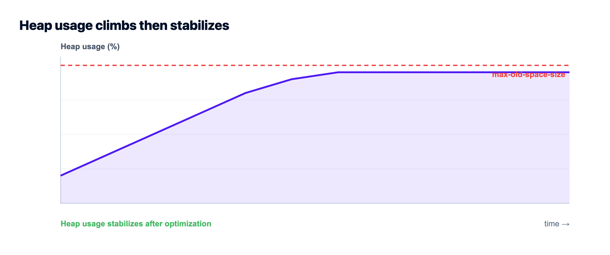

# Fix "JavaScript heap out of memory" in Node.js

*By Kloudbean Engineering · Raise the limit to confirm, then find the actual leak.*

You deploy, traffic builds, and then the log ends with `FATAL ERROR: Reached heap limit Allocation failed - JavaScript heap out of memory` and the process dies. The "JavaScript heap out of memory" error in Node.js means V8 tried to grow its heap past the limit and gave up. Raising that limit is the fast confirmation, not the cure. This guide gives you the 60-second triage, then the real fix: whether you're leaking memory or just running on a box that's too small.

> **How do I fix "JavaScript heap out of memory" in Node?** Short term, raise the ceiling to confirm it's memory and buy breathing room: `NODE_OPTIONS=--max-old-space-size=2048` (megabytes). If the crash comes back no matter how high you set it, you have a leak, not a sizing problem: take a heap snapshot, find what keeps growing (usually an unbounded cache, uncleared timers, or listeners), and fix it. If memory is stable but simply larger than the server, give it more RAM. Bumping the flag forever just delays the same crash.

## What the error actually means

Node runs on V8, and V8 keeps your objects in a managed heap with a hard ceiling. When your app allocates faster than the garbage collector can free, the heap grows toward that ceiling. Hit it, and V8 doesn't limp along, it aborts the whole process with that fatal error. So this isn't a warning you can ignore. It's a crash.

Two very different problems produce the identical message, and telling them apart is the whole game:

- **Undersized:** your app genuinely needs more memory than the machine or container gives it. Memory usage is stable, just too high for the box.
- **Leaking:** your app holds references it never releases, so memory climbs forever until it hits the wall. More RAM only buys time before the same crash.

Same symptom, opposite fixes. Guess wrong and you either overpay for a bigger server that still crashes, or you starve an app that was fine and just needed room. And read the message before you start digging: heap space is only one of the ceilings a Node process can hit, so a crash that mentions [too many open files, the EMFILE file-descriptor limit](https://www.kloudbean.com/blog/fix-emfile-too-many-open-files-node/), is a different resource running out and more RAM won't touch it.

## The 60-second triage

Before you go leak-hunting, run one experiment. Raise the heap limit and watch what happens. This tells you which of the two problems you have.

```bash
# Give V8 a bigger old-space heap, in MB. Set it where your app starts.
NODE_OPTIONS=--max-old-space-size=2048 node server.js

# or bake it into the start script (package.json)
"scripts": {
  "start": "node --max-old-space-size=2048 server.js"
}
```

Now read the result like a test:

- **It stops crashing and memory settles** at, say, 1.2GB and holds steady. You were undersized. The fix is a server with enough RAM, or trimming what you load into memory.
- **It still crashes,** just later, and climbs past whatever number you set. That's a leak. No flag value saves you. Go find it.

One caution: don't set `--max-old-space-size` higher than the RAM the machine actually has. If you tell V8 it has 8GB of heap on a 2GB box, the OS kills the process (or the container OOM-kills it) before V8 ever throws, and you lose the nice error message that was helping you.

## The real causes, and how to fix each

When it's a leak, it's almost always one of a short list of usual suspects. I've debugged the same handful more times than I can count.

**Unbounded caches and maps.** A module-level `Map` or object you keep adding to and never evict. It looks like a cache; it's a memory leak with good intentions. Fix it with a bounded cache (an LRU with a max size) or move the cache out of process into Redis.

**Listeners and timers you never clean up.** Every `setInterval`, every `emitter.on()` that's added per request and never removed, holds its closure alive. You'll often see the warning `MaxListenersExceededWarning` first. Remove listeners when you're done, and clear intervals on shutdown.

**Buffering big things into memory.** Reading a whole file, upload, or query result into a variable at once. One 500MB file becomes 500MB of heap. Stream instead: `fs.createReadStream(...).pipe(res)`, cursor-based DB reads, chunked processing. Streaming is the single biggest win for memory-heavy Node apps.

**Closures holding large scopes.** A callback that captures a big array or request object and lives on in a queue or cache keeps all of it alive. Keep only what you need.

**A genuinely bigger workload.** Sometimes there's no bug. Concurrency went up, payloads got larger, and the app honestly needs more room. That's a sizing decision, not a code fix.

## How to find the leak

Stop guessing and measure. Start with the cheapest signal and escalate.

First, log memory over time. If `heapUsed` only ever climbs, you're leaking:

```js
setInterval(() => {
  const m = process.memoryUsage();
  console.log(
    `rss=${(m.rss/1e6).toFixed(0)}MB heapUsed=${(m.heapUsed/1e6).toFixed(0)}MB`
  );
}, 30_000);
```

Then take heap snapshots and compare them. Start the app with the inspector, open `chrome://inspect` in Chrome, connect, and grab a snapshot early and another after load. The objects that grew between the two are your leak:

```bash
# start with the inspector open
node --inspect server.js

# or auto-capture a snapshot right before the crash (Node 15+)
node --heapsnapshot-near-heap-limit=2 server.js
```

For a guided view, `clinic doctor` and `clinic heapprofiler` from the Clinic.js toolkit draw the memory curve and point at the hot allocations without you reading raw snapshots. Either way, the goal is the same: find the object count that only goes up.


*A healthy app sawtooths as garbage collection frees memory and holds a plateau. A leak climbs with no recovery until it crosses the limit and the process dies.*

## Symptom to cause, fast

| What you see | Likely cause | Fix |
| --- | --- | --- |
| Memory climbs forever, never drops | Leak (unbounded cache, listeners) | Heap snapshot, bound the cache, remove listeners |
| Crash only on big files or exports | Buffering into memory | Stream with pipes / cursors |
| Stable memory, just too high | Undersized server | More RAM, or trim what's loaded |
| Crash right at startup on a small box | Heap limit above real RAM | Lower the flag, size the box to the app |
| Fine locally, dies in production | Container memory cap | Match the limit to the container, or resize |

## PM2 restarts are a seatbelt, not a fix

If you run Node under PM2, you can auto-restart a process when it crosses a memory threshold. That keeps the site up while you fix the real thing:

```js
// ecosystem.config.js: restart a worker if it passes 500MB
module.exports = {
  apps: [{ name: "api", script: "server.js", max_memory_restart: "500M" }]
};
```

Do use it. Just be honest about what it is. A restart on a leak means your users occasionally hit a dropped connection while the process recycles. It buys time; it doesn't repair the leak. Treat the alert as a to-do, not a solution.

## Why this bites harder on tiny and free tiers

A lot of "heap out of memory" crashes are really "the box is too small" in disguise. Free and micro tiers hand you very little RAM, and a Node app with a few dependencies, a cache, and real traffic can brush the ceiling fast. The two fixes that actually stick: give the app enough memory, and move memory-hungry work out of the Node process.

That second one is where a managed setup helps. On Kloudbean your Node app runs on a real server you can resize when it genuinely needs more headroom, no rebuild-from-scratch. And a managed Redis sits in the same dashboard, so the caches and session data that were bloating your heap can live in Redis instead of in-process. PM2 multi-process keeps the app running and restarts a worker if it does spike. Fewer surprise 3am crashes, and a clear place to add memory when the app has earned it.


*Move heap-heavy caching off the Node process: a managed Redis launches in the same dashboard as the app, backed up automatically.*



## What else this decision affects

Memory is one of a few things that quietly decide whether a Node app stays up. For the pieces around it, see [the PM2 process manager guide](https://www.kloudbean.com/blog/pm2-process-manager-guide/), [managed Redis hosting](https://www.kloudbean.com/blog/managed-redis-hosting/) for offloading caches, and [database connection pooling](https://www.kloudbean.com/blog/database-connection-pooling/). Choosing where to run it all in the first place? [Where to deploy a Node.js app](https://www.kloudbean.com/blog/where-to-deploy-nodejs-app/) walks the options, and [deploy a Node app to a managed cloud](https://www.kloudbean.com/blog/deploy-node-app-to-managed-cloud/) is the hands-on version.

<!-- cta:start -->
**Deploys that tell you what broke.**

Build logs stream live in the console, deployment history keeps what happened, and the logs viewer separates app errors from web requests, so a failed start is a five-minute read rather than a guessing game.

- Live build logs
- Deployment history
- Logs viewer
- Managed process restarts
- Automatic backups
- Git deploy

[Start free](https://console.kloudbean.com/register) · [See plans](https://www.kloudbean.com/pricing/)
<!-- cta:end -->

## FAQ

**What does JavaScript heap out of memory mean in Node.js?**
It means V8, the engine Node runs on, tried to grow its memory heap past the maximum it's allowed and aborted the process. It's a hard crash, not a warning. The cause is either a genuine memory leak (memory climbs forever) or an app that simply needs more RAM than the server provides.

**How do I increase the Node.js memory limit?**
Set the old-space heap size in megabytes with the flag: `node --max-old-space-size=2048 server.js`, or via `NODE_OPTIONS=--max-old-space-size=2048`. Don't set it higher than the machine's real RAM, or the OS will kill the process before V8 can. Raising the limit is a confirmation step and a stopgap, not a fix for a leak.

**Is raising --max-old-space-size a real fix?**
Only if your app was truly undersized and memory is otherwise stable. If memory keeps climbing, a higher limit just delays the same crash, because the leak is still there. Use the flag to confirm which problem you have, then either size the server correctly or fix the leak.

**How do I find a memory leak in a Node app?**
Log `process.memoryUsage().heapUsed` over time; if it only rises, you're leaking. Then take two heap snapshots with the inspector (`node --inspect`, then `chrome://inspect`), one early and one after load, and compare them. The object types that grew between snapshots are the leak. Clinic.js can draw the same picture automatically.

**What usually causes a Node.js memory leak?**
Most often an unbounded in-memory cache or map that's never evicted, event listeners or timers added and never removed, or closures that hold large objects alive. Buffering big files or query results into memory instead of streaming them is another common one. Bound your caches, clean up listeners, and stream large data.

**Why does my app run fine locally but crash in production?**
Usually the production container has a memory cap your laptop doesn't, and real traffic pushes past it. Match the heap limit to the container's memory, watch usage under load, and give it enough room. If it climbs without limit under production traffic, it's a leak that your low local traffic never triggered.

**Does more RAM fix heap out of memory?**
It fixes the undersized case and does nothing for a leak. If memory is stable but larger than the box, a server with more RAM solves it cleanly. If memory grows without bound, more RAM only lengthens the time between crashes. Diagnose first, then decide.

**Can Redis help with Node memory problems?**
Yes, indirectly and effectively. Caches, sessions, and rate-limit counters kept in a process-level object grow your heap and don't survive a restart. Moving them to Redis takes that load off the Node heap and shares it across processes. On Kloudbean a managed Redis runs in the same dashboard as the app, so it's a small change with a big memory payoff.

---

*Kloudbean Engineering · Measure the curve before you buy a bigger box.*
