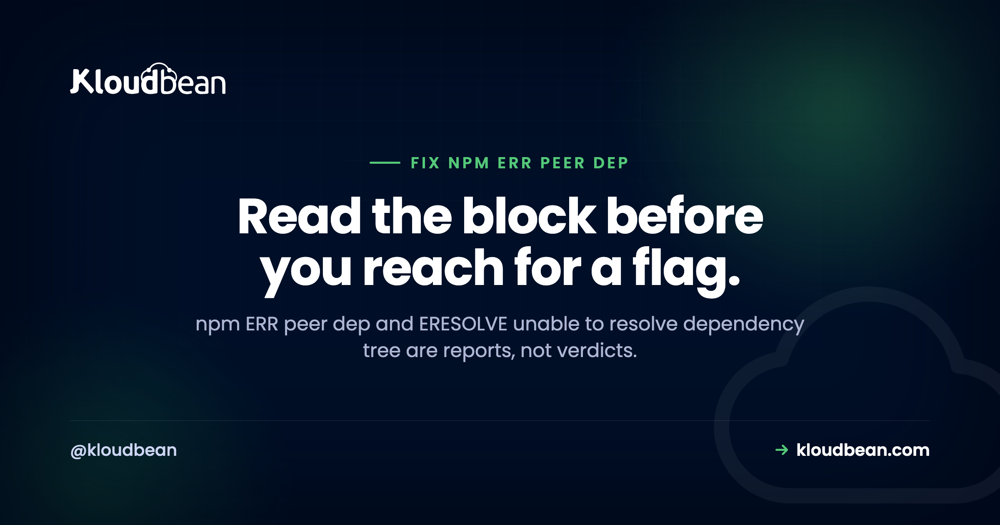

# npm ERR Peer Dep: How to Read and Fix ERESOLVE Properly
*By Kloudbean Engineering · Read the block before you reach for a flag.*



An `npm ERR peer dep` failure looks like npm blocking you for no reason. It isn't. When you get `npm ERR! ERESOLVE unable to resolve dependency tree`, npm has finished doing real work and is handing you a report: two packages in your project disagree about which version of a third package should exist, and npm won't pick a winner on your behalf. To fix ERESOLVE you mostly need to read that report properly. The skill takes about five minutes to learn and it turns this from a recurring mystery into a decision you make on purpose.

> **How do I fix npm ERR ERESOLVE unable to resolve dependency tree?**
> Read the block first. The `Found:` line is the version installed in your project; the `peer` line is the version some package demands. Then fix the real mismatch: upgrade or downgrade so the ranges overlap, or install a newer release of the complaining package that supports your version. Use `--legacy-peer-deps` only as a documented stopgap, and prefer `overrides` for a transitive pin.

## The error is a report, not a verdict

npm resolves your dependency tree before it writes anything to disk. ERESOLVE means that resolution failed: there is no single version of some package that satisfies everybody who asked for it. So npm stops and prints the conflict rather than quietly installing a tree it knows is inconsistent.

That's a feature. Older npm installed cleanly and let a library blow up weeks later against an API it was never written for. An install-time failure is cheap. A production one isn't.

## Why this started happening to old projects

Peer dependencies are how a package says "I don't bundle React, I plug into the React you already have, and it needs to be roughly this version." Older npm just warned and moved on, so mismatches sat there silently.

npm 7 changed that. From npm 7 onward, npm installs peer dependencies automatically and enforces them during resolution instead of warning about them. Nothing in your repository changed. The rules did. That's why you can clone a project that installed fine years ago, run `npm install` on a current Node release, and hit an npm peer dependency conflict straight away. The conflict was always there. You're just being told about it now.

## How to read an ERESOLVE block line by line

Here's a typical block, trimmed of noise:

```
npm ERR! code ERESOLVE
npm ERR! ERESOLVE unable to resolve dependency tree
npm ERR!
npm ERR! While resolving: my-app@1.0.0
npm ERR! Found: react@18.3.1
npm ERR! node_modules/react
npm ERR!   react@"^18.2.0" from the root project
npm ERR!
npm ERR! Could not resolve dependency:
npm ERR! peer react@"^17.0.0" from react-fancy-widget@2.1.0
npm ERR! node_modules/react-fancy-widget
npm ERR!   react-fancy-widget@"^2.1.0" from the root project
```

Four lines carry the whole story:

- **`While resolving: my-app@1.0.0`** is just context. That's your project.
- **`Found: react@18.3.1`** is reality: what your project asks for, and what npm placed in `node_modules/react`.
- **`peer react@"^17.0.0" from react-fancy-widget@2.1.0`** is the demand. `react-fancy-widget` version 2.1.0 says it needs React 17.x.
- **The `node_modules/...` paths** tell you where each requirement came from, which matters when the complainer is buried deep in the tree.

Read it as one sentence: *you have React 18, and react-fancy-widget@2.1.0 only claims to work with React 17.* Now the question isn't "how do I make npm shut up," it's "which of those two is wrong?" That question usually has an obvious answer.

Watch for this: the complaining package often isn't the one you were installing. If the error names something you've never typed, you've hit a transitive conflict. Same reading method, different fix, and `overrides` becomes relevant.

<!-- ADD IMAGE: annotated terminal screenshot of a real ERESOLVE block with arrows on the Found line and the peer line -->

## Fix npm ERR peer dep in order of correctness

Four real fixes and one bad habit. They're not equivalent, and the order matters. Work down the list, not up it.

### 1. Fix the actual version mismatch

This is the correct fix most of the time, because the error is usually telling the truth. Either your project is ahead of the package or the package is ahead of you. Move one of them:

```bash
# Option A: the package is old and you want to stay on React 18.
# Look for a version of it that supports 18 (see step 2).

# Option B: you jumped a major version too early.
npm install react@17 react-dom@17

# Check what a package actually wants before you guess
npm view react-fancy-widget peerDependencies
npm view react-fancy-widget versions --json | tail -20
```

`npm view <pkg> peerDependencies` is the command most people don't know, and it answers the question directly.

### 2. Check whether a newer release of the complaining package supports you

Often the package fixed this a while ago and your `package.json` is pinned to an old major. The maintainer shipped a version whose peer range includes React 18, and you haven't picked it up:

```bash
# What is the latest, and what does it require?
npm view react-fancy-widget version
npm view react-fancy-widget@latest peerDependencies

# Upgrade the complainer, not your framework
npm install react-fancy-widget@latest
```

Try this before you downgrade anything. Downgrading React to satisfy one widget is how projects end up two majors behind on everything.

### 3. Use --legacy-peer-deps as a deliberate stopgap

`--legacy-peer-deps` tells npm to behave the way npm 6 did: skip the peer dependency checks entirely and install anyway. It does not repair anything. It restores the older, quieter behaviour where the mismatch simply isn't checked.

```bash
npm install --legacy-peer-deps
```

Sometimes that's the right call: the package works in practice, the maintainer just hasn't widened the range, and you have a release to ship. Make it visible and temporary. Put it in the repo with a reason, not your shell history:

```ini
# .npmrc  (committed, so every developer and CI run behaves identically)
legacy-peer-deps=true
# TODO(2026-Q1): react-fancy-widget@2.1.0 peer range stops at react 17.
# Remove this once we move to react-fancy-widget@3, which supports 18.
```

A committed `.npmrc` with a dated note is a known compromise. A flag one developer types is a trap for everyone else.

The same trap has a hosting-flavoured version. Any platform that lets you set environment variables for the build, Kloudbean's console included, makes it tempting to unblock a red deploy by adding `NPM_CONFIG_LEGACY_PEER_DEPS` there and walking away. Resist that specifically. It's the same undocumented flag as your shell history, just stored somewhere even fewer people will look, and the repo still doesn't build for anyone else. Put it in `.npmrc` where a reviewer trips over it.

### 4. Pin a transitive dependency with overrides

When the conflict is deep in the tree and you can't upgrade the package that pulls it in, `overrides` in `package.json` forces one version of that dependency everywhere, and it stays in version control where reviewers see it:

```json
{
  "overrides": {
    "react": "18.3.1"
  }
}
```

You can also scope it to the one troublesome subtree:

```json
{
  "overrides": {
    "react-fancy-widget": {
      "react": "18.3.1"
    }
  }
}
```

Then reinstall so the lockfile picks it up. It beats a global flag because it's surgical: one package, one version, in the file everyone reads.

### 5. --force, which you should treat as a last resort

`--force` is not a stronger version of `--legacy-peer-deps`. It's broader. It tells npm to override its own resolution decisions and push through conflicts it flagged as genuinely unresolvable, so it can write a tree that's actually broken: incompatible copies of a package, a library calling an API that doesn't exist in the version it got. Then you're debugging a runtime error whose cause lives in `node_modules`, not your code. That's a bad afternoon.

If `--legacy-peer-deps` won't get you installed, the conflict is real, and reaching for `--force` is arguing with a correct diagnosis.

| Approach | What it does | When it's acceptable | Correctness |
|---|---|---|---|
| Upgrade or downgrade to align versions | Removes the conflict for real | Almost always the first thing to try | Best |
| Upgrade the complaining package | Picks up a wider peer range the maintainer already shipped | When you're pinned to an old major | Best |
| `overrides` in package.json | Pins one dependency, committed and reviewable | Transitive conflicts you can't upgrade past | Good, if documented |
| `--legacy-peer-deps` | Skips peer checks and installs anyway | Short-lived stopgap, committed in `.npmrc` with a reason | Tolerable, time-boxed |
| `--force` | Overrides resolution more aggressively; can install a broken tree | Rarely. Debugging, throwaway spikes | Worst |

## Why leaving --legacy-peer-deps in place is technical debt with a countdown

Here's my actual opinion, and it's a strong one: a permanent `--legacy-peer-deps` in a Dockerfile or a CI script is debt with an expiry date you didn't choose.

It works today because the mismatch happens to be harmless today. Nothing keeps it harmless. One minor bump later, the failure won't say "peer dependency." It'll be something unrelated three layers deep in a stack trace, and nobody will connect it to a flag added months earlier.

Fix the version. Don't silence the check. If you must silence it, leave a date and a reason so the next person knows they can remove it.

<!-- ADD IMAGE: side by side, a local install succeeding with a warm node_modules and a clean CI install failing on the same commit -->

## The CI trap: it works locally, then fails on a clean install

This one burns hours. You hit ERESOLVE, run `npm install --legacy-peer-deps`, everything works, you push. The build fails.

On your machine `node_modules` already exists in a working state, so day-to-day commands never redo the resolution that failed. CI has none. It installs from scratch, from your committed files only, and knows nothing about the flag you typed. Same commit, different starting conditions.

Which gives you the actual rule: **the fix has to live in `package.json`, `package-lock.json`, or a committed `.npmrc`.** If the only record of it is one developer's terminal, it isn't a fix. It's a local workaround that will fail for every teammate and every build.

Worth checking your own repo:

```bash
# Reproduce what CI does, on your machine
rm -rf node_modules
npm ci

# If that fails but "npm install" succeeds, your fix isn't committed.
```

A Git-based deploy is CI whether you call it that or not. Kloudbean's managed CI/CD installs from your committed files on every push, so the deploy is a clean strict install by design, and that's a feature rather than an obstacle: it fails on the machine you can watch instead of succeeding by accident and drifting away from what you tested. The build log streams live in the console, which is where you'll read the full ERESOLVE block rather than a red badge.

This class of "works here, breaks there" bug is everywhere in Node deploys. Same shape as the case-sensitivity trap behind [Error: Cannot find module](https://www.kloudbean.com/blog/fix-cannot-find-module-node/), and a frequent cause of a [Node app crashing on deploy](https://www.kloudbean.com/blog/fix-node-app-crashing-on-deploy/).

## npm ci versus npm install, and why the lockfile matters

These two commands are not interchangeable, and the difference is exactly why peer conflicts surface in builds.

| | `npm install` | `npm ci` |
|---|---|---|
| Reads | `package.json`, may update the lockfile | `package-lock.json` only |
| Resolution | Re-resolves and can pick new versions | Installs exactly what's locked |
| `node_modules` | Patches what's there | Deletes it and installs clean |
| Lockfile mismatch | Updates the lockfile | Fails immediately |
| Use it for | Adding or changing dependencies | CI and production installs |

`npm ci` refusing to proceed when the lockfile disagrees with `package.json` is the point of it. That strictness is what keeps production matching what you tested. So resolve the conflict locally with `npm install`, commit the updated lockfile, then confirm `npm ci` works on a clean tree. That third step is the one people skip.

## The anti-pattern: deleting package-lock.json to make it go away

Sooner or later someone suggests deleting the lockfile. It appears to work, and it's the worst move on this page.

The lockfile records the exact tree you tested against. Delete it and npm re-resolves everything from your ranges, so you can pick up newer versions of packages you never meant to touch, and CI ends up with a different tree from yours. You've traded a specific error for an install that isn't reproducible, and the conflict usually returns anyway.

If you must rebuild the tree, do it deliberately and commit the result:

```bash
# deliberate, reviewed, and committed
rm -rf node_modules
npm install
git add package.json package-lock.json
git commit -m "resolve react peer conflict: bump react-fancy-widget to 3.x"
```

The commit message matters. Six months from now it's the only explanation anyone will have.

<!-- ADD IMAGE: decision tree, read the block then upgrade the complainer, align versions, use overrides, or a time-boxed legacy-peer-deps -->

## A short checklist

1. Read `Found:` and `peer`. Say the conflict out loud as one sentence.
2. Run `npm view <package> peerDependencies` so you're working from facts.
3. Is there a newer release of the complaining package? Upgrade that first.
4. Otherwise align versions properly, up or down.
5. Transitive conflict you can't reach? Add a scoped `overrides` entry.
6. Truly blocked? Commit `legacy-peer-deps=true` in `.npmrc` with a dated reason.
7. Commit `package.json` and `package-lock.json`, then verify with a clean `npm ci`.
8. Skip `--force`.

## How to prove the conflict is fixed rather than just quiet

Almost every bad outcome on this page comes from stopping too early. The install printed no red text, so the work felt done. Quiet is not the same as resolved, and there are three specific tests that tell them apart.

**First, reproduce the strict install locally.** Your warm `node_modules` is hiding the answer, so throw it away and let npm resolve from committed files only:

```bash
rm -rf node_modules
npm ci
```

If that fails while `npm install` succeeds, whatever you did isn't in the repository. Stop and put it there.

**Second, check that a reviewer can see the compromise.** Open the diff. A version bump, an `overrides` block, or an `.npmrc` line with a dated reason all survive a code review. A flag in your shell, in one machine's global npm config, or in a build environment variable does not, and a fix nobody can find is a fix that gets re-broken.

**Third, let a clean machine be the judge.** This is the part where a Git-based deploy earns its keep: it installs from your committed files with no history, which is exactly the condition your laptop can't reproduce convincingly. On Kloudbean that install runs on every push with the build log streaming beside deployment history, so a conflict shows up as the actual `Found:` and `peer` lines you can act on, and a passing build is meaningful evidence rather than a hopeful sign. If you'd rather see it fail before it deploys, run the same clean install in a pre-push check.

Now the part hosting cannot do, and this one is worth saying plainly because the temptation is real. No platform resolves a version conflict for you. If `react-fancy-widget@2` genuinely does not support React 18, that stays true on every build machine ever made, and a build that goes green because someone globally disabled peer checks is not a fixed dependency tree, it's an unobserved one. The decision, upgrade the complainer, align the versions, scope an override, or accept a dated stopgap, is a judgement about your own code. All a good platform does is show you the real error and run the strict install honestly.


## If npm ERR Peer Dep keeps coming back

For a build that runs the same way every push, see [CI/CD auto-deploy from GitHub](https://www.kloudbean.com/blog/ci-cd-auto-deploy-from-github/). If the install works but the app can't find something, read [Error: Cannot find module](https://www.kloudbean.com/blog/fix-cannot-find-module-node/). Builds dying mid-install are often memory: [JavaScript heap out of memory](https://www.kloudbean.com/blog/fix-javascript-heap-out-of-memory-node/). For config drift between local and production, [environment variables done right](https://www.kloudbean.com/blog/environment-variables-done-right/), and to place the whole thing, [deploy a Node app to managed cloud](https://www.kloudbean.com/blog/deploy-node-app-to-managed-cloud/).

**See the build log, not just the failure.** Deploy your Node app from Git with managed CI/CD that streams live build logs and keeps deployment history, so install errors are readable while you're fixing them. From $8/mo. Start at [kloudbean.com](https://www.kloudbean.com/).

Git deploys · Live build logs · Deployment history · Free SSL · From $8/mo

## FAQ

### What does npm ERR ERESOLVE unable to resolve dependency tree mean?
npm could not find one version of a package that satisfies everyone requiring it, so it stopped before writing anything. The `Found:` line shows what your project installs; the `peer` line shows what another package demands. It's a report of a real disagreement, not npm being fussy.

### Is --legacy-peer-deps safe to use?
It's safe in the narrow sense that it installs the tree older npm would have, skipping peer checks rather than breaking anything. As a permanent setting it isn't, because the mismatch it hides is still there and a later version bump can turn it into a confusing runtime error. Use it briefly, commit it in `.npmrc` with a reason, and remove it.

### What is the difference between --legacy-peer-deps and --force?
`--legacy-peer-deps` skips peer dependency checking and installs anyway. `--force` is broader: it overrides npm's resolution decisions more aggressively and can produce a genuinely broken tree. If `--legacy-peer-deps` won't install, the conflict is real, and `--force` only moves the failure to runtime.

### Why did npm install work last year and fail now?
Because npm's behaviour changed, not your code. From npm 7 onward it installs peer dependencies automatically and enforces them during resolution, where older npm only warned. The conflict existed before, silently tolerated. A current npm reports it as an error.

### Why does the peer dependency error only happen in CI?
Because your machine already has a working `node_modules`, so day-to-day commands don't redo the resolution that fails. CI installs from scratch using only your committed files, and it doesn't know about a flag you typed locally. Reproduce it by deleting `node_modules` and running `npm ci`.

### How do I use overrides in package.json to fix a peer dependency conflict?
Add an `overrides` block naming the dependency and the version you want forced, then reinstall so the lockfile updates. Scope it under the package causing trouble and the rest of the tree stays untouched. Better than a global flag: precise, and reviewable.

### Should I delete package-lock.json to fix ERESOLVE?
No. The lockfile keeps your install reproducible and production matching what you tested. Deleting it re-resolves every dependency, so you silently pick up versions you never intended, and the conflict usually returns anyway. Resolve it, then commit the updated lockfile.

### Does npm ci respect legacy-peer-deps?
Yes, when it's in a committed `.npmrc` or passed as a flag. But it won't tolerate a lockfile that disagrees with `package.json`, which is why the real fix has to be committed. It installs exactly what's locked and fails fast otherwise.

### How do I find which package is causing the peer conflict?
The `peer ... from <package@version>` line names it, and the `node_modules/...` path below shows where it sits. If you never installed it, it came in transitively, and `npm ls <name>` shows the chain. Then check its range with `npm view <name> peerDependencies`.

*Kloudbean Engineering · Fix the version, don't silence the check.*
