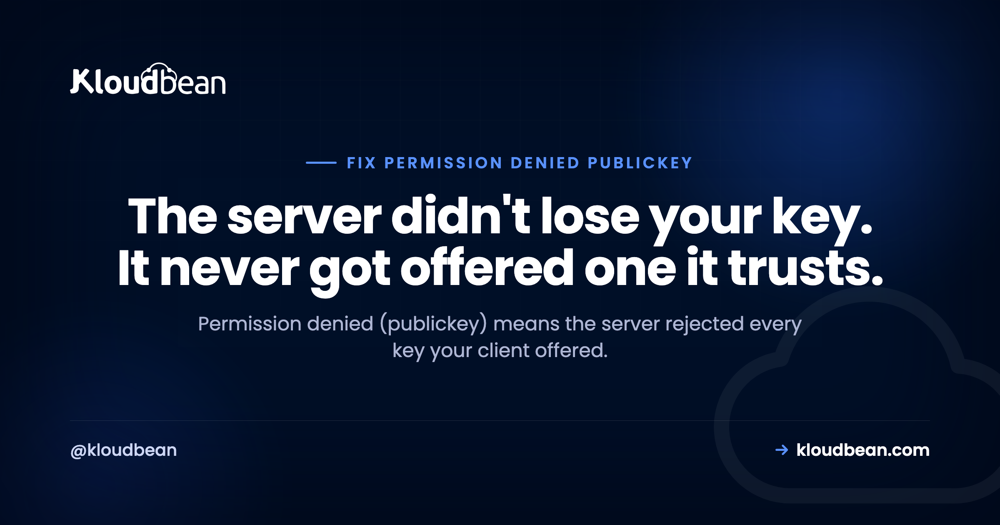
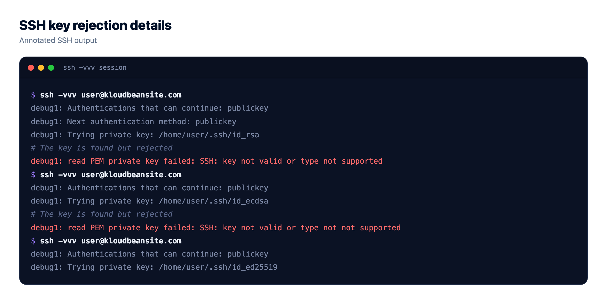
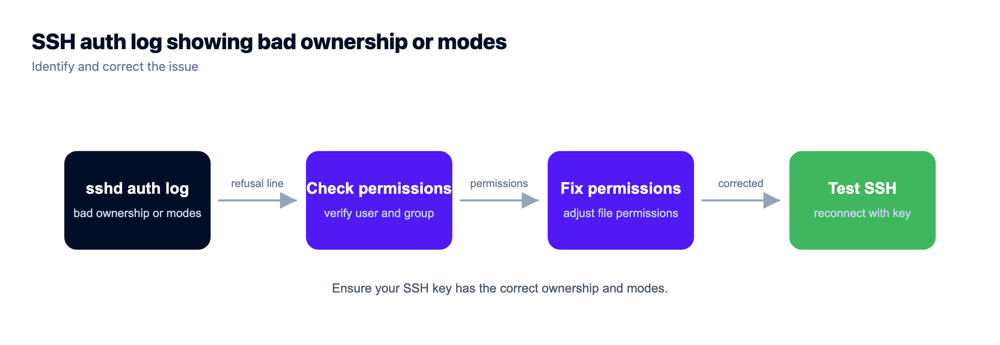
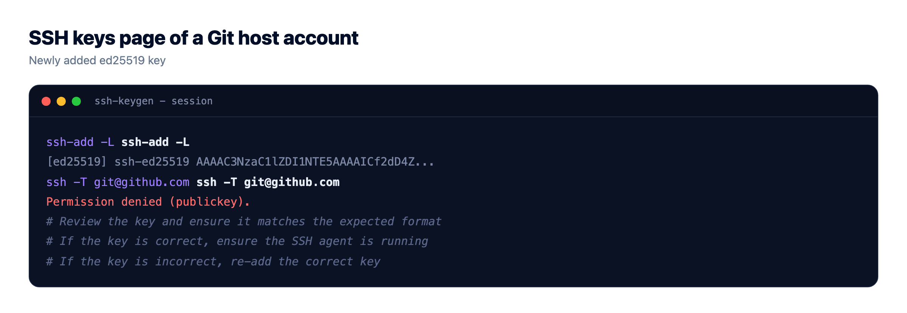

# Permission denied (publickey): How to Fix SSH Key Rejection

*By Kloudbean Engineering · The server didn't lose your key. It never got offered one it trusts.*



You type your usual `ssh` command and get back one flat line: `Permission denied (publickey).` No hint, no retry, no password prompt. That's SSH telling you it finished the authentication conversation and the server refused every credential your client put forward. So the useful question isn't "why is my SSH key not working," it's "which key did my client actually offer, and what did the server say about it?" Answer that and the fix takes a minute. Guess at it and you'll spend an hour regenerating keys you didn't need to touch.

> **How do I fix SSH permission denied (publickey)?**
> Run `ssh -vvv user@host` first. The verbose log shows exactly which keys your client offered and how the server answered, which is the whole diagnosis. From there it's usually one of five things: the right key isn't loaded, the public key isn't in the server's `authorized_keys`, permissions on `~/.ssh` are too loose, you're using the wrong username, or the key type is disabled.

## What Permission denied (publickey) really means

SSH authentication is a negotiation. Your client says which methods it can use, the server says which it accepts, and then the client offers credentials one at a time. When the server accepts *only* public-key auth and none of your offered keys match an authorized one, the negotiation ends and you get that single line.

Two things follow. The network is fine: you reached the SSH daemon and got a policy decision back, so stop checking firewalls and DNS. And no password prompt appeared because the server never advertised password auth. That's usually deliberate hardening, not a bug.

If you want the underlying model of how key auth works before you debug it, our walkthrough of [SSH key authentication](https://www.kloudbean.com/blog/ssh-key-authentication/) covers the setup properly. This page is about the moment it stops working.

## Step one: run ssh -vvv and read the offer

Verbose mode is the entire trick. Three `v`s gives you the key exchange, the identity files considered, each offer, and the server's response:

```bash
ssh -vvv ubuntu@203.0.113.10
```

You don't need to read all 120 lines. Scan for four patterns:

```text
# 1. Which identity files the client will consider
debug1: identity file /Users/you/.ssh/id_ed25519 type 3
debug1: identity file /Users/you/.ssh/id_rsa type -1     <- type -1 means the file was not found

# 2. Which methods the server will accept
debug1: Authentications that can continue: publickey

# 3. Each key actually offered, and the answer
debug1: Offering public key: /Users/you/.ssh/id_ed25519 ED25519 SHA256:abc123...
debug1: Authentications that can continue: publickey        <- that key was rejected
debug1: No more authentication methods to try.

# 4. The verdict
you@203.0.113.10: Permission denied (publickey).
```

The single most valuable line is `Offering public key:`. If it never appears, your client offered nothing, so the server was never the problem. If it appears with a path you didn't expect, you're offering the wrong key. If it appears with the right key and the server still refuses, the problem lives on the server side, in `authorized_keys` or in permissions.

| What you see in -vvv | What it means | Fix |
| --- | --- | --- |
| No `Offering public key` line at all | Client had no usable identity to send | `ssh-add` the key, or pass `-i` |
| `identity file ... type -1` | That key file doesn't exist | Point at the key that does exist |
| Offers several keys, all rejected | Agent is spraying keys; none are authorized | `-i key -o IdentitiesOnly=yes` |
| Right key offered, still rejected | Not in `authorized_keys`, or permissions too loose | Re-add the key, tighten modes to 700/600 |
| `send_pubkey_test: no mutual signature algorithm` | Key type disabled by the server | Use an ed25519 key, or enable rsa-sha2 |
| Server offers `publickey,password` | Password auth exists as a fallback | Different failure; check the username |



## Cause 1: your client is offering the wrong key, or none

This is the most common one on a laptop that has collected keys over the years. Check what your agent is holding:

```bash
ssh-add -l
# The agent has no identities.   <- nothing to offer
# 256 SHA256:abc123... you@laptop (ED25519)

ssh-add ~/.ssh/id_ed25519         # load it
ssh-add -D                        # clear everything and start clean
```

There's a subtler version of this. If the agent holds six keys, SSH offers them in turn, and some servers cut you off after a handful of failed attempts (`MaxAuthTries` defaults to 6). You then get denied while holding the correct key, because your turn never came. Force a single identity:

```bash
ssh -i ~/.ssh/deploy_key -o IdentitiesOnly=yes ubuntu@203.0.113.10
```

`IdentitiesOnly=yes` matters more than people expect. Without it, `-i` is a suggestion: the agent still offers its own keys alongside yours. Once it works, write it down in `~/.ssh/config` so you never rely on memory:

```text
Host prod
  HostName 203.0.113.10
  User ubuntu
  IdentityFile ~/.ssh/deploy_key
  IdentitiesOnly yes
```

## Cause 2: the public key isn't on the server

Keys live in the account's own `~/.ssh/authorized_keys` on the server. Not in root's copy, not in some other user's. If you can still reach the box another way, compare the fingerprint you offered against what's authorized. And "another way" matters here: on a managed platform like Kloudbean, SSH keys for a server are attached from the dashboard, so adding a key doesn't require already having a working login to that server. That's the difference between a five-minute annoyance and a rebuild.

```bash
# Fingerprint of your local public key
ssh-keygen -lf ~/.ssh/id_ed25519.pub

# Fingerprints of every key the server trusts for this account
ssh-keygen -lf ~/.ssh/authorized_keys
```

If your fingerprint isn't in that list, the server has never trusted this key. Add it with the tool built for the job, which appends instead of overwriting and sets the modes correctly:

```bash
ssh-copy-id -i ~/.ssh/id_ed25519.pub ubuntu@203.0.113.10
```

When you have to paste by hand, paste carefully. A public key is one line. Editors and chat apps love to wrap it, and a wrapped key silently never matches: sshd reads a broken first line, finds no valid key, and denies you with no explanation. Check for it directly:

```bash
# One key per line? Count them.
wc -l ~/.ssh/authorized_keys
grep -c '^ssh-' ~/.ssh/authorized_keys   # these two numbers should agree
```

## Cause 3: permissions, the silent killer

Here's the one that makes people think SSH is haunted. The key is correct, it's in `authorized_keys`, and the server still refuses. sshd deliberately ignores key files when their permissions are too permissive, because a world-writable or group-writable `authorized_keys` means anyone with local write access could grant themselves a login. It's a safety rule, and it fails closed and quietly.

Group-writable home directories catch people constantly. If your home is `775` and you belong to a group someone else is in, sshd treats the whole chain as untrustworthy and skips your keys.

| Path | Required mode | Why |
| --- | --- | --- |
| `~` (home directory) | `755` or tighter, never group-writable | A writable parent means the .ssh directory can be swapped |
| `~/.ssh` | `700` | Only the owner may list or change the key store |
| `~/.ssh/authorized_keys` | `600` | Only the owner may add a trusted key |
| `~/.ssh/id_ed25519` (private key) | `600` | Your client refuses to use a readable private key |
| Ownership of all of the above | The login user, not root | Files owned by root are ignored for that account |

```bash
chmod 755 ~
chmod 700 ~/.ssh
chmod 600 ~/.ssh/authorized_keys
chown -R ubuntu:ubuntu /home/ubuntu/.ssh
```

Never reach for `chmod 777` to make this go away. It won't: sshd will keep ignoring the file, and now every account on the box can rewrite who gets in. Loosening permissions is the opposite of the fix. If you want the reasoning behind the rest of the SSH surface, the [server hardening checklist](https://www.kloudbean.com/blog/server-hardening-checklist/) walks through it.

On the server, `sudo journalctl -u ssh -n 50` (or `/var/log/auth.log`) is where sshd says the quiet part out loud, with lines like `Authentication refused: bad ownership or modes for directory /home/ubuntu`. The client never sees that. Only the server log does.



## Cause 4: you're logging in as the wrong user

Every distro image picks a different default account, and your key is authorized for that one account only: `ubuntu` on Ubuntu, `debian` on Debian, `ec2-user` or `admin` elsewhere. Log in as `root` when the key lives in `/home/ubuntu/.ssh` and you're denied, because root's `authorized_keys` is a different file. Most images also ship with `PermitRootLogin` disabled, which is the right default. Do admin work through `sudo` from a normal account. The cheap test is to try the likely names first:

```bash
for u in ubuntu debian admin ec2-user root; do
  ssh -o BatchMode=yes -o ConnectTimeout=5 $u@203.0.113.10 true 2>/dev/null \
    && echo "works: $u"
done
```

## Cause 5: the key type is disabled on newer OpenSSH

OpenSSH 8.8 turned off the `ssh-rsa` signature algorithm by default, the one that uses SHA-1. An old RSA key that worked for years can start getting refused the day a server is upgraded, with the same unhelpful message. The tell in `-vvv` looks like this:

```text
debug1: send_pubkey_test: no mutual signature algorithm
```

The right fix is a modern key. Generate one, authorize it, and retire the old one:

```bash
ssh-keygen -t ed25519 -C "you@laptop"
ssh-copy-id -i ~/.ssh/id_ed25519.pub ubuntu@203.0.113.10
```

If you must get in with the legacy key right now, you can re-enable the algorithm for that one connection, then replace the key properly:

```bash
ssh -o PubkeyAcceptedAlgorithms=+ssh-rsa ubuntu@203.0.113.10
```

Treat that as a bridge, not a setting. RSA keys aren't the problem; SHA-1 signatures are, and they were disabled for good reason.

## What this error is not

Two failures get mixed up with this one. Host key warnings (`REMOTE HOST IDENTIFICATION HAS CHANGED`) are about the *server's* identity, not yours, and they're usually a rebuilt box whose stale entry needs removing with `ssh-keygen -R hostname`. Verify the new fingerprint out of band before you accept it, and don't disable host key checking to make the warning stop. That's the check that catches an impostor. And `Permission denied (publickey,password)` is a different animal: the server does accept passwords, so your credential or username is simply wrong. Turning password auth back on is a weaker fallback than keys, so if you use it to recover, use it briefly and switch back once your key works.

## The Git case: git@github.com Permission denied (publickey)

Same error, different surface. `git push` fails with `git@github.com: Permission denied (publickey). fatal: Could not read from remote repository.` The username here is always `git`, so don't change it. What's missing is your public key on the Git host account. Test the connection on its own, away from Git:

```bash
ssh -T git@github.com
# Hi you! You have successfully authenticated, but GitHub does not provide shell access.
```

If that greets you by name, SSH is fine and your problem is repository access or a wrong remote URL. If it denies you, add the contents of `~/.ssh/id_ed25519.pub` to your account's SSH keys and try again. Two more traps worth knowing: an HTTPS remote won't use your key at all (`git remote -v` will show it), and a deploy key authorized on one repository won't work for another. Once you're back in, our notes on [deleting and renaming Git branches](https://www.kloudbean.com/blog/git-delete-and-rename-branch/) cover the cleanup that usually follows a stalled push.



## Keep a second way in before you need one

Here's the opinion I'd argue for: the safest recovery from an SSH lockout is the one you set up before you were locked out. This error is unnerving because the standard fix needs the access you just lost. Build the second path while you still have the first: a console you've tested at least once, a second authorized key on another machine, or a teammate whose key is already on the box.

The anti-pattern that turns an annoyance into an outage: editing `sshd_config` and restarting the daemon while that session is your only way in. If the config has a typo, sshd won't come back and you're finished. Validate first, and keep the old session open while you test a new one in a second terminal:

```bash
sudo sshd -t                      # syntax check, says nothing if valid
sudo systemctl reload ssh         # reload keeps existing sessions alive
# now open a SECOND terminal and prove you can still log in
```

The other quiet trap is the pasted key with a line break in it, mentioned above. It looks right in the file and never matches. Both mistakes have the same root: changing your access path without a verified fallback.

One structural way to need SSH less often: the routine jobs people keep a shell around for don't have to run through a shell. [Cron from the UI](https://www.kloudbean.com/blog/run-a-cron-job-without-ssh/), env vars and runtime settings in the console, and deploys triggered from Git all work without a session, and Kloudbean does those from the dashboard. Fewer people needing shells means fewer keys to keep straight, and scoped subuser access means one teammate's broken laptop isn't everybody's outage.

## Locked out right now? What's actually recoverable, in order

Work down this list and stop at the first one that's true. The order matters, because each step costs more than the one above it.

1. **An open session on the box.** If any terminal is still connected, that's your fix window. Don't close it. Repair `authorized_keys`, ownership and modes from there, and prove a new login works in a second terminal before you let the first one go.
2. **A second authorized key, on another machine or a teammate's laptop.** Cheap, boring, and the reason most lockouts end in four minutes.
3. **Key management at the platform layer.** If your host attaches SSH keys to the server from a dashboard rather than requiring you to already be inside, you can add a fresh key and log in again. On Kloudbean that's on the server screen, and it's the difference between a lockout and a rebuild.
4. **A snapshot or backup.** Restore, get in, then fix properly. Slow and disruptive, but your data survives. This is why backups matter to an access problem at all.
5. **Nothing above is true.** Then you're rebuilding the server and restoring data onto it.

The honest part: no host fixes step 5 for you, ours included. Support can hand you a console or attach a key, nobody can recover a private key you never had a copy of, and no provider can authenticate you when you've deleted the only trusted key and disabled password auth. Access recovery is something you provision in advance or do without. Spend the four minutes now on a second key and a tested console, while nothing is broken.

## More on permission denied (publickey)

For the concepts underneath the error, read [SSH key authentication](https://www.kloudbean.com/blog/ssh-key-authentication/) and, when you need to reach a service that isn't publicly exposed, [what an SSH tunnel is](https://www.kloudbean.com/blog/what-is-an-ssh-tunnel/). Keys are credentials, so [secrets management](https://www.kloudbean.com/blog/secrets-management/) applies to them the same as API tokens.

<!-- cta:start -->
**Fewer mysteries on the next deploy.**

Build logs stream live in the console, deployment history keeps what happened, and the logs viewer separates app errors from web requests, so a failed start is a five-minute read rather than a guessing game.

- Live build logs
- Deployment history
- Logs viewer
- Managed process restarts
- Automatic backups
- Git deploy

[Start free](https://console.kloudbean.com/register) · [See plans](https://www.kloudbean.com/pricing/)
<!-- cta:end -->

## FAQ

**What does Permission denied (publickey) mean?**
It means the SSH server accepted only public-key authentication and rejected every key your client offered. You reached the server and completed the protocol, so it isn't a network or DNS problem. It's a policy decision: none of the offered keys matched an authorized one for that account.

**How do I see which SSH key was actually offered?**
Run `ssh -vvv user@host` and look for lines beginning `Offering public key:`. Each one names the exact file that was sent. If no such line appears, your client had nothing to offer, which usually means the key isn't loaded in the agent or isn't specified with `-i`.

**Why is my SSH key not working after it worked yesterday?**
The usual causes are an agent that lost its keys after a reboot, a rebuilt server whose `authorized_keys` no longer has your key, permissions changed on your home directory or `.ssh`, or a server upgrade that disabled old RSA-SHA1 keys. The verbose log tells you which of those it is in a few seconds.

**What permissions do SSH keys and authorized_keys need?**
Set `~/.ssh` to 700 and `~/.ssh/authorized_keys` to 600, both owned by the login user, and keep the home directory itself no looser than 755 and never group-writable. sshd deliberately ignores key files when permissions are too open, and it does so without telling the client, which is why the error looks so mysterious.

**Should I use chmod 777 to fix SSH permission errors?**
No. It makes things worse, not better. sshd will still refuse the key because the permissions are too permissive, and now every local account can rewrite who has access. The correct direction is tighter: 700 on the directory, 600 on the files, owned by the right user.

**How do I fix git@github.com Permission denied (publickey)?**
Test the connection with `ssh -T git@github.com`. If it denies you, add the contents of your public key file to the SSH keys section of your Git host account, then retry. Keep the username as `git`, and check `git remote -v`, because an HTTPS remote ignores your SSH key entirely.

**Why does SSH not even prompt me for a password?**
Because the server didn't advertise password authentication as an available method. When only `publickey` is offered, there's nothing to prompt for, so SSH fails immediately. That's a hardened default. Password auth is a weaker fallback than keys, so if you enable it to recover access, treat it as temporary.

**Can I get locked out of my server permanently by this error?**
Rarely, if you prepared. A provider console, serial console, a second authorized key on another machine, or a teammate's key all give you a path back in. Set at least one of those up before you edit SSH config, since the fix for a lockout normally needs the access you just lost.

**Why does specifying -i still offer the wrong key?**
Because `-i` adds a key to the list rather than replacing it, so your agent's keys are still offered too. Add `-o IdentitiesOnly=yes` to send only the key you named. That also avoids hitting the server's limit on failed attempts before your correct key gets its turn.

*Kloudbean Engineering · Read the verbose log before you regenerate a single key.*
