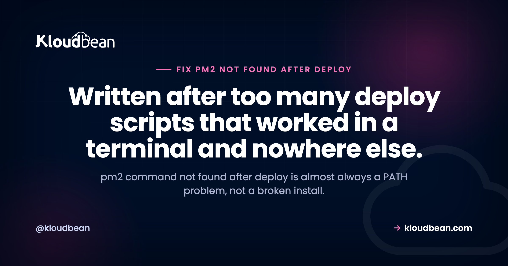

# pm2: command not found After Deploy: Fix the PATH, Not the Install

By Kloudbean Engineering · Written after too many deploy scripts that worked in a terminal and nowhere else.

Your deploy script ends with `pm2 reload app` and the log says `pm2: command not found`. You SSH into the same server, type the same command, and it runs perfectly. So you reinstall PM2. Nothing changes. Here's the thing you need to know before you touch npm again: `pm2 command not found` is almost never an install problem. It's a PATH problem wearing an install costume. The binary exists. The shell running your deploy just can't see it, because a non-interactive shell loads a different environment than the one you get when you log in.

> **Why does pm2 say command not found after deploy?**
> Because the shell running your deploy script or cron job doesn't load the same PATH as your interactive login shell, so the global PM2 binary isn't on it. PM2 is usually installed fine. Start with `command -v pm2` inside the failing context, not in your own terminal, then compare it to `npm bin -g`. Fix it by calling the absolute path or setting PATH in the script.

## Interactive shells and non-interactive shells are not the same machine

This is the whole explanation, so it's worth being precise about it.

When you SSH in and get a prompt, you start a login shell. It reads your profile files, typically `~/.bash_profile` or `~/.profile`, and usually `~/.bashrc` too. Those files are where a Node version manager like nvm, fnm, asdf, or Volta injects itself. That injection is what puts a directory such as `~/.nvm/versions/node/v20.11.1/bin` onto your PATH. PM2 lives there.

Now run a script over SSH non-interactively, or from cron, or as a CI step. That shell is not a login shell and often not even bash. Most `.bashrc` files bail out early for non-interactive use, with a guard near the top like this:

```
# very common near the top of ~/.bashrc
case $- in
    *i*) ;;
      *) return;;
esac
```

Everything below that line never runs. No nvm init, no PATH additions. Your shell falls back to a bare default, often `/usr/bin:/bin` plus a couple of sbin directories, and `pm2` is not in any of them. The binary is on disk. The lookup just fails.

Cron is the strictest version of this. It gives you a minimal PATH and does not read your profile at all. Which is why the same script that works when you paste it into a terminal fails silently at 3am.

| Where it fails | What's really happening | The fix |
|---|---|---|
| Deploy script over SSH | Non-interactive shell skips .bashrc, so the version manager never initialises | Set PATH explicitly in the script, or call the absolute path |
| Cron job | Minimal PATH, no profile files read at all | Absolute path, or a PATH= line at the top of the crontab |
| CI step (GitHub Actions, GitLab CI) | Fresh environment on a different machine or user, PM2 was never installed there | Install it in the job, or run it on the target host over SSH with a full path |
| Works as you, fails as root or deploy user | PM2 was installed into one user's home directory only | Install for the user that actually runs it, or use a shared global prefix |
| pm2 exists but the app won't start | Different bug. PM2 was found and your app is crashing | Read the logs, that's a crash loop not a PATH issue |

<!-- ADD IMAGE: terminal split view. Left: interactive SSH session where `which pm2` prints a path. Right: the same command inside a non-interactive script printing nothing. src -> images/interactive-vs-script.png -->

## Prove whose environment is broken

Before changing anything, find out where PM2 actually lives and which environment can see it. Run these in your interactive session first:

```
# Where is the binary, according to your shell?
which pm2
command -v pm2

# Where does npm put global packages and their binaries?
npm root -g          # e.g. /home/deploy/.nvm/versions/node/v20.11.1/lib/node_modules
npm bin -g           # e.g. /home/deploy/.nvm/versions/node/v20.11.1/bin

# What does your interactive PATH look like?
echo $PATH
```

Note that `npm bin -g` was removed in npm 9. If it errors, use `npm prefix -g` and append `/bin`, or just read the parent of `npm root -g`.

Now run the same lookup in the environment that's actually failing. This is the step people skip, and it's the one that answers the question:

```
# What does a NON-interactive shell see? (note: no login)
ssh deploy@server 'command -v pm2; echo "PATH=$PATH"'

# What does a specific user's LOGIN environment see?
sudo -u deploy -i which pm2

# What does cron see? Add this line temporarily to the crontab:
* * * * * /usr/bin/env > /tmp/cron-env.txt 2>&1
```

If `sudo -u deploy -i which pm2` prints a path but `ssh deploy@server 'command -v pm2'` prints nothing, you have confirmed it: right user, wrong shell type. If neither prints anything, PM2 was installed for a different user entirely. Those are two different bugs with two different fixes, and this pair of commands separates them in about ten seconds.

## The four causes, in the order you should suspect them

### 1. PM2 is installed for a different user than the one running the deploy

You installed PM2 as `ubuntu` or as yourself. Your deploy runs as `root`, or as a dedicated `deploy` user, or as `www-data`. Global npm installs under a version manager land inside that user's home directory, so they are not global in any meaningful sense. They're global to one user.

Worse, this cause has a nasty tail: if you started the app as one user and your deploy reloads as another, each user gets its own PM2 daemon and its own process list. You end up with two copies of your app running, both bound to the same port, and one of them losing. Check with:

```
# List every pm2 daemon on the box
ps aux | grep -i 'PM2 v'

# Compare what each user thinks is running
sudo -u deploy -i pm2 list
sudo -i pm2 list
```

Pick one user to own the app, permanently. Write it down in the repo. Everything else follows from that decision.

### 2. A Node version manager whose shims are not on the non-interactive PATH

nvm is the classic. It's a shell function, not a binary, and it only exists after `~/.nvm/nvm.sh` is sourced by an interactive shell. asdf and Volta use shim directories that get prepended to PATH by the same profile files. None of that happens in automation.

The trap inside the trap: version managers switch versions. The path `~/.nvm/versions/node/v20.11.1/bin/pm2` stops existing the moment you install Node 22 and make it your default. Anything hardcoded to the old path breaks, quietly.

### 3. Cron or a CI step with a minimal PATH

Cron gives you something close to `/usr/bin:/bin` and nothing else. Not your profile, not your version manager, not even your working directory. CI is a different flavour of the same problem: the job runs on a fresh runner where PM2was never installed, so the correct move is usually to SSH into the target host and run the command there rather than expecting the runner to have PM2 at all.

### 4. PM2 is installed locally in the project, not globally

If PM2 is in your `devDependencies`, the binary sits at `./node_modules/.bin/pm2`. That directory is only on PATH inside an npm script. Type `pm2` at a shell prompt in the same folder and you'll get command not found, correctly. And if your build ran with `npm ci --omit=dev` or `NODE_ENV=production`, the dev dependency wasn't installed at all, so it's genuinely missing.

```
# Is it local?
ls node_modules/.bin/pm2

# Then run it through npx or the npm bin path
npx pm2 reload ecosystem.config.js
# or
./node_modules/.bin/pm2 reload ecosystem.config.js
```

<!-- ADD IMAGE: annotated screenshot of a failing deploy log with the pm2: command not found line highlighted, and the surrounding script lines visible. src -> images/deploy-log-failure.png -->

## Fixes for pm2 command not found, most robust first

### Call the absolute path

Boring, and the most reliable thing you can do in automation. Find the real path once, then use it:

```
# Find it (as the user that will run it)
sudo -u deploy -i command -v pm2
# /home/deploy/.nvm/versions/node/v20.11.1/bin/pm2

# Use it in the deploy script
/home/deploy/.nvm/versions/node/v20.11.1/bin/pm2 reload ecosystem.config.js
```

If you're on a version manager, prefer a stable symlink over a version-specific path so a Node upgrade doesn't break the script. On Debian and Ubuntu, `update-alternatives` or a plain symlink into `/usr/local/bin` both work, as long as you accept that the symlink is now a thing you maintain.

### Set PATH explicitly at the top of the script

My preference for anything longer than one command, because it fixes `node`, `npm`, and `pm2` in one line instead of prefixing three absolute paths:

```
#!/usr/bin/env bash
set -euo pipefail

# Make the environment explicit. Do not inherit it and hope.
export PATH="/home/deploy/.nvm/versions/node/v20.11.1/bin:$PATH"
export NODE_ENV=production

cd /var/www/app
git pull --ff-only
npm ci --omit=dev
pm2 reload ecosystem.config.js --update-env
pm2 save
```

For cron, put it in the crontab itself so every job inherits it:

```
PATH=/home/deploy/.nvm/versions/node/v20.11.1/bin:/usr/local/bin:/usr/bin:/bin

0 3 * * * cd /var/www/app && pm2 reload api >> /var/log/app-reload.log 2>&1
```

### Install PM2 globally for the user that actually runs it

If the deploy user genuinely has no PM2, install it there. As that user:

```
sudo -u deploy -i npm install -g pm2
```

A word of caution on the usual internet advice. Running `sudo npm install -g pm2` installs into a root-owned system prefix, and it also leaves root-owned files scattered through the npm cache and sometimes in your project. After that, ordinary `npm install` as your normal user starts throwing `EACCES`, and the popular response is to keep escalating with sudo until half your toolchain needs root. If you want a genuinely system-wide PM2, set an npm prefix you own instead:

```
# Give the deploy user its own global prefix, no sudo needed afterwards
sudo -u deploy -i bash -c 'mkdir -p ~/.npm-global && npm config set prefix ~/.npm-global'
sudo -u deploy -i npm install -g pm2
# then add ~/.npm-global/bin to PATH in the deploy script
```

And to be explicit about a fix you'll see suggested: don't run your app as root to sidestep this. Root gets you past the permission error and hands every future code-execution bug in your app full control of the box. The whole point of a dedicated deploy user is that a compromise stays small. Same reasoning applies to `chmod 777` on your app directory, which converts a PATH question into a permissions hole. Fix the lookup, not the ownership model.

## The engineering opinion: never trust an inherited PATH in automation

Automation should not depend on the ambient environment of whichever shell happened to invoke it. If a script needs a binary, it should either call that binary by absolute path or set PATH itself, at the top, visibly. Anything else is a script that works on your machine and is one Node upgrade or one cron migration away from breaking.

That's a small rule with a large payoff. It also makes failures loud instead of mysterious, because a wrong absolute path fails immediately with a clear message rather than falling through to a stale binary somewhere else on the system.

## The anti-pattern: reinstalling PM2, then sourcing nvm inside the script

Two moves to avoid, both extremely common.

The first is reinstalling PM2 again and again. It's the natural reaction to command not found, and it can't work, because the binary was never missing. You'll churn through `npm uninstall -g pm2` and `npm install -g pm2`, possibly with sudo, and end up with two PM2 installs in two prefixes and a slightly more confusing PATH than you started with. One `command -v pm2` in the failing context would have ended it.

The second is subtler and feels clever: dropping `source ~/.nvm/nvm.sh` into the deploy script so nvm becomes available. It usually makes the immediate error go away. What it also does is create a second environment that resembles your interactive one without matching it, and that resemblance is the problem. nvm picks a default version that may not be the version you tested with. If a `.nvmrc` is present, the version depends on the working directory when the sourcing happened. Now you have a deploy that runs your app on a Node version chosen by a config file you forgot about. Pin the version and set PATH to it explicitly instead. Be boring here.

## The reboot trap: pm2 startup, pm2 save, and Node version changes

There's a close cousin of this bug that shows up after a reboot rather than a deploy, and it has the same root cause.

`pm2 startup` generates a systemd unit for you. Look at what it writes:

```
pm2 startup
# outputs a command like:
sudo env PATH=$PATH:/home/deploy/.nvm/versions/node/v20.11.1/bin \
  /home/deploy/.nvm/versions/node/v20.11.1/lib/node_modules/pm2/bin/pm2 \
  startup systemd -u deploy --hp /home/deploy
```

That unit hardcodes the Node version that was active when you ran it. Upgrade Node, remove the old version, reboot, and systemd tries to launch PM2 from a directory that no longer exists. Your apps don't come back. Nothing in the boot output looks like a PATH problem, but that's exactly what it is.

Check the unit after any Node upgrade:

```
systemctl cat pm2-deploy.service | grep -E 'ExecStart|Environment'

# If the path is stale, regenerate it
pm2 unstartup systemd
pm2 startup systemd -u deploy --hp /home/deploy
pm2 save
```

And remember that `pm2 save` is the piece that actually persists your process list to `~/.pm2/dump.pm2`. The startup unit only tells systemd to run `pm2 resurrect` at boot. If you never ran `pm2 save` after your last change, resurrection restores an old list, or an empty one. Add `pm2 save` to the end of every deploy script. It's one line and it removes a whole category of "why is the old version running" confusion. If you're weighing whether to keep PM2 under systemd at all, [PM2 versus systemd](https://www.kloudbean.com/blog/pm2-vs-systemd/) works through that trade-off properly.

<!-- ADD IMAGE: the output of `systemctl cat pm2-deploy.service` with the version-specific Node path in ExecStart underlined. src -> images/pm2-systemd-unit.png -->

## When it isn't PATH at all

Two checks before you close the ticket. If `pm2 list` runs but your app isn't in it, PM2 was found and something else is wrong, usually a crash on boot. That's covered in [why your PM2 app keeps restarting](https://www.kloudbean.com/blog/pm2-app-keeps-restarting/) and in [fixing a Node app that crashes on deploy](https://www.kloudbean.com/blog/fix-node-app-crashing-on-deploy/). And if you're still working out how PM2 should be configured in the first place, the [PM2 process manager guide](https://www.kloudbean.com/blog/pm2-process-manager-guide/) covers ecosystem files, cluster mode, and reloads.

## Where this class of bug comes from

Notice what every cause above has in common. None of them are about PM2. They're all about a hand-rolled deploy path where the shell, the user, and the Node version are implicit rather than declared, and each one drifts independently over months. That drift is the actual bug. PM2 is just the first command in the script unlucky enough to notice.

Which is the practical case for not hand-rolling this part. On Kloudbean, applications run persistently under PM2 as part of the platform, deploys come from a Git repo with deployment history and live build logs, Node runtime configuration is set in the UI, and cron jobs are defined in the dashboard rather than in a crontab with its own private PATH, so there's no guessing about which shell or which user ran what. If you'd rather keep your own scripts, the rule from earlier still carries you: declare PATH, don't inherit it.

For the wider picture, [CI/CD auto deploy from GitHub](https://www.kloudbean.com/blog/ci-cd-auto-deploy-from-github/) covers the deploy side, [running a cron job without SSH](https://www.kloudbean.com/blog/run-a-cron-job-without-ssh/) covers the scheduling side, and [deploying a Node app to managed cloud](https://www.kloudbean.com/blog/deploy-node-app-to-managed-cloud/) puts the whole flow together.

---

**Stop debugging your deploy script's environment.**

Push to your repo and Kloudbean builds it, runs your Node app under PM2, and streams the build log so you can see exactly what happened. Start at [kloudbean.com](https://www.kloudbean.com/) or check [pricing](https://www.kloudbean.com/pricing/).

Git deploys · Live build logs · Node runtime config in the UI · Cron jobs without SSH · Free trial

## FAQ

**Why does pm2 work over SSH but not in my deploy script?**

Because your interactive SSH session is a login shell that reads your profile files, and those files are what put the global npm bin directory on your PATH. A deploy script runs in a non-interactive shell that skips most of that, so the PM2 binary is on disk but not on PATH. Call it by absolute path or set PATH at the top of the script.

**How do I fix pm2 command not found in a cron job?**

Cron uses a minimal PATH and never reads your profile. Either call the full path to the pm2 binary in the crontab entry, or add a PATH= line at the top of the crontab that includes your global npm bin directory. To see what cron actually has, schedule a temporary job that writes the output of env to a file and read it.

**Do I need to reinstall PM2 if I get command not found?**

Usually not. Run command -v pm2 inside the context that is failing, as the user that is failing. If the binary exists anywhere on the box, reinstalling changes nothing and can leave you with two installs in two prefixes. Reinstall only after you have confirmed PM2 is genuinely absent for that user.

**How do I find the absolute path to the pm2 binary?**

Run npm root -g and take its parent directory, or npm prefix -g and append /bin. On npm 8 and earlier, npm bin -g prints it directly. Under nvm the path looks like /home/user/.nvm/versions/node/v20.11.1/bin/pm2. Confirm with sudo -u deploy -i command -v pm2 so you get the answer for the right user.

**Why does pm2 work as my user but not as root?**

Global npm installs under a version manager go into that user's home directory, so root has its own PATH and its own npm prefix with no PM2 in it. Each user also gets a separate PM2 daemon and process list, which is how people end up with two copies of an app running. Pick one user to own the app and always deploy as that user.

**What is the difference between npx pm2 and pm2?**

npx pm2 runs the copy in your project's node_modules/.bin, while plain pm2 requires the binary to be on your PATH, normally from a global install. If PM2 is a dev dependency, npx is the correct way to call it. Be aware that a production install with --omit=dev will not have it at all.

**Should I add source ~/.nvm/nvm.sh to my deploy script?**

It usually clears the error and it is not a good habit. Sourcing nvm builds a second environment that looks like your interactive one without matching it, and the Node version you get depends on your default and on any .nvmrc in the working directory. Pin the version and export PATH to it explicitly instead.

**Why did my PM2 apps stop starting on reboot after a Node upgrade?**

The systemd unit generated by pm2 startup hardcodes the Node version that was active when you ran it. Upgrade or remove that version and systemd points at a directory that no longer exists. Check the unit with systemctl cat, then run pm2 unstartup and pm2 startup again, and finish with pm2 save so your process list is current.

**Does pm2 save matter if I already ran pm2 startup?**

Yes, they do different jobs. pm2 startup installs the boot service, while pm2 save writes your current process list to the dump file that pm2 resurrect reads. Without a fresh save, a reboot restores whatever the list looked like the last time you saved, or nothing. Put pm2 save at the end of every deploy.

---

*Kloudbean Engineering · The binary was always there. The environment was the bug.*
