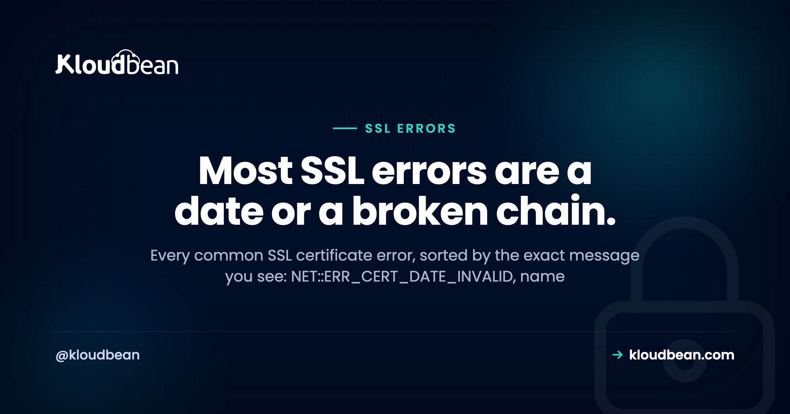

# SSL Certificate Errors, Decoded: Fix Each One by the Message You See

Few things spike a site owner's pulse like a full-page red warning where the homepage used to be. Your connection is not private. It looks catastrophic. It almost never is.

An SSL certificate error is the browser being strict about HTTPS, and it hands you a specific code that says exactly what's wrong. This is a field guide sorted by that message. Find the one you're staring at, read why it happens, apply the fix. Most of them come down to two things, and I'll say which as we go.

> **Fast triage:** Read the exact error code. A date error means the certificate expired, so renew it (and auto-renew so it can't happen again). A name error means the cert doesn't cover the hostname you're visiting. "Unable to verify the first certificate" means a missing intermediate, so install the full chain. A padlock with a warning is mixed content, which is a fix in your own pages, not the certificate.

## How a browser decides to trust your certificate

Before the error list, one picture that explains half of them. Your certificate isn't trusted on its own. It's signed by an intermediate certificate authority, which is signed by a root the browser already trusts. That's a chain, and the browser walks it from your site up to a root it recognizes. Break any link and trust collapses.

<!-- ADD IMAGE: the chain-of-trust diagram. Four boxes left to right (Browser, Your certificate/leaf, Intermediate CA, Root CA/trusted) joined by chain links, with the link between the leaf and the intermediate drawn broken in red and labelled chain breaks here. A dashed arc notes browsers may auto-fetch the missing link but strict clients won't. -->
*Diagram: the chain of trust, browser to leaf certificate to intermediate CA to trusted root, with the leaf-to-intermediate link snapped. A missing intermediate is the "unable to verify the first certificate" error.*

Two of the scariest errors are really just this chain going wrong: a missing middle link (incomplete chain) or a root nobody trusts (self-signed). Keep the picture in mind and they stop being mysterious. Here's the whole error list, and honestly, the vast majority of real SSL pain is two of them: a certificate that expired, and a chain that's missing its middle. Handle those two and you've handled most of what ever goes wrong.

## Match the SSL certificate error to its cause

Skim for the exact string you see, then jump to its section below.

| The message you see | What it means | The fix |
| --- | --- | --- |
| `NET::ERR_CERT_DATE_INVALID` | The certificate expired (or your device clock is wrong) | Renew it, then auto-renew |
| `NET::ERR_CERT_COMMON_NAME_INVALID` | The cert doesn't cover this hostname (often www vs apex) | Issue one covering every name you serve |
| "unable to verify the first certificate" | The server isn't sending the intermediate | Install the full chain |
| `NET::ERR_CERT_AUTHORITY_INVALID` | Self-signed, or from a CA the browser doesn't trust | Use a cert from a trusted CA |
| Padlock with a warning | Mixed content: an HTTPS page loading `http://` assets | Serve every asset over HTTPS |
| "certificate is not valid yet" | Clock skew, or a fresh cert and DNS not settled | Fix the clock, or wait for DNS |

## NET::ERR_CERT_DATE_INVALID: the certificate expired

The most common one by a wide margin. Certificates are valid for a fixed window, then they die. If renewal is manual, someone eventually forgets, and one morning every visitor meets a full-page warning. **What you see:** the red "your connection is not private" page with `NET::ERR_CERT_DATE_INVALID`. **Why:** today's date is past the certificate's `notAfter` date. **The fix right now** is to renew and reload. **The real fix** is automatic renewal, so the cert quietly reissues itself weeks before it lapses and expiry stops being a thing that can happen to you.

One gotcha worth knowing: if the site looks fine on your phone but throws a date error on one laptop, suspect that laptop's clock. TLS checks validity against the local time, so a badly wrong system clock produces a date error on a perfectly good certificate. Correct the clock and it clears.

## NET::ERR_CERT_COMMON_NAME_INVALID: the name doesn't match

A classic. `https://example.com` loads fine, but `https://www.example.com` throws an error, or the other way round. **What you see:** `NET::ERR_CERT_COMMON_NAME_INVALID` or a "this certificate is not valid for this name" message. **Why:** a certificate is only valid for the exact names listed on it, and you're visiting one it doesn't cover. The bare domain and the `www` version count as two different names. **The fix:** get a certificate that covers every hostname you serve (apex, `www`, and any subdomains), then redirect consistently to one canonical version so visitors land on the name the cert is built for. If HTTPS works without `www` but not with it, this is nearly always the reason. The cleanest setup is to add each domain and its SSL up front, which is what the [custom domain and SSL](https://www.kloudbean.com/blog/custom-domain-and-ssl-for-your-app/) walkthrough covers.

## "Unable to verify the first certificate": a broken chain

This is the sneaky one, because it fools you. The site loads with a padlock in Chrome, so you assume it's fine. Then an API call from another server fails, or a mobile app won't connect, or a payment gateway rejects you with a certificate error. **What you see:** "unable to verify the first certificate," "incomplete chain," or `SEC_ERROR_UNKNOWN_ISSUER` from stricter clients. **Why:** your server is sending its own certificate but not the intermediate that signed it (the broken link in the diagram above). Browsers often paper over it by fetching the missing piece themselves, which is exactly why it looks fine in a browser and breaks everywhere else. Servers, command-line tools, and mobile SDKs don't do that favor. **The fix:** install the complete chain, your certificate plus its intermediates, so every client can walk it to a trusted root. If a site works in a browser but a server-to-server call complains about the cert, suspect the chain before anything else.

## NET::ERR_CERT_AUTHORITY_INVALID: self-signed or untrusted CA

**What you see:** `NET::ERR_CERT_AUTHORITY_INVALID`, sometimes worded as "issued by an unknown authority." **Why:** the certificate traces back to a root the browser doesn't trust. Usually that means it's self-signed (you generated it yourself for local testing) or it came from an internal CA that public browsers have never heard of. Self-signed certs are perfectly fine on your own machine. They are not fine on a public site, because no visitor's browser will trust them. **The fix:** replace it with a certificate from a publicly trusted CA. Let's Encrypt issues those for free, and on managed hosting you don't touch the process at all. If you deliberately run an internal CA for a private tool, the fix instead is to distribute your root to the machines that need it, but for anything public, use a trusted CA. Distributing it takes an extra step for Firefox, which keeps its own root store instead of reading the operating system's, and that difference is also why a site can load in Chrome and fail in Firefox with [PR_END_OF_FILE_ERROR or PR_CONNECT_RESET_ERROR](https://www.kloudbean.com/blog/pr-end-of-file-error/).

## Mixed content: the half-secure padlock

Sometimes the page loads over HTTPS but the padlock has a small warning, or it's crossed out. **What you see:** "not fully secure," a broken padlock, and a console line like "Mixed Content: The page was loaded over HTTPS but requested an insecure resource." **Why:** the page itself is secure, but it's pulling in an image, a script, or a stylesheet over plain `http://`, and the browser flags that insecure asset. **The fix lives in your code, not the certificate.** Your cert is fine. Change those `http://` references to `https://` (or drop the scheme so they inherit the page's), and every resource loads securely. Search your templates and bundled assets for `http://` links and hunt them down. Once you're serving everything over HTTPS, add [HSTS and the other security headers](https://www.kloudbean.com/blog/security-headers-guide/) so browsers refuse to fall back to insecure requests at all. And to be clear, SSL only encrypts the connection. It isn't a filter for attacks, which is a separate job for [a WAF](https://www.kloudbean.com/blog/what-a-waf-does/).

## "Certificate is not valid yet": clocks, fresh issues, and DNS

The mirror image of expiry, and it trips people up right after they set a site up. **What you see:** a validity error saying the certificate isn't active yet. **Why, and the fix, split two ways.** Either the client's clock is set in the past, so a valid cert looks like it hasn't started (fix the clock), or you just issued the cert and DNS hasn't fully pointed at your server yet. A certificate authority validates that you control the domain before it issues, and it can only do that once the domain resolves to your server. So the order matters: point your DNS first, confirm it resolves, then issue the certificate. Rush it and issuance fails or the cert lands before the world can see the domain. If you're moving a live site between hosts, sequence the DNS cutover and the new certificate carefully, which is the heart of a [zero-downtime migration](https://www.kloudbean.com/blog/how-to-migrate-hosting-zero-downtime/).

## Diagnose it from the command line

The browser gives you a code. These give you the evidence. Two tools settle almost every SSL question, and you don't have to guess which error you've got.

```
# What certificate(s) is the server actually sending? A full chain, or just one?
openssl s_client -connect example.com:443 -servername example.com -showcerts

# The essentials: who it's for, who issued it, and the valid dates
echo | openssl s_client -connect example.com:443 -servername example.com 2>/dev/null \
  | openssl x509 -noout -subject -issuer -dates

# Headers plus the TLS handshake in one quick look
curl -vI https://example.com
```

Read it like this. If `-showcerts` returns a single certificate, your chain is probably incomplete, because a healthy server sends the leaf and at least one intermediate. A `notAfter` date in the past means it's expired. If the `subject` or its subject-alternative names don't include the exact host you typed, that's your name mismatch. And `curl` failing with a certificate error while a browser stays happy is the classic fingerprint of a missing intermediate. Two minutes here beats an afternoon of guessing.

<!-- ADD IMAGE: a terminal showing openssl s_client output with the certificate chain and the notAfter date highlighted -->

## Why most of this never happens on managed SSL

Here's the part that quietly deletes four of the six errors above. On managed hosting, the certificate is auto-provisioned for your domain, the full chain is installed correctly, modern protocols are configured, and renewal is automatic. On Kloudbean that's free, auto-renewing Let's Encrypt SSL, and it checks that your domain resolves before it issues, so the "not valid yet" and authority errors don't get a chance to appear. Expiry, chain, authority, and issuance timing all stop being your problem.


That leaves exactly one on your side of the line: mixed content, because only you know which assets your pages load. It's a Linux and web-server stack underneath, and "managed" means the platform keeps the padlock green (issuing, chaining, and renewing the cert) while you make sure your own pages request everything over HTTPS. Decode the specific message, apply its fix, and the scary red screen goes back to a quiet padlock.

**A green padlock you never have to renew.** Serve your site with free, auto-provisioning, auto-renewing SSL and the full chain installed for you, on [kloudbean.com](https://www.kloudbean.com/). Most of these errors never occur. Plans on [pricing](https://www.kloudbean.com/pricing/).

One-line feature recap: Free auto-renewing SSL · Full chain installed · Custom domains · Private networking · Free migration · Free trial

## FAQ

**Why does my site say "Your connection is not private"?**
The browser doesn't trust your certificate, and the code underneath says why. Usually it has expired (`NET::ERR_CERT_DATE_INVALID`), it's for the wrong domain, or it's self-signed. Read the specific code on the warning, then renew, reissue for the right names, or replace a self-signed cert with one from a trusted CA. Auto-renewal stops the expiry version coming back.

**What does NET::ERR_CERT_DATE_INVALID mean?**
The certificate is outside its valid dates, almost always because it expired. Renew it and reload. If only one device shows the error while others are fine, check that device's clock, since TLS validates the certificate against the local time and a wrong clock fakes a date error on a good cert.

**Why does HTTPS work on my domain but not with www (or the reverse)?**
Your certificate covers one hostname but not the other. The apex domain and the `www` version are separate names, so a cert issued for one throws `NET::ERR_CERT_COMMON_NAME_INVALID` on the other. Issue a certificate that covers every name you serve, then redirect consistently to one canonical version.

**Why does my SSL work in the browser but fail from an app, curl, or API?**
Almost always an incomplete chain. Your server is sending its certificate without the intermediate that signed it. Browsers often fetch the missing piece automatically and hide the problem, but curl, mobile apps, and payment gateways don't and fail with "unable to verify the first certificate." Install the full chain and the server-to-server errors stop.

**What causes NET::ERR_CERT_AUTHORITY_INVALID?**
The certificate traces to a root the browser doesn't trust, usually because it's self-signed or from an internal CA. Self-signed is fine for local testing but never for a public site. Replace it with a certificate from a publicly trusted authority like Let's Encrypt, which managed hosting provisions for you automatically.

**What is mixed content and how do I fix the padlock warning?**
Mixed content is an HTTPS page loading a resource (image, script, or stylesheet) over insecure `http://`, which the browser flags with a broken padlock. Your certificate is fine. Change those references to `https://` in your code so every asset loads securely, then add HSTS so browsers won't attempt insecure requests at all.

**How do I check my certificate and its chain from the command line?**
Run `openssl s_client -connect example.com:443 -servername example.com -showcerts` to see every certificate the server sends. One certificate usually means an incomplete chain. Pipe into `openssl x509 -noout -subject -issuer -dates` to read the names and expiry, and use `curl -vI https://example.com` for a quick handshake check.

**Do I have to manage SSL renewal myself?**
Not on managed hosting. Certificates auto-provision and auto-renew, and the full chain is installed for you, so expiry and chain errors don't occur. On a hand-configured server you own renewal, and forgetting it is the single most common cause of a site suddenly showing a certificate warning.

Byline: Kloudbean · Most SSL errors are a date or a broken chain.
