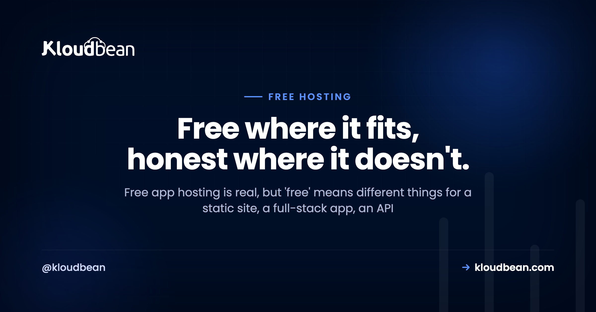
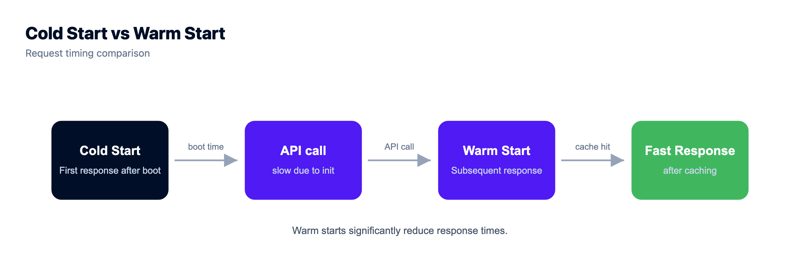
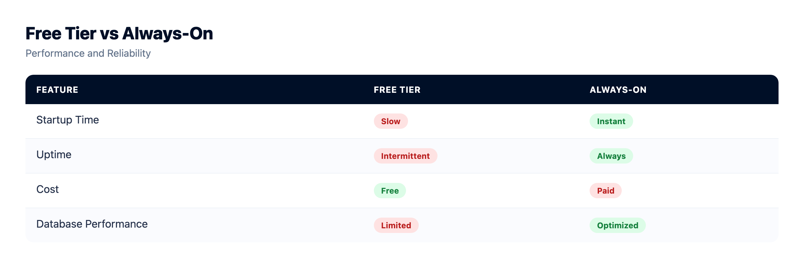

# Free App Hosting: Your Real Options, by What You're Hosting

Free app hosting is a hugely popular search, and the honest answer starts with a question back: what are you actually hosting? Because "free" means something very different for a static site than it does for a full-stack app, an API, or a database. Some of those are genuinely, permanently free. One of them barely is. Lumping them into a single "top free hosts" list is how people end up disappointed.

So this is a buyer's guide, not a listicle. We'll sort by the thing you're deploying, name the free option that actually fits it, and be straight about the catch. Any numbers here are illustrative. The tradeoffs are the part that stays true.

> **The short version.** A **static site** hosts free and well, with your own domain and SSL, no real catch. A **full-stack app** or **API** can run on a free tier for demos and learning, but most sleep when idle, so the first visitor waits on a cold start. A **database** has small free tiers with tight caps. Free is perfect while you build. The day real users depend on always-on, a cheap always-on server beats it, and it's still only a few dollars.

## First, what are you actually hosting?

Match the option to the thing. This is the whole game, and the diagram below is the short version of the entire article. Find your row, and you've mostly got your answer.

<!-- Decision-map SVG in the HTML: a root box "What are you hosting?" branching to four columns (static / front end, full-stack app, API / backend, a database), each pointing down to its best free option. The static column is highlighted green (free static hosting: your domain, free SSL, visit analytics); the others point to free tiers, cheap always-on, or free trial then a small managed DB. -->

## Hosting a static site or front end

This is the one place "free" is just true. If your app is a static build (a React, Vue, or Astro bundle, or a plain HTML site), it's a folder of files. Files are cheap to serve, they don't need a running server, and they can't sleep. So static hosting free tiers are genuinely generous, and they don't punish you with cold starts. Your build step spits out a folder, and that folder goes live:

```
npm run build          # produces a /dist folder of static files
# point free static hosting at /dist  →  live, with SSL
```

Kloudbean does this too: **free static site hosting** with your own custom domain, free SSL, and built-in visit analytics, so you can park a marketing site or a front end here and keep it next to the rest of your stack. The [custom domain and SSL guide](https://www.kloudbean.com/blog/custom-domain-and-ssl-for-your-app/) covers wiring the domain up.

**The catch:** it's static only. The moment you need code running on a server, a database, or background jobs, a static host can't help, and you'll pair it with one of the options below for the dynamic half. That's normal. A lot of good architectures are a static front end plus a small API.



## Hosting a full-stack app

Now the server enters the picture, and "free" gets conditional. A full-stack app (a Next.js app with server routes, a Django or Laravel app, a Node/Express server rendering pages) needs a process running somewhere. Provider free tiers and PaaS hobby tiers will run one at no cost, which is brilliant for a demo, a prototype, or learning how deployment works.

**The catch:** most free tiers **sleep** an idle app to reclaim shared capacity. The first visitor after a quiet spell triggers a cold start, several seconds of a blank tab while the app wakes. Add tight CPU, memory, and build-minute caps, and you've got something great for evaluation and rough on anyone real. It's not a scam. It's the design. Free tiers optimize for getting you in the door, not for keeping your app warm.

If you want the app always-on without cold starts, that's the jump to a cheap server, covered further down. There's a deeper head-to-head in [free tier vs cheap VPS](https://www.kloudbean.com/blog/free-tier-vs-cheap-vps/).

## Hosting an API or backend for free

Free backend hosting is really the same story as a full-stack app, with one extra wrinkle: an API's whole job is to answer fast. A cold start that's a mild annoyance on a web page is a timeout on an API call, and the client on the other end may just give up. Free Node.js hosting, free Python API hosting, they all exist on free and hobby tiers, and they're perfect for a webhook you're testing or a side project's back end that nobody's timing.

**The catch:** sleeping hurts an API more than a site, per-request or per-hour caps are easy to trip, and there's usually no real uptime guarantee. Fine for a bot, a cron target, or a demo endpoint. Risky for anything another system depends on. A small always-on box removes the cold start entirely, which is why a Discord bot or a webhook receiver tends to graduate quickly, see [Discord bot hosting](https://www.kloudbean.com/blog/discord-bot-hosting/) and [deploying a Node app to managed cloud](https://www.kloudbean.com/blog/deploy-node-app-to-managed-cloud/).



## Hosting a database for free

Databases have free tiers too, and they're genuinely useful while you build. A small free Postgres, MySQL, or Redis is plenty for local-feeling development against a real cloud database. But data is where free tiers get stingiest, and for good reason: storage and connections cost the provider real money.

**The catch:** tight row or storage caps, connection limits that a busy app trips, and a habit of pausing an idle free database (another cold start, this time on your data layer). And a free database you've built your app around is the hardest thing to migrate later, so lock-in bites hardest here. My advice: use a free database tier to develop, but when the app is real, run a proper one. Kloudbean's **free trial** lets you spin up a managed PostgreSQL, MySQL, or Redis and see it working before you pay, and there's [managed PostgreSQL hosting](https://www.kloudbean.com/blog/managed-postgresql-hosting/) if you want the detail.

## Free app hosting tradeoffs, side by side

Same information, one table. Notice that only the first row is a clean "yes" on free:

| Hosting | Genuinely free? | The main catch | Best for |
|---|---|---|---|
| **Static site** | Yes | Static only, no server code | Front ends, marketing sites, SPAs |
| **Full-stack app** | For demos | Sleeps, cold starts, caps | Prototypes, learning, demos |
| **API / backend** | For demos | Cold starts hurt more; rate caps | Webhooks, test endpoints, bots |
| **Database** | To develop | Tight caps, pausing, lock-in | Dev and prototyping |
| **Homelab / old machine** | Yes (power cost) | Your home internet, your upkeep | Learning, tinkering |

## Truly free vs effectively free

One more distinction worth holding, because "free" hides two different deals. **Truly free** means no card and no monthly charge: static hosting, provider and PaaS free tiers, small database tiers, your own homelab. They cost nothing and come with the classic strings, sleeping, caps, or your own hardware and electricity. **Effectively free** means so cheap it rounds to zero: a basic VPS at a few dollars, or a small managed plan. Not literally free, but for a real project the couple of dollars buys away the exact problems (cold starts, tight caps) that make the truly-free options frustrating.

The useful move is to stop asking "what's free?" and start asking "what's the cheapest thing that's actually good enough for this?" Often that's a truly-free tier for a demo and an effectively-free server for anything real. Both are bargains. They're bargains for different jobs. If you want that comparison in full, [what a side project really costs](https://www.kloudbean.com/blog/cost-of-running-a-side-project/) and [cloud hosting pricing explained](https://www.kloudbean.com/blog/cloud-hosting-pricing-explained/) lay out the money side.

## My rule of thumb

Here's the opinion I'll defend. Free is the correct choice for a static front end, full stop, and for anything you're building, learning on, or demoing. Use it happily and don't overthink it. Where free stops fitting is a specific place: a full, always-on dynamic app that must never cold-start, that real people or real revenue depend on. That's not a free-tier job. It never was. A free tier that sleeps is doing exactly what it was built to do, and fighting that design is a losing game.

So the failure isn't using free hosting. It's using free hosting for the one thing it's bad at, then blaming the tool. Match the option to the stakes and free earns its keep. If you want that judgment call in full, [is free hosting worth it](https://www.kloudbean.com/blog/is-free-hosting-worth-it/) walks through exactly where the line sits.

## When it's time to graduate, and how easy it is

The good news: moving off free isn't a rebuild. Your app is code in a repo, maybe with a database, so graduating to an always-on server is a redeploy. Connect the Git repo, bring your environment variables, point the domain, done. Cheap app hosting on a small managed server gives you the always-on foundation without the cold starts or the sysadmin homework.


Push to your main branch and it builds and deploys, with live build logs streaming so you can watch it go out. That's the same simple flow whether it's a Node API, a Django app, or a static front end. There's a full walkthrough in [CI/CD auto-deploy from GitHub](https://www.kloudbean.com/blog/ci-cd-auto-deploy-from-github/), and if you're deciding whether to self-manage or not, [managed vs unmanaged hosting](https://www.kloudbean.com/blog/managed-vs-unmanaged-hosting/) settles it.


<!-- ADD IMAGE: a before and after showing a free tier waking slowly on the left, an always-on server responding instantly on the right. -->

<!-- cta:start -->
**Take it off localhost for good.**

Run the app as an always-on process with managed databases, Redis, object storage, and automatic backups beside it. Deploy from Git with live build logs, and keep the infrastructure someone else's problem.

- Managed databases
- Always-on processes
- Object storage
- Automatic backups
- Free SSL
- Git deploy
- Free migration

[Start free](https://console.kloudbean.com/register) · [See plans](https://www.kloudbean.com/pricing/)
<!-- cta:end -->

## FAQ

**What's the best free app hosting?**
It depends on what you're hosting. For a static front end, static hosting free tiers are genuinely free and excellent, with your own domain and SSL. For a full app or API, provider free tiers and PaaS hobby tiers work for demos and learning, but most sleep idle apps. For always-on at low cost, a cheap VPS or small managed plan beats free once real users are involved.

**Can I host a backend for free?**
For learning and demos, yes. Provider free tiers and PaaS hobby tiers run backends at no cost, with the usual sleeping and rate caps. Purely static hosting can't run a backend. For an always-on backend that another system or real users depend on, a low-cost VPS or a small managed plan is the practical step up, because a cold start on an API is often a timeout.

**Is there free Node.js hosting?**
Yes, free and hobby tiers happily run a Node.js app or Express API at no cost, which is great for a prototype or a webhook you're testing. Expect the same free-tier realities: the app sleeps when idle, resources are capped, and there's no real uptime promise. For a Node service that must stay responsive, a small always-on server removes the cold starts.

**Can I host a static site for free with my own domain?**
Yes, and this is the cleanest free option there is. Static hosting free tiers, Kloudbean's included, serve your built files with a custom domain and free SSL, no sleeping and no cold starts because there's no server process to spin down. Kloudbean also adds built-in visit analytics on its free static hosting, so you can see traffic without bolting on a tool.

**What's the catch with free app hosting?**
For static sites, almost none. For anything with a running server, the catch is usually sleeping (cold starts), tight resource caps, no uptime guarantee, and lock-in that makes leaving awkward, especially for a free database. None of that makes free hosting bad. It makes it a tool for building and demoing rather than for running a service real people rely on.

**Free tier or cheap VPS for an always-on app?**
If the app must stay up, a cheap VPS or small managed plan beats a free tier, because free tiers sleep and cap resources. A raw VPS is a few dollars and always-on but unmanaged, so you handle patching and backups. A small managed plan adds that maintenance back for a little more. The free tier is the better pick only when sleeping genuinely doesn't matter.

**Can I host a database for free?**
Yes, for development. Small free tiers of Postgres, MySQL, and Redis are fine to build against, but they cap storage and connections tightly and often pause when idle. Data is also where lock-in bites hardest, so a free database is the trickiest thing to migrate later. Develop on free, then run a managed database once the app is real; a free trial lets you try one first.

**Will a free tier scale as my app grows?**
Only up to a point. Free tiers are generous until a threshold, and then the jump to paid can be steep, or a feature you now depend on turns out to be paid-only. It's wise to glance at the paid pricing before you build so the growth path holds no surprises. Assume you'll graduate off free rather than scale within it.

**How do I move off free hosting when I outgrow it?**
It's a redeploy, not a rebuild. Your app is code in a repository plus maybe a database, so you connect the repo to an always-on server, bring your environment variables, point your domain, and deploy. Free migration help can move an existing database for you, so graduating usually costs an afternoon rather than a weekend.

---

*By Kloudbean · Free where it fits, honest where it doesn't.*
