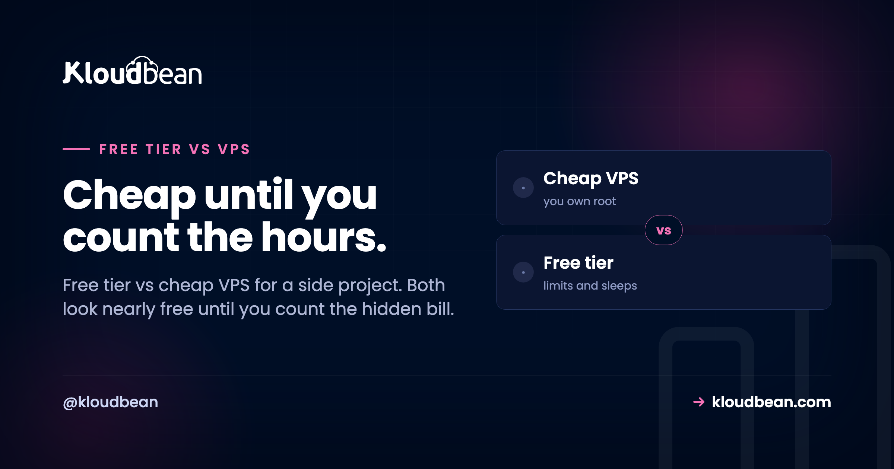
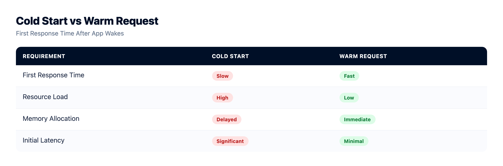
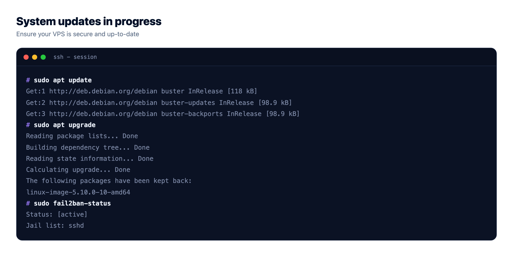

# Free Tier vs Cheap VPS: What Actually Hosts Your Side Project?

You've built a thing. Now you need somewhere to put it, and you're staring at the two cheapest options: a free tier that costs nothing, or a cheap VPS that runs a few dollars a month. Free tier vs cheap VPS looks like a money question. It really isn't.

The prices sit so close that the couple of dollars between them shouldn't decide anything. What should decide it is a thing neither pricing page prints: what each one quietly costs you after the sticker. Spoiler, and I'll stand behind this: neither is actually cheap once you add up the hidden part.

> **Short answer:** A **free tier** is genuinely free in dollars, but you pay in cold starts, tight limits, expiring credits, and no real support. It's perfect for learning and demos. A **cheap VPS** is always-on and fully yours, but it's unmanaged, so you pay in time: setup, patching, security, and backups. Great if you want control and have the ops skill. Once a project is real and needs to stay up, a small managed server usually beats both.

## The trap in the word "cheap"

Sticker price is the number you see. Total cost is the number you feel. And those two drift a long way apart the moment a project stops being a toy.

A free tier's sticker is zero. But the app sleeps when idle, so a real visitor eats a cold start of several seconds while it wakes. The credits that made it free often expire. The limits are tight, and when you hit them, throughput gets throttled or the bill quietly appears. Bandwidth overages, egress especially, have surprised more than one hobby project.

A cheap VPS's sticker is a few dollars. But it lands as a bare Linux box. You install the stack, lock down SSH, configure a firewall, set up TLS, wire up backups, and you're on call when it falls over. That's not free. That's your evenings. So let's put the real cost on a chart, not just the sticker.

<!-- Waterline SVG in the HTML: sticker price above the line (free tier $0, VPS ~$5, managed a bit more), hidden cost below (free tier = cold starts, throttling, egress bills, no support; VPS = your time patching, security risk, backups, downtime; managed = mostly handled). Free looks cheapest until you weigh what's under the water. -->

## What a free tier really costs you

Free tiers are a fantastic on-ramp. They earn their keep for the right job. But the price of zero dollars shows up in four familiar ways:

- **Cold starts.** Idle apps get spun down. The next visitor waits while it boots, and on a small free plan that can be five to ten seconds of staring at a blank tab. Fine for a demo. Rough for anyone you're trying to impress.
- **Tight limits and throttling.** CPU, memory, build minutes, request counts. Cross a line and things slow down or stop. You're sharing a crowded box, and it shows under load.
- **Expiring credits.** A lot of "free" is really a trial. The credit runs out, or the promo ends, and month four looks nothing like month one.
- **Egress surprises.** Outbound bandwidth is the classic gotcha. Serve a few big files or get a small traffic spike, and a $0 plan can sprout a bill you didn't plan for.

And when any of that goes sideways, support is usually a community forum and a shrug. That's the honest trade for free. Worth it when the stakes are low, painful when they aren't. If you want the long version, we wrote a whole piece on [whether free hosting is worth it](https://www.kloudbean.com/blog/is-free-hosting-worth-it/) and a rundown of [free app hosting options](https://www.kloudbean.com/blog/free-app-hosting-options/).

## What a $5 VPS really costs you

Flip to the other option and the hidden cost changes shape. A cheap VPS gives you a real, always-on machine for the price of a coffee. No cold starts, dedicated CPU and RAM, root access, run anything. For the right person that's a great deal.

The catch is one word: unmanaged. The provider hands you a bare Linux box and walks away. Everything after that is you. And here's where it usually breaks for beginners: the security part is invisible until it isn't. Leave SSH open with a weak password and automated bots will find it within hours, not days. An unpatched server is a target. Nobody's taking backups unless you set them up, so the first time you really learn that lesson is the time you lose data.

None of this is hard, exactly. It's just real, ongoing work, and it's on you at the worst possible moments. The 2am "why is the site down" moment is a rite of passage, and it's a lot less charming when it's a project people actually use. If that tradeoff intrigues you rather than tires you, a VPS is a brilliant classroom. The [real cost of an unmanaged VPS](https://www.kloudbean.com/blog/the-real-cost-of-unmanaged-vps/) goes deeper, and [managed vs unmanaged hosting](https://www.kloudbean.com/blog/managed-vs-unmanaged-hosting/) lays the two side by side.

## Free tier vs cheap VPS: the honest ledger

Put the sticker and the hidden cost in the same table, add the option most comparisons leave out, and the picture gets a lot clearer:

| | Free tier | $5 VPS | Managed server |
|---|---|---|---|
| **Sticker price** | $0 | ~$5/mo | A bit more |
| **Always on?** | No, sleeps when idle | Yes | Yes |
| **Cold starts** | Yes | None | None |
| **The hidden bill** | Limits, egress, expiring credits | Your time as sysadmin | Small, most work is handled |
| **Who does the ops** | Platform (but capped) | You, all of it | Handled for you |
| **Control** | Limited | Full root | Full, plus backups & SSL |
| **Right for** | Learning, demos | Control + ops skill | A project that's real |

## So who is each actually right for?

This is where I'll take a position instead of shrugging "it depends." Because the right pick is genuinely clear once you're honest about the project.

**Choose a free tier** if it's pure learning, a demo you'll show a few times, a prototype, or a link you'll paste in a chat and forget. Zero dollars, near-zero setup, and the sleeping and limits simply don't matter. Don't overthink it. Ship it and move on.

**Choose a cheap VPS** if you specifically want control and you either have the ops skills or actively want to build them. A raw VPS is the best learning environment in tech. If running your own box sounds fun, do it, and enjoy the education. Just go in knowing the uptime and the security are your job now.

What about the project that's outgrown "demo" but where you'd rather write features than babysit a server? That one doesn't fit either box cleanly. Which brings us to the option most head-to-heads skip.

## The grown-up option once a project is real

There's a third choice that quietly takes the best of both. A **small managed server** is always-on with dedicated resources like the VPS, no cold starts, your own domain, and it's maintained like a platform, so patching, SSL, and backups are handled for you. It costs a little more than a bare VPS, and that difference buys back the exact thing the VPS charges you in secret: your time.

Underneath, it's a Linux box in all three cases. Managed just means the server, the stack, SSL, patching, and automatic backups are handled, while your app code and data stay yours to export whenever you want. You get the always-on reliability without the sysadmin homework, and you're not on the hook at 2am. For a side project that people actually depend on, that's usually the right answer, and a free trial plus free migration help means trying it costs you nothing. If you're weighing the whole picture, [the real cost of running a side project](https://www.kloudbean.com/blog/cost-of-running-a-side-project/) and [cloud hosting pricing explained](https://www.kloudbean.com/blog/cloud-hosting-pricing-explained/) both help.

## Start cheap, graduate when it earns it

Here's the freeing part: none of this is a marriage. A sensible path is to start on a free tier while you build and validate, then move to an always-on server the day it starts to matter. Your app is just code in a repo plus maybe a database, so that move is a redeploy, not a rebuild.

Connect the repo, bring your environment variables, point the domain, done. So don't agonize at the start. Pick the cheapest thing that fits today, knowing you can graduate in an afternoon when the project earns it.

<!-- ADD IMAGE: A custom domain going live with SSL on the new server, to show graduating is quick and finished. -->

<!-- cta:start -->
**Move it once. Own it after.**

Standard code moves onto a standard Linux server, so this is a migration rather than a rewrite. Pick from seven clouds, keep push-to-deploy, and get help moving the first workload across.

- Free migration assistance
- Free trial
- Seven cloud providers
- Flat monthly price
- Managed databases
- Git deploy

[Start free](https://console.kloudbean.com/register) · [See plans](https://www.kloudbean.com/pricing/)
<!-- cta:end -->

## FAQ

**Free tier vs cheap VPS, which is better?**
Neither wins outright, because they behave oppositely for a similar near-zero cost. A free tier is $0 and zero-effort but sleeps when idle and has tight limits, which suits demos and learning. A cheap VPS is always-on and fully yours but unmanaged, so you run it. Pick the free tier for low-stakes projects, and the VPS when always-on matters and you'll do the ops.

**Is a free tier actually free?**
In dollars, often yes, but it's rarely free in practice. You pay in cold starts, tight limits, and support that's basically a forum, and many free plans run on credits that expire or throttle you once you cross a line. Egress and bandwidth overages are the usual place a $0 plan turns into a real bill.

**Why does my free-tier app sleep, but a VPS doesn't?**
Free platforms spin idle apps down to reclaim shared resources, so the next visitor triggers a slow cold start while it wakes. A VPS is a dedicated virtual server you rent whole, so it runs continuously whether or not anyone's using it. That always-on behavior is the VPS's main advantage over a free tier.

**Is a $5 VPS worth it over a free tier?**
If your project needs to stay up, yes, because it removes cold starts for a few dollars. The catch is that a VPS is unmanaged, so factor in the time to patch, secure, and back it up. If it's a demo where sleeping is fine, the free tier is the better zero-cost choice.

**What's the real downside of a cheap VPS?**
It's unmanaged, so you set up the server, patch it, harden SSH, configure a firewall, handle SSL, take backups, and fix it when it breaks. The security exposure is the sharp edge beginners miss: an open, unpatched box gets probed by bots fast. That's fine if you want to learn, and a real time cost if you don't.

**Can I lose data on a cheap VPS?**
Yes, if nobody set up backups, and on an unmanaged box nobody does that for you. A failed disk, a bad command, or a compromise can wipe your data with no restore point. Backups are the single most skipped step on a self-run VPS, which is exactly why managed hosting includes automatic ones.

**Is there a better option than both?**
Often, yes: a small managed server. It's always-on with dedicated resources like a VPS, but patching, SSL, and backups are handled for you like a platform. It costs a bit more than a bare VPS, and in return you get the reliability without the maintenance. Usually the best fit once a project is real.

**Can I move from a free tier to a server later?**
Yes, and it's easier than people expect. Your app is code in a repository plus maybe a database, so moving is a redeploy: connect the repo, bring your environment variables, point the domain. Start on the cheapest thing that fits and graduate when the project earns it.

**Do I need a credit card for a free tier?**
Often yes, and that's worth noticing. Many free tiers ask for a card up front and run on credits or trials, so the free period can quietly convert to a paid one. Read what happens when the credits expire before you rely on it for anything you care about.

**Which is best for a side project that a few people use?**
If a handful of real people depend on it, you've outgrown a sleeping free tier, and a raw VPS means you're now the sysadmin. A small managed server is usually the sweet spot: always-on, backed up, and maintained, for a little more than a bare VPS and none of the upkeep.

---

*By Kloudbean · Cheap until you count the hours.*
