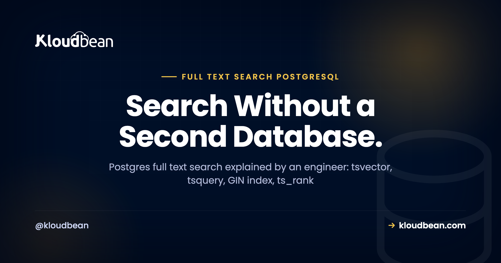

# Postgres Full Text Search: You Might Not Need Elasticsearch



You need a search box, and your first instinct is to reach for Elasticsearch. Pause for a second. If your data already lives in PostgreSQL, Postgres full text search is very likely enough, and it saves you from running, syncing, and securing a whole second datastore.

This is a working guide to full-text search in PostgreSQL, written the way I'd explain it to a teammate. We'll cover why `LIKE '%term%'` was never real search, how tsvector and tsquery actually work, how to rank and index results so Postgres search stays fast, and where the honest line sits between Postgres and Elasticsearch.

> **The short version**
> Yes, Postgres does real full-text search. It turns text into normalized lexemes (`tsvector`), parses the query (`tsquery`), matches with the `@@` operator, ranks with `ts_rank`, and stays fast behind a `GIN` index. For most apps that's plenty, and it's one less system than Elasticsearch. Graduate to a dedicated search engine when search becomes a core product surface, not before.

## Why `LIKE '%term%'` was never search

Plenty of apps ship "search" that's really a `LIKE` query. It works in the demo. Then real users show up and it falls apart. Here's the query almost everyone starts with:

```sql
-- looks like search, behaves like a substring match
SELECT title FROM articles
WHERE body ILIKE '%running%';
```

Four problems, and none of them is small.

- **It can't rank.** Every row that contains the substring comes back equal. There's no idea of "best match first," so a one-word aside outranks the article that's genuinely about running.
- **It can't handle word stems.** A search for `running` won't match `run` or `ran`. You're matching characters, not words, so grammar is invisible to it.
- **It treats stop words as signal.** Filler like "the" and "of" counts the same as your real terms, so noise pollutes the match.
- **The leading wildcard kills your index.** A B-tree index can't help a pattern that starts with `%`, so Postgres scans every row and runs the match on each one. Fine at a thousand rows. Rough at a million.

Full-text search fixes all four. It matches words, not characters. It stems, so run, running, and ran collapse into a single lexeme. It drops stop words. And it sits behind an index built for exactly this.

<!-- ADD IMAGE: Show EXPLAIN ANALYZE on the ILIKE query, with Seq Scan and the row-count cost visible. -->

## How does Postgres full text search actually work?

Two data types carry the whole feature. A `tsvector` is a document after Postgres has normalized it: lowercased, stemmed, stop words removed, and each remaining lexeme stored with its position. A `tsquery` is the search request after the same treatment. The `@@` operator asks one question, does this tsvector match this tsquery?

```sql
-- a document becomes normalized lexemes
SELECT to_tsvector('english', 'The cats were running fast');
-- becomes: 'cat':2 'fast':5 'run':4

-- the query gets parsed the same way
SELECT websearch_to_tsquery('english', 'running cats');
-- becomes: 'run' & 'cat'

-- @@ is the match operator
SELECT to_tsvector('english', 'The cats were running fast')
       @@ websearch_to_tsquery('english', 'run cats');
-- returns: true
```

Look at what happened. "The" and "were" vanished (stop words). "cats" became `cat`, "running" became `run`. So a search for "run cat" matches a document that literally said "cats were running." That's the stemming and normalization `LIKE` could never do.

One practical tip that saves real bugs: use `websearch_to_tsquery` for anything a human types. The older `to_tsquery` expects strict syntax and throws `syntax error in tsquery` the moment someone types a stray quote or an operator. `websearch_to_tsquery` takes Google-style input (quoted phrases, OR, a leading minus to exclude a term) and never errors on messy text. Feeding raw user input straight into `to_tsquery` is a classic way to 500 your own search endpoint.

<figure>
  Diagram: The Postgres full-text search pipeline. Query text ("running cats") is parsed by websearch_to_tsquery into a tsquery ('run' & 'cat'), matched with the @@ operator against a tsvector on a GIN index, then scored by ts_rank into ranked results (best match first). Text in, ranked rows out, one database, no copy to keep in sync.
</figure>

## Ranking results with `ts_rank`

Matching is a yes or no. Search needs an order. `ts_rank` scores how well each document matches the query, so the best hit lands on top. A realistic search query reads like this:

```sql
SELECT title,
       ts_rank(search, websearch_to_tsquery('english', 'postgres full text search')) AS rank
FROM articles
WHERE search @@ websearch_to_tsquery('english', 'postgres full text search')
ORDER BY rank DESC
LIMIT 20;
```

The `WHERE` clause filters to matching rows, `ts_rank` scores them, and `ORDER BY ... LIMIT` returns the top handful. Want a title to count more than the body? `setweight` tags lexemes A through D, and `ts_rank` respects those weights. For a content site or a product catalog, that's usually all the relevance tuning you need.

## Making it fast: a generated column and a `GIN` index

Computing `to_tsvector` on every row at query time is the slow trap. The clean modern pattern is to store the tsvector in a generated column and index it. Postgres keeps that column in sync on every insert and update, and the `GIN` index turns the match into a lookup instead of a scan.

```sql
-- store the searchable document once, kept in sync automatically
ALTER TABLE articles
  ADD COLUMN search tsvector
  GENERATED ALWAYS AS (
    to_tsvector('english', coalesce(title,'') || ' ' || coalesce(body,''))
  ) STORED;

-- the index that makes full-text search fast
CREATE INDEX articles_search_idx ON articles USING gin (search);
```

A `GIN` (Generalized Inverted Index) is the right structure here. It maps each lexeme to the rows that contain it, which is an inverted index, the same core idea Elasticsearch uses under the hood. Skip this step and every search recomputes the vector and walks the table. Add it and Postgres jumps straight to the matching rows. The usual mistake is shipping full-text search with no GIN index, then blaming Postgres when it crawls at scale. The index is not optional once your table gets real.

<!-- ADD IMAGE: Show EXPLAIN ANALYZE after adding the GIN index, with a Bitmap Index Scan replacing the Seq Scan. -->

## Typo tolerance with trigrams (`pg_trgm`)

Full-text search matches words, but it won't catch a misspelling. Someone types "postgers" and gets nothing back. The companion tool is `pg_trgm`, a built-in extension that compares strings by their three-character chunks (trigrams) and scores how similar they are. It's what powers "did you mean" and loose partial matches.

```sql
CREATE EXTENSION IF NOT EXISTS pg_trgm;

-- a trigram index for fuzzy matching
CREATE INDEX articles_title_trgm
  ON articles USING gin (title gin_trgm_ops);

-- fuzzy match, closest spelling first
SELECT title
FROM articles
WHERE title % 'postgers'
ORDER BY similarity(title, 'postgers') DESC
LIMIT 5;
```

The `%` operator returns true when two strings are similar enough, and `similarity()` gives you the score to sort by. Run full-text search for the main query, and fall back to a trigram search when it returns nothing. That combination covers typos with zero extra infrastructure. It won't match the fuzzy sophistication of a dedicated search engine, but for a search box it's honestly good.

<!-- ADD IMAGE: Show a search box with a did you mean suggestion driven by trigram similarity. -->

## `LIKE` vs full text search vs Elasticsearch, side by side

Three tools, three jobs. This is the quick mental model:

| | `LIKE` | Postgres FTS | Elasticsearch |
|---|---|---|---|
| **Ranking** | None | Good (`ts_rank`) | Strong (BM25, tunable) |
| **Stemming / stop words** | No | Yes | Yes |
| **Typo tolerance** | No | With `pg_trgm` | Built in |
| **Facets / aggregations** | No | Doable, heavier | Fast, first-class |
| **Uses an index** | Not with a leading % | Yes (GIN) | Yes (inverted) |
| **Extra service to run** | No | No | Yes |
| **Best for** | Nothing, really | Most app search | Search-heavy products |

## When Postgres full text search stops being enough

I'd be doing you a disservice if I pretended Postgres search scales to everything. It doesn't. There's a real point where a dedicated engine earns its keep, and it usually shows up as some mix of these:

- **Very large corpora and high query volume.** Tens of millions of documents plus heavy concurrent search push past what one Postgres box wants to do while also serving your transactional load.
- **Advanced relevance tuning.** Elasticsearch's BM25 scoring, custom analyzers, synonym sets, and per-field boosting reach well beyond `ts_rank` and `setweight`.
- **Faceting and aggregations at scale.** Live counts per brand, price band, and category across huge result sets are exactly what a search engine is built for.
- **Typo tolerance as a ranking signal.** Trigrams are fine for a search box. Fuzzy matching baked into relevance across millions of docs is Elasticsearch territory.
- **Near-real-time indexing of massive document sets, and distributed search** across a cluster you grow by adding nodes.

None of this makes Postgres search bad. It makes it a different tool for a different size of problem. The [managed Elasticsearch guide](https://www.kloudbean.com/blog/managed-elasticsearch-hosting/) walks through what that engine is genuinely great at, and it's a fair bit.

## So do I need Elasticsearch, or not?

Here's my actual position, not a hedge. If search is a feature *of* your app, searching your own posts, products, or docs, and that data already lives in Postgres, start with Postgres full text search. You skip an entire category of work. Move to Elasticsearch when search becomes a core product surface, or when Postgres FTS visibly strains under real traffic. Don't stand up an Elasticsearch cluster to search five hundred blog posts. That's a pile of moving parts for a problem `tsvector` solved years ago.

The reason isn't only "fewer servers." It's the sync tax. The moment you run a separate search engine, your source of truth stays in Postgres and Elasticsearch holds a *copy*. Now you own a write path that indexes new and changed rows, a reindex job for when the mapping changes, and reconciliation for when the two inevitably drift. That's a standing cost you pay forever. Keep search inside Postgres and there's nothing to sync, because the data and the index are the same database. This is the same source-of-truth versus searchable-copy tradeoff the Elasticsearch guide gets into, and it's the part most "just add Elasticsearch" advice quietly skips.

Think about it the way you'd think about adding [Redis to a Postgres app](https://www.kloudbean.com/blog/when-to-use-redis-vs-postgres/): a great tool, added when the workload asks for it, not on reflex. It's the same judgment call as picking [between MySQL and PostgreSQL](https://www.kloudbean.com/blog/mysql-vs-postgresql/) at the start. Fit the tool to the real problem, not the problem you imagine you'll have at ten million users.

## Start in Postgres, graduate without switching vendors

This is where "start simple, grow when needed" stays painless on Kloudbean. Both managed PostgreSQL and managed Elasticsearch are one-click managed engines here, among the same set of managed databases (MySQL, MariaDB, PostgreSQL, Redis, Memcached, Elasticsearch, MongoDB). So you can begin with Postgres full text search, and the day you truly need a dedicated engine, you launch managed Elasticsearch from the same dashboard. Same login, same private network, same backups. No new vendor to evaluate.


*DBS, Launch Database: managed PostgreSQL now, managed Elasticsearch later, from one place.*

Both engines arrive provisioned and patched, on a [private network](https://www.kloudbean.com/blog/what-is-a-vpc/) instead of the open internet, with [automatic backups](https://www.kloudbean.com/blog/server-backups-guide/) and controlled access. Your app reads the connection details from environment variables, the same discipline as [adding any managed database](https://www.kloudbean.com/blog/add-managed-database-to-your-app/). Nothing exotic, just fewer things you have to babysit.


*Watch CPU, RAM, and disk. When search load starts crowding your transactional queries, that's your cue to consider a dedicated engine.*

When you're deciding, the split stays simple. Keep the source of truth in [managed PostgreSQL](https://www.kloudbean.com/blog/managed-postgresql-hosting/), lean on its full-text search for as long as it serves you, and add [managed Elasticsearch](https://www.kloudbean.com/blog/managed-elasticsearch-hosting/) only when search truly becomes the product. Most apps never need the second box. The ones that do will know.

---

**Give your app real search without running a second database.**

Launch managed PostgreSQL, use full-text search that stems and ranks, and add managed Elasticsearch later from the same dashboard when search becomes the product. Start free at [kloudbean.com](https://www.kloudbean.com/), see plans on [pricing](https://www.kloudbean.com/pricing/).

One-click databases · Automatic backups · Private networking · Free migration · Free trial

## FAQ

**Can PostgreSQL do full-text search?**
Yes, and it's real full-text search, not a workaround. Postgres normalizes text into a `tsvector`, parses queries into a `tsquery`, matches with the `@@` operator, ranks with `ts_rank`, and stays fast behind a `GIN` index. For most apps it's genuinely enough, and it needs no extra service.

**What are tsvector and tsquery?**
A `tsvector` is your document after Postgres normalizes it: lowercased, stemmed, stop words removed, each lexeme stored with its position. A `tsquery` is the search request after the same processing. The `@@` operator checks whether a tsvector matches a tsquery, which is the heart of Postgres full text search.

**Is LIKE the same as full-text search?**
No. `LIKE '%term%'` is a substring match. It can't rank results, can't stem words so running won't match run, treats stop words as meaningful, and a leading wildcard can't use an index, so it scans the whole table. Full-text search fixes all of that by matching normalized words instead of raw characters.

**How do I index full-text search in Postgres?**
Store the searchable text in a generated `tsvector` column, then build a `GIN` index on it. The generated column stays in sync on every insert and update, and the GIN index maps each lexeme to the rows that contain it. Without that index, every search recomputes the vector and scans the table.

**How do I rank search results in Postgres?**
Use `ts_rank`, which scores how well each row matches the query, then `ORDER BY` that score and `LIMIT` the results. If you want a title to weigh more than the body, tag lexemes with `setweight` and ts_rank will respect the weights. That covers relevance tuning for most content sites and catalogs.

**Should I use to_tsquery or websearch_to_tsquery?**
Use `websearch_to_tsquery` for anything a person types. It accepts Google-style input with quoted phrases and a leading minus to exclude terms, and it never errors on messy text. Plain `to_tsquery` expects strict syntax and throws a syntax error on a stray character, which is an easy way to break your own search endpoint.

**How do I add typo tolerance to Postgres search?**
Enable the `pg_trgm` extension and use trigram similarity. It compares strings by three-character chunks, so misspellings still find close matches. Index the column with `gin_trgm_ops`, then use the similarity operator and the `similarity()` function to power did-you-mean and fuzzy fallbacks when full-text search returns nothing.

**Postgres full text search vs Elasticsearch, what's the difference?**
Postgres full-text search lives inside your existing database, so there's no copy to sync and no extra service. Elasticsearch is a dedicated search engine with stronger relevance tuning, first-class faceting, built-in fuzzy matching, and distributed scale, but it holds a copy of your data you must keep in sync. Start in Postgres, move to Elasticsearch when search becomes a core product surface.

**Do I need Elasticsearch for search?**
Usually not at first. If search is a feature of your app and the data already lives in Postgres, its full-text search covers a blog, a help center, a docs site, or a modest catalog well. Reach for Elasticsearch when you need advanced relevance, facets and aggregations at scale, typo tolerance across millions of documents, or distributed search that grows by adding nodes.

**Can I run both managed PostgreSQL and Elasticsearch on Kloudbean?**
Yes. Both are one-click managed engines on Kloudbean, alongside MySQL, MariaDB, Redis, Memcached, and MongoDB. You can start with Postgres full-text search and later launch managed Elasticsearch from the same dashboard, on the same private network, with automatic backups and controlled access. It's one login instead of a second vendor.

*By Kloudbean Data Team · Search Without a Second Database.*
