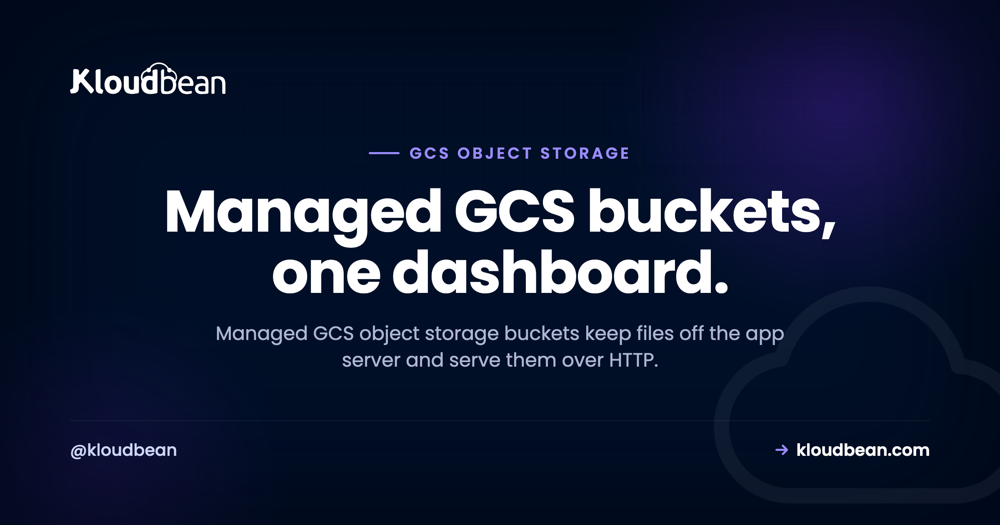
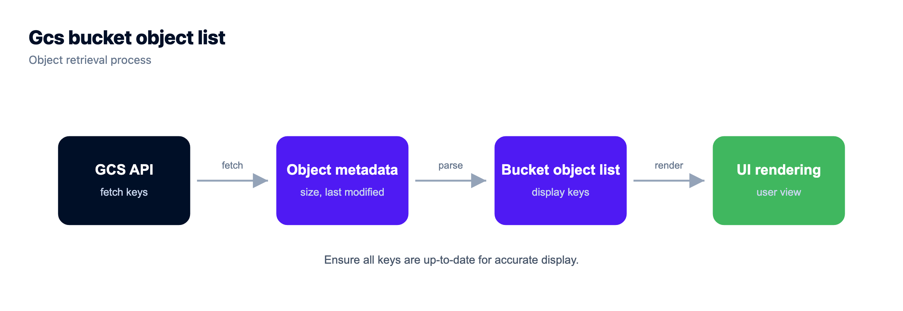
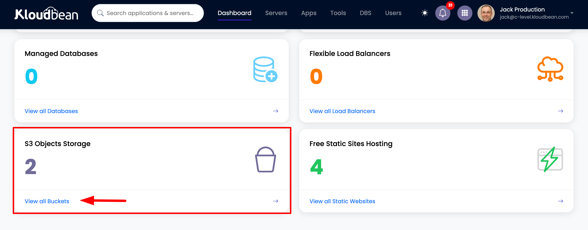
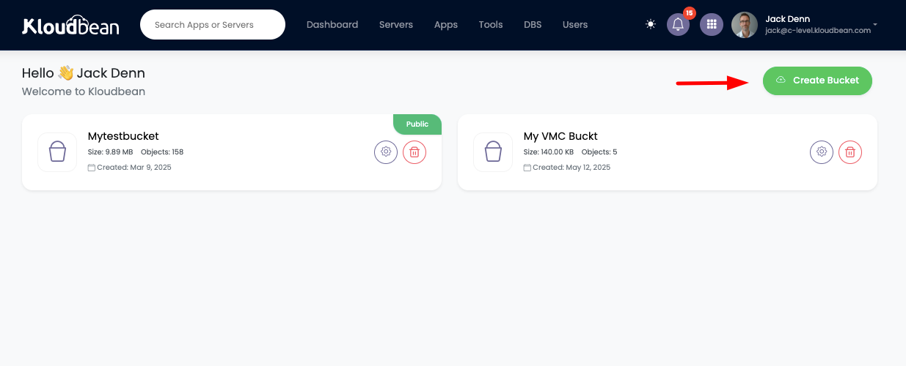
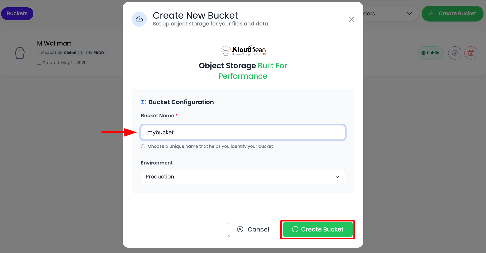
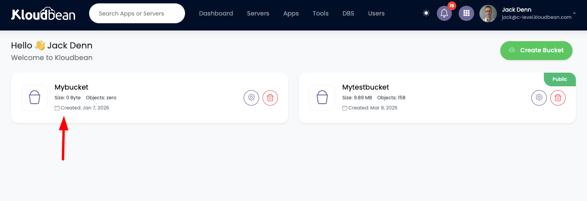
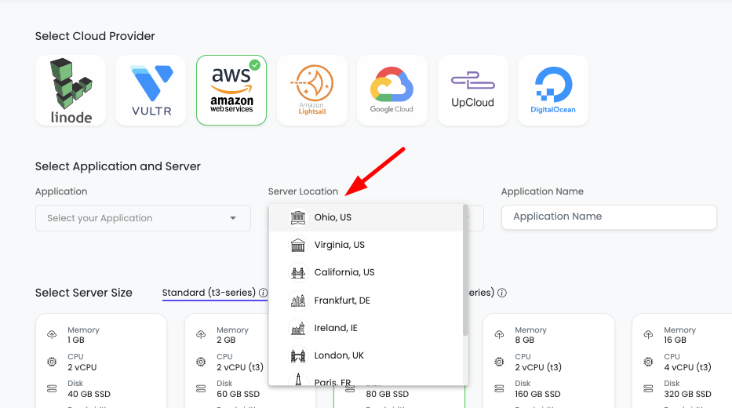
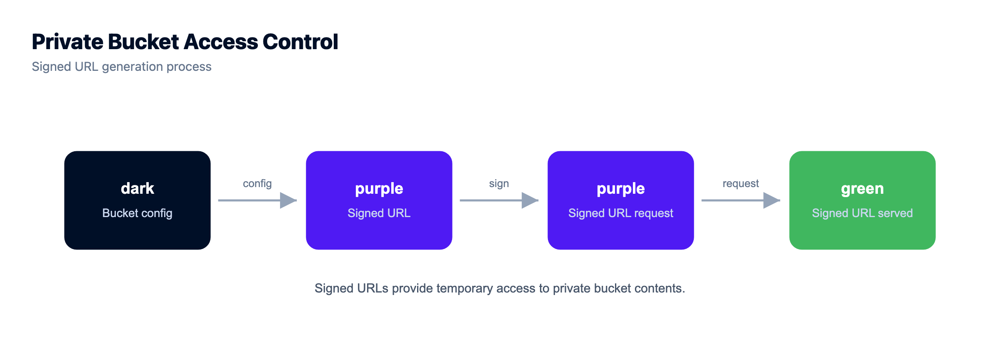
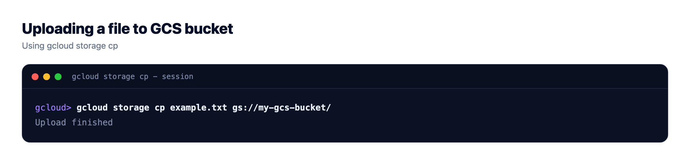

# GCS Object Storage Buckets: What They Are and When to Use Them

You're building on Google Cloud, or you're about to. Your app writes files. User uploads, product images, a nightly CSV export. Right now they land on the app server's disk, which is fine until the first redeploy wipes them or a second server can't find them. **GCS object storage buckets** fix that. This is a plain-English guide to Google Cloud Storage buckets: what object storage on Google Cloud actually is, how managed GCS works on Kloudbean, when to pick GCS over the S3-compatible buckets you can also run here, and how to store files in a bucket without shooting yourself in the foot.

> **Short answer:** Managed GCS object storage buckets are Google Cloud Storage buckets you create and control from one dashboard: files live as objects, named by a key and served over HTTP, never pinned to your app server's disk. Reach for GCS when your workload already sits on Google Cloud, or when you want your files next to a GCP region like Dammam. Prefer the S3-compatible buckets Kloudbean also offers if your tooling is built around the `aws` CLI and S3 SDKs. Either kind keeps uploads, media, and backups off the box.

## What GCS object storage buckets actually are

Start with the file you already understand. On a disk, a file has a path like `/var/www/uploads/avatar.png` and lives on one machine. Object storage drops the folder tree. You get a **bucket**, and inside it you store **objects** (Google calls each one a **blob**). An object is your bytes plus a little metadata and a **key**, its name. The key can read like a path, `uploads/2025/avatar.png`, but there's no real directory underneath. It's a flat namespace that allows slashes.

You don't mount a bucket, you talk to it over HTTP: store, fetch, delete. That's what makes object storage cheap and elastic. Google replicates your objects, so one dead disk loses nothing, there's no volume to fill, and you can rebuild the server anytime without the files noticing. For the deeper filesystem-versus-object walkthrough, the sibling guide on [S3-compatible object storage](https://www.kloudbean.com/blog/s3-compatible-object-storage/) takes it apart slowly. GCS is the same idea in Google's tooling.



## Managed Google Cloud Storage buckets on Kloudbean

Kloudbean added managed GCS buckets in December 2025. You create a Google Cloud Storage bucket from the same dashboard that runs your servers, managed databases, and apps, set it public or private, and manage the objects inside without leaving the console. No separate Google Cloud project to wire up, no second bill to babysit. Managed GCS bucket hosting, in the same place as everything else you run.

It sits beside the built-in S3-compatible object storage Kloudbean has offered since November 2024, with full AWS S3 SDK and CLI compatibility since March 2025. The real win isn't one bucket type over another. It's that both live in one account, so your files, servers, databases, and apps share a single login instead of scattering across consoles you forget to check.









## GCS or S3-compatible buckets: which should you pick?

Both keep files off the app server disk, both are managed for you, and you won't regret either for most workloads. The deciding factor is your ecosystem and your tooling, not raw capability.

Pick **managed GCS** when you already live in Google Cloud, or when you want objects sitting next to a GCP workload. If your compute runs in a Google region (say Dammam, GCP's in-Kingdom region for Saudi Arabia), the bucket sits close to the app that reads it. You also get Google's native toolchain, `gcloud storage` and the `google-cloud-storage` client libraries, which your team may already use.

Pick the **S3-compatible buckets** instead when your code and your habits are built on the S3 API. The `aws` CLI, boto3, the JavaScript v3 client, Laravel's `s3` disk, `django-storages`, an offload plugin. All of it speaks S3 and points at a bucket by changing an endpoint. That portability is why teams standardize on S3 even when they never touch Amazon.

<figure>
  <svg viewBox="0 0 760 372" role="img" aria-label="A chooser: pick managed GCS buckets when you are on Google Cloud, pick S3-compatible buckets when your tooling is built on the S3 API, and either way the files leave the app server disk" style="width:100%;height:auto;border:1px solid #e6e9f2;border-radius:16px;background:#f6f7fb">
    <title>GCS versus S3-compatible bucket chooser</title>
    <text x="30" y="40" fill="#000f27" font-family="Poppins,sans-serif" font-size="17" font-weight="700">Two ways to keep files off the app server</text>
    <rect x="34" y="66" width="336" height="176" rx="16" fill="#ffffff" stroke="#4F1AF3" stroke-width="2"/>
    <text x="58" y="102" fill="#4F1AF3" font-family="Poppins,sans-serif" font-size="16" font-weight="700">Pick managed GCS</text>
    <text x="58" y="134" fill="#1c2536" font-family="Poppins,sans-serif" font-size="13">You already run on Google Cloud</text>
    <text x="58" y="162" fill="#1c2536" font-family="Poppins,sans-serif" font-size="13">Objects beside a GCP workload (Dammam)</text>
    <text x="58" y="190" fill="#1c2536" font-family="Poppins,sans-serif" font-size="13">Google tooling: gcloud storage, gsutil</text>
    <text x="58" y="218" fill="#5b6a86" font-family="Poppins,sans-serif" font-size="12.5">gs://your-bucket/key</text>
    <rect x="390" y="66" width="336" height="176" rx="16" fill="#ffffff" stroke="#000f27" stroke-width="2"/>
    <text x="414" y="102" fill="#000f27" font-family="Poppins,sans-serif" font-size="16" font-weight="700">Pick S3-compatible</text>
    <text x="414" y="134" fill="#1c2536" font-family="Poppins,sans-serif" font-size="13">Your tooling is built on the S3 API</text>
    <text x="414" y="162" fill="#1c2536" font-family="Poppins,sans-serif" font-size="13">aws CLI, boto3, JS v3, Laravel disk</text>
    <text x="414" y="190" fill="#1c2536" font-family="Poppins,sans-serif" font-size="13">Portable across S3-compatible clouds</text>
    <text x="414" y="218" fill="#5b6a86" font-family="Poppins,sans-serif" font-size="12.5">s3://your-bucket/key</text>
    <line x1="202" y1="242" x2="202" y2="286" stroke="#4F1AF3" stroke-width="2.5"/>
    <path d="M202 286 l-5 -10 h10 z" fill="#4F1AF3"/>
    <line x1="558" y1="242" x2="558" y2="286" stroke="#000f27" stroke-width="2.5"/>
    <path d="M558 286 l-5 -10 h10 z" fill="#000f27"/>
    <rect x="34" y="290" width="692" height="58" rx="14" fill="#eaf7ee" stroke="#40b75f" stroke-width="2"/>
    <text x="380" y="317" text-anchor="middle" fill="#000f27" font-family="Poppins,sans-serif" font-size="14.5" font-weight="700">Either way, the files live off the app server disk</text>
    <text x="380" y="337" text-anchor="middle" fill="#2f9d4e" font-family="Poppins,sans-serif" font-size="12.5">durable, served over HTTP, and the server stays disposable</text>
  </svg>
  <figcaption>The choice is ecosystem and tooling, not capability. Both bucket types get files off the box and keep the server replaceable.</figcaption>
</figure>

Here's the same decision as a table you can scan:

| | Managed GCS buckets | S3-compatible buckets |
| --- | --- | --- |
| **Pick when** | You're in the Google Cloud ecosystem; objects beside a GCP workload | Your code and tools are built on the S3 API |
| **Native tools** | `gcloud storage`, `gsutil`, google-cloud SDKs | `aws` CLI, boto3, JS v3 client |
| **URL scheme** | `gs://bucket/key` | `s3://bucket/key` |
| **Portability** | Google Cloud native | Works across S3-compatible providers |
| **On Kloudbean since** | Dec 2025 | Nov 2024 (S3 API Mar 2025) |
| **Keeps files off the server** | Yes | Yes |



## Public vs private buckets, and why the default matters

A bucket is private by default, and that default is usually correct. Objects in a private bucket aren't reachable by a raw URL. When your app needs to hand a user a file, it generates a **signed URL**, a temporary link that grants access to one object for a set number of minutes, then expires. Right for invoices, private documents, or paid downloads.

A public bucket serves objects to anyone with the URL, which is what you want for a site's images, CSS, and other visible assets. Default to private, and go public only when the content is genuinely meant for the open web. Flipping a bucket public to fix a broken link is how private files land in Google's index. Set access on purpose.

## What actually belongs in a GCS bucket

A useful test: if it's a file your app reads or writes, and it isn't code, it probably belongs in a bucket. The regulars:

- **User uploads.** Avatars, documents, anything people send you. The first thing to move off the local disk, because uploads on a server disk vanish on a rebuild and can't be shared between two app instances.
- **Product media.** A store's photos, a gallery, a video library. Usually the bulk of your storage and the heaviest thing you serve. Put a CDN in front and visitors pull files from a nearby edge.
- **Static assets.** The hashed JS and CSS from a build, plus generated CSV reports and PDF invoices. Write them to a bucket, serve a link, stop piling temp files on the server.
- **Backups and exports.** A backup on the same server it protects isn't really a backup. Dumps and snapshots want to sit off-box, and a bucket is the durable home. The [server backups guide](https://www.kloudbean.com/blog/server-backups-guide/) goes deeper.

Two things stay out. Your *live* database, which needs fast random-access storage a bucket can't give it, so run a [managed database](https://www.kloudbean.com/blog/add-managed-database-to-your-app/) and only park its *backups* in a bucket. And your running app code, which gets deployed to the server, not fetched from storage.



## Working with GCS buckets: gcloud and gsutil basics

Google Cloud Storage speaks Google's tooling. The modern command is `gcloud storage`; the older `gsutil` still works. GCS bucket paths use the `gs://` scheme. The fastest way to prove a bucket works is from the terminal:

```bash
# upload a file into a bucket (modern gcloud)
gcloud storage cp report.pdf gs://my-bucket/exports/report.pdf

# list what's in a bucket
gcloud storage ls gs://my-bucket

# copy an existing uploads folder into the bucket, recursively
gcloud storage rsync ./public/uploads gs://my-bucket/uploads --recursive

# the older gsutil syntax does the same thing
gsutil cp report.pdf gs://my-bucket/exports/report.pdf
gsutil rsync -r ./public/uploads gs://my-bucket/uploads
```

In code the shape is just as short. A small Python example with the official client, credentials pulled from the environment rather than hard-coded:

```python
from google.cloud import storage

client = storage.Client()
bucket = client.bucket("my-bucket")
blob = bucket.blob("uploads/avatar.png")

blob.upload_from_filename("avatar.png")

# a temporary link that works for one hour, then expires
url = blob.generate_signed_url(expiration=3600)
```

And the Node version:

```js
import { Storage } from "@google-cloud/storage";

const storage = new Storage();

await storage.bucket("my-bucket").upload("avatar.png", {
  destination: "uploads/avatar.png",
});
```

The credentials never appear in the source. Storage keys are as sensitive as a database password, so keep them in environment variables and out of Git. If you want the S3 toolchain instead of Google's, that's the signal you belong on Kloudbean's [S3-compatible buckets](https://www.kloudbean.com/blog/s3-compatible-object-storage/), where the same `aws` CLI and SDK calls work by pointing at an endpoint.



## The one storage habit worth burning in

The single highest-value storage habit I know is boring: never write user uploads to the app server's disk. Not to `/uploads`, not to `/tmp`, not "just for now." The moment a file exists only on one box, that box stops being disposable. You can't rebuild it without a careful copy-off, you can't add a second server behind a load balancer without half the uploads 404ing, and a disk failure turns into data loss.

It's the anti-pattern we see most, and it always looks the same. An app runs fine on one server for a year. The team adds a second for capacity. Now images uploaded to server A are missing on server B, because they only lived on A's disk. Buckets from day one skip that whole class of incident. Send the file to a bucket, store the key in your database, serve it back with a signed or public URL. The server holds code, nothing else.

## A word on egress and cost

One cost is worth understanding before you commit to any bucket: **egress**, the charge many clouds apply to data leaving storage. Uploading in is usually free; serving out is metered, and on a media-heavy site it can dwarf the storage cost. This isn't a GCS-specific quirk, and I won't promise you a magic number. Egress terms vary by provider and change over time, so check the current data-transfer-out pricing for whatever you pick, GCS or S3-compatible. We pulled the math apart in [the egress fees breakdown](https://www.kloudbean.com/blog/zero-egress-object-storage/). The first lever is usually a CDN in front of the bucket, so cached files serve from the edge.

## Where this sits in the wider stack

A bucket is one piece of owning your whole stack instead of renting slices from five vendors. The bucket holds files. A managed database holds the structured data. The stateless app server runs the code and scales out when traffic climbs. If you're weighing where to run the whole thing, we put the tradeoffs side by side in [DigitalOcean vs Kloudbean](https://www.kloudbean.com/blog/digitalocean-vs-kloudbean/).

## GCS Object Storage Buckets: the caveats

Managed GCS buckets run alongside the S3-compatible buckets, and both are for files: uploads, media, static assets, backups, exports. They're not a database, so keep live data in a [managed database](https://www.kloudbean.com/blog/add-managed-database-to-your-app/) and store only its backups in a bucket. Kloudbean runs Linux stacks, and "managed" means the platform provisions the bucket and handles access controls while the objects stay yours to export. Standard plans start from $8/mo, Enterprise is custom, and storage terms change, so confirm the current numbers on the pricing page.

<!-- cta:start -->
**Prototype to production, without the babysitting.**

Move the whole thing onto a managed server you own: always-on processes, a managed database for real data, object storage for uploads, and Git deploys with live build logs.

- Managed databases
- Always-on processes
- Object storage
- Automatic backups
- Free SSL
- Git deploy
- Free migration

[Start free](https://console.kloudbean.com/register) · [See plans](https://www.kloudbean.com/pricing/)
<!-- cta:end -->

## FAQ

**What are managed GCS object storage buckets?**
Google Cloud Storage buckets you create and control from one dashboard. Files are stored as objects (Google calls them blobs), named by a key and served over HTTP instead of sitting on your app server's disk. On Kloudbean they've been available since December 2025, with public or private access and objects you can export anytime.

**When should I use GCS instead of S3-compatible storage?**
Use GCS when your workload already runs on Google Cloud, or you want objects next to a GCP region like Dammam, and your team prefers Google tooling like gcloud storage. Choose S3-compatible buckets when your code is built on the S3 API (the aws CLI, boto3, a Laravel s3 disk). Both keep files off the server, so it comes down to ecosystem, not capability.

**How do I upload files to a Google Cloud Storage bucket?**
From the terminal, use gcloud storage cp for one file or gcloud storage rsync for a whole folder; the older gsutil cp and gsutil rsync do the same. In code, use the google-cloud-storage client for your language and load credentials from environment variables rather than hard-coding them.

**What is the difference between a public and a private GCS bucket?**
A private bucket keeps objects unreachable by a raw URL; your app grants access with a temporary signed URL that expires. A public bucket serves objects to anyone with the link, which suits site images. Default to private and make a bucket public only when the content is genuinely public.

**Can I store my database in a GCS bucket?**
No. A live database needs fast, random-access storage that object storage isn't built for. Run a managed database engine for the live data, and store the database backups in a bucket so they sit off the machine the database runs on.

**Does GCS charge egress fees?**
Serving data out of any object storage can carry an egress charge, and terms vary by provider and change over time, so check the current data-transfer-out pricing for whatever you choose. Uploading in is usually free. On a media-heavy site, egress can beat the storage cost, and a CDN in front of the bucket is the usual way to cut it.

**Can I manage GCS buckets from the Kloudbean dashboard?**
Yes. Since December 2025 you can create managed Google Cloud Storage buckets in the console, set them public or private, and manage the objects inside, in the same dashboard as your servers, databases, and apps. It sits beside the S3-compatible object storage available since November 2024.

**Do I have to use Google tooling to work with GCS?**
For a native GCS bucket, yes: gcloud storage, gsutil, and the google-cloud-storage client libraries. If you'd rather keep the S3 toolchain you already know, that's the signal to use Kloudbean's S3-compatible buckets instead, where the aws CLI and S3 SDKs work by pointing at an endpoint.

---

*By Kloudbean Storage Team · Managed GCS buckets, one dashboard.*
