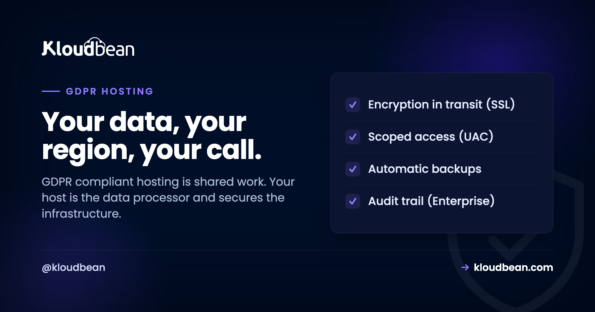
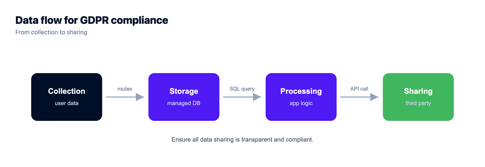
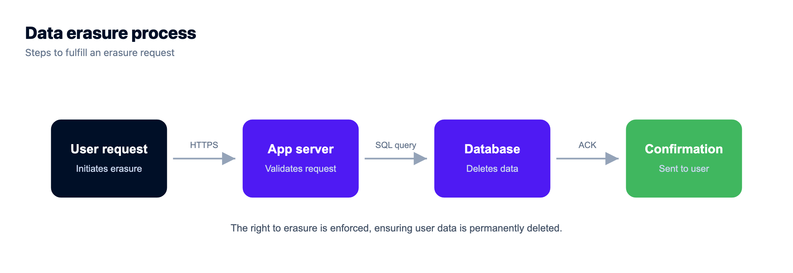

# GDPR-Compliant Hosting: Who Actually Owns What

A data-processing request lands in your inbox. Or a security questionnaire does, and there it is in black and white: show that your hosting handles personal data the way GDPR expects. So you go search for "GDPR compliant hosting" and hope you can buy your way out of the problem. You can't, not entirely. But the part a host genuinely owns is real, and worth getting right.

GDPR is the EU's data-protection law. It's about personal data, the people that data belongs to, and the rights those people hold over it. GDPR-compliant hosting is hosting that hands you the controls to build a compliant system: an EU region, encryption in transit, access control, backups, and the ability to actually delete someone's data. It isn't a button that makes you compliant. Split the work cleanly and the whole thing calms right down.

> **The short version:** Your host is a data *processor* and secures the infrastructure: EU-region residency, encryption in transit, access control, backups. You're the data *controller* and own the rest, which is most of it: what you collect, your lawful basis, consent, retention, and answering data-subject requests. Pick an EU region on purpose, sign a Data Processing Agreement, then put your real effort into your app. That's where GDPR actually lives.

## Controller vs processor: the one split that explains everything

If you take a single idea from this page, take this one. GDPR gives two roles to the parties handling personal data. The **controller** decides what data gets collected and why. The **processor** handles that data on the controller's instructions. In almost every case, you're the controller and your host is the processor.

That matters because the two roles carry different duties. As controller, you answer for the decisions: what you gather, whether you had a lawful reason, how long you keep it, and how you honour someone's request to see or erase their data. As processor, your host answers for running the infrastructure safely and only doing what you've asked with the data. The contract that pins this down is a **Data Processing Agreement (DPA)**, and any host worth using will sign one. A host cannot be "compliant for you." It can hold up its half.

```
        YOU (Controller)                 YOUR HOST (Processor)
   You decide. You answer for it.       Runs the infrastructure.
   • What personal data you collect     • Secure servers and hardening
   • Lawful basis and consent           • Encryption in transit (SSL)
   • Access and deletion requests       • Automatic backups
   • Retention and privacy policy       • The region you choose
              └───────────────[ DPA ]───────────────┘
        Shared: you pick the region, and you prepare
                for breach notification together.
```

## Who owns what, line by line

Here's the same split as a checklist you can scan. Notice how little of it is actually about the server, and how much is about your choices.

| What has to happen | Who owns it |
| --- | --- |
| Decide what personal data you collect, and why | You (controller) |
| A lawful basis and clear consent | You |
| Answer access, correction and deletion requests | You (your app) |
| Retention limits and a real privacy policy | You |
| Secure, hardened, patched servers | Host (processor) |
| Encryption in transit (SSL) | Host provides, on by default |
| Automatic backups of the data | Host |
| Physical data-center security | Host and the underlying cloud |
| Choosing an EU region | You choose it, host offers it |
| Detecting and reporting a breach | Shared |
| A signed Data Processing Agreement | Shared, both sign |

## What GDPR actually asks of your infrastructure

Four of GDPR's ideas land squarely on hosting. This is the host's homework, and it's genuinely useful.

**Data residency.** Keeping EU residents' personal data in an EU region is the cleanest path, and it's a choose-your-region decision at launch. It isn't strictly mandatory, because GDPR allows transfers out of the EU with proper safeguards like an adequacy decision or Standard Contractual Clauses. But picking Frankfurt or Amsterdam up front removes a whole category of paperwork and doubt. If you're weighing where to put things, we go deeper in [data residency explained](https://www.kloudbean.com/blog/data-residency-explained/).

**Security of processing.** GDPR expects appropriate technical measures, which in practice means encryption in transit, a firewall, access control, and a stack that gets patched. Keeping personal data off the public internet is a big one. Lock your database down with IP allow-listing so only your app server can reach it and scanners never find it. On enterprise you can go further and isolate it on [a private network (VPC)](https://www.kloudbean.com/blog/what-is-a-vpc/). Then tighten the app itself with sensible [security headers](https://www.kloudbean.com/blog/security-headers-guide/).

**Storage limitation and resilience.** You keep data only as long as you need it, and you keep it recoverable. Automatic, tested [backups](https://www.kloudbean.com/blog/server-backups-guide/) cover the resilience half. The "how long" half is your retention policy, which is a decision, not a setting.

**Breach readiness.** GDPR gives you a tight window to report a serious breach, so you need to know when one happened and what it touched. Logging and monitoring matter here. On enterprise accounts, an immutable audit trail (searchable, exportable) is exactly the evidence you'd reach for.






## The rights that live in your code, not your region

Here's where teams get lulled. They host in an EU region, tick a mental box, and forget the part GDPR spends the most words on: the rights of the person whose data you hold. Access, correction, deletion, portability. Those are almost entirely your app's job, and no region setting touches them.

The one that trips people up is deletion. Someone asks you to erase their data, and you discover your app never really deletes anything. It flips a `deleted_at` flag and moves on. The row is still there. So are the copies: in your backups, in your logs, in that analytics tool you bolted on, in the CSV someone exported last quarter. A genuine "right to erasure" means you can find a person across all of that and actually remove them. That's a design decision you make early or pay for later.

A basic control that helps: don't scatter the credentials that unlock personal data through your codebase. Keep them as managed, access-controlled environment variables so only the right people and services can reach the data at all.


<!-- ADD IMAGE: your app's delete-account flow, or a data-export screen, showing a real erasure or access request being fulfilled -->

## So what is "GDPR compliant hosting", really?

It's hosting that gives you the controls to build a compliant system. Nothing more, nothing less. An EU region so residency is a choice you control. Encryption in transit so data isn't readable on the wire. IP allow-listing so your database isn't sitting in the open. Access control so the wrong people can't reach it. Backups so it survives a bad day. And a DPA that puts the processor relationship in writing.

My honest take after seeing plenty of these: pick your region on purpose, sign the DPA, and then stop worrying about the host. Spend that energy on your app, because collecting less data, having a lawful basis, and honouring requests is where the real risk sits. A perfect server in Frankfurt won't save you if you hoard data you don't need and can't delete it on request.

> **One honest caveat.** This is a plain-English guide, not legal advice. GDPR has genuine nuance, and edge cases (special-category data, large-scale profiling, cross-border transfers) deserve a qualified professional. Use this to calm the panic and get the infrastructure half right, then check the specifics with someone who does this for a living.

So where does Kloudbean sit in all this? Squarely on the processor's side of the line. It gives you the infrastructure controls your GDPR work stands on: your choice of cloud and EU region, free SSL for encryption in transit, IP allow-listing so your database answers only to your app server, subusers and granular access control for least privilege, automatic backups, and, on enterprise accounts, private networking (VPC) and an immutable audit trail built for exactly this kind of evidence. The servers run on tier-1 clouds whose own data centers carry the major certifications. What Kloudbean does not do, and won't pretend to, is hand you a finished status or make you compliant on its own. That half, the controller's half, stays yours. Sibling reads if you're mapping your whole obligation: [SOC 2 compliant hosting](https://www.kloudbean.com/blog/soc2-compliant-hosting/) and [PCI compliant hosting](https://www.kloudbean.com/blog/pci-compliant-hosting/).

<!-- cta:start -->
**Prototype to production, without the babysitting.**

Run the app as an always-on process with managed databases, Redis, object storage, and automatic backups beside it. Deploy from Git with live build logs, and keep the infrastructure someone else's problem.

- Managed databases
- Always-on processes
- Object storage
- Automatic backups
- Free SSL
- Git deploy
- Free migration

[Start free](https://console.kloudbean.com/register) · [See plans](https://www.kloudbean.com/pricing/)
<!-- cta:end -->

## GDPR hosting FAQ

**Does GDPR apply to me if I'm not based in the EU?**
Yes, if you process the personal data of people in the EU. GDPR follows the data subject, not your company's address. A US or Australian business with European users is in scope. Being outside the EU is not the exemption many people assume it is.

**Does GDPR require me to store data in the EU?**
Not strictly, but an EU region is the simplest path. GDPR permits transfers outside the EU when you have proper safeguards, such as an adequacy decision or Standard Contractual Clauses. Choosing an EU region at launch just removes a lot of that paperwork, which is why it's the popular default.

**If my host is GDPR compliant, am I compliant too?**
No. It's shared. You're usually the controller and your host is the processor. The host secures the infrastructure and signs a Data Processing Agreement. You still own consent, lawful basis, retention, and answering data-subject requests. A host cannot be compliant for you.

**What is a Data Processing Agreement, and do I need one?**
A DPA is the contract between you (controller) and your host (processor). It sets out what the processor may do with the data and the safeguards it applies. If a provider processes personal data on your behalf, you want a DPA in place. Any serious host will offer one.

**What does GDPR-compliant hosting actually include?**
The infrastructure controls GDPR leans on: EU-region residency when you want it, encryption in transit through free SSL, access control over who can reach personal data, IP allow-listing, automatic backups, and, on enterprise, private networking (VPC) and an immutable audit trail. That covers the processor half. Your practices cover the controller half.

**Who handles a delete my data request?**
Mostly your app. The host can delete data on your instruction and expire backups, but your code has to be able to find a person and erase them everywhere: the database, logs, exports, and any third-party tools. Design for real deletion early, not a soft-delete flag that leaves the data in place.

**Do small sites and startups have to follow GDPR?**
Yes. There is no blanket small-business exemption. If you process EU residents' personal data, the core principles apply at any size: lawful basis, user rights, security, and breach notification. Small organisations get some relief on certain record-keeping duties, but the substance stands.

**Is choosing an EU region enough on its own?**
No. Region is one control, and an important one, but GDPR is mostly about your practices. You can host perfectly in the EU and still fall short by collecting data you don't need or ignoring deletion requests. Treat the region as the foundation, then do the app-level work on top.

---

*Kloudbean · Your data, your region, your call.*
