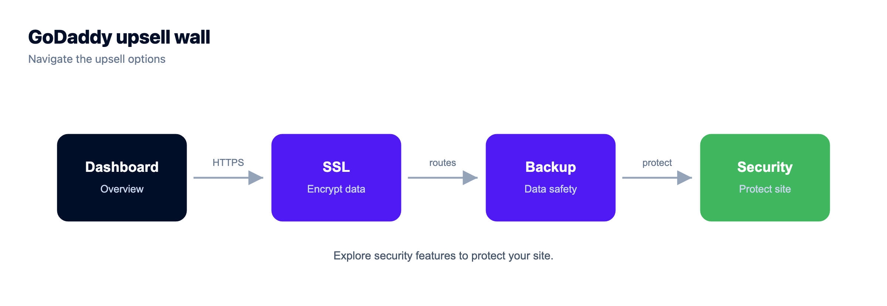
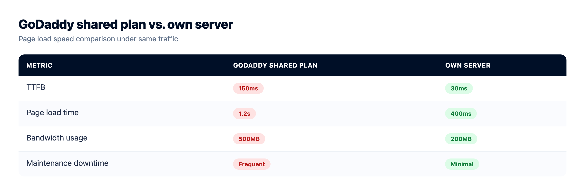
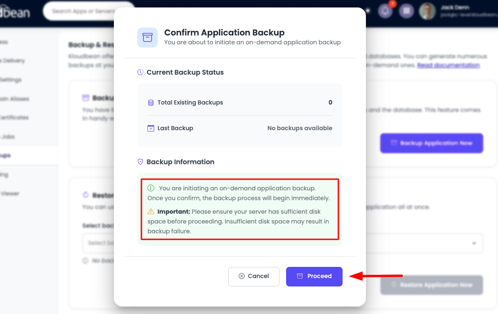
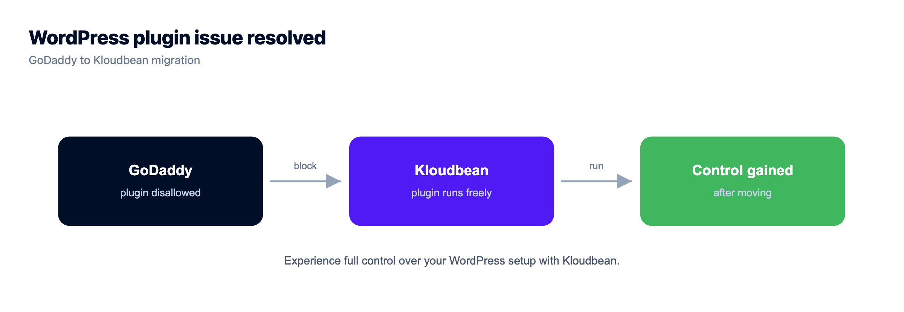
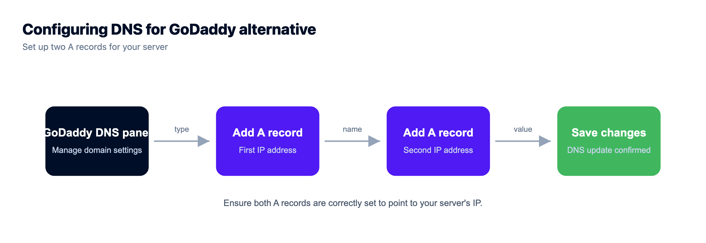

# The GoDaddy Alternative for When the Upsells Stop Fixing the Speed


GoDaddy will sell you a domain in ninety seconds and a hosting plan in the same checkout. That part's easy. The hard part shows up later, when your site crawls under real traffic, the dashboard keeps pitching add-ons, and you find out you can't SSH in to fix anything. If you're hunting for a GoDaddy alternative for hosting, and I mean the hosting, not the domain, this is for you. The move that actually solves it is managed cloud: your own server resources, managed databases, Git deploy, and staging, without turning you into a sysadmin.

> **The short version**
>
> GoDaddy is the biggest registrar around and fine for a small brochure site. Once its shared or Managed WordPress plans start throttling you (slow TTFB under load, endless upsell prompts, no root access, a stuck PHP version, no real managed databases), it's time to move up. Kloudbean runs your site on your own server across seven clouds, with managed databases, Git deploy, staging, and automatic backups, from $8/mo. Keep the domain at GoDaddy and just point the DNS.

## First, the honest part: what GoDaddy gets right

Credit where it's earned. GoDaddy is the largest domain registrar on the planet, and buying a domain there is genuinely painless. For a small brochure site that gets a handful of visitors a day, the cheap shared plan does the job. GoDaddy even offers Windows hosting with Plesk, which matters if your world is ASP.NET or a Windows-only app. Kloudbean doesn't do that, and I'll come back to it later.

So this isn't a takedown. If your entire need is a parked domain and a one-page site, stay put. The trouble starts when the thing you built actually catches on. Traffic climbs, the app gets heavier, and the plan that felt like a bargain starts feeling like a cage. That needs a different kind of host.

## Signs you've outgrown GoDaddy hosting

Nobody sends you an email that says "you've outgrown this plan." You just start collecting symptoms. Here's what outgrowing GoDaddy hosting tends to feel like in practice.

- **Fast at midnight, molasses at noon.** Pages that snap open when it's quiet take six or eight seconds once traffic arrives. That's the shared resource cap doing its job, protecting the box by throttling you.
- **The dashboard never stops selling.** SSL upsell, backup upsell, SiteLock security upsell, email upsell, "boost my site" upsell. Half the features you assumed were included turn out to be line items, and the renewal bill climbs every year.
- **Managed WordPress won't let you.** There's a banned-plugins list, so your favorite caching or backup plugin gets blocked. You can't tune the server, and control lives with the platform, not with you.
- **No root, no SSH.** You can't install a package, edit a config, or run the one command your app needs. The control panel decides what's allowed, and it usually says no.
- **You're stuck on a dated stack.** An older PHP version you can't easily bump, and no clean way to run Node.js or Python. Your framework wants things the plan simply doesn't offer.
- **One basic MySQL and that's the whole menu.** No PostgreSQL you control, no Redis for caching, no managed engines you'd pick on purpose.
- **Deploys are FTP or the File Manager.** You drag files up, refresh, and hope nothing broke. There's no Git, no build step, no rollback.
- **No real staging.** You edit the live site because there's nowhere safe to try a change first, or staging is locked behind a higher tier.

One of these alone is just a papercut. Three or four together is your site telling you it needs its own room. That's the point where an alternative to GoDaddy hosting stops being a maybe.



## The add-on problem, drawn out

The reason a cheap GoDaddy plan rarely stays cheap is the bolt-on model. You buy a base plan, then SSL, backups, and security get sold to you as separate line items. Managed cloud flips that. You rent your own server, and the platform folds the essentials in. Same idea as a picture.

*(Diagram: GoDaddy sells a base plan and then bolts on SSL, backups, and security as separate charges. Managed cloud gives you one server with the essentials included, all in one account you control.)*

## GoDaddy hosting vs managed cloud: what actually changes

The core shift is about who owns the resources. On GoDaddy shared hosting you rent a slice of one busy machine, capped so the neighbors don't suffer. On managed cloud you get your own server, with the maintenance still handled for you. So the real question is which flavor of "not shared hosting" to pick.

Rent a **raw VPS** and you own every layer from the kernel up. More power, yes, but now you're the sysadmin. You patch the OS, configure the web server, set up the firewall, install SSL, wire up backups, and answer the pager when it falls over at 2am. That bill is bigger than it looks, and we broke it down in [the real cost of an unmanaged VPS](https://www.kloudbean.com/blog/the-real-cost-of-unmanaged-vps/).

**Managed cloud** is the middle lane most people leaving GoDaddy actually want. You get your own server resources, like a VPS, but the OS, stack, SSL, patching, and backups are handled for you. It's a cleaner cPanel alternative with real muscle underneath: a proper dashboard on top, dedicated resources below, and none of the manual babysitting. The full breakdown lives in [managed vs unmanaged hosting](https://www.kloudbean.com/blog/managed-vs-unmanaged-hosting/) and [what is a managed server](https://www.kloudbean.com/blog/what-is-a-managed-server/).

My honest take? Most people escaping GoDaddy's upsell treadmill don't want a bare Ubuntu box and a lost weekend. They want the site to stop timing out. Managed cloud gets you there.

## GoDaddy hosting vs Kloudbean managed cloud

A fair, side-by-side look. GoDaddy wins a few rows on purpose, and I've kept those honest.

| | GoDaddy hosting | Kloudbean managed cloud |
|---|---|---|
| **Resources** | Shared slice of one box, capped | Your own dedicated server resources |
| **Root / SSH** | Limited or none on shared and Managed WordPress | Full root and SSH access |
| **Managed databases** | Basic MySQL | 7 engines: MySQL, MariaDB, PostgreSQL, Redis, Memcached, Elasticsearch, MongoDB |
| **Git deploy** | Manual FTP or File Manager | Managed CI/CD from GitHub, build and deploy on push, live build logs |
| **Staging** | Tier-gated or missing | Staging for WordPress and Laravel |
| **Scaling / resize** | Jump plan tiers, hard ceiling | Resize your server when you need more |
| **Stack freshness** | Often older PHP, PHP-centric | Modern PHP, Node.js, Python, Ruby, Java on Linux |
| **Upsells / add-ons** | SSL, backups, security sold separately | Free SSL, automatic backups, firewall included |
| **Price to start** | Cheaper, a few dollars a month | From $8/mo, more power for more money |
| **Windows hosting** | Yes, Windows and Plesk available | No, Linux only |
| **Domain registration** | Yes, it's a registrar (keep your domain here) | Not a registrar, point your DNS instead |

Read the last three rows plainly. GoDaddy is cheaper to start, it sells Windows hosting, and it registers domains. Those are real advantages, and you shouldn't move for the sake of moving. You move up when the cheap plan is costing you visitors, patience, and a growing monthly bill. For the same logic aimed at cheap registrars, our [Namecheap alternative](https://www.kloudbean.com/blog/namecheap-alternative/) walks the same road from a different starting point.



## How to move your site off GoDaddy

The move is less dramatic than it sounds. Nothing here needs a terminal marathon. Here's the whole path.

### 1. Launch a server

Start with the cloud (AWS, Lightsail, Google Cloud, Linode, Vultr, DigitalOcean, UpCloud), then region, then size. That's your own box, not a shared slice you fight the neighbors for. You can resize it later, so don't agonize over the first choice.


### 2. Add your application

Add the app you're moving. There are one-click stacks for WordPress, WooCommerce, Laravel, Magento, Drupal and Joomla. Running something GoDaddy never made easy? Node.js, Python, Ruby, and Java all have a home here, and static sites host free.


### 3. Bring your site over

Two paths. If it's a WordPress or PHP site, free migration assistance can move it for you, files and database included. If it's a codebase in Git, connect the repo and let managed CI/CD build and deploy on every push, with live build logs you can watch. No more dragging files up over FTP and praying.


Connect GitHub and deploy on push, with live build logs. More in the [Git deploy guide](https://www.kloudbean.com/blog/ci-cd-auto-deploy-from-github/).

### 4. Turn on backups

Backups are on by default, not a checkbox you'll forget. You can see them, and you can restore from one when you need it. If you've ever lost a site to a bad plugin update, you already know why this matters. The full picture is in the [server backups guide](https://www.kloudbean.com/blog/server-backups-guide/).





## Keep your GoDaddy domain, just point the DNS

You don't have to transfer your domain anywhere. Leave it registered at GoDaddy and point its DNS at your new server. In GoDaddy's DNS management, open your domain, go to the records table, and set an A record for the root and one for `www`, both aimed at your server's IP:

```
# GoDaddy: My Products -> Domain -> DNS -> Manage DNS -> Records
# Type    Name   Value            TTL
# A       @      203.0.113.42     600 seconds
# A       www    203.0.113.42     600 seconds

# The same records in zone-file form:
example.com.       600  IN  A   203.0.113.42
www.example.com.   600  IN  A   203.0.113.42
```

Drop the TTL to 600 seconds a day before you cut over so the change propagates fast, then raise it once you're settled. Because the domain name doesn't change, your URLs stay the same, so a WordPress move needs no search-and-replace across the database. Once DNS points at the new box, request a free SSL certificate and you're serving over HTTPS.

> **Keeping your GoDaddy domain? No transfer needed.** Kloudbean isn't a registrar, and it doesn't need to be. Your domain stays at GoDaddy, you edit two DNS records, and the hosting moves. Your domain registration and your GoDaddy email don't have to change at all.



## Moving a WordPress site off GoDaddy

This is the most common move we see, and Managed WordPress is usually the reason. On GoDaddy's managed plans you inherit a banned-plugins list, so the caching or backup plugin you rely on may be blocked, and tuning the server isn't on the menu. After the move, that control comes back. You run the plugins you want, staging is there for the risky changes, and free migration assistance handles the files and the database so you're not babysitting an export at midnight. There's a deeper walkthrough in [managed WordPress hosting](https://www.kloudbean.com/blog/managed-wordpress-hosting/).

Not on WordPress? Moving off GoDaddy isn't a PHP-only story. Node.js, Python, Ruby, and Java run here as first-class citizens, static sites host free, and you can run cron jobs from the dashboard instead of hunting for a hidden cron panel. Whatever your team or an AI tool handed you, it probably fits.

## Limits worth naming

Straight talk, because fair cuts both ways. Kloudbean isn't a domain registrar, and it isn't a $1 shared plan. If all you need is a parked domain and a single static page, GoDaddy is cheaper and completely fine, and you should stay. And if you specifically need Windows, Plesk, or a .NET app, Kloudbean isn't that, because it's Linux managed cloud. What it is: your own server across seven clouds, from $8/mo, for sites and apps that have outgrown the shared slice and the upsell wall. Managed means the server, stack, SSL, backups, and patching are handled for you, while your code and your data stay yours to take anywhere.

<!-- cta:start -->
**Move it once. Own it after.**

Migration assistance is free and there is a free trial to prove the setup first. You keep Git-based deploys, get managed databases beside the app, and pay a flat monthly price on the cloud you choose.

- Free migration assistance
- Free trial
- Seven cloud providers
- Flat monthly price
- Managed databases
- Git deploy

[Start free](https://console.kloudbean.com/register) · [See plans](https://www.kloudbean.com/pricing/)
<!-- cta:end -->

## FAQ

**Is Kloudbean a domain registrar?**

No, and it doesn't pretend to be. Kloudbean is managed cloud hosting, not a place to buy or register domains. Keep your domain wherever you like, including GoDaddy, and point its DNS at your Kloudbean server. Your registration and your email stay exactly where they are.

**Can I keep my GoDaddy domain?**

Yes. There's no transfer needed. In GoDaddy's DNS management you set an A record for the root and for `www` pointing at your server's IP, and that's it. Because the domain name doesn't change, your existing URLs keep working.

**Is managed cloud better than GoDaddy hosting?**

If GoDaddy's shared or Managed WordPress plan is throttling you with slow pages and a rising add-on bill, then yes. You get your own server resources instead of a shared slice, plus managed databases, Git deploy, staging, and backups included. If your site is tiny and quiet, GoDaddy is cheaper and fine. Move up when you feel the ceiling.

**Will my WordPress site move from GoDaddy?**

Yes, and it's the most common migration we handle. WordPress and WooCommerce run on a one-click stack, and free migration assistance moves the files and the database for you. Since you keep the same domain, there's no URL rewrite across the database, and the plugins GoDaddy Managed WordPress blocked will run again.

**Does Kloudbean offer Windows hosting?**

No. Kloudbean is Linux managed cloud, so there's no Windows, Plesk, or .NET here. GoDaddy does offer Windows hosting, so if that's a hard requirement for your app, GoDaddy is the better fit. For PHP, Node.js, Python, Ruby, and Java on Linux, Kloudbean is built for it.

**Is it more expensive than GoDaddy?**

To start, yes. GoDaddy shared hosting is a few dollars a month, and Kloudbean managed cloud starts from $8/mo. You're paying for dedicated resources and a managed platform instead of a shared slice, and SSL and backups are included rather than upsold. Confirm the current numbers on the pricing page first.

**Do I need to be a sysadmin or know Linux?**

No. That's the whole point of managed cloud. The platform handles the OS, the stack, SSL, patching, and backups, so you get your own server without the server chores. You have root and SSH if you want them, but you're never forced to touch either.

**What happened to all the GoDaddy add-ons and upsells?**

They mostly become included. Free SSL is standard, automatic backups are on by default, and baseline hardening with a firewall and Fail2ban comes with the server. Instead of a base plan plus a stack of separately billed extras, you rent one server and the essentials come with it.

**Can I run Node.js or Python, not just PHP and WordPress?**

Yes. Node.js, Python, Ruby, and Java all run here alongside PHP stacks like WordPress, Laravel, and Magento. Static sites host free, and you can wire up cron jobs and Git deploys from the dashboard. Shared hosting rarely gives you that range.

**How long does migration take, and is there downtime?**

For most sites the move is quick, and free migration assistance can do the heavy lifting. The usual trick to avoid downtime is to migrate first, test on the new server, then switch the DNS once you're happy. Traffic only moves when you point the A records over, so you cut across on your schedule.

---

*By Kloudbean Platform · Developer-grade hosting*
