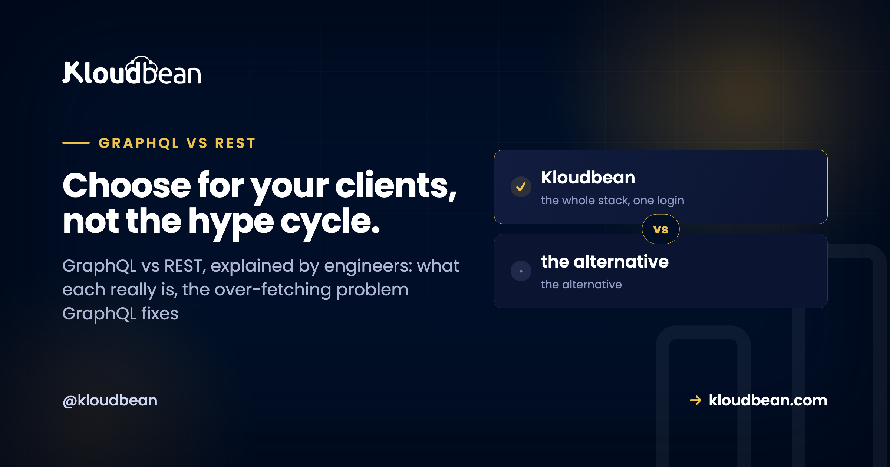

# GraphQL vs REST: An Honest Engineering Comparison (and When to Use Each)

By Kloudbean Engineering · Choose for your clients, not the hype cycle.

GraphQL vs REST is one of those debates that generates more heat than light, usually because people compare a feature list instead of the tradeoffs that actually bite in production. Both are ways to build an API over HTTP. REST has been the default for years. GraphQL showed up to fix a specific pain, and it brought a fresh set of its own. So here is the honest engineering version: what each really is, where GraphQL genuinely wins, what it quietly costs you, and a simple rule for choosing.

> **The short, useful version.** REST models your data as resources you hit with HTTP verbs. GraphQL exposes one endpoint and a typed query language where the client asks for exactly the fields it wants. GraphQL shines when many different clients need different data shapes. REST stays simpler for CRUD apps and public APIs, with easier caching. Neither is a winner in the abstract.

## What REST and GraphQL actually are

Strip away the tooling and the two are simpler than the arguments around them suggest.

**REST** models your backend as resources. A user, an order, a product, each gets a URL, and you act on it with HTTP verbs: GET to read, POST to create, PUT or PATCH to update, DELETE to remove. Call GET /users/42 and you get user 42 back, usually as JSON, in whatever shape the server decided. The rules are conventions, not a strict spec, which is why no two REST APIs feel quite alike. But everyone already understands the shape, and that familiarity is worth a lot.

**GraphQL** takes a different bet. Instead of many endpoints you get one, usually /graphql, plus a typed schema that describes every type and field the API exposes. The client sends a query naming exactly the fields it wants, and the server answers in that exact shape, nothing extra. It is a query language sitting in front of whatever databases and services you actually have. The schema is the contract, and it is strongly typed, so tooling can validate a query before it ever runs.

One line to hold onto: REST is about resources and verbs, GraphQL is about a single endpoint and a query language. Almost every difference downstream falls out of that one design choice.

## The problem GraphQL solves: over-fetching and under-fetching

GraphQL did not appear for fun. It came out of a real problem at scale: mobile clients talking to APIs designed for a different screen.

**Over-fetching** is when an endpoint hands you far more than you need. Say you want a user's name and avatar for a header. GET /users/42 returns the name and avatar, plus email, address, billing settings, notification preferences, timestamps, and more. You wanted two fields. You paid to serialize, send, and parse twenty. On a phone on a patchy connection, that waste is real.

**Under-fetching** is the mirror image. One endpoint does not have everything the screen needs, so you fire a second request, then a third. Load the user, then load their recent posts from /users/42/posts, then load comments for each post. That is round-trip sprawl, and latency stacks up fast.

GraphQL's core win is that it kills both in one move. The client sends a single query describing exactly the fields and relationships it wants, across what would have been several REST endpoints, and gets one response in that shape. One round trip, exactly the data. Now picture a web app, an iOS app, and an Android app that each need slightly different fields from the same backend. With REST you either build custom endpoints for each or make them all over-fetch. With GraphQL, each client just asks for its own shape. That is the concrete reason big product teams adopted it, and it is a genuinely good one.

<!-- ADD IMAGE: a two-column diagram. Left, REST over-fetching: GET /users/42 returns many fields, most greyed out as wasted, plus a second GET /users/42/posts request labelled round trip #2. Right, GraphQL: one POST /graphql query asking for name and post titles, response mirrors the query, one round trip. Brand colors navy, purple, green. -->

*Over-fetching in REST (many fields, two round trips) versus a precise GraphQL query (exact fields, one round trip). That precision on the right is GraphQL's core win.*

## The same data, fetched two ways

Here is the difference in actual requests. Say a profile screen needs a user's name and the titles of their three latest posts.

With REST, that is typically two round trips, and each one hands back more than you asked for:

```
GET /users/42
=> { id, name, email, avatarUrl, address, phone, createdAt, ... }

GET /users/42/posts?limit=3
=> [ { id, title, body, createdAt, ... }, ... ]
```

You over-fetch on both calls (all those extra fields) and under-fetch overall (two trips for one screen). With GraphQL, it is one request to one endpoint:

```
POST /graphql

{
  user(id: 42) {
    name
    posts(last: 3) {
      title
    }
  }
}
```

And the response mirrors the query exactly, nothing more:

```
{
  "data": {
    "user": {
      "name": "Ada",
      "posts": [
        { "title": "Indexing basics" },
        { "title": "Why my query was slow" },
        { "title": "Pooling connections" }
      ]
    }
  }
}
```

That mirroring is the thing to notice. The client controls the shape, so the same endpoint serves a data-hungry web dashboard and a lean mobile screen with no server change between them.

## The costs GraphQL adds, and nobody warns you about

Every post that sells you GraphQL stops at the win above. The honest ones keep going, because that flexibility is not free. Here is what you take on.

**HTTP caching gets harder.** This is the big one people underestimate. REST rides on HTTP's own caching: a GET to a stable URL can be cached by the browser, a CDN, and a reverse proxy, all keyed on the URL, all for free. GraphQL usually sends every request as a POST to a single /graphql URL, and POST is not cacheable by that machinery. So you lose easy edge and HTTP caching and rebuild it at the application layer with persisted queries or a normalized client cache. It is solvable. But you are now doing work that HTTP handed REST for nothing.

**The N+1 query problem moves into your resolvers.** In GraphQL, each field can have a resolver, a small function that fetches that piece of data. Ask for 10 posts and each post's author, and a naive server runs one query for the posts, then one query per post for its author. That is 11 queries for what should be two. This pattern will quietly hammer your database. The standard fix is DataLoader, a batching-and-caching layer that collects those author lookups within a single tick and issues one batched query instead. You will reach for it early, and forgetting it is the most common GraphQL performance bug there is. It is also why [connection pooling](https://www.kloudbean.com/blog/database-connection-pooling/) and a properly sized [managed PostgreSQL](https://www.kloudbean.com/blog/managed-postgresql-hosting/) matter more under GraphQL than people expect.

**Schema and resolver complexity is real work.** You define a typed schema, write resolvers for every type and field, wire them to your data sources, and keep the whole thing consistent as it grows. On the client you usually add a library like Apollo or urql. That is more moving parts than a route that returns JSON. For a small app, the overhead can outweigh the benefit outright.

**File uploads and errors get clunkier.** REST handles uploads with plain multipart form posts, a solved problem in every framework. GraphQL has no native upload, so you bolt on a spec or a library, or you just handle uploads over a separate REST route anyway. Errors are odd too. A GraphQL response often returns HTTP 200 even when something failed, with the problem tucked into an errors array in the body. REST leaning on status codes (404, 401, 500) is blunter, but it is easier to reason about and to monitor.

**It is easy to write an accidental expensive query.** Because clients compose their own queries, someone can request deeply nested related data (users, their posts, each post's comments, each comment's author) and trigger an enormous amount of work in one innocent-looking request. Public GraphQL APIs need query depth limits, complexity analysis, and sometimes timeouts to stay safe. A fixed REST endpoint cannot be abused in quite the same open-ended way.

## GraphQL vs REST, dimension by dimension

Same tradeoffs as above, in a form you can scan and share with your team.

| Dimension | REST | GraphQL |
| --- | --- | --- |
| Shape of the API | Many endpoints, one per resource | One endpoint, a typed schema |
| Getting related data | Multiple round trips or custom endpoints | One query with nested fields |
| Over and under-fetching | Common, response shape is fixed | Client picks the exact fields |
| HTTP caching | Easy: GET plus URL plus CDN | Harder: POST to one URL |
| Learning curve | Low, familiar HTTP | Higher: schema, resolvers, client library |
| Versioning | Often /v1, /v2 endpoints | Evolve the schema, deprecate fields |
| File uploads | Straightforward multipart | Clunky, needs an extra spec or library |
| Error handling | HTTP status codes | Usually 200 with an errors array |
| Best fit | CRUD apps, public APIs | Many client shapes, backend aggregation |

## So when should you reach for GraphQL?

Here is the part most comparisons dodge. A clear recommendation.

**Reach for GraphQL when** you have many different clients (web, iOS, Android, third-party developers) that each need different shapes of the same data. Or when you are aggregating several backend services and databases behind one API, and a single typed graph is genuinely simpler than orchestrating a pile of REST calls. Or when your frontend iterates fast and you are tired of shipping a new endpoint every time the UI wants one more field.

**Stick with REST when** you are building CRUD over resources, which is most apps. When you want a public API that outside developers can cache, bookmark, and understand in an afternoon. When your team is small and the schema-plus-resolver overhead would cost more than it returns.

My honest take, after watching both in production: most apps are well served by REST, and a fair amount of GraphQL adoption is resume-driven rather than problem-driven. REST is boring, cacheable, and everyone on the team already gets it. GraphQL earns its keep in a specific situation, many clients with divergent data needs or a gateway aggregating multiple services, and it is genuinely strong there. Outside that, you are often paying the complexity tax for flexibility you never use. And you do not have to pick a side for life. Plenty of teams run REST for the public, cacheable surface and a GraphQL gateway for their own rich internal clients. Use each where it is strong.

## Where these APIs actually run

Whichever you choose, the runtime underneath is the same unglamorous, important thing: your API is app code on a server, talking to a database. A REST service and a GraphQL server are both just a process listening on a port. In Node that is usually Express (see [deploy an Express app](https://www.kloudbean.com/blog/deploy-express-app/), or the broader [deploy a Node app to managed cloud](https://www.kloudbean.com/blog/deploy-node-app-to-managed-cloud/)). In Python it is FastAPI or Django (see [deploy a FastAPI app](https://www.kloudbean.com/blog/deploy-fastapi-app/)). GraphQL runs inside those same frameworks. It is a library you add, not a different kind of server.

And notice what decides your API's real performance. It is rarely REST vs GraphQL. It is the database behind it. That N+1 problem lands on your database as load, so a pooled connection setup and a right-sized managed database do more for tail latency than the API style ever will. Get the data layer right first, then argue about the query language.

<div class="cta">
Ship the API, not the server headaches. REST or GraphQL, it is a Node or Python app that still needs a server, a database, and backups. Kloudbean runs managed servers for Express, FastAPI, Django and more across several clouds, with managed databases and automatic backups, so you can focus on the schema instead of the sysadmin. See [kloudbean.com](https://www.kloudbean.com/) and [pricing](https://www.kloudbean.com/pricing/).
</div>

## FAQ

**What is the difference between GraphQL and REST?**
REST exposes many endpoints, one per resource, and you use HTTP verbs to act on them, getting back whatever shape the server defines. GraphQL exposes a single endpoint and a typed schema, and the client sends a query asking for exactly the fields it wants. In short, REST is resources and verbs, GraphQL is one endpoint and a query language.

**Is GraphQL faster than REST?**
Not inherently. GraphQL can feel quicker on the client because it collapses several round trips into one and skips over-fetching, which helps a lot on mobile. But on the server a careless GraphQL setup triggers the N+1 problem and hits the database harder than a tuned REST endpoint would. Real performance comes from your data layer and caching, not the API style itself.

**When should I use GraphQL instead of REST?**
Use GraphQL when many different clients need different shapes of the same data, or when you are aggregating several backend services behind one API. Those are the cases where letting each client ask for its own fields pays off. For straightforward CRUD apps and public APIs, REST is usually the simpler and better fit.

**What are over-fetching and under-fetching?**
Over-fetching is when an endpoint returns more data than you need, wasting bandwidth and parsing time. Under-fetching is when one endpoint does not have everything a screen needs, so you make extra requests to fill the gaps. GraphQL addresses both by letting the client request exactly the fields it wants in a single query.

**What is the N+1 problem in GraphQL, and how does DataLoader help?**
If you request a list of items and a related field on each, a naive resolver runs one query for the list plus one query per item, so N items cost N+1 queries. DataLoader batches those per-item lookups within a single tick into one query and caches the results, which turns N+1 back into a small constant. It is the standard fix and you want it early.

**Why is HTTP caching harder with GraphQL?**
REST uses GET requests against stable URLs, which browsers, CDNs, and proxies cache for free based on the URL. GraphQL usually sends a POST to one endpoint, and POST responses are not cached by that same machinery. So you rebuild caching at the application layer with persisted queries or a normalized client cache instead of getting it from HTTP.

**Can I use GraphQL and REST together in one app?**
Yes, and many teams do. A common pattern is REST for the public, cacheable surface and simple CRUD, with a GraphQL gateway for rich internal clients that need flexible data shapes. They are not mutually exclusive, so pick the style that fits each part of your system.

**Is REST outdated now that GraphQL exists?**
No. REST is still the default for most APIs, and for good reasons: it is simple, it caches over plain HTTP, and every developer already understands it. GraphQL solves a specific set of problems rather than replacing REST. Choosing REST today is a perfectly sound engineering decision.

**Do I need a special database to use GraphQL?**
No. GraphQL sits in front of whatever data sources you already have: SQL, NoSQL, other APIs, or a mix. Your resolvers fetch from those sources, so a managed relational database like PostgreSQL or MySQL works fine. What matters more is batching queries and pooling connections so resolvers do not overload the database.

---

*Kloudbean Engineering · One endpoint or many, the right call is the one your clients actually need.*
