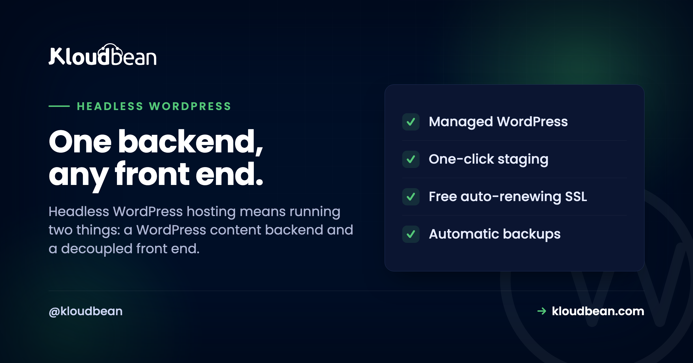

# Headless WordPress Hosting: The Architecture and the Two Things You Now Host

You want the WordPress editor your writers already love, and a Next.js front end your developers actually want to build. Headless is how you get both. It's also how you quietly end up running two apps instead of one, which is the part most tutorials skip right past.

So let's treat this as what it really is: an architecture decision with a hosting bill attached. Here's how headless WordPress fits together, when the split earns its keep, when it just makes your life harder, and how headless WordPress hosting works once you're running a backend and a front end at the same time.

> **The short version:** Headless WordPress keeps WordPress as the content backend (PHP and MySQL, the admin you know) and moves the public site to a separate front-end app that pulls content over the REST API or WPGraphQL. The catch: you now host two things, a WordPress backend and a decoupled front end. Keep them on one platform so they talk over a fast private link. And skip headless entirely if you lean on page builders or you're building a small site.

## What "headless WordPress" actually means

Normal WordPress does two jobs at once. It *stores* your content (the CMS) and it *renders* your pages (the theme). Headless splits those apart. WordPress keeps doing the thing it's genuinely great at, managing content through a familiar editor and admin. But instead of a theme drawing the public site, WordPress hands its content out through an API: the built-in **WordPress REST API**, or **GraphQL** via the WPGraphQL plugin.

A separate front-end app then fetches that content and renders the site. React or Next.js, Vue or Nuxt, Astro, whatever your team likes. WordPress is the body (the content engine). Your front end is the head. Take the usual head off and you've gone headless. Simple idea. The interesting part is what it does to your hosting.

<!-- Inline SVG in the HTML version: topology of writers editing in the WordPress backend, content flowing through a REST/GraphQL API to a decoupled front end that serves web, mobile and kiosk, with both apps on one platform and a private network. -->

## Headless WordPress hosting means running two apps

This is the consequence people underestimate, and it's the whole reason "headless WordPress hosting" is even a phrase. With a classic site you host one thing. Go headless and you host two: the WordPress backend (PHP, a database, the admin) and a separate front-end app (a Node server if you're rendering on the server, or static files if you're pre-building). Both need a home. And where they live matters more than people expect.

Keep them together. When the front end and the backend sit on the same platform, they can talk over a fast internal connection instead of the public internet, and you've got one dashboard and one bill instead of two. Split them across unrelated providers and you invite the annoying stuff: extra latency on every content fetch, CORS headers to wrangle, auth to coordinate across two systems, and two invoices to reconcile at month end.

This mixed setup is exactly what Kloudbean is built for. It runs the WordPress backend on its managed PHP and MySQL stack, and it runs a Node or static front end right alongside it, on whichever of the seven supported clouds you pick. One place, one login, both halves on a private network. That's the practical difference between headless being tidy and headless being a chore.


<!-- ADD IMAGE: the dashboard listing both apps, the WordPress backend and the Next.js or Astro front end, on the same server. -->

## When headless is genuinely worth it

Headless earns its extra complexity in a handful of real situations. If two or more of these describe you, it's worth a serious look.

- **You want a modern JavaScript front end.** Your team would rather build in React, Next, Vue, or Astro for the interactivity and the developer experience. Headless lets them, while your writers keep the WordPress editor.
- **The same content feeds several places.** One backend can serve a website, a mobile app, and an in-store display, all pulling from one content API. If content has to live in more than one front end, headless is the clean way to do it.
- **Your team is front-end strong.** You've got developers who are comfortable building and shipping a JavaScript app. Headless plays straight to that.
- **You want to shrink WordPress's exposed surface.** A pre-built static front end can be very fast, and keeping wp-admin off the public site reduces what an attacker can even reach. If security is a driver, pair this with a proper look at [secure WordPress hosting](https://www.kloudbean.com/blog/secure-wordpress-hosting/).

## When you should just stay classic

Now the honest half, the part the hype skips. The same split turns into pure friction here, and I'll say it plainly: most simple sites should not go headless.

- **You live in page builders and themes.** Elementor, Divi, the customizer, the block editor's front-end output. All of that renders the *normal* WordPress site. Go headless and most of that ecosystem stops applying. You're rebuilding the presentation layer yourself, by hand.
- **You want true what-you-see-is-what-you-get previews.** In classic WordPress, "Preview" shows the real page. In headless, previewing a draft in the separate front end takes extra wiring, and it's rarely as smooth.
- **It's a small site or a small team.** Brochure site, a blog, a local business page? Headless is a pile of extra moving parts for almost no gain. Classic WordPress ships faster and is easier to keep alive.
- **Your plugins render on the front end.** Loads of plugins output HTML, forms, and scripts into the theme. Headless bypasses the theme, so those don't "just work." You reimplement their front-end behaviour yourself.

If those hit home, classic WordPress is almost certainly the right call, and there's no shame in it. Headless is a tool, not a trophy.

## Classic vs headless, side by side

| | Classic WordPress | Headless WordPress |
|---|---|---|
| Build speed | Fast, theme does the work | Slower, you build the front end |
| Front-end freedom | Bounded by the theme | Total (any framework) |
| Previews | Instant and accurate | Extra wiring, less seamless |
| Page builders / plugins | Work out of the box | Many stop applying |
| Multi-channel content | One site | Web, app, displays from one API |
| Things to host | One (WordPress) | Two (backend + front end) |
| Best for | Most sites, small teams | JS teams, multi-channel, custom UX |

## REST API or WPGraphQL? Decide this early

Once you're headless, the front end talks to WordPress through an API, and there are two common ways to do it. Pick early, because it shapes how you write the front end.

The built-in **WordPress REST API** needs nothing extra. It's already live at `/wp-json/`, and it's perfect for straightforward "give me these posts" requests:

```js
// REST: fetch the latest posts, no plugin needed
const res = await fetch('https://cms.example.com/wp-json/wp/v2/posts?per_page=5');
const posts = await res.json();
```

**WPGraphQL** (a plugin) lets the front end ask for exactly the fields it wants in a single request, which is handy for a complex page that would otherwise fire several REST calls:

```graphql
# GraphQL: one request, only the fields you need
query {
  posts(first: 5) {
    nodes { title excerpt uri }
  }
}
```

Neither is "better." REST is zero-setup and dead simple. GraphQL is more efficient when your pages pull lots of related data. Start with REST unless you already know your pages are query-heavy. For the full how-to on endpoints, auth, and custom fields, the [WordPress REST API guide](https://www.kloudbean.com/blog/wp-rest-api-guide/) is the reference; this piece is the architecture and hosting decision that sits above it.

<!-- ADD IMAGE: the WPGraphQL explorer running a query against your content, or the REST response in a browser at /wp-json/. -->

## Where headless quietly goes wrong

A pattern worth flagging, because we see it land teams in trouble. Someone reads that headless is faster and more modern, so they rebuild a small marketing site as headless. Then the weeks disappear. Rebuilding navigation, contact forms, SEO tags, sitemaps, redirects, and draft preview, all things a decent theme handed over for free. The site isn't meaningfully faster to the visitor, and now there are two apps to maintain instead of one.

The other classic snag is the split-provider setup. Backend on one host, front end on another, and suddenly you're debugging CORS, coordinating SSL on two domains, and adding a network hop to every content request. None of it is fatal. All of it is avoidable by keeping the two halves on one platform from the start. Headless is worth real complexity when the payoff is real. It's a bad trade when you're buying complexity you didn't need.

## How the two halves fit your stack

Running headless well is mostly about treating it as one system with two deployables. The front end deploys from Git like any modern app: push, build, go live, with the WordPress API URL stored as an [environment variable](https://www.kloudbean.com/blog/ci-cd-auto-deploy-from-github/) rather than hard-coded. If you're on Next.js, the [Next.js deployment guide](https://www.kloudbean.com/blog/deploy-nextjs-app-to-your-own-server/) covers the shape; on Astro, see [deploying Astro](https://www.kloudbean.com/blog/deploy-astro-app/).


A few other pieces slot in naturally. Media can go to [object storage](https://www.kloudbean.com/blog/s3-compatible-object-storage/) so uploads aren't stuck on one server's disk. When the backend gets busy, it scales like any other WordPress site, covered in [scalable WordPress hosting](https://www.kloudbean.com/blog/scalable-wordpress-hosting/). And the backend still benefits from the usual [WordPress speed work](https://www.kloudbean.com/blog/speed-up-wordpress/), because a slow API makes for a slow front end no matter how quick your framework is.

## The honest boundary

Under the hood it's all Linux, headless or not. The platform manages the server, the WordPress stack, SSL, and backups, and you own both your WordPress content and your front-end code. Going headless doesn't change who owns what. It changes how many pieces you're running and how carefully they need to fit together. Be honest about whether your project actually needs that, and the decision more or less makes itself.

---

**One backend. Any front end. One place to run both.** Host the WordPress backend and your decoupled front end together at [kloudbean.com](https://www.kloudbean.com/). Plans on [pricing](https://www.kloudbean.com/pricing/).

Managed WordPress + Node/static · One private network · Git deploy · Staging · Free migration · Free trial

## FAQ

**What is headless WordPress hosting?**
It's hosting for a headless WordPress setup, which means two things instead of one: a WordPress content backend (PHP and MySQL) and a separate front-end app that renders the site. Good headless hosting runs both on one platform so they share a fast private connection, one dashboard, and one bill, rather than splitting them across separate providers.

**What is headless WordPress in plain terms?**
It's using WordPress only as a content backend while a separate front-end app displays the site. WordPress exposes content through its REST API or WPGraphQL, and a front end built in React, Vue, Astro, or similar fetches and renders it. You keep the WordPress editor and admin but replace the theme-rendered public site.

**Should I use headless WordPress?**
Use it if you want a modern JavaScript front end, you're serving the same content to multiple places like a site and an app, and your team can build and deploy a front-end app. Skip it if you rely on page builders and themes, want seamless previews, or run a small site. For most simple sites, classic WordPress is faster to build and easier to maintain.

**What hosting does headless WordPress need?**
Two homes: a managed PHP and MySQL host for the WordPress backend, and a host for the front-end app (a Node server for server-side rendering, or static hosting for a pre-built site). Running both on one platform keeps latency low and management simple. Kloudbean runs the PHP backend and a Node or static front end side by side on the cloud you choose.

**REST API or WPGraphQL for headless WordPress?**
Start with the REST API. It's built in, needs no plugin, and handles most content fetching cleanly. Move to WPGraphQL when your pages pull lots of related data and you'd rather ask for exactly the fields you need in one request. Neither is universally better; REST is simpler, GraphQL is more efficient for complex queries.

**Do WordPress plugins work with headless?**
Plugins that manage content in the admin generally still work. Plugins that render output on the front end, like page builders, form displays, and front-end scripts, do not, because headless bypasses the theme layer. You reimplement that front-end behaviour in your separate app, which is a big reason headless suits some projects and not others.

**Is headless WordPress faster?**
It can be, because a static or server-rendered front end can be very fast and is decoupled from WordPress's PHP rendering. But speed depends on how you build and host the front end, and a slow content API will still slow you down. Headless enables high performance; it doesn't hand it to you automatically.

**Can I host the WordPress backend and the front end together?**
Yes, and you should. Keeping both on one platform lets them talk over a private network instead of the public internet, avoids CORS and cross-provider auth headaches, and gives you one dashboard and one bill. Kloudbean is built for this mixed stack, running managed WordPress alongside a Node or static front end.

**Does going headless change who manages the server?**
No. It's still a Linux stack, and on managed hosting the platform handles the server, the WordPress stack, SSL, and backups. You own your WordPress content and your front-end code. Headless changes the number of moving parts you run, not the split between what the platform manages and what you own.

---

*Kloudbean · One backend, any front end.*
