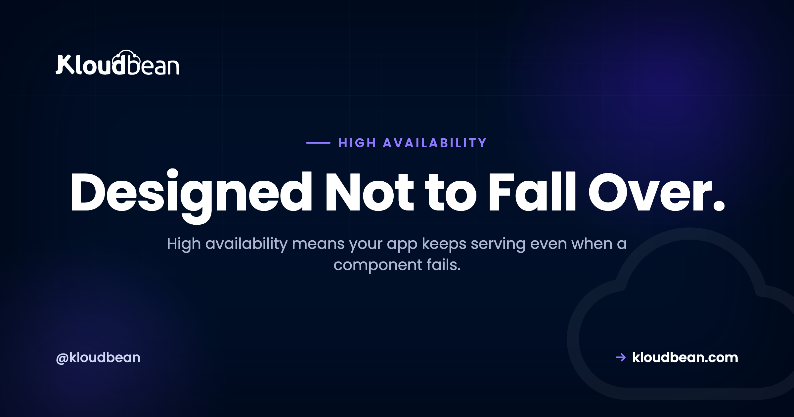

# What Is High Availability? Staying Up When Things Break

Your server reboots at 3am for a kernel patch. For ninety seconds it answers nothing, and the checkout page a customer had open just dies on them. On one box, that ninety seconds is an outage. On a high availability setup it's a non-event, because a second machine was already serving and traffic never stopped. That's the whole promise of high availability: the system keeps running even when a piece of it fails.

So let's define high availability, build it from the parts that make it work, and draw the line most articles blur between HA, backups, and disaster recovery. By the end you'll know what to build, what to skip, and when one solid server is still the right call.

> **The short version:** High availability (HA) means a system stays available even when a component fails, because there's no single point of failure and traffic fails over to a healthy replica. You get there with redundancy (more than one of everything that matters), a load balancer running health checks, and automatic failover. HA is not backups and not disaster recovery. Those protect against different problems, and a serious setup uses all three.

## What high availability actually means

High availability is a design property, not a feature you buy. A system is highly available when it keeps serving through the failure of an individual component. A disk dies, a server locks up, a whole availability zone blinks out, and users still get a response because something else picks up the work.

Contrast the setup most apps start on: one server running the app and the database, doing everything. Cheap, simple, and fine right up until it isn't. That single box is a **single point of failure**. It goes down, your site goes down, because there's only one of it.

HA is the deliberate removal of those single points. Add a second server so one can die. Put a load balancer in front so traffic steers to a healthy node. The test is simple: if you can point at one component and say "when that dies, we're down," you don't have HA yet. You have a to-do item.

```
  SINGLE POINT OF FAILURE                HIGH AVAILABILITY
  one box, it dies, all dark             one fails, traffic reroutes

  [ Visitors ]                           [ Visitors ]
       |                                      |
       v                                      v
  [ One server ] X  DOWN               [ Load balancer ] (health checks)
       |                                    /        \
       v                             -> [ Replica A ]  [ Replica B ] X down
  Whole site offline                    healthy         no traffic
                                        => Site stays up
```
*Same failure, two outcomes. One server down is an outage. A replica down behind a load balancer is a shrug, because the healthy node keeps answering.*

Our explainer on [how cloud hosting works](https://www.kloudbean.com/blog/how-cloud-hosting-works/) covers where servers, networking, and storage live, the ground floor HA builds on.

## The nines, and what 99.9% uptime really buys you

Availability gets measured in "nines." You've seen them on every pricing page: 99.9%, 99.99%, and up. They sound like near perfection. They're not. Each percentage maps to a hard amount of downtime that still counts as fine, and the gap between one nine and the next is huge. This is plain arithmetic off a year of about 8,760 hours, not a claim about any provider:

| Uptime target | Downtime allowed / year | Downtime / month |
| --- | --- | --- |
| **99%** (two nines) | ~3.65 days | ~7.3 hours |
| **99.9%** (three nines) | ~8.77 hours | ~43.8 minutes |
| **99.99%** (four nines) | ~52.6 minutes | ~4.4 minutes |
| **99.999%** (five nines) | ~5.26 minutes | ~26 seconds |

Read the 99.9% row again. Three nines still allows almost nine hours of downtime a year, a whole working day dark, with nothing promised that wasn't delivered. One more nine, 99.99%, drops the yearly budget under an hour. Here's the catch: an uptime number on a sales page promises the provider's infrastructure, not your app. Your server can reboot, your database can fall over, you can ship a bad Friday deploy, and the provider's nines stay intact while users see errors. HA is how you close that gap. For what these promises legally mean, read our [cloud SLA explainer](https://www.kloudbean.com/blog/cloud-sla-explained/). The number is the floor. Your architecture is the building.

<!-- ADD IMAGE: A before and after uptime timeline, one server with a red outage gap versus a redundant pair with none. -->

## The building blocks of high availability

HA isn't one product. It's a few ideas working together, each removing a specific way your system can die. Here's what they are, and why each exists.

### Redundancy: more than one of everything that matters

Redundancy is the foundation. If losing a component takes you down, run more than one of it. Two web servers, not one. A database with a standby copy. Ideally across more than one availability zone, so a single data center problem doesn't kill every copy at once. Redundancy turns "the server died" into "a server died." It costs money, because you pay for capacity you hope never to fully use.

### A load balancer with health checks

Redundant servers are useless if traffic still points at a dead one. The load balancer fixes that. It sits in front, spreads requests, and runs a **health check** against each node on a schedule, often a small request to `/health` every few seconds. Miss a few in a row and the node is pulled from rotation automatically, then added back when it recovers. That health check is the quiet hero. Without it, the balancer keeps feeding users to a server that's timing out. Our [cloud load balancer explainer](https://www.kloudbean.com/blog/cloud-load-balancer-explained/) takes routing, sticky sessions, and SSL apart. For HA, one idea: the balancer is how a failed node stops being an outage.

### Failover: active-passive vs active-active

Failover is shifting work off a failed component onto a healthy one. Two broad shapes, and knowing which you run matters.

| | Active-passive | Active-active |
| --- | --- | --- |
| **Normal state** | One node serves, a standby waits | All nodes serve traffic at once |
| **On failure** | Promote the standby, short failover gap | Survivors absorb the load, no promotion |
| **Cost** | You pay for a standby that mostly idles | Every node you pay for is working |
| **Complexity** | Simpler, but the failover must be tested | Harder, state has to be shared cleanly |
| **Fits** | Databases, stateful services | Stateless web and app tiers |

Active-passive keeps a warm spare ready, which suits databases where only one node should accept writes. Active-active runs everything at once and loses a slice of capacity when a node dies, more efficient and more resilient, but it demands your app hold no important state on any single node. That constraint is exactly where the database gets hard.

### No single point of failure, including the balancer itself

Removing single points of failure is a mindset, not a checkbox. Walk your request path and ask at each hop, "what if this one thing dies?" The web tier is easy, add a node. Don't forget the overlooked pieces: the database (a single primary is a single point of failure), the balancer itself, and the zone or region everything sits in. A managed platform usually runs the balancer redundantly, so it isn't the weak link.

## High availability is not backups, and not disaster recovery

This is the distinction most articles smear together, and getting it wrong leaves a real hole. HA, backups, and disaster recovery solve three different problems. You need all three.

| | High availability | Backups | Disaster recovery |
| --- | --- | --- | --- |
| **Protects against** | A component failing (node, disk, balancer) | Data loss or corruption (bad deploy, dropped table, ransomware) | A big event (region outage, fire, a whole account gone) |
| **Time to recover** | Seconds, automatic | Minutes to hours, a restore | Hours or more, a planned rebuild |
| **Keeps you** | Up | Recoverable | Recoverable after catastrophe |
| **You still also need** | Backups and DR | HA and DR | HA and backups |

One example makes it click. Someone runs `DELETE FROM orders` with no `WHERE` clause. HA faithfully replicates that empty table to every replica in milliseconds. It did its job perfectly, and your data is still gone. Only a backup saves you. Flip it: your primary region goes dark for an afternoon. Backups are safe, but a backup sitting in that same dead region doesn't get you online right now. That's disaster recovery. Sell one of the three as if it covers all three and you've quietly left two holes. Our [guide to server backups](https://www.kloudbean.com/blog/server-backups-guide/) covers the layer HA can't.

<!-- ADD IMAGE: Three columns separating HA, backups, and DR by the problem each one solves. -->

## Where the database fits, and why it's the hard part

Making the web tier redundant is easy. Web and app servers can be **stateless**, holding nothing important between requests, so you run a few identical copies behind a balancer. Any node serves any request. Lose one, who cares.

The database is the opposite. It's **stateful**. It holds the one authoritative copy of your data that has to stay correct, so you can't just clone it five times. A single primary is the classic hidden single point of failure, still one-of-a-kind after everything else is redundant.

The general answer is replication: the primary streams its changes to one or more replicas, and if it fails, a replica is promoted to take writes. Done well, that's real failover. Done carelessly you hit ugly edge cases, replication lag where a replica trails behind, or split-brain where two nodes both think they're in charge. This is genuinely hard distributed-systems work, which is why database HA is a bigger project than web HA. A lighter move helps: put sessions in a shared store like [managed Redis](https://www.kloudbean.com/blog/managed-redis-hosting/) every node reads from, and write uploads to object storage, not local disk. Then any node can serve any user.

## Do you actually need high availability?

Here's where I'll take a position, since a lot of writing on this won't. Most small apps do not need full active-active HA on day one. They really don't.

HA adds real cost and complexity: more servers, a balancer, a stateless app, a replicated database, more moving parts that can misbehave. If you run a blog, a brochure site, or an early product with a handful of users, a rare hour offline is annoying, not existential. Engineering five nines in month one instead of building the product solves a problem you don't have yet.

My honest advice: start with one well-sized server on reliable infrastructure, plus good, tested backups. Add redundancy the moment downtime costs more than the HA setup does. That crossover is the trigger. When an hour offline means lost sales, angry paying customers, or an SLA you signed, redundancy pays for itself and you build it deliberately. Not before. And if the pressure is really just traffic growth, look first at [whether you need autoscaling](https://www.kloudbean.com/blog/autoscaling-explained/), a related but separate question.

## High availability hosting on Kloudbean

So what does a managed platform give you as a foundation? Start with the floor. Kloudbean runs your servers on tier-1 cloud infrastructure across **seven providers**: AWS, AWS Lightsail, Google Cloud, Linode, Vultr, DigitalOcean, and UpCloud. That's the same hardware and networking the largest sites on the internet run on. No amount of clever architecture saves you if the ground floor is shaky.


*The built-in Flexible Load Balancer sits in front of an application pool and routes each request to a healthy node.*

The floor was never the whole story. The **Flexible Load Balancer (FLB) is built into every account**. It's off by default, but it isn't a separate product or a tier you buy up into. Switch it on, point it at an application pool of two or more servers, and a dead node becomes a rerouted request instead of an outage. You also get SSL management and access logs. That's the core HA move, redundant servers behind a health-checked balancer, as a feature you enable, not a project you assemble.


*Server health at a glance. Spotting a node under strain before it falls over is half the battle.*

Underneath, automatic backups cover the data layer HA can't protect, and IP allow-listing keeps your database reachable only from your app servers rather than the public internet. On enterprise, you can isolate the database and backend nodes further on [a private network (VPC)](https://www.kloudbean.com/blog/what-is-a-vpc/). It's all one dashboard, which matters more than it sounds: redundancy you can set up in a few clicks is redundancy you'll actually set up.

Two honest boundaries. Kloudbean manages Linux stacks (PHP, Node, Python, Ruby, Java and their databases), not Windows or IIS. And the heavier machinery, Kubernetes, autoscaling, and fully custom HA architectures, is an enterprise and custom offering, where Kloudbean acts like your in-house infrastructure team. On the SLA question: real uptime comes from redundancy you build on a solid base, not a banner percentage. Check the current terms for your plan directly.

<!-- ADD IMAGE: A two node application pool behind the Flexible Load Balancer in the dashboard. -->

---

**Turn one box that can die into a setup that stays up.** Run redundant servers behind a built-in load balancer, on tier-1 cloud infrastructure, with automatic backups and IP allow-listing, all from one dashboard. Start free at [kloudbean.com](https://www.kloudbean.com/) · compare plans on [pricing](https://www.kloudbean.com/pricing/).

Built-in load balancer · Automatic backups · 7 clouds · Free migration · Free trial

## FAQ

**What is high availability?**
High availability (HA) means a system keeps serving even when one component fails. You remove single points of failure, run redundant copies of anything critical, and let a load balancer route traffic around a dead node. One failure becomes a non-event, not an outage.

**What does 99.9% uptime mean in real downtime?**
99.9% uptime, three nines, allows about 8.77 hours of downtime a year, roughly 43.8 minutes a month, and still counts as kept. Moving to 99.99% cuts that to under an hour a year. It's plain arithmetic off 8,760 hours, not a provider guarantee.

**What is a single point of failure?**
A single point of failure is any one component whose failure takes down the whole system, the classic example being a lone server running your app and database. HA is largely the discipline of finding those points, the database, the balancer, a single zone, and making each redundant.

**Is high availability the same as backups?**
No. HA keeps you online through component failures. Backups protect data against loss and corruption, like a bad deploy or an accidental delete, which HA would faithfully replicate to every node. Different problems, so you need both.

**What is failover?**
Failover is shifting work from a failed component to a healthy one. A load balancer pulls a dead web node from rotation and sends traffic to the survivors; with databases, a standby replica gets promoted. Good failover is automatic and fast, which is why teams test it before relying on it.

**What is the difference between active-active and active-passive?**
In active-passive, one node serves while a standby waits and takes over on failure, simpler and common for databases. In active-active, all nodes serve at once and survivors absorb the load when one dies, more efficient but it needs a stateless design with shared session state.

**Do I need high availability for a small app?**
Usually not on day one. HA adds cost and complexity, and a small blog or early product survives a rare hour offline just fine. Start with one solid server plus tested backups, and add redundancy when downtime costs more than the HA setup does.

**How is high availability different from disaster recovery?**
HA handles small, frequent failures automatically in seconds, keeping you up. Disaster recovery is your plan for a rare, large event like a whole region going offline, usually a slower rebuild measured in hours. A complete setup has both, plus backups.

**Does Kloudbean offer high availability hosting?**
Kloudbean gives you the foundation and the building blocks. Servers run on tier-1 infrastructure across seven clouds, the Flexible Load Balancer is built into every account for redundant servers with health checks, and automatic backups plus IP allow-listing cover the rest. Kubernetes, autoscaling, private networking, and custom HA are enterprise offerings; check your plan's SLA terms directly.

---

*Kloudbean · Designed Not to Fall Over.*
