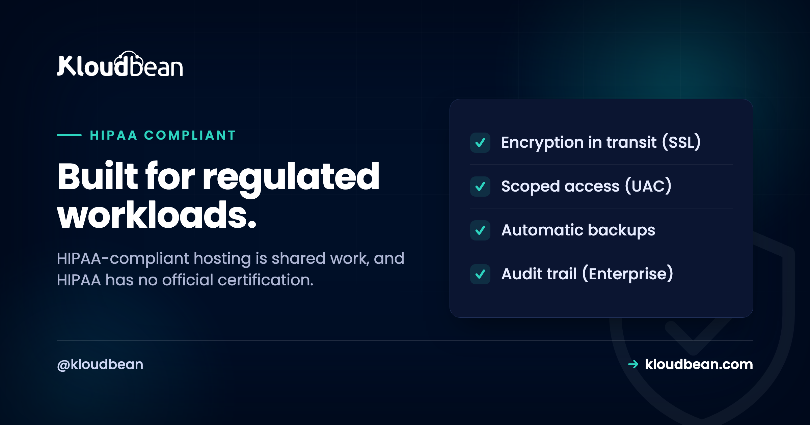

# HIPAA-Compliant Hosting: What It Covers, and What Stays Yours

If you're a developer or founder building a healthcare app that touches patient data, someone eventually asks the question that stops the sprint: is our setup HIPAA-compliant? So you search for HIPAA-compliant hosting, hoping a plan makes the problem disappear. It doesn't work that way. HIPAA-compliant hosting is real, but it's shared work: your host secures the infrastructure your app runs on, and you own how your app handles protected health information (PHI), your policies, and your paperwork.

HIPAA is the US health-privacy law, and its Security Rule is the part that lands on hosting. One thing worth saying plainly up front: there is no official HIPAA certification. No government body hands out a seal, and no host can sell you one. A good host gives you the infrastructure controls that support a HIPAA-aligned setup. The rest of the job is yours.

> **The short version:** Hosting is one piece of HIPAA, not the whole thing. You need infrastructure controls (encryption in transit, private networking, access control, audit logging, backups), your own application-level safeguards and policies, and usually a business associate agreement (BAA) with every vendor that touches PHI. No host makes your app automatically HIPAA-compliant, and there's no official HIPAA certification to buy. Get the shared-responsibility split right and the rest gets much simpler.

## What HIPAA-compliant hosting actually requires

Most HIPAA hosting requirements trace back to one place: the Security Rule, which governs electronic protected health information (ePHI). It sorts its protections into three categories, and only some are about servers at all. This is general information, not legal advice, so treat it as a map.

**Administrative safeguards.** The biggest bucket, and almost entirely yours: risk analysis, workforce training, who gets access to PHI and how they lose it, incident response, and contracts with the vendors that handle PHI for you. A server can't run your risk analysis. This is policy and process work that lives with your organization.

**Physical safeguards.** Facility access, device controls, and the physical security of the machines PHI sits on. Build on a managed platform running on tier-1 clouds like AWS and Google Cloud, and this layer is largely inherited from data centers that already run serious physical security. It's the part of HIPAA you're least likely to touch.

**Technical safeguards.** Where hosting earns its keep. Access control, audit logging, integrity, authentication, and transmission security are all technical controls, and a host can supply the raw materials for each. The table maps every technical safeguard to the control that satisfies it.

| Technical safeguard | What it means | The concrete control |
| --- | --- | --- |
| Access control | Only the right people and services reach PHI | Unique logins, least-privilege roles, IP allow-lists |
| Audit controls | Record and review who did what | An activity log or audit trail you can search and export |
| Integrity | PHI is not altered or destroyed improperly | Backups, controlled database access, change history |
| Authentication | Verify a user is who they claim to be | Strong login, session controls, no shared accounts |
| Transmission security | PHI is protected while moving over networks | Encryption in transit (TLS/SSL) everywhere |

One detail catches developers off guard: encryption in HIPAA is mostly what the rule calls **addressable**, not **required**. That's not the same as optional. You implement it, or document why an equivalent safeguard is reasonable. Almost everyone encrypts anyway, because encrypted PHI that leaks generally falls under a breach safe harbor. Treat encryption in transit as table stakes, and decide on encryption at rest where your data lives.

## Shared responsibility: who owns what

This is the idea that makes the topic click. HIPAA compliance splits between the platform and you, and it isn't an even split. The platform secures the ground your app stands on. You own the app and everything about how it treats PHI. A host that pretends otherwise is selling something that doesn't exist.

| The platform provides (infrastructure) | You own (application and policy) |
| --- | --- |
| Hardened, patched servers | Your application code and how it handles PHI |
| Network isolation and private networking | Access policies: who sees PHI, and when |
| Encryption in transit (free SSL) | Data retention and minimization decisions |
| Automatic backups for availability | Workforce training and security awareness |
| Access controls and firewalling | Business associate agreements with each vendor |
| Physical security of the data center | Your risk analysis and incident response plan |

Look at the right column. That's most of HIPAA, and no server touches it. The fastest way to fail a HIPAA review isn't a weak server. It's collecting PHI you never needed, or piping it into a tool you forgot was in scope.

```
   How PHI flows, and who secures each part

   [Patient/user] --TLS--> [Your app] --private net--> [Managed DB]
                                                            |
                                                            v
                                                    [Automatic backups]

   ┌── PLATFORM PROVIDES ──────────┐   ┌── YOU OWN ────────────────────┐
   │ infrastructure controls        │   │ application + policy          │
   │ • Encryption in transit (SSL)  │   │ • How your code handles PHI   │
   │ • Firewall + brute-force block │   │ • Access & retention policies │
   │ • Private networking / VPC     │   │ • Workforce training          │
   │ • Automatic backups            │   │ • BAAs with every vendor      │
   │ • Access controls (UAC, IP)    │   │ • Risk analysis + response    │
   └────────────────────────────────┘   └───────────────────────────────┘
```

<!-- ADD IMAGE: a data-flow map for your own app: every place PHI is collected, where it travels, and every service that can see it -->

## How Kloudbean's controls support a HIPAA-aligned setup

Honest framing first: none of this makes your app HIPAA-compliant on its own. It hands you the infrastructure half of the safeguards above, so controls you'd otherwise assemble by hand are already there. Kloudbean sits on the infrastructure side of the line.

**Access control.** Subusers with granular User Access Control grant per-resource, per-action permissions, so people reach only what their job needs. IP Access Control adds allow and deny rules by CIDR range, HttpOnly cookie sessions harden logins, and a Basic Auth gate can lock an app while you build. That's the access-control and authentication safeguards, and here's [how user access control works](https://www.kloudbean.com/blog/user-access-control-explained/).

**Transmission security.** Free SSL is issued and auto-renewed, so encryption in transit is on by default across your app and its APIs. Encryption at rest is a separate decision you make at the application or database level, so plan for it rather than assume it.

**Network isolation.** Put your database on a private network so it never gets a public address and no scanner can find it. That single move removes a whole class of exposure. Pair it with the baseline Shorewall firewall and Fail2ban blocking that run by default, and here's [what a VPC is](https://www.kloudbean.com/blog/what-is-a-vpc/).

**Availability and integrity.** Automatic [backups](https://www.kloudbean.com/blog/server-backups-guide/) cover the recoverability HIPAA expects, and the seven managed database engines run with controlled access and their own backups. For public-facing defense, Cloudflare is a paid add-on (free on enterprise) that adds edge protection; it's worth knowing [what a web application firewall does](https://www.kloudbean.com/blog/what-a-waf-does/).

**Audit controls.** On enterprise accounts, the Audit Trail is an immutable, searchable, account-wide activity log with CSV export, built for exactly this kind of evidence. Note the boundary: it's an enterprise capability, not per-app HIPAA logging on every plan, and your app still logs PHI-access events in its own layer. For custom architectures, Kubernetes, and tailored setups, Kloudbean can act like an in-house infrastructure team for enterprise and government workloads.

## Practical steps to build a HIPAA-aligned setup

Concept is nice. Here's the order I'd work in, on any platform, with the console shots where they help.

### Step 1. Put the database on a private network

Before anything else, keep PHI off the public internet. Launch your managed database on a private network so it has no public address, and open only the app-to-database path. An exposed database gets found by automated scanners in hours, not weeks, and a database full of PHI is the worst thing to leave reachable.

### Step 2. Turn on encryption in transit

Every page and API call that carries PHI runs over HTTPS, with no mixed content. On a managed host that's a free SSL certificate that issues and renews itself, so there's no excuse to serve health data over plain HTTP.


### Step 3. Lock down who can reach production

Give every teammate a unique login, never a shared one, and grant the narrowest role that does the job. Use subusers and granular access control for least privilege, and restrict where admins can connect from with IP allow-lists. When a review asks who can reach PHI, you want a precise answer, not a shrug.


### Step 4. Harden the server and close ports

Unpatched software and open ports start a lot of breaches. Keep the OS and stack patched, and run baseline protections like a firewall and brute-force blocking by default, not as a task you hope to remember. It pays off the day someone starts probing.


### Step 5. Turn on automatic backups

HIPAA cares about availability and recoverability, not just secrecy. Automatic backups stored off the main server mean a bad day doesn't erase patient records. Do the step everyone skips: actually test a restore, so you know your backups work before the moment you need them.


### Step 6. Keep PHI out of logs, URLs, and side tools

This is where healthcare apps quietly break their own compliance. PHI leaks into places nobody classified as sensitive: request logs that capture full bodies, patient IDs in URL query strings that land in access logs, an error tracker shipping stack traces to a third party you never signed a BAA with. Scrub PHI before it's logged, keep it out of URLs, and audit every service your app talks to.

<!-- ADD IMAGE: your logging or error-tracker config with PHI fields masked or dropped before anything is written -->

### Step 7. Line up your BAAs and your risk analysis

Now the part only you can do. List every vendor that creates, receives, stores, or transmits PHI for you: host, email provider, SMS gateway, analytics, error tracker. Each is a business associate, and HIPAA generally expects a signed BAA with each. Then write your risk analysis and your access and retention policies. This is the half that actually keeps you compliant.

<!-- ADD IMAGE: your vendor and BAA tracker: every service that touches PHI, and whether a signed agreement is in place -->

> **Please read this part.** This is general educational information, not legal advice. HIPAA has real nuance, and your specific situation (the PHI you handle, your role as a covered entity or business associate, your risk analysis) deserves a qualified compliance professional. Before you store real PHI anywhere, confirm two things: that you've done a proper risk analysis, and that you have a BAA with every vendor that will touch that data. Confirm BAA availability with any provider directly.

## So, is my hosting HIPAA-compliant?

It's the wrong question, gently. Hosting can't be HIPAA-compliant on its own, the way a locked filing cabinet isn't a compliant medical practice. The better question: does your hosting give you the infrastructure controls a HIPAA-aligned setup needs, and have you done your half on top? PHI hosting comes down to a short checklist: encryption in transit, a private database, access control, audit logging, backups, and a BAA with anyone who touches the data.

My honest opinion after plenty of healthcare builds: most early teams overspend on exotic infrastructure and underspend on the two things that catch them out, minimizing the PHI they collect and keeping it out of places they forgot to secure. HIPAA cloud hosting is a foundation, not a finish line. A hardened server won't save an app that logs patient data into a tool with no agreement behind it.

Where Kloudbean fits: on the infrastructure side, giving you the controls your HIPAA work stands on, from free SSL and private networking to access control, automatic backups, and, on enterprise, an immutable Audit Trail. It runs on tier-1 clouds that maintain their own data-center security programs. What it won't do, because no honest host can, is make your app HIPAA-compliant for you or sell you a certification that doesn't exist. Mapping several obligations at once? The siblings pair well: [SOC 2 compliant hosting](https://www.kloudbean.com/blog/soc2-compliant-hosting/), [PCI compliant hosting](https://www.kloudbean.com/blog/pci-compliant-hosting/), [GDPR compliant hosting](https://www.kloudbean.com/blog/gdpr-compliant-hosting/), and the broader [secure and compliant hosting](https://www.kloudbean.com/blog/secure-compliant-hosting/) overview.

---

**Build healthcare apps on a foundation you can stand behind.** Run your app on infrastructure with hardening, encryption in transit, private networking, access controls, and automatic backups, all on one dashboard. Talk to us about enterprise Audit Trail and custom setups for regulated workloads. Start with a free trial and free migration assistance at [kloudbean.com](https://www.kloudbean.com/), and see plans on [pricing](https://www.kloudbean.com/pricing/).

Free SSL · Private networking / VPC · Subuser access control · Shorewall + Fail2ban · Automatic backups · Enterprise Audit Trail

## HIPAA hosting FAQ

**Is Kloudbean HIPAA compliant?**
No host can be HIPAA-compliant on your behalf, because compliance describes an organization and how it handles PHI, not a product you switch on. Kloudbean provides infrastructure controls that support a HIPAA-aligned setup: encryption in transit, private networking, access control, and automatic backups. Your application, your policies, and your BAAs remain yours to own.

**Is there an official HIPAA certification for hosting?**
No. HIPAA has no official certification or government seal, and the Office for Civil Rights enforces the law rather than certifying products. Any host claiming an official HIPAA seal is overstating things. Judge a provider on its actual controls and contracts, not on a badge, and confirm what it offers directly.

**Does HIPAA require a BAA?**
Generally yes. If a vendor creates, receives, maintains, or transmits PHI on your behalf, HIPAA expects a signed business associate agreement (BAA) with that vendor. That can include your host, email provider, analytics, and error tracking. Before you put real PHI on any platform, confirm BAA availability with the provider directly.

**Is encryption required for PHI?**
Encryption is what HIPAA calls addressable rather than strictly required, which means you implement it or document why an equivalent safeguard is reasonable. In practice you should encrypt, because encrypted PHI that leaks generally qualifies for a breach safe harbor. Encryption in transit through TLS is the baseline, and encryption at rest is a decision you make where the data lives.

**Can any host make my app HIPAA compliant?**
No. Compliance is shared. A host secures the infrastructure layer and can sign a BAA for the part it handles, but your code, your PHI handling, your access policies, and your workforce training are yours. Good infrastructure is a real head start, and it is not the finished result.

**What is PHI, exactly?**
PHI is protected health information: health data that can be tied to a specific person. The rules list eighteen identifiers, such as name, email, dates, and medical record numbers, that turn health data into PHI. When it is stored or transmitted electronically it is called ePHI, and that is what the Security Rule protects.

**Where should PHI live so it is not exposed?**
On a database that sits on a private network with no public address, behind a firewall, reachable only by your app. Keep PHI out of URLs, out of verbose logs, and out of any third-party tool you have not signed a BAA with. Most PHI exposure comes from these forgotten side channels, not from the main database.

**Do small healthcare startups have to follow HIPAA?**
Yes, if you are a covered entity or a business associate handling PHI, size does not exempt you. A two-person telehealth app faces the same core Security Rule obligations as a hospital, scaled to its risk. The Office for Civil Rights can levy real penalties, so treat HIPAA as a day-one design constraint, not a later cleanup.

**What is the most common HIPAA mistake developers make?**
Letting PHI leak into places nobody classified as sensitive: full request bodies in logs, patient IDs in URL query strings, or stack traces shipped to an error tracker with no BAA. The second most common is assuming that running on a big cloud makes the app compliant by itself. Both are shared-responsibility misunderstandings.

---

*By Kloudbean Security · Built for regulated workloads.*
