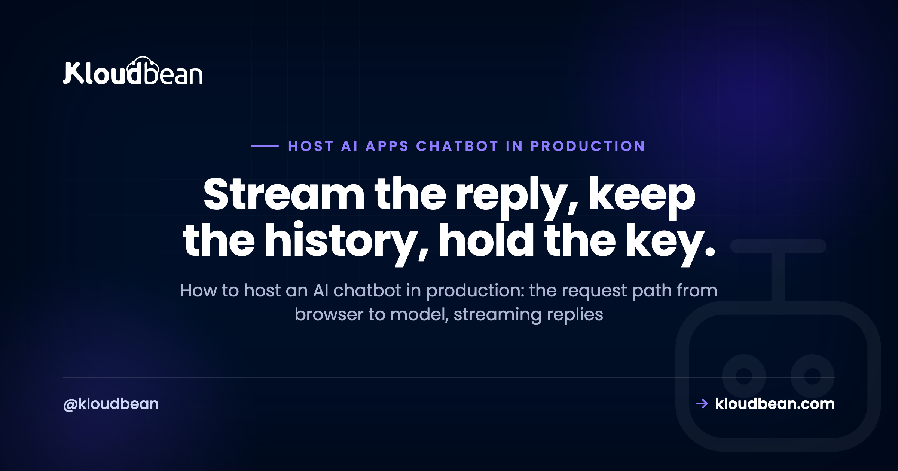

# How to Host an AI Chatbot in Production: Architecture, Cost, and Reliability

You built a chatbot. Maybe in Lovable or Cursor, maybe by hand with the OpenAI or Anthropic SDK, and on localhost it feels like magic. Then you try to host an AI chatbot in production, in front of real people, and the questions change. Why is the first message slow? Where do conversations go when I redeploy? What stops a stranger from scripting my endpoint and spending my whole model budget overnight?

None of that is model magic. It's architecture. A production chatbot is a small, well-behaved system: a browser, your backend, a model provider, a database, a cache, and a few rules about who's allowed to talk to what. This page walks the whole request path and the three things that decide whether it survives real users: how it's built, what it costs, and whether it stays up.

> **The short version:** To host an AI chatbot in production you need an always-on backend that holds your model key, streams replies token by token, saves conversation history in Postgres, and leans on Redis for sessions and rate limits. Put it behind a domain with SSL, require auth on every call, and cap spend so nobody runs up your bill.

## What it takes to host an AI chatbot in production

A production chatbot is a system, not a single script. A browser sends a message to your backend over HTTPS. Your backend checks who's asking, pulls the recent history, and calls the model provider with your secret key. Tokens stream back through your server to the user. History lands in Postgres, and Redis handles the fast, short-lived work.

The important rule hides in that description: the browser never talks to the model directly. Your server sits in the middle on purpose. It's the only place that holds the API key, the only place that can check auth and enforce rate limits, and the only place that decides how much history to send. Skip that middle layer and you've basically published your model key to the internet. More on why that ends badly in a moment.

So the boxes are: a frontend, an always-on backend (Node or Python, usually), a managed database for the record of truth, Redis for the fast layer, and the model API it calls. A domain and SSL wrap the whole thing. Here's how one message moves through it.

<!-- ADD IMAGE: the request-path diagram (browser to your API to model provider, tokens streaming back, Postgres for history and Redis for the fast layer, all wrapped in domain + SSL). -->

## Streaming the answer back, so it doesn't feel frozen

Streaming matters because a model can take several seconds to write a long reply. If you wait for the whole thing before showing anything, the screen sits frozen and the user assumes it broke. Stream tokens as they arrive so words appear as they're generated. Most chat UIs use Server-Sent Events for this; reach for WebSockets only when you genuinely need two-way traffic.

The model provider already streams tokens to your server. Your job is to pass that stream through to the browser instead of buffering it. Server-Sent Events (SSE) are the simplest fit: a one-way stream over plain HTTP, which is exactly what a chat reply is. WebSockets give you a full two-way channel, which you want for things like live typing indicators or collaborative multi-user rooms, but they're more to run and to scale.

| Approach | How it works | Good for | Watch out for |
| --- | --- | --- | --- |
| Server-Sent Events | One-way stream, server to browser, over HTTP | Token-by-token chat replies | One direction only; a buffering proxy kills it |
| WebSocket | Persistent two-way connection | Live chat, typing, multi-user rooms | More moving parts; needs care to scale |
| Wait for the full reply | Request blocks until the model finishes | Simple internal tools, short answers | Feels frozen on long answers; risks timeouts |

One real gotcha trips up almost everyone the first time: a reverse proxy or CDN that buffers responses will happily collect your whole stream and deliver it in one lump, so streaming silently stops working in production while it looked fine locally. The fix is to turn buffering off for the streaming route (on nginx that's the `X-Accel-Buffering: no` header, plus disabling proxy buffering). If you're going the WebSocket route at any real size, the scaling patterns in [scaling WebSockets in Node.js](https://www.kloudbean.com/blog/scale-websockets-nodejs/) are worth reading before you launch, not after.

## Giving the bot a memory: Postgres for history, Redis for speed

A chatbot with no memory forgets the last message, which feels broken to a user mid-conversation. Store each message in Postgres so history survives a redeploy: the role, the content, a timestamp, a user id, and a conversation id. Use Redis for the fast, short-lived layer. And send the model only the recent, relevant slice of history, never the entire transcript.

The single most common data-loss mistake here is starting on SQLite or an in-memory array because the AI builder scaffolded it that way. It works right up until your first redeploy wipes the file, and every conversation goes with it. A managed database lives outside the app process, so shipping new code never touches your data. If that pattern is new to you, the [last mile of vibe coding](https://www.kloudbean.com/blog/last-mile-of-vibe-coding/) covers why AI builders leave this gap, and [managed PostgreSQL hosting](https://www.kloudbean.com/blog/managed-postgresql-hosting/) covers the fix.

A minimal history table is not complicated:

```sql
create table messages (
  id           bigserial primary key,
  conversation_id  uuid not null,
  user_id      uuid not null,
  role         text not null,   -- user | assistant | system
  content      text not null,
  tokens       int,
  created_at   timestamptz not null default now()
);
create index on messages (conversation_id, created_at);
```

Redis earns its place separately. It's where sessions live, where rate-limit counters tick, and where you cache repeated answers so an identical question doesn't pay for a fresh model call. Set sensible TTLs so it stays small. Practically, this is two managed services rather than two servers to build: on Kloudbean both Postgres and Redis are one-click from the same screen as the app server, patched and backed up, and you allow-list your app server's IP on each so nothing else can connect. See [managed Redis hosting](https://www.kloudbean.com/blog/managed-redis-hosting/) for the setup. And because every chat request opens a database connection, put a pool in front of Postgres or you'll exhaust connections under load. [Database connection pooling](https://www.kloudbean.com/blog/database-connection-pooling/) explains why that limit bites sooner than people expect.

If your bot answers from your own documents (support articles, a knowledge base, product docs), that's retrieval, and you'll want vector search. You probably don't need a separate vector product on day one: the `pgvector` extension stores embeddings right alongside your normal Postgres data, which keeps the stack to one database. [pgvector for AI apps](https://www.kloudbean.com/blog/pgvector-for-ai-apps/) walks through it.

## Auth and rate limits, before a stranger runs up your model bill

Your chat endpoint calls a paid API using your key. If anyone can hit that endpoint, anyone can spend your money. Require auth on every request, put per-user and global rate limits in front of the model, set a hard spend cap at the provider, and keep the key on the server. This is the difference between a demo and something you can leave running.

Here's the anti-pattern to burn into memory: the open proxy. You ship a chatbot where the browser calls `/api/chat` with no login and no limit, and your backend faithfully relays every call to the model on your key. Anyone who opens dev tools sees that endpoint. A bored person with a script can fire thousands of requests at it while you sleep, and you wake up to a bill that looks like a typo. This isn't rare. It's one of the most common ways a launched AI app gets expensive fast.

The fixes stack, and none are exotic:

- **Auth on every model-touching route.** No anonymous access to the endpoint that costs money.
- **Rate limits per user and globally.** A Redis-backed counter (a simple token bucket) caps how often one user, and everyone together, can call the model.
- **A hard spend cap at the provider.** Set the monthly limit in the provider dashboard so the worst case is a stopped service, not an unbounded invoice.
- **Keep the key server-side.** Load it from an environment variable, never inline it in client code. Where that variable is set matters as much as the rule: put it on the app in your host's console (Kloudbean does this without SSH, and it survives redeploys) rather than in a file somebody eventually commits. [Secrets management](https://www.kloudbean.com/blog/secrets-management/) and [environment variables done right](https://www.kloudbean.com/blog/environment-variables-done-right/) cover the how.

Chatbots take untrusted text and hand it to a model, so prompt injection and abuse are live concerns too. The [AI-built app security checklist](https://www.kloudbean.com/blog/ai-built-app-security-checklist/) is a good pass to run before you open the doors.

## Logging you can trust, without storing people's prompts

You need logs to debug and to watch spend, but chat prompts routinely contain personal or sensitive information. So log the metadata, not the message. Keep request timing, token counts, the model used, the user id, status codes, and errors. Skip or redact the raw prompt and reply by default. Store what helps you operate, not what turns into a liability later.

This is the reliability layer people skip until an incident. When a user reports a bad answer or costs spike, you want to see which route was slow, how many tokens went out, and where errors clustered. You almost never need the actual words to answer those questions. If you truly must keep some content for quality work, make it opt-in, redact obvious identifiers, and set a short retention window so old data ages out on its own.

Honestly, storing every raw prompt "just in case" is a habit that ages badly. It grows your database, widens your blast radius if anything leaks, and creates data-handling obligations you didn't plan for. Log the shape of the conversation, not its contents, and you keep the debugging power without the risk.

## A domain, SSL, and staying always-on so the first message isn't slow

A chatbot that scales to zero pays a cold-start tax: the first message after an idle period waits for the process to wake up, which is exactly when a brand-new user is deciding whether your product is any good. Run the backend as an always-on process behind your own domain with SSL. A warm process also keeps its database connection pool ready instead of rebuilding it on every cold start.

Serverless is genuinely good for spiky, occasional work. A chat backend is usually the opposite: steady, connection-heavy, and sensitive to that first-response delay. Cold starts hurt chat more than most workloads because the very first interaction is the one being judged, and because a streaming connection wants a stable process on the other end rather than one that might spin down mid-conversation.

The domain and SSL part is table stakes now. Users type into a box and expect a padlock; browsers increasingly demand HTTPS anyway. Free automated certificates make this a solved problem, so there's no reason to run a chatbot on a raw preview URL that can sleep, reset, or expire. Give it a real address and a process that's always listening. That's the shape of a plain managed server rather than a serverless platform: on Kloudbean a Node or Python app runs persistently under PM2 with free SSL on your own domain, so there's no idle-then-wake behaviour to design around in the first place.

## What hosting a chatbot actually costs, and where the money goes

Most of the bill is the model, not the host. Providers charge per token, so your cost scales with how many people chat and how long each conversation runs. The always-on server, the managed database, and Redis are smaller, predictable monthly line items. The lever that actually controls spend is sending less to the model and caching more, not cheaping out on the infrastructure underneath.

| Cost driver | What pushes it up | How to keep it sane |
| --- | --- | --- |
| Model API tokens | Every prompt and reply, times your users, times conversation length | Trim the history you send, cap max tokens, cache repeat answers |
| Always-on server | A process that never sleeps | Right-size it, scale up only when traffic proves you need to |
| Managed database | Storage and size as history grows | Archive or prune old conversations |
| Redis | Memory for sessions, counters, and cache | Set TTLs; size for the working set, not everything |
| Bandwidth | Data out to users | Usually small for text; watch it for image or file features |

Here's my one firm opinion for this whole page: don't self-host the language model to save money on day one. Running your own inference means a GPU, drivers, memory management, and a scaling problem that's a real project by itself. A provider API is cheaper and faster to ship until your volume is large enough, or your privacy requirements strict enough, that the maths genuinely flips. When it does flip, and for some teams it does, self-hosting an open model is a normal thing to run: Kloudbean has GPU servers you can provision yourself, with DeepSeek and Open WebUI as one-click installs and other models installed on request. You still choose and own the model. Two different projects, though. Ship the API version first.

## What to build on day one, and what can wait

Chatbot posts tend to list everything at once, which is how a weekend project becomes a month. Here's the order I'd build in, and what skipping each piece costs.

| Piece | When | What skipping it costs |
| --- | --- | --- |
| Backend that holds the key, on a real domain with SSL | Day one, not optional | Your model key is public. There's no fixing that quietly. |
| Auth plus a spend cap at the provider | Day one | An open proxy. A stranger's script spends your budget overnight. |
| Managed Postgres for history | Day one | SQLite or an in-memory array gets wiped on redeploy. Every conversation goes with it. |
| Streaming, with proxy buffering off | Day one | Users watch a frozen screen and decide the product is broken. |
| Redis for limits, sessions, cache | First real users | Rate limits that don't survive a restart, and a bigger model bill than you need. |
| Connection pooling | Before your first traffic spike | Connection exhaustion under load, which looks exactly like a database outage. |
| pgvector and retrieval | When it must answer from your own docs | Nothing, until then. Don't add a vector database you don't need yet. |
| A second server behind a load balancer | When one box is genuinely the ceiling | Nothing early. Prove the limit before you architect around it. |

Every row there is a component in one dashboard on Kloudbean, which is the practical reason to keep them together: the always-on app server, managed Postgres and Redis, object storage for uploaded files, automatic backups, free SSL, Git deploys, and the built-in load balancer waiting for the day you need it. Fewer consoles, one bill, and the database sitting beside the app rather than across the internet.

The scope, plainly, because the split matters more than the pitch. Managed covers the server, the stack, SSL, backups, and patching. Your code, your prompts, and your data stay yours. No host fixes an endpoint with no auth on it, ours included, and none of us can stop a prompt-injected reply, trim the history you send to the model, or cap your token spend. Those live in your code. One boundary to know before you design around it: a private VPC is an Enterprise capability, so on a standard plan you keep the database off the open internet by allow-listing your app server's IP, which is genuinely enough for this architecture.

## Give your chatbot a home that streams, remembers, and stays up

**Run your AI chatbot on an always-on server with managed Postgres and Redis, object storage, automatic backups, and free SSL, all in one dashboard and deployed straight from Git.** No cold starts, so the first message is fast. Start free at [kloudbean.com](https://www.kloudbean.com/); see plans on [pricing](https://www.kloudbean.com/pricing/).

Always-on (no cold starts) · Managed Postgres + Redis · pgvector · Object storage · Automatic backups · Free SSL · Git deploy · IP allow-listing

## FAQ

**How do I host an AI chatbot in production?**
Run an always-on backend (Node or Python) that holds your model key, checks auth, and streams replies. Save conversation history in a managed Postgres database, use Redis for sessions and rate limits, and put it behind your own domain with SSL. The browser talks only to your backend, never to the model directly.

**Should I use WebSockets or SSE for a chatbot?**
For a normal chat reply, Server-Sent Events are simpler and enough: they stream tokens one way, server to browser, over plain HTTP. Reach for WebSockets when you need real two-way traffic like live typing indicators or multi-user rooms. WebSockets are more to run and to scale, so don't add them without a reason.

**Where should I store chatbot conversation history?**
In a managed database that lives outside your app, so a redeploy never wipes it. Postgres is a solid default: store the role, content, timestamp, user id, and conversation id per message. Avoid SQLite or in-memory storage in production, since both vanish on redeploy and take your conversations with them.

**How do I stop people from running up my AI API bill?**
Require auth on every route that calls the model, add per-user and global rate limits backed by Redis, and set a hard spend cap in your provider dashboard. Keep the API key on the server, never in the browser. An open, unauthenticated chat endpoint is the most common way an AI app gets expensive overnight.

**Do I need a vector database for my chatbot?**
Only if the bot answers from your own documents or does semantic search. Even then you usually don't need a separate product. The pgvector extension stores embeddings inside Postgres alongside your normal data, which keeps the stack to one database. Add a dedicated vector store later only if scale demands it.

**Should I self-host the language model or call an API?**
Call a provider API to start. Self-hosting a model means GPUs, drivers, memory, and a real scaling problem, which is an ops project on its own. An API is cheaper and faster to ship until your volume is large or your privacy needs are strict enough to justify the switch. Revisit it then, not on day one.

**Why is the first message from my chatbot so slow?**
Usually a cold start. If your host scales to zero, the first request after idle waits for the process to wake up and rebuild its database connections. That delay lands right when a new user is judging you. An always-on process keeps the app warm and the connection pool ready, so the first message is quick.

**Should I log chatbot prompts and replies?**
Log the metadata, not the message. Timing, token counts, model, user id, status, and errors are enough to debug and watch spend. Raw prompts often hold personal data, so redact or skip them by default. If you must keep some content, make it opt-in and set a short retention window.

**Do I need Redis for a chatbot?**
You don't strictly need it, but it earns its place fast. Redis is where sessions live, where rate-limit counters tick, and where you cache repeated answers so identical questions don't pay for a fresh model call. Set TTLs so it stays small. Postgres remains the durable record; Redis is the fast layer in front.

**How much does it cost to host an AI chatbot?**
Most of the cost is the model, priced per token, so it scales with users and conversation length. The always-on server, database, and Redis are smaller, predictable monthly costs. Control spend by trimming the history you send, capping max tokens, and caching, rather than by under-provisioning the infrastructure.

---

*Kloudbean · Stream the reply, keep the history, hold the key.*
