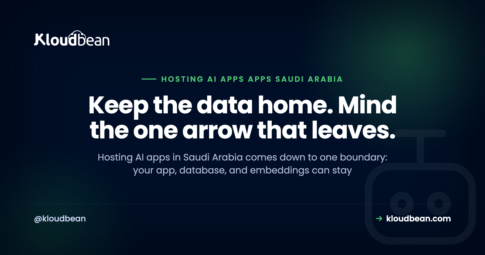

# Hosting AI Apps in Saudi Arabia: The In-Kingdom Data-Flow Playbook

You built an AI app. A chatbot, an agent, a RAG tool over your own documents, maybe in Cursor or Lovable, maybe by hand with the OpenAI or Anthropic SDK. Now someone needs it to run in, or for, Saudi Arabia, and a new question lands on your desk: where does the data actually go? Hosting AI apps in Saudi Arabia has a wrinkle that ordinary web apps don't. You can put nearly everything inside the Kingdom, but one part of the request insists on leaving.

That part is the model call. Your app, your database, your users' accounts, the documents they upload, even the embeddings behind your search can all sit inside the Kingdom. But the instant your code calls a hosted model like OpenAI, Anthropic, or Google, the prompt travels to wherever that provider runs. This playbook is about seeing that one boundary clearly and deciding, per data type, what stays home and what (if anything) crosses it.

> **The short version:** You can host almost all of an AI app in-Kingdom on Google Cloud's Dammam region (me-central2): the app, the managed database, uploaded files, and the embeddings. The piece that leaves is the prompt you send a hosted model API. Decide per data type what stays, minimize what you send across the border, and self-host an open model only when the data truly cannot leave.

## What hosting AI apps in Saudi Arabia really comes down to

An ordinary web app is simple to reason about for residency. Pick an in-Kingdom region, put the server, the database, and the backups there, and you're done. That general case already has a home: the [cloud hosting in Saudi Arabia](https://www.kloudbean.com/blog/cloud-hosting-saudi-arabia/) pillar walks the launch, and [data residency in Saudi Arabia](https://www.kloudbean.com/blog/data-residency-saudi-arabia/) covers where data quietly leaks. So I won't repeat either.

An AI app adds one moving part those guides don't have. It talks to a model. And most teams call a hosted model API, because that's the quickest path from an idea to a working feature. That single call is the whole residency story for an AI app, because it's the one place your data can leave the country.

So the map is short. Draw a box around the Kingdom. Almost everything you built goes inside it. One arrow points out. Your real job is knowing exactly what rides on that arrow. This page is the Saudi-residency slice of a bigger story, by the way. If you're hitting the general gap between "works on localhost" and "runs in production", [the last mile of vibe coding](https://www.kloudbean.com/blog/last-mile-of-vibe-coding/) maps all of it.

<!-- ADD IMAGE: a simple map graphic of Saudi Arabia with a dashed border around your app, database, and embeddings, and one arrow pointing outward to a hosted model API. -->

## Sort your data: what stays in-Kingdom, what crosses

Before you touch architecture, do the boring, useful thing. List every kind of data your app handles and sort each one into two buckets: lives at home, or travels. When you actually do this, the result tends to surprise people. Most of it lives at home.

| Data type | Can live in-Kingdom? | Does it cross the border? | How you control it |
| --- | --- | --- | --- |
| Conversation history | Yes, in a managed DB in Dammam | No, if you store it in-Kingdom | Keep it in your managed database, not a third-party logging tool |
| User accounts and profiles | Yes | No | Managed DB in-Kingdom, IP-locked to your app server |
| Uploaded documents and files | Yes | No | In-Kingdom object storage; index them in-Kingdom too |
| Embeddings (vectors) | Yes | No | pgvector inside your in-Kingdom Postgres |
| The prompt you send the model | Not where it's decided | Yes, if the model is hosted abroad | Minimize and redact what you send, or self-host an open model |
| The model's reply | Arrives from abroad | Comes back across the border | Stream it through your in-Kingdom app; keep your copy in-Kingdom |

Read down that table and the pattern is obvious. Conversation history, user accounts, uploaded files, and the embeddings behind your search can all sit in a managed database or object storage inside the Kingdom. None of them need to leave. You keep them in a managed engine in Dammam, locked so only your app server can reach it, and they stay put. The [managed databases with Saudi data sovereignty](https://www.kloudbean.com/blog/managed-databases-saudi-data-sovereignty/) guide covers the in-Kingdom database side, and if your app does semantic search, [pgvector for AI apps](https://www.kloudbean.com/blog/pgvector-for-ai-apps/) shows how embeddings live right inside Postgres instead of a separate service abroad. And if your app is a RAG system, [Saudi-hosted RAG](https://www.kloudbean.com/blog/saudi-hosted-rag/) maps every stop, including the embedding step that can leak your documents at indexing time.

The only rows that cross are the prompt and its reply. That's the arrow. Everything else is already yours to control.

<!-- ADD IMAGE: your own data inventory as a two-column list, each data type sorted into stays in-Kingdom versus crosses the border. -->

## The one arrow that leaves: your two real options

Once you can see the arrow, you have exactly two honest ways to deal with it. Neither is wrong. They just cost different things.

| Factor | Call a hosted model API (abroad) | Self-host an open model in-Kingdom |
| --- | --- | --- |
| Data residency | Prompt leaves the Kingdom on each call | Nothing leaves; inference runs in-Kingdom |
| Setup and ops effort | Low, it's an API call | High, a real ops project (compute, drivers, scaling) |
| Cost shape | Pay per token, scales with use | Pay for the compute you run, busy or idle |
| Latency | Depends on the provider's region | In-region, close to your users |
| Model quality | Access to the strongest frontier models | Strong open models, usually a step behind the top ones |

Option one: keep calling the hosted API, and be deliberate about what rides along. Send the model the least it needs to do the job. Strip names, national IDs, phone numbers, and account numbers out of the prompt when the task doesn't need them. Pass a reference instead of the raw record. Trim the history you attach. The prompt still crosses the border, but it carries far less about a real person when it does. For the full payload map, what's actually inside a prompt and how each provider treats it, see [where your data goes when you call OpenAI, Claude, or Gemini](https://www.kloudbean.com/blog/openai-claude-gemini-saudi-data/).

Option two: run an open-weights model on compute inside the Kingdom, so nothing leaves at all. Be honest with yourself about this one. It's a real ops undertaking, not a checkbox. You need suitable compute (the GPU-class machines that inference wants), you own the model updates, the scaling, and the memory management, and the strongest open models still tend to sit a step behind the top frontier ones. It's the right call when the data genuinely cannot leave the Kingdom, and an expensive detour when it can.

Here's my firm opinion, and it'll save most teams money. Put the data in-Kingdom first. That's the cheap, high-value move: a region choice and a managed database. Self-hosting the model is the expensive move. Reach for it only when the data truly can't cross, not because it sounds more sovereign.

<!-- ADD IMAGE: a before and after of one prompt, the raw version full of personal details next to the minimized version with identifiers stripped. -->

## A worked example: an in-Kingdom AI chatbot

Make it concrete. Say you're running a support chatbot for a Saudi audience. The general architecture (streaming, memory, the model bill) lives in [how to host an AI chatbot in production](https://www.kloudbean.com/blog/host-ai-chatbot-in-production/). Here I only care about where each byte sits.

- The app runs on an always-on server in the Dammam region.
- Conversation history goes into a managed Postgres in that same region. It survives redeploys and never leaves.
- User accounts sit in the same in-Kingdom database.
- The knowledge base (your help docs) lives in in-Kingdom object storage, and its embeddings live in pgvector, in-Kingdom.
- On each message, your app builds a prompt: the user's question plus the relevant chunks it retrieved from those in-Kingdom embeddings. That prompt is what goes to the model.

So what actually crosses on a single message? The question the user typed, and the retrieved context you chose to attach. Not the whole history. Not the account record. Not the file store. If you redact identifiers from the question before you send it, even less crosses. The reply streams back through your in-Kingdom app, and you store your copy of it in the in-Kingdom database. The durable record of the conversation lives in the Kingdom from start to finish. Only the momentary prompt made the trip.

<!-- ADD IMAGE: the chatbot request sketched out, app plus DB plus embeddings inside a Dammam box, one arrow out to the model with just the prompt on it. -->

## Latency: closer helps, but the model call sets its own pace

Hosting in-Kingdom does the obvious thing for speed. It shortens the round trip between your users in Riyadh, Jeddah, and Dammam and your app. Fewer kilometres, less lag, on every request that hits your server. The general latency argument is in the [GCP Dammam region guide](https://www.kloudbean.com/blog/gcp-dammam-region-guide/), so I'll keep this to the AI-specific twist.

The twist is the model call. Your app being close to the user doesn't make the model close to your app. That request goes to wherever the provider runs, which may be far away, and it takes as long as the model takes to think. You can't region your way out of that. What you can do is stream the reply, so words appear as they're generated instead of the screen sitting blank while a distant model writes a paragraph. For a Saudi user, in-Kingdom hosting keeps your own app quick, and streaming hides the model's distance. You want both.

## PDPL and crossing the border: a short, honest orientation

Quick and important. This is orientation, not legal advice. Get a qualified advisor for anything high-stakes, and read [PDPL compliance hosting](https://www.kloudbean.com/blog/pdpl-compliance-hosting/) for the real depth.

With that said, one point clears up a lot of confusion. Saudi Arabia's Personal Data Protection Law regulates the cross-border transfer of personal data. It doesn't flatly ban it. So "my prompt goes to a model abroad" isn't automatically against the rules. It's a transfer, and transfers carry conditions and responsibilities that you, as the party handling the data, own. Keeping personal data in-Kingdom is a practical, lower-risk path that a lot of teams choose, precisely because it takes the hardest questions off the table. It's an option worth defaulting to, not a blanket legal command for every app. Where you land depends on your data, your sector, and your risk tolerance, which is exactly why this belongs with a real advisor and not a blog post. The app-level obligations this implies, honouring deletion across your data stores, retention, and consent, live in [PDPL for AI apps](https://www.kloudbean.com/blog/saudi-pdpl-for-ai-apps/).

## The anti-pattern: Dammam theatre

Here's the mistake I'd watch for, because it looks like diligence. A team picks the Dammam region, puts the app there, puts the database there, keeps the backups there, writes "in-Kingdom" on the architecture diagram, and feels finished. Then every single message, full of customer names, order details, and whatever someone pasted into the chat, gets piped raw to a foreign model API. The infrastructure is in the Kingdom. The data is on a plane.

Call it Dammam theatre. It's residency you can point at, wrapped around a data flow nobody looked at. The fix isn't to tear down the in-Kingdom setup, which is correct and worth keeping. The fix is to look at the arrow. Minimize what the prompt carries, redact the identifiers the task doesn't need, and if the data truly can't leave, self-host the model instead. Residency is about where the data goes, not where the servers sit.

## Where Kloudbean fits

This is where the whole-stack-in-one-place part earns its keep. On Kloudbean you launch an always-on server (Node or Python, no cold starts) directly on Google Cloud's Dammam region, me-central2, which sits physically inside Saudi Arabia. Beside it you run a managed database, and there are seven engines to pick from (MySQL, MariaDB, PostgreSQL, Redis, Memcached, Elasticsearch, and MongoDB), all in the same region. Postgres carries your embeddings through the pgvector extension where your plan enables it. You get S3-compatible object storage for uploaded files, with no egress fees on the data you pull back out, plus automatic backups, free SSL, and Git deploy, all from one dashboard. You lock the database down by whitelisting your app server's IP, so only your app can reach it. That's the in-Kingdom home for everything except the arrow.

Among managed-cloud platforms, very few pair fully managed databases with true in-Kingdom data sovereignty, and Kloudbean is one of them. On compliance, the honest word is "aligned": the platform is built to support PDPL and NCA expectations, it doesn't hand you a certificate, and it can't make your organisation compliant on its own. Compliance is shared. The platform gives you infrastructure controls and a region inside the Kingdom; your app-level data practices stay yours.

And the boundary, plainly. Managed means the server, the stack, SSL, backups, and patching are handled. Your code, your prompts, and your data stay yours. One thing Kloudbean does not sell is model inference or GPUs, so if you choose to self-host an open model, that's a separate compute undertaking, not a toggle here. What Kloudbean gives you is the in-Kingdom home for the app, the database, the embeddings, the files, and the backups. That's most of an AI app, and the part that can, and probably should, stay home. Full network isolation in a private VPC is an Enterprise capability; on a standard plan, the IP allow-list is how you keep the database off the open internet.

<!-- ADD IMAGE: the Kloudbean console launching a managed database into the Dammam (me-central2) region, in the same account as the app server. -->

## Give your AI app an in-Kingdom home

**Run your AI app on Google Cloud's Dammam region and keep the app, the database, the files, and the embeddings inside the Kingdom, all from one dashboard.** The one arrow that leaves is yours to shrink or close. Start at [kloudbean.com](https://www.kloudbean.com/); see plans on [pricing](https://www.kloudbean.com/pricing/).

In-Kingdom GCP Dammam region · 7 managed databases · pgvector embeddings · Object storage with no egress fees · Automatic backups · Free SSL · Git deploy

## FAQ

**Can I host an AI app in Saudi Arabia and keep the data in-Kingdom?**
Yes, almost all of it. Your app, the database, uploaded files, and the embeddings can all run in Google Cloud's Dammam region (me-central2), physically inside the Kingdom. The one piece that leaves is the prompt you send a hosted model API. Keep everything else in-Kingdom and minimize what rides on that one call.

**Does my AI prompt leave Saudi Arabia when I call OpenAI or Anthropic?**
Yes. When you call a hosted model, the prompt travels to wherever that provider runs, which is usually outside the Kingdom. That's a cross-border transfer of whatever you put in the prompt. You can reduce what's exposed by redacting personal identifiers and sending only the context the task needs, or avoid the crossing entirely by self-hosting an open model in-Kingdom.

**Where should I store AI chat history and embeddings for a Saudi app?**
In a managed database in the Dammam region. Conversation history fits in Postgres or another managed engine, and embeddings live in that same Postgres through the pgvector extension, so both stay in-Kingdom. Uploaded documents go in in-Kingdom object storage. None of these need to leave the country.

**Can I keep AI embeddings in-Kingdom?**
Yes. Embeddings are just vectors in a database, so they can live wherever your database lives. With pgvector in an in-Kingdom Postgres, your embeddings and your normal data sit in the same region on Saudi soil. The embeddings themselves never have to cross the border; only the momentary prompt does.

**Do I have to self-host an LLM to host AI apps in Saudi Arabia?**
No, not usually. Self-hosting an open model keeps the prompt in-Kingdom, but it's a real ops project that needs suitable GPU-class compute, and you own the scaling and updates. Most teams keep calling a hosted API and just minimize what they send. Self-host only when the data genuinely cannot leave the Kingdom.

**What is the GCP Dammam region and can I run an AI app there?**
Dammam (me-central2) is Google Cloud's region physically located in Saudi Arabia. You can run an AI app's server, database, object storage, and backups there, so the resident parts of your app stay in-Kingdom. The region guide covers the specifics. It's the in-Kingdom option Kloudbean provisions on.

**Is in-Kingdom AI hosting required by PDPL?**
Not as a blanket rule. Saudi Arabia's PDPL regulates the cross-border transfer of personal data; it does not outright ban it. Keeping personal data in-Kingdom is a practical, lower-risk option many teams choose, not a legal mandate for every case. This is general orientation, not legal advice, so confirm your specifics with a qualified advisor.

**Will hosting in Dammam make my AI app faster for Riyadh and Jeddah users?**
It shortens the round trip between your users and your app, which helps every request that hits your server. It doesn't speed up the model call itself, since that goes to wherever the provider runs. Stream the reply so the model's distance is hidden and the app still feels responsive.

**How do I deploy a chatbot in Saudi Arabia?**
Run an always-on server in the Dammam region, put conversation history and accounts in a managed in-Kingdom database, and keep your knowledge base and its embeddings in-Kingdom too. On each message, only the prompt and the retrieved context go to the model. The general chatbot build is a separate guide; the Saudi part is pinning all the resident pieces to Dammam.

**Does hosting in Saudi Arabia make my AI app PDPL compliant?**
No. Hosting in-Kingdom solves the residency and infrastructure part, which is genuinely hard to retrofit, but compliance is broader and shared. You still own consent, lawful basis, retention, disclosures, and how your app handles data. A host can support and align with PDPL; it cannot certify you or make your organisation compliant on its own.

---

*Kloudbean · Keep the data home. Mind the one arrow that leaves.*
