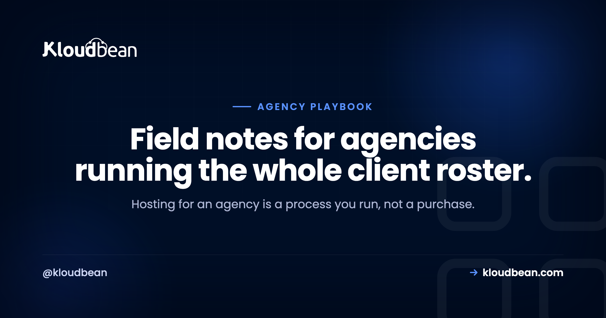
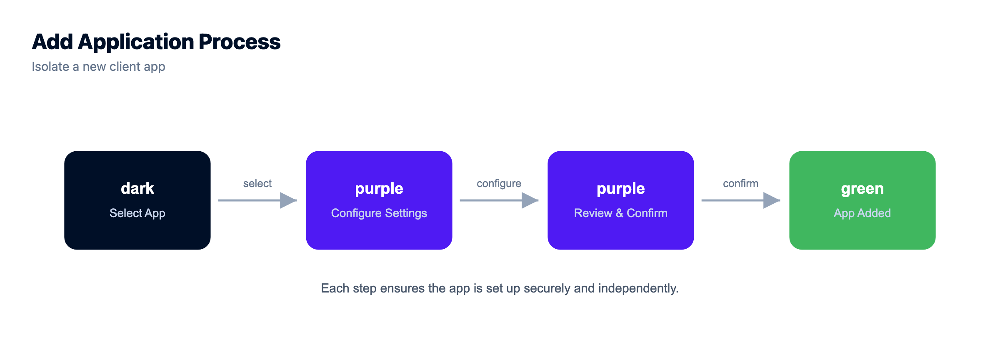
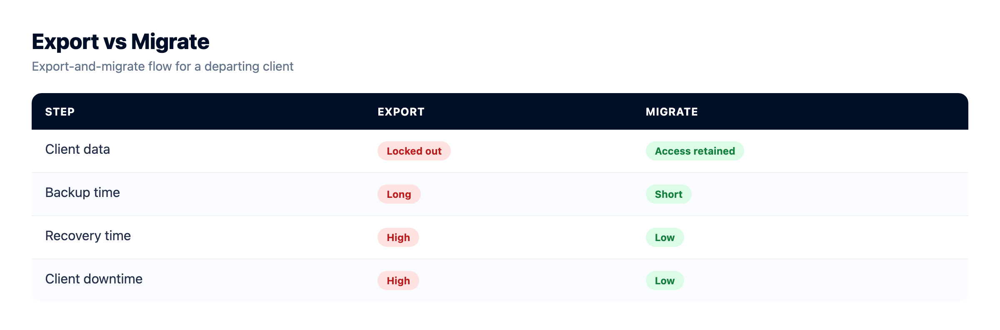
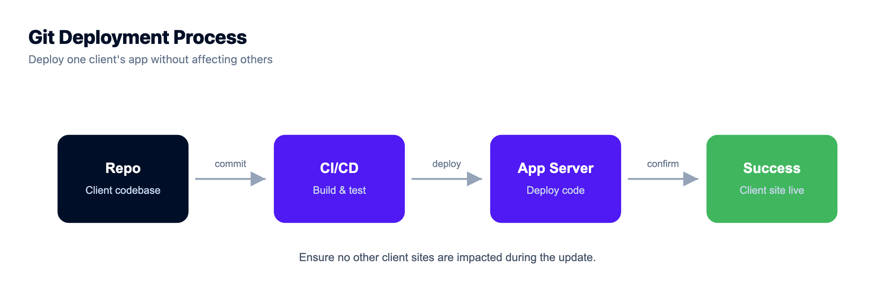

# The Agency Hosting Playbook: Run Client Sites Like a Pro

Most agencies buy hosting. The good ones run it. That one word is the whole difference between holding forty client sites calmly and living one login away from a bad afternoon.

This is the agency hosting playbook I wish more shops had before their client roster got big. It's a process, with a setup you do once and a per-client routine you repeat forever. Work through it top to bottom the first time. After that you're just running the checklist. We'll cover account structure, real per-client isolation, scoped access for your team and your clients, staging, backups, billing that protects your margin, and how to hand a site back without burning the relationship.

> **The short version:** Run everything from one account, name things consistently, and give people scoped access instead of shared passwords. Put each client in its own isolated app or server (never one shared reseller box). Standardize a per-client onboarding checklist: isolate, stage, SSL, backups, DNS, secrets, access, launch check. Test a restore before you need it. And keep offboarding clean, because the client's site and data are theirs.

## Buy hosting, or run it? Run it.

Here is the mental flip that fixes almost everything. Stop thinking of hosting as a product you resell and start thinking of it as an operation you run for clients. An operation has structure. It has a setup, a routine, a cadence, and an exit. Skip the structure and you get the classic agency mess: a pile of separate logins, live edits with no staging, backups nobody has ever restored, and a client offboarding that turns into a fight.

None of that is a hosting problem. It's a process problem. So let's build the process.

## One account, many walled-off clients

Before the phases, picture the shape you're aiming for. One control plane, your agency account, fanning out to client environments that can't touch each other. Same login for you. Full isolation between them. Scoped logins for everyone else, which the [subusers and UAC guide](https://www.kloudbean.com/blog/subuser-and-uac-guide/) covers as its own runbook.

*Diagram: one agency account (subusers + UAC) fanning out to isolated per-client environments. Same login for you, walls between them.*

## Phase 1: The foundation you build once

Do this before your first client site. It's an afternoon of setup that saves a decision on every client you ever add.

- **One central account.** Every client site, server, and database lives under a single login. This is the biggest lever for staying sane, and it's the thing agencies most often get wrong by spreading work across five providers.
- **A naming convention you'll actually keep.** Pick a pattern and never deviate. Something like `acme-prod`, `acme-staging`, `acme-db`. Future-you, scanning a list of forty things at 9pm, will be grateful.
- **Roles, not shared passwords.** Set up subusers with scoped permissions from day one. A designer who only needs staging shouldn't be able to delete a production server. This is what [real isolation](https://www.kloudbean.com/blog/single-tenant-vs-multi-tenant/) looks like at the people layer.
- **A default stack and size.** Decide your standard starter spec so spinning up a new client is a known quantity, not a fresh debate each time.

On that third point, here's a sample access map. Adapt the roles to your team, but the principle holds: least privilege, granted per resource.

| Role | Can do | Cannot do |
| --- | --- | --- |
| **Owner (you)** | Everything: servers, billing, access | Nothing off-limits |
| **Senior dev** | Deploy, manage apps and databases | Touch billing, delete servers |
| **Designer** | Staging, files, content | Production deploys, server actions |
| **Client (subuser)** | View their own site and reports | See other clients, change infra |

That last row matters more than it looks. Scoped client access means a client logs in and sees their site, and only their site. No other client's name is anywhere near it.

## Phase 2: The per-client onboarding checklist

This is the routine you run every single time you take on a site. Make it muscle memory. The tenth client should feel exactly as smooth as the first, because you ran the same list. The step-by-step version, with an intake list and a definition of done, is the [agency onboarding checklist runbook](https://www.kloudbean.com/blog/agency-onboarding-checklist/).

- **Isolate the client.** Put the site in its own app (its own system user and web root) or its own server if it's heavy. Never drop a new client into a shared pile where they can read a neighbor's files.
- **Set up staging.** Kloudbean has one-click staging for WordPress and Laravel, so you can show the client a change before it hits their live site.
- **Turn on SSL.** Free certificate, HTTPS live, auto-renewing. Confirm it, don't assume it.
- **Enable backups** and write down the schedule.
- **Point the domain** and verify DNS actually resolves before you tell anyone it's live.
- **Set secrets in the environment**, never in the repo. If you're fuzzy on this, [environment variables done right](https://www.kloudbean.com/blog/environment-variables-done-right/) is the five-minute read.
- **Grant scoped access** to the client (view-only, usually) and the right teammates by role.
- **Run a launch check.** Click through the live site. Test the contact form, a login, a checkout. The client will, so you should first.

## The shared reseller box is where agencies get burned

I'll be blunt about this one, because I've seen it go wrong too many times. The old reseller model, one box with everyone's sites crammed into shared space, feels cheap and simple right up until it isn't. One client's hacked plugin becomes everyone's incident. One runaway process slows every site you host. And when a client wants to leave, untangling their stuff from the shared heap is a genuine chore.

Per-client isolation costs a little more thought up front and saves you the 2am pages later. Here's the honest comparison.

| | Shared reseller box | App or server per client |
| --- | --- | --- |
| **Isolation** | Weak: shared space and users | Strong: own user, files, database |
| **One client hacked** | Risk spreads to neighbors | Contained to that client |
| **Noisy neighbor** | Everyone slows down | Cap and move the heavy one |
| **Per-client restore** | Awkward, all-or-nothing | Roll back one site cleanly |
| **Offboarding** | Untangle from the pile | Export and hand over |

If you want the full mechanics of running many isolated apps efficiently, that's its own guide: [how agencies host 20+ client apps](https://www.kloudbean.com/blog/how-agencies-host-20-client-apps/). And there's a broader take on when to consolidate versus split in [hosting multiple apps on one server](https://www.kloudbean.com/blog/host-multiple-apps-one-server/).

## Phase 3: The care cadence

Hosting well is a light, regular rhythm, not a one-time launch. Set a cadence and hold to it.

- **Updates on staging first.** Test plugin, theme, and dependency updates on staging, then promote. Updating straight on production is how a Tuesday turns into a fire drill.
- **Actually restore a backup now and then.** An untested backup is a hope, not a backup. Restore one to staging occasionally and confirm it's real.
- **Watch uptime.** Knowing a site is down before the client emails you is half of what "support" even means to them.
- **Keep a short per-client log.** What's installed, any quirks, who the contact is. So anyone on the team can pick up a site cold.

## Phase 4: Media and off-server backups belong in object storage

Client sites pile up files fast. Media libraries, downloads, user uploads. Those don't belong scattered on the app server, and your backups definitely don't belong on the same box they're supposed to protect.

Built-in [S3-compatible object storage](https://www.kloudbean.com/blog/s3-compatible-object-storage/) gives client media a durable home that survives a server rebuild and serves quickly. Just as important, store backups *off* the server they cover. A backup sitting on the box that failed isn't a backup, it's a souvenir. There's a fuller treatment in the [server backups guide](https://www.kloudbean.com/blog/server-backups-guide/).

## Phase 5: Billing and margin

Hosting should make you money, not quietly cost you time you never bill. Pick a model and price the work, not just the server.

- **Bundle it into a retainer.** Hosting becomes part of a monthly care plan next to maintenance and support. Clients like the simplicity and you stop itemizing infrastructure.
- **Or bill it through with a margin.** You pay the platform cost and charge a clear fee above it. Simple and transparent.
- **Keep costs predictable.** Flat, understandable platform pricing is what lets you set a client price with confidence. Surprise overages eat margin and trust at the same time.

You're selling management, updates, monitoring, and a person who answers when something breaks. That's worth more than a raw server, so charge for it. The models, the margin math, and what is actually billable are in the [client billing and markup guide](https://www.kloudbean.com/blog/client-billing-and-markup-for-hosting/).

## Phase 6: Offboard cleanly, because their data is theirs

Sometimes a client leaves. How you handle that day says more about your agency than any pitch deck. Treat it as an ethics test you pass every time. The export, transfer, revoke, and delete steps are the [agency client offboarding runbook](https://www.kloudbean.com/blog/agency-client-offboarding/).

- **Hand over cleanly.** Give them the files and a database export, or migrate the site to wherever they're going. Their site and data belong to them. Don't hold either hostage, ever.
- **Revoke access** and remove the site from your account once handover is confirmed.
- **Keep a final backup for a short window**, in case they need something after the move.

A clean exit earns referrals and the occasional returning client. A messy one follows you around the local business community for years.

## Where agencies get burned (learn from other people's scars)

Nearly every agency hosting horror story traces back to a skipped phase. Separate logins that multiply into chaos. Live edits with no staging. Backups nobody tested. Shared admin passwords instead of scoped roles. A rushed offboarding that torches a relationship. Every one of those has a phase above that prevents it. The playbook is the fix.

One more that stings: putting all your best clients on the same machine. If that box has a bad day, so does your entire top tier of revenue at once. Spread the important ones.

## How agency hosting maps to Kloudbean

You can run this playbook anywhere in theory. It's a lot easier when the platform is built for it. Here's the honest fit, feature by feature, no fluff:

- **One dashboard for the whole roster.** Servers, apps, managed databases, object storage, and load balancing under a single login, across seven clouds (AWS, Lightsail, Google Cloud, DigitalOcean, Vultr, Linode, UpCloud). Pick the cloud and region per client.
- **Real per-client isolation.** Each app gets its own system user and space. Give each client its own database from six managed engines (MySQL, MariaDB, PostgreSQL, Redis, Elasticsearch, MongoDB).
- **Scoped access built in.** Subusers and User Access Control give per-resource, per-action permissions, so team roles and client view-only access are a settings screen, not a workaround.
- **Staging, SSL, and backups.** One-click staging for WordPress and Laravel, free auto-renewing SSL, and automatic backups.
- **Git deploys per app.** Connect a repo and ship on push with [managed CI/CD](https://www.kloudbean.com/blog/ci-cd-auto-deploy-from-github/), with live build logs. Shipping one client's update never touches another's uptime.
- **Free migration help** to move the first clients over, so adopting this isn't a lost weekend.

<!-- ADD IMAGE: the Git Deployment screen, shipping one client's app from its repo without touching the rest of the roster (../assets/console-real/shots/git_connect_step_4.png) -->

The honest boundary, since you're the custodian of other people's sites: this is managed Linux hosting. The platform keeps the servers, stack, SSL, and backups healthy. Your clients' code and data always stay theirs (and yours). Running hosting like a pro means owning the process, never locking up the content. If enterprise clients need Kubernetes, autoscaling, a private VPC, or an audit trail, those live on the enterprise tier.

<!-- cta:start -->
**Run the whole client book from one console.**

Host client apps as isolated applications on servers you own, each with its own database and SSL, with per-app backups and Git deploys, and scoped access for teammates through subusers and user access control.

- One dashboard
- Per-client isolation
- Subusers and access control
- Per-app backups
- Git deploys
- Free migration assistance

[Start free](https://console.kloudbean.com/register) · [See plans](https://www.kloudbean.com/pricing/)
<!-- cta:end -->

## FAQ

**How should an agency manage hosting for many clients?**
Run it as a process, not a purchase. Keep one central account, use a naming convention, grant scoped roles instead of shared passwords, and run the same per-client onboarding checklist every time (isolate, stage, SSL, backups, DNS, secrets, access, launch check). Add a light care cadence and a clean offboarding routine. That structure is what lets a small team hold dozens of sites calmly.

**What should be on an agency's client onboarding checklist?**
Isolate the site in its own app or server, set up staging, turn on SSL, enable backups, point DNS, set secrets in the environment, grant scoped access by role, and run a launch check that confirms forms, logins, and payments work. Running the identical list every time keeps the tenth client as smooth as the first.

**Is it safe to host multiple clients on one server?**
Yes, when they're properly isolated. Each app should get its own system user, web root, process, and database, so one client can't read or crash another. The shared risk that remains is a server-level failure, which you cover with tested per-app backups and by not stacking all your highest-value clients on a single machine.

**How do I give clients and teammates the right access?**
Use subusers and User Access Control to grant per-resource, per-action permissions. A designer gets staging, a senior dev gets deploys and databases, and a client gets view-only on their own site. Nobody sees another client's resources, and nobody gets more power than their job needs.

**Where should agencies store client media and backups?**
In S3-compatible object storage. It gives client media a durable home that survives server rebuilds and serves fast behind a CDN, and it keeps the app server lean. Store backups off the server they protect, because a backup on the box that failed isn't recoverable when you need it most.

**How do agencies actually make money on hosting?**
Charge for the management, not just the server. Bundle hosting into a retainer or bill it through with a margin, and keep platform costs predictable so your pricing stays stable. You're providing updates, monitoring, staging, and support on top of infrastructure, and that bundle is worth more than the raw server cost.

**What's the right way to offboard a client's site?**
Hand it over cleanly. Provide the files and a database export, or migrate the site to the client's new host, then revoke access and remove it from your account. Keep a final backup for a short window in case they need something. The site and data are theirs, so never hold them hostage. A clean exit protects your reputation and earns referrals.

**Do I need to be a sysadmin to run agency hosting this way?**
No. On a managed platform the patching, security hardening, SSL renewals, and backups are handled for you. You run the client-facing process (onboarding, staging, deploys, support) from one dashboard, and the heavy ops stay off your plate. That's the point of managed hosting for an agency.

By Kloudbean · Field notes for agencies running the whole client roster.
