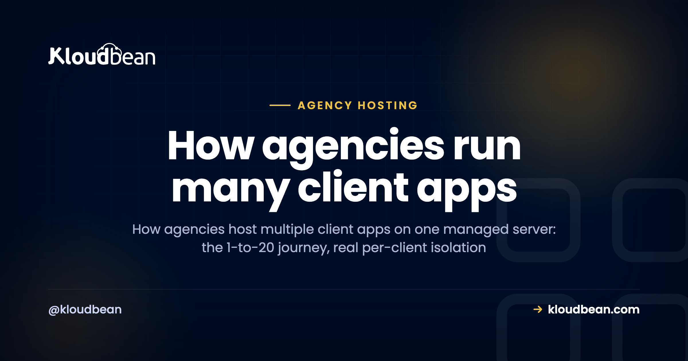

# How Agencies Host 20+ Client Apps on One Managed Server

The question isn't whether you can host multiple client apps on one server. You can. The real question is what happens between client app #1 and client app #20, and whether the setup that felt clever at three clients still feels clever at twenty.

This is the growth story, told the way it actually happens. Not "spin up a VPS and cram everything in," but the mechanics of adding one client, then five, then twenty, and keeping the whole thing calm. What stays flat as you grow. What quietly grows with you. And where it bites if you skip the discipline. If you want the higher-level agency operations version, the [agency hosting playbook](https://www.kloudbean.com/blog/hosting-for-agencies-playbook/) covers billing and offboarding too. This piece is the hands-on "how do I actually run 20" part.

> **The short version:** One well-sized managed server can hold twenty-plus light-to-moderate client apps, as long as each app is truly isolated (its own system user, database, and SSL) and you can back up and deploy them one at a time. What stays flat as you scale: your logins, your dashboard, your bill. What grows: apps, databases, and domains, which is fine because they're a few clicks each. Move the heaviest client to its own server when it earns it.

## The trap most agencies fall into first

Count your logins right now. Go on. A frontend host for the Next.js builds, a WordPress host for the brochure sites, something metered for the one client whose "quick landing page" quietly became a booking system, and a database provider you forgot you were even paying for. Every project arrived with its own dashboard, its own quota, its own renewal date. By client ten, nobody on the team can tell you what the monthly infrastructure bill actually is.

That's the trap: a platform per client app. It scales your costs and your mental overhead linearly with your client count, and it never gets easier. The alternative is older than most of the platforms charging you for it. Put the client work on servers you control, run them from one place, and let something else handle keeping those servers patched and healthy.

## What grows as you add clients, and what doesn't

Here's the whole argument in one picture. As you go from one client app to twenty, your resources grow (more apps, more databases, more domains). But your *control surface*, the number of places you log into and the number of bills you reconcile, stays flat at one. That gap is the entire point of consolidating onto managed servers.

<!-- ADD IMAGE: growth chart. As client apps go from 1 to 20, per-client resources (apps, databases, domains, SSL) climb, while logins, dashboards and bills stay flat at one. -->
*Chart: add clients and your resources climb, but your control surface (logins, dashboards, bills) stays at one. That flat line is the win.*

## App #1: the day-one setup

Your first client app sets the template for every one after it, so it's worth doing deliberately. You launch one server, sized with real headroom, and add the client's app to it. WordPress, a Node build, a Laravel API, whatever they need. The app lands in its own isolated space with its own system user. That's the foundation.

Two decisions here pay off for years. First, a naming convention you'll stick to (`acme-wp`, `globex-next`), because staring at twenty unnamed apps later is genuinely miserable. Second, don't under-buy the server. This box is going to carry a crowd eventually, so give it room.

## Apps #2 to #5: the pattern locks in

This is the good stretch. Each new client is the same short routine on the same server: add the app, give it its own database, wire the connection into that app's environment variables, deploy from Git, point the domain, install SSL. Five minutes of clicks, not an afternoon of setup.

And this is where the flat line from the chart starts to feel real. Client #5 didn't add a fifth dashboard or a fifth bill. It added one app to a server you already run. You're building a system, and the system is getting easier per client, not harder.

<!-- ADD IMAGE: the Add Application screen, adding a new client app to the same managed server in its own isolated space (../assets/console/add-application.png) -->

## Apps #6 to #12: where the toil actually creeps in

Somewhere around here, the cracks show if your setup is sloppy. Not because one server can't hold the apps, but because a shared box has sharp edges. Four of them, specifically. Anyone who's run a busy server has the scars.

**Noisy neighbor.** One client's traffic spike or memory leak starves the others. The fix is headroom and limits. Size the server with room to spare, keep roughly a quarter of it free for spikes, and watch which client is trending up. When one app consistently wants more than its share, that's your cue to move it, not to buy a bigger everything.

**Blast radius.** They share a kernel, so a server-level failure is a shared failure. Your insurance is backups you've actually restored, plus not stacking all your best clients on one machine. Spread the important ones across two boxes.

**Per-client backups.** A whole-server snapshot is useless when one client deletes a page and wants *just their site* rolled back to Tuesday. You want backups you can restore at the individual app and database level. If your setup only does all-or-nothing restores, you'll feel it the first time a client panics.

**Deploys without collateral damage.** Shipping an update for Client C should never risk Client A's uptime. Per-app processes plus a real [CI/CD pipeline](https://www.kloudbean.com/blog/ci-cd-auto-deploy-from-github/) handle this. You deploy one app and the neighbors never notice.

> **The one that gets people:** the most common failure I see isn't capacity, it's a shared database with every client's tables in it. It feels tidy on day one. It becomes a security and backup nightmare by client eight. Give every client their own database from the start.

## Apps #13 to #20: what breaks without discipline

By the mid-teens, you're not learning anything new, you're just enforcing the habits from earlier. The apps that break the calm are always the ones that skipped isolation or naming. Two honest limits are worth saying out loud.

There's no magic number for "apps per server." Anyone who quotes you one is guessing. Static sites and cached WordPress brochure sites are featherweights, so a modest box holds a lot of them. A busy Laravel app with background jobs, or a Node API doing real work, is a different animal, and a handful of those can fill the same server. Watch memory first (it's usually what runs out), then CPU and disk. Twenty-plus light-to-moderate sites on one properly sized machine is realistic. Twenty heavyweight apps is not, and that's fine, because you'll split those out anyway.

## The cost and toil, side by side

Put the two models next to each other and the growth math is obvious.

| | A platform per client app | Isolated apps on one managed server |
| --- | --- | --- |
| **Logins to manage** | One per client, and climbing | One, flat |
| **Monthly bills** | Several, hard to total | One, predictable |
| **Adding client #15** | New account, new quota, new dashboard | Add an app, a few clicks |
| **Per-client isolation** | Varies by vendor | Own user, database, SSL |
| **Who patches the OS** | You, or nobody | Managed for you |
| **Moving a heavy client out** | Full migration off a platform | Move one app to its own server |

## The isolation model that keeps client apps on one server safe

"Multi-tenant on one server" only works if the tenants can't touch each other. Done right, each client app gets four walls:

- **Its own system user and web root.** Client B's PHP can't read Client A's files. This is the single most important line of defense, and it's boring on purpose.
- **Its own process or pool.** WordPress sites run in their own pools, Node and Next apps run as their own managed processes, a Laravel app has its own queue workers. If one hangs, the neighbors keep serving.
- **Its own database and credentials.** A separate MySQL, PostgreSQL, or Redis per client. Never one shared database with everyone's tables.
- **Its own domain and SSL,** each terminating its own certificate, renewed automatically.

Underneath, it's a Linux server running Nginx or Apache with the runtimes installed, which is why the apps can be a total mix. WordPress next to Next.js next to a Django API on the same box. There's a deeper look at the tradeoffs in [single-tenant vs multi-tenant](https://www.kloudbean.com/blog/single-tenant-vs-multi-tenant/), and the general case in [hosting multiple apps on one server](https://www.kloudbean.com/blog/host-multiple-apps-one-server/).

## Where a managed platform earns its keep

You can do every bit of this on a raw VPS. Plenty of agencies start there. What ends the honeymoon is the ops. Kernel patches, a failed SSL renewal at midnight, a security incident you hear about late, the backup script that quietly stopped running in March. That work doesn't bill, and it doesn't scale with your team. Honestly, most agencies don't need a DevOps hire, they need the DevOps done.

That's the gap [Kloudbean](https://www.kloudbean.com/) fills. You pick the cloud (AWS, Lightsail, Google Cloud, DigitalOcean, Vultr, Linode, or UpCloud) and the region, then run your whole client book on servers you own, from one console:

- **The server is managed for you:** security hardening (Shorewall firewall and Fail2ban), OS patching, monitoring, and free auto-renewing SSL on every site.
- **Any stack, side by side:** WordPress, Next.js, Vue, Laravel, Django, Node, and static sites, plus six managed databases (MySQL, MariaDB, PostgreSQL, Redis, Elasticsearch, MongoDB) running right next to the apps.
- **Built-in load balancing and S3-compatible object storage,** so client media and off-server backups have a durable home and traffic can be spread when a client grows.
- **Managed CI/CD from Git with live build logs,** so adding, isolating, and shipping client apps is a few clicks, and one app's deploy never risks another's uptime.
- **Scoped access with subusers and UAC,** so teammates and clients get exactly the permissions they should, and free migration help to move your first clients over.

When a client genuinely outgrows the shared model, or needs hard isolation for compliance, that's when the [enterprise tier](https://www.kloudbean.com/enterprise/) (Kubernetes, autoscaling, a private VPC, and an audit trail) makes sense. Most of your roster won't need it. Match the client to the setup instead of over-buying on day one.

## Setting it up on Kloudbean

Here's the actual click-path, agency edition. One server, many isolated clients, no DevOps hire required.

### 1. Launch one shared server

From the dashboard, click **Add Server**. Pick your **Cloud Provider** and the **datacenter** nearest most of your clients, choose a first **Application** (say WordPress or Node.js), name the server something you'll recognize (`agency-prod-01`), and choose a **size with real headroom**, because this box will carry several apps. Hit **Launch Now** and it provisions in a few minutes.

<!-- ADD IMAGE: the Add Server screen, choosing cloud provider, region, and a server size with headroom for many apps (../assets/console/add-server.png) -->

### 2. Add each client as its own application

This is the step that makes the whole model work, and it's a first-class feature, not a workaround. Go to **Applications → Add Application** and add each client's app to the *same* server. WordPress for one, a Next.js build for another, a Laravel API for a third. Each app lands in its own isolated space with its own system user, so no client can read or crash another.

### 3. Give each client its own database

From **DBS → Launch Database**, spin up a PostgreSQL or MySQL instance *per client* instead of sharing one, then wire the credentials into that app's **Runtime Configuration → Environment Variables**. One client's data never sits in another's database. (There's a full walkthrough of the wiring in [hosting an app, API, and database on one server](https://www.kloudbean.com/blog/host-app-api-and-database-on-one-server/).)

### 4. Deploy each app from Git

For every client app, open **Git Deployment**, connect the repo, pick the branch, and **Pull & Deploy**. Because each app deploys independently, shipping Client C's update never risks Client A. Turn on automated deployment per app and pushes go live on their own. If a client's app was built with an AI tool, the full deploy walkthrough is in [how to deploy an AI-built app to production](https://www.kloudbean.com/blog/deploy-ai-built-app-to-production/).

<!-- ADD IMAGE: the Git Deployment screen, connecting a client repo and deploying that one app without touching the others (../assets/console/git-deployment.png) -->

### 5. Domains and SSL, per client

In each app's **Domain Aliases**, add that client's domain (point its DNS at the server's public address) and install a free **Let's Encrypt** certificate. Every site terminates its own HTTPS, renewed automatically.

### 6. Backups at the right level

Server-level backups cover the whole box. For the "roll back *just this client* to Tuesday" case, use per-application backups so you can restore one app or database without touching the rest. Test a restore to staging before you're depending on it. The [server backups guide](https://www.kloudbean.com/blog/server-backups-guide/) goes deeper.

## When to split into more servers

Consolidation is a starting point, not a religion. Split a client onto its own server when its resource use is consistently crowding the others, when it needs genuine isolation for security or compliance, or when the blast radius of one shared machine gets bigger than you're comfortable with. The goal was never "everything on one server forever." It's the fewest servers you can run well, with the ops off your plate. And because it's all one console, moving one app out leaves the rest untouched. Same login, same bill.

**Run the whole client book from one console.** Spin up your first managed server, add clients as isolated apps, and watch the dashboard sprawl disappear. Start free at [kloudbean.com](https://www.kloudbean.com/); see plans on [pricing](https://www.kloudbean.com/pricing/).

One console · Per-client isolation · Managed databases · Per-app backups · Git deploys · Free migration · Free trial

## FAQ

**How many client apps can one server really host?**
It depends on the apps, not a magic number. Cached WordPress and static sites are light, so a modest server holds many; busy Node or Laravel apps are heavier, so fewer fit. Watch memory first, keep real headroom for spikes, and move the heaviest client to its own box when it earns it. Twenty-plus light-to-moderate sites on one well-sized server is realistic.

**Is it safe to put multiple clients on the same server?**
Yes, when they're properly isolated. Each client gets its own system user, web root, process, database, and SSL, so one can't read or crash another. The shared risk that remains is a server-level failure, which you cover with tested per-app backups and by not stacking all your highest-value clients on one machine.

**Can I run WordPress and Node or Next.js apps on the same server?**
Yes. Underneath it's a Linux server running Nginx or Apache with multiple runtimes installed, so WordPress, Next.js, Laravel, Django, and Node apps can live side by side on one box. Add each one from Applications, Add Application.

**How do backups and restores work per client?**
Server-level backups cover the whole box, and per-application backups let you restore an individual app or database, so you can roll back one client's site without touching anyone else's. Test a restore to staging before you actually need it, so you know the path works.

**What's the difference between this and reseller hosting?**
Old-school reseller hosting splits one box into fixed quotas behind a control panel, usually with weak isolation. Running isolated apps on a managed server gives each client its own user, database, and SSL, on modern clouds you choose, from one console. There's a fuller comparison in reseller hosting versus managed cloud.

**When should a client get its own server instead?**
When it consistently crowds the others on resources, when it needs hard isolation for security or compliance, or when you're not comfortable with the shared blast radius. Because everything runs from one console, moving that one app to a dedicated server leaves the rest of your roster untouched.

By Kloudbean · From client app #1 to #20, on one console.
