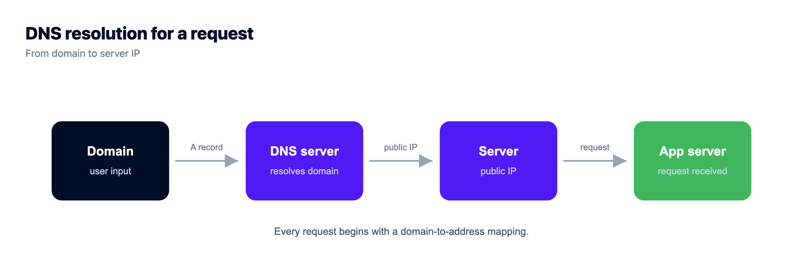
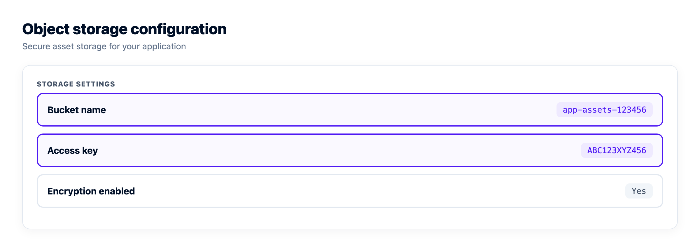
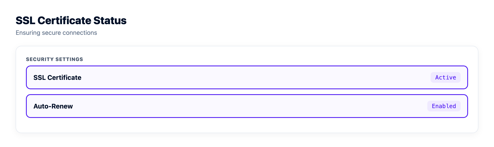
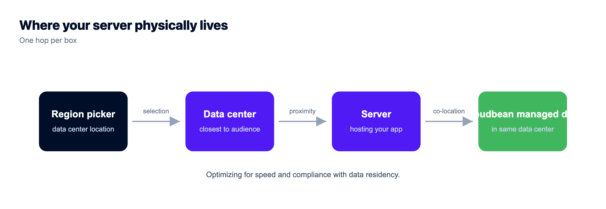

# How Cloud Hosting Works: The Life of a Single Request

You typed a domain, hit enter, and a page appeared. Simple, right? Underneath, a dozen pieces of infrastructure just did their jobs in a few hundred milliseconds, and most of them stay invisible until one breaks.

This is how cloud hosting works, told as the journey of a single request. From the moment your browser asks "where does this site live?" to the moment your data is written and safely backed up. No hand-waving about "the cloud" as magic fog in the sky. Just the real machines, in order, and why each one earns its place.

> **The short answer:** Cloud hosting runs your site or app on a virtual server, a slice of a much larger physical machine in a data center. When someone visits, DNS turns your domain into that server's IP address, the request travels in, your application code runs and reads or writes a database, and the response comes back. Managed cloud hosting adds the operations layer on top: provisioning, security, SSL, and automatic backups handled for you.

## What is cloud hosting, and what's a cloud server?

Start with what the word "cloud" hides: there's a real computer. What is cloud hosting? It's renting computing power from a provider's data center instead of buying and racking a machine yourself. Your site runs on a **cloud server**, a virtual machine carved out of a big physical host by a hypervisor. You get a guaranteed slice of CPU, memory, and disk that behaves like its own box, with its own IP address and operating system, almost always Linux.

The old way was one physical server in a rack. It died, you drove to it. You outgrew it, you migrated to a bigger one over a weekend. Cloud hosting broke that. Your server is virtual, so it spins up in minutes, resizes while it runs, and moves to healthy hardware if a host fails. That, at its most basic, is how web hosting works: a server with an address, waiting to answer requests.


## The shape of it: one request, end to end

Before we walk each piece, here's the whole path in one picture. A request enters from the left, threads through the layers, and returns the same way. Object storage and backups branch off to the side.

```
                          ┌──────────── YOUR ACCOUNT · INTERNAL ────────────┐
You ─▶ DNS ─▶ Load balancer ─▶ App server ─▶ Managed DB
(browser) (name→IP) (public door·SSL)   │              │
                                         ▼              ▼
                                   Object storage    Backups
                                   (files/uploads)   (automatic)
```

## How cloud hosting works, one hop at a time

Now the walk, cloud hosting explained the way you'd actually debug it. Each layer solves a real problem, and each bites back if you ignore it.

### Step one: DNS turns a name into an address

Your browser has no idea what `example.com` means. It knows IP addresses, numbers like `203.0.113.10`. DNS, the Domain Name System, is the phone book in between. Hit enter and your machine asks a chain of resolvers to translate the name into an IP, caching the answer so the next lookup is basically free.

```bash
# what DNS is really doing (an A record)
example.com.   300   IN   A   203.0.113.10

# your browser then opens an HTTPS connection to that IP
curl -I https://example.com
```

That `300` is the TTL, how many seconds the answer stays cached. It's why a DNS change takes time to show up everywhere: the record is cached all over the internet, and those copies expire on their own clock. This is the naming answer to how web hosting works. A DNS record points your domain at your server's public IP, and everything after depends on that one line.



### The load balancer: one public door for many servers

For a single server, DNS points straight at it. Run more than one, and something has to decide which server answers each request. That's a **load balancer**. It sits at the front, holds the public address, and spreads traffic across a pool of backends. It runs health checks too, so a server that stops responding is pulled from rotation automatically and visitors never notice.

It usually terminates SSL as well, so HTTPS ends there and you manage certificates in one place. Do you need one on day one? Honestly, no. A single well-sized server handles plenty first, and adding a balancer early is moving parts without a problem to solve. Reach for it when one server isn't enough, or when you need a dead node to be a shrug instead of an outage. Full breakdown in [how a cloud load balancer works](https://www.kloudbean.com/blog/cloud-load-balancer-explained/). It leans on [health checks](https://www.kloudbean.com/blog/nodejs-health-checks/) to route only to servers that can actually serve, which is also what makes [zero-downtime deploys](https://www.kloudbean.com/blog/zero-downtime-deployments/) safe.


### The web server: answering on ports 80 and 443

Traffic reaches your server and hits a **web server** process, usually Nginx or Apache, on port 443 for HTTPS (and 80 for plain HTTP, which it redirects to 443). It reads the incoming request and decides what to do with it.

A static file, an image, a stylesheet, a built React bundle, it hands back directly. Anything dynamic, a dashboard, a search, a checkout, it forwards inward to your application. People call that a reverse proxy.

### The app runtime: where your code actually runs

Behind the web server sits the **application runtime**, the process running the code you wrote. PHP-FPM for WordPress or Laravel. A Node process for Express or a server-rendered React or Vue app. Gunicorn or Uvicorn for Django and FastAPI. A JVM for Java. This is the layer people mean when they say "my app." It takes the request, runs your logic, usually hits a database, and builds the response the web server sends back.

Here's a failure mode worth naming, one of the most common going. The app hard-codes a port the platform doesn't expect, or binds to `localhost` instead of `0.0.0.0`, so the web server can't reach it and every request returns a `502` or `503`. The code is fine. The wiring is wrong. The fix is boring: read the port from an environment variable and bind where the platform tells you. Most deploy failures are config, not code.

### The managed database: where your data lives

Your app needs to remember things. Users, orders, posts, sessions. That's the **database**, the one component you can't rebuild from your code repo if it's lost. On any sane setup it does not sit open on the public internet. It's reachable by your app and nothing else, whether you lock it to your app server's IP with IP allow-listing or, on bigger setups, put it on a **private network** (a VPC). Scanners hammer public database ports constantly, so keeping it off the open web isn't optional.

A **managed** database goes further: the platform provisions the engine, patches it, keeps it private, and backs it up, while the schema and the data stay yours. A trap worth flagging: plenty of generated apps ship with SQLite, a single file on the app server's disk. Great in dev, wrong in production, because the next redeploy can wipe that file and every row in it. A real client-server database is the fix. More on walling it off in [what a VPC is and why your database belongs in one](https://www.kloudbean.com/blog/what-is-a-vpc/).

### Object storage: the files that don't belong in a database

Databases are for structured data, not a 40MB video or a profile photo. Big files go to **object storage**, an S3-compatible bucket that stores blobs and serves them over HTTP. Cheap, scales on its own, and keeps your database lean.

One rule saves a lot of pain: don't write uploads to the app server's local disk. Redeploy and it can be wiped. Add a second server and half your traffic can't see what the other half saved. Send them to a bucket from the start and the problem never exists.



### Backups: the layer you hope you never open

Everything above can be rebuilt from your code, except your data. **Automatic backups** are the safety net under the whole stack. A server snapshot rolls a broken box back to a known-good state. Database backups save you from a bad migration or a fat-fingered `DELETE`.

The mistake people make is trusting backups they've never restored. A backup you haven't tested is a hope, not a plan. Run one restore into a throwaway environment, confirm the data comes back, and then you know the path works.

## Where SSL, the CDN, and the edge fit

Three things wrap around the whole path rather than living at a single hop.

**SSL/TLS** is the padlock in the address bar. It encrypts the connection between visitor and server so nobody in between can read or tamper with it. Modern hosting issues free, auto-renewing certificates, so HTTPS is the default rather than a yearly chore. **A CDN** caches static content in locations around the world and serves each visitor from the nearest one, which cuts latency and origin load. Kloudbean offers Cloudflare Enterprise edge caching as an add-on for exactly this. And in front of all of it, **DDoS protection** absorbs floods of junk traffic before they ever reach your server. Here's [how DDoS protection actually works](https://www.kloudbean.com/blog/ddos-protection-explained/) and why the filtering happens at the edge.



## Managed vs unmanaged cloud hosting: who fixes it at 3am?

Two ways to buy a cloud server, and the difference is entirely about who does the operations work.

**Unmanaged** means a bare Linux box and root access. Everything above the operating system is your job: web server, database, runtime, firewall, SSL renewals, security patches, backups. Total control, and a real time sink. When something breaks at 3am, that pager is yours.

**Managed cloud hosting** hands that layer to the platform. Server, stack, SSL, patching, and backups handled, so you work on the app instead of on `apt upgrade`. The honest boundary: managed doesn't mean someone writes your code or owns your data. You own both and can export them anytime. It just means the plumbing is somebody else's problem. Weighing the two? See [managed vs unmanaged hosting](https://www.kloudbean.com/blog/managed-vs-unmanaged-hosting/).

| | Unmanaged cloud | Managed cloud hosting |
| --- | --- | --- |
| Server setup | You install and configure everything | Provisioned and configured for you |
| Security patches | Your responsibility, on your schedule | Handled by the platform |
| SSL certificates | Install and renew yourself | Free, auto-renewing |
| Backups | You build the whole pipeline | Automatic, restorable |
| A 3am outage | Your pager | Platform handles the infrastructure |
| Your app and data | Yours | Still yours |

## How cloud hosting scales: vertical, horizontal, and the autoscaling question

Traffic grows. You have two real moves, and one overhyped one.

**Vertical scaling** is making the server bigger. More CPU, more RAM, a couple of clicks and a reboot. Simplest thing you can do, and almost always the right first step. A single beefier box carries most apps a long way. **Horizontal scaling** is adding servers behind a load balancer, spreading the work across a pool. That's for when one box, however big, isn't enough, or when you want redundancy so one failure can't take you down.

Then there's **autoscaling**, which adds and removes servers automatically as load changes. Sounds essential, mostly oversold. Most small and mid-sized apps never need it. A right-sized server plus the option to resize covers years of growth, minus the surprise bills that come from machines spinning up on their own. On Kloudbean, autoscaling and Kubernetes are part of enterprise and custom setups, not a switch a standard account flips. If you think you might need it, read [autoscaling and whether you actually need it](https://www.kloudbean.com/blog/autoscaling-explained/) first. The honest default: watch your graphs, resize near the ceiling, add a server when uptime demands it.


## Regions and data residency: where your server physically sits

"The cloud" is always somewhere specific. A **region** is a physical data center location, and you pick it when you create the server. Two reasons it matters: latency and the law.

First, latency. A server close to your users answers faster, because the request travels less distance. Traffic mostly in Europe? A European region shaves real milliseconds off every round trip. Second, **data residency**. Some rules require personal data to stay inside a country or bloc, so where the bytes live becomes a legal question, not just a performance one. The full picture is in [data residency, explained](https://www.kloudbean.com/blog/data-residency-explained/).



## Uptime, SLAs, and what "reliable" actually means

Reliability gets sold in nines. 99.9% uptime sounds airtight until you do the math: roughly 43 minutes of downtime a month. 99.99% is about 4. Each extra nine is exponentially harder and more expensive to reach, which is why a vague "high availability" claim earns a raised eyebrow.

An **SLA**, a service level agreement, is the provider's written promise about uptime, usually with credits back if they miss it. Read what it actually covers. The foundation underneath matters just as much. Kloudbean runs on tier-1 clouds like AWS, Google Cloud, and DigitalOcean, so the hardware and networking beneath your server already carry serious redundancy. For reading these promises without getting spun, see [cloud SLAs, explained](https://www.kloudbean.com/blog/cloud-sla-explained/). An SLA is a promise, not a measurement, so pair it with your own [uptime monitoring](https://www.kloudbean.com/blog/uptime-monitoring/) to know the truth from the outside.

## The whole stack, on one dashboard

Here's where it comes together. Every layer we just walked, the server, the load balancer, the managed database, the object storage, SSL, the backups, traditionally means juggling separate products, logins, and bills. That sprawl is where things get dropped.

Kloudbean puts the entire stack behind **one dashboard** and one login. Seven clouds to launch on: AWS, AWS Lightsail, Google Cloud, Linode, Vultr, DigitalOcean, and UpCloud. Seven managed database engines, from PostgreSQL and MySQL to Redis and MongoDB. Built-in S3-compatible object storage. A Flexible Load Balancer available on every account, off until you flip it on. Free auto-renewing SSL and automatic backups on by default. Run a server, a database, a static site, and a standalone load balancer side by side without leaving the panel. Comparing your options? [What makes the best managed cloud hosting](https://www.kloudbean.com/blog/best-managed-cloud-hosting/) lays out what's actually worth looking for.


<!-- cta:start -->
**You built the app. Give it a real home.**

Run the app as an always-on process with managed databases, Redis, object storage, and automatic backups beside it. Deploy from Git with live build logs, and keep the infrastructure someone else's problem.

- Managed databases
- Always-on processes
- Object storage
- Automatic backups
- Free SSL
- Git deploy
- Free migration

[Start free](https://console.kloudbean.com/register) · [See plans](https://www.kloudbean.com/pricing/)
<!-- cta:end -->

## FAQ

**How does cloud hosting work, in simple terms?**
Your site runs on a virtual server inside a provider's data center. When a visitor loads it, DNS translates your domain into that server's IP address, the request travels in, your app code runs and reads or writes a database, and the finished page travels back. Cloud hosting just means that server is virtual, so it can be created, resized, and moved in minutes instead of being a physical box you own.

**What is a cloud server?**
A cloud server is a virtual machine carved out of a larger physical host by a hypervisor. You get a dedicated slice of CPU, memory, and disk that behaves like its own computer, with its own IP address and operating system, usually Linux. Because it's virtual, the provider can spin it up fast, resize it while it runs, and move it to healthy hardware if a physical host fails.

**How is cloud hosting different from traditional web hosting?**
Traditional web hosting often meant your site shared one physical server with many others, with fixed resources and little room to grow. Cloud hosting runs on virtual servers backed by large fleets of hardware, so you can resize on demand, survive a hardware failure by moving to another host, and pay for what you use. The request path is similar; the flexibility and resilience underneath are the difference.

**What is managed cloud hosting?**
Managed cloud hosting means the platform handles the operations layer for you: provisioning the server, configuring the stack, applying security patches, issuing and renewing SSL, and running automatic backups. You still own your application code and your data and can export them anytime. Unmanaged hosting gives you a bare server and leaves all of that work to you.

**Do I need a load balancer for my site?**
Usually not at first. A single well-sized server handles a surprising amount of traffic, and a load balancer adds cost and moving parts. You want one when you outgrow the largest sensible single server, or when you need redundancy so one server failing does not take you offline. Add it when the scale or uptime need is real, not before.

**Where is my data actually stored?**
In the data center region you choose when you create the server. Structured data lives in your database, reachable only by your app and not the public internet, large files live in object storage, and both are covered by automatic backups. The region matters for speed, because closer is faster, and for data residency, because some regulations require personal data to stay inside a specific country or region.

**How does scaling work in cloud hosting?**
Two ways. Vertical scaling makes the server bigger, more CPU and RAM, which is the simplest first move and covers most apps for a long time. Horizontal scaling adds more servers behind a load balancer to spread the work and add redundancy. Autoscaling, which adds servers automatically, is rarely needed by small or mid-sized apps and on Kloudbean is part of enterprise and custom setups.

**How reliable is cloud hosting?**
It depends on the design and the foundation. Uptime is measured in nines: 99.9% is about 43 minutes of downtime a month, 99.99% about 4. Running on tier-1 cloud infrastructure gives you hardware and network redundancy underneath, and adding a load balancer with more than one server removes the single point of failure. An SLA is the provider's written uptime commitment, worth reading closely.

---

*By Kloudbean Infrastructure · From the DNS lookup to the nightly backup, one dashboard holds the whole chain.*
