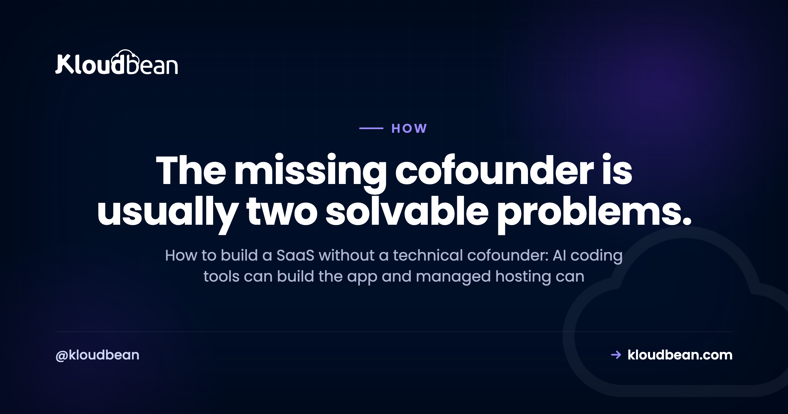

# How to Build a SaaS Without a Technical Cofounder

By Kloudbean Engineering · The missing cofounder is usually two solvable problems.

Almost every non-technical founder hits the same wall. The idea is clear, the market feels real, but there's no engineer on the team, so the search for a technical cofounder begins and the launch stalls for months. Here's a more useful way to look at it. Learning how to build a SaaS without a technical cofounder isn't about finding a magic no-code shortcut. It's about noticing that the "technical cofounder" label bundles several very different jobs, and software has quietly taken over the two biggest ones.

> **The short version.** You can build and run a SaaS without a technical cofounder. The role really bundles two solvable jobs: writing the app, which AI coding tools now handle, and operating the servers, which managed hosting handles. What no one can take over for you is product direction, customer support, and the security of your own code and data.

## So, can you build a SaaS without a technical cofounder?

Short answer: for most products, yes. The longer answer needs one reframe. A SaaS looks like a single technical mountain, so a founder without an engineer assumes they can't even start climbing. But the technical cofounder you think you need is really a bundle of separate jobs, and two of the heaviest ones are no longer human problems.

Writing the first version of an app used to require an engineer. AI coding tools now do a large chunk of that. Running production servers used to require a DevOps person. Managed hosting now does that. What's left over is judgment: what to build, who it's for, how to support them, and how to keep their data safe. That part was always the founder's job, cofounder or not.

So the question worth asking isn't "where do I find a technical cofounder." It's "which of these jobs still needs a human partner, and which can I solve with tools." Get honest about that split and the wall turns into a to-do list.

## What the "technical cofounder" label actually bundles

When founders say they need a technical cofounder, they usually mean one person to do all of these at once:

- **Build the product.** Turn the idea into working software.
- **Run the infrastructure.** Keep servers, databases, deployments, and backups alive.
- **Make technical product calls.** Decide architecture, tradeoffs, and what to build next.
- **Own security and data.** Protect user data and the application itself.

Rolling those into one hire made sense a decade ago, because each one ate real engineering time. It's worth pulling them apart now. Two of these are largely solved by software you can rent. The other two stay with you no matter who's on your cap table. Confusing the four is what makes the whole thing feel impossible.

*Split the role into four jobs and two of them stop being a hiring problem.*

## Building the product: AI tools do most of the typing now

This is the job that changed the most. Tools like Lovable, Bolt.new, v0, Cursor, Replit, Claude Code, and ChatGPT can turn plain-language descriptions into working code. They scaffold an app, build a UI, and wire up a database. A non-technical founder can get a real prototype running without writing much by hand, which was simply not true a few years ago.

That's genuine, and it matters. But be honest about the sharp edges, because this is exactly where people get burned. AI writes code faster than you can read it, and it doesn't understand your business. It'll happily produce something that looks great in a demo and quietly falls over in production. It makes security mistakes. It hard-codes values that should be configurable. So "AI built my app" does not mean "I can ignore the code."

You still need to understand roughly what the app does, especially anything touching payments, logins, or user data. That's not a cofounder's job, it's a founder's literacy. If you want the deployment side of this, the walkthrough for [deploying an AI-built app to production](https://www.kloudbean.com/blog/deploy-ai-built-app-to-production/) covers the gap between "works on my laptop" and "works for a paying user."

My honest take: you don't need someone on your equity to type the code anymore. You need to stay close enough to it that you're never shipping something you couldn't explain to a curious user.

<!-- Swap this slot for a real image. src -> images/ai-tool-prompt.png -->

## Running the servers: that's a managed-hosting job

Here's the job founders underestimate. Building the app is the exciting part. Keeping it running is the part that wakes you at 2am, and it's where a lot of solo founders assume they're stuck without an engineer.

Running production infrastructure means provisioning a server, installing and patching the stack, configuring SSL, setting up a database, wiring deployments, and taking backups. On raw cloud, that's a real, ongoing job, and doing it badly is how you get outages and surprise bills. That's why, for most launches, you [rarely need raw AWS to launch a SaaS](https://www.kloudbean.com/blog/do-i-need-aws-to-launch-a-saas/) at all.

You don't have to operate any of that yourself. Managed hosting exists precisely to take the operations half off your plate. A managed platform provisions the server, keeps the stack patched, handles SSL, runs a managed database, and takes automatic backups, so nobody on your team has to babysit a machine. On Kloudbean that's one dashboard: the server, a managed MySQL or PostgreSQL next to it, free SSL, backups running on their own, and a deploy every time you push to GitHub. The reason that matters for a solo founder isn't the feature list. It's that none of those five things becomes a project you schedule. The database question alone is worth reading up on, because the difference between a [managed database and a self-managed one](https://www.kloudbean.com/blog/managed-database-vs-self-managed/) is roughly the difference between "it's handled" and "it's your weekend."

My take here is blunt: the thing a non-technical founder actually needs isn't a DevOps hire. It's to not run their own raw servers in the first place.

<!-- Swap this slot for a real image. src -> images/managed-dashboard.png -->

## What you can hand off, and what stays yours

Put the split in a table and it gets obvious. Notice the line doesn't fall between "technical" and "non-technical." It falls between generic infrastructure work and decisions only you can make about your product.

| The job | Handled for you | Stays with you |
| --- | --- | --- |
| Writing app code | AI coding tools draft it | Reviewing and understanding it |
| Server, OS, patching | Managed hosting | Nothing, it's covered |
| SSL and backups | Managed hosting | Testing that a restore actually works |
| Database operations | Managed hosting | Your schema and what data you store |
| Deployments | Managed CI/CD from GitHub | Deciding what ships and when |
| Product direction | Nobody | You |
| Customer support | Nobody | You |
| App-level security | Platform hardens the server | Your auth, access rules, and code |

The top rows are buyable. The bottom rows are not. That's the whole map on one page. A technical cofounder would have covered the top rows for equity, and now you can rent that instead. The bottom rows they'd have shared with you, but never fully owned.

## The part no tool takes off your plate

Automating the building and the operating doesn't make the hard parts disappear. It just moves them into focus.

**Product decisions are yours.** What to build, what to cut, who you're selling to, what to charge. No tool and no cofounder replaces that. A technical partner might argue with you about it, which is genuinely useful, but the call is still the founder's.

**Customer support is yours.** When a charge fails or a user's data looks wrong, they email you, not your hosting provider. Early support is also your sharpest product research, so handing it off before you've learned from it is a mistake.

And here's the anti-pattern that bites solo founders hardest: assuming "managed" means your security and your data are fully handled. It doesn't. Managed hosting secures the server, patches the stack, and backs up the machine. It does not secure your application. If your code leaks user data, leaves an admin route open, or trusts input it shouldn't, that's an app-level problem living in code you own. Same story with data: the platform backs up the disk, but making sure your app writes the right records, and that you can actually restore what matters, is on you. The split is easier to see with an example. Kloudbean gives every server a firewall and brute-force protection by default, and lets you whitelist your app server's IP on the database so nothing else can connect to it. Useful, and none of it stops a logged-in user from opening `/admin` because your code never checked whether they should be there. Network controls and authorisation logic are different layers, and only one of them is for sale. A quick pass through a [prototype-to-production checklist](https://www.kloudbean.com/blog/from-prototype-to-production-checklist/) catches most of these before real users do.

The clean way to hold this: managed hosting covers the server, the stack, SSL, backups, and patching. Your application code and your data stay yours. That boundary doesn't shift just because you skipped hiring an engineer.

<!-- Swap this slot for a real image. src -> images/shared-responsibility.png -->

## When a technical cofounder is genuinely worth it

To be fair, sometimes a technical cofounder is the right move, and pretending otherwise would be dishonest. A few situations really do call for one.

**When your product is the engineering.** Some ideas are hard at their technical core: a novel database engine, real-time video, heavy machine learning, anything where the technology is the differentiator rather than a wrapper around it. AI tools and managed hosting won't carry that. You want a real engineer who owns it, ideally as a partner.

**When you're heading into hard scale, fast.** Getting to launch is one thing. Handling serious, spiky growth with complex architecture is another, and it eventually needs someone whose full-time job is the system.

**When you refuse to touch code at all.** You can build without deeply learning to code, but running a software company while refusing to understand any of it is fragile. A technical partner absorbs that risk in a way a tool can't.

**When you want a partner, not a service.** A cofounder brings commitment, shared ownership, and someone in the trenches with you. Vendors and tools don't. For some founders that's the whole point, and it's a fair reason to hold out for the right person.

None of those is "I need someone to set up a server." They're deeper than that. If one of them describes you, go find the partner. If none of them does, you're probably describing work you can now simply buy.

## A realistic path to launching solo

If you're going without a coding cofounder, here's a sane order of operations. It's not the only path, but it dodges the common traps.

1. **Validate before you build much.** Talk to potential users first. The cheapest code is the code you didn't write.
2. **Build a small first version with AI tools.** Keep the scope brutal. One core workflow, done properly, beats ten half-built ones.
3. **Learn enough to read your own code.** You don't need to become an engineer. You need to not be helpless when something breaks.
4. **Put it on managed hosting from day one.** Skip raw cloud. A managed server, a managed database, SSL, and backups get you to production without a DevOps hire. Do it before you have users, not after, because moving a live app is the one part that's genuinely stressful. Kloudbean's trial runs 3 days on one service, which is enough to see whether the deploy from your repo works, and migration is free if the server you're moving is above 4GB.
5. **Handle your security basics.** Secrets in environment variables, real authentication, no admin routes left wide open.
6. **Ship, support, and listen.** Your first users will teach you what to build next better than any roadmap.

None of these steps requires a cofounder's equity. They require your time and a few well-chosen tools. If you're still weighing where to run it, the buyer's view for [hosting an AI SaaS](https://www.kloudbean.com/blog/best-hosting-for-ai-saas/) lays out the options in plain terms. And none of this promises your SaaS will succeed, by the way. It just removes the technical reasons you couldn't start.

<!-- Swap this slot for a real image. src -> images/solo-launch-path.png -->

## What ignoring the operations half costs you, and when the bill arrives

Skipping infrastructure feels free at the start, because nothing bad happens on day one. The cost shows up later, and it's rarely a dramatic outage. It's usually one of these, and it's worth knowing the shape of each before you're in it.

**The data you can't get back.** An app storing data in a file on the server's disk, or a database nobody backs up, works fine until the first redeploy or the first disk problem. Then it's gone, and there's no clever fix at that point. This is the only item on the list with no recovery path, which is why a managed database with automatic backups is the first thing to sort out, before design, before pricing, before anything.

**The weekend that disappears.** Running your own raw server means the patching, the certificate that expires at 3am, the disk that fills with logs. None of it is hard. All of it lands on the one person who also does sales, support and product, which is the actual problem.

**The bill nobody read.** Raw cloud is priced per resource, and an overbuilt setup from a tutorial can quietly cost several times what the app needs. A flat monthly price for a managed server is worse than free-tier arithmetic and better than a surprise.

**The launch that slips by three months.** This is the most common and the least visible. Founders stall not because the infrastructure is impossible but because it's unfamiliar, so it keeps getting postponed. Paying for the operations half is mostly buying the decision back.

That's the specific job Kloudbean does. Managed servers and managed databases in one dashboard, automatic backups, free SSL, patching handled, and a deploy on every push to GitHub, from $8/mo on standard plans (check the [pricing page](https://www.kloudbean.com/pricing/), since numbers move). If cost is the worry, the story of [cutting a SaaS bill from thousands to almost nothing](https://www.kloudbean.com/blog/cut-saas-bill-4000-to-100/) shows how much of the "we need an engineer for infra" instinct is really an overbuilt setup.

Two items on that list no host fixes, ours included. If your app writes user files to the local disk, backups of the server won't save the data you meant to keep, because the app put it somewhere temporary. And no platform makes the product decisions, answers the first support email, or checks whether your `/admin` route asks who's knocking. Renting the operations half doesn't buy you a cofounder. It removes the reason you needed one to start.

<!-- cta:start -->
**Take it off localhost for good.**

Move the whole thing onto a managed server you own: always-on processes, a managed database for real data, object storage for uploads, and Git deploys with live build logs.

- Managed databases
- Always-on processes
- Object storage
- Automatic backups
- Free SSL
- Git deploy
- Free migration

[Start free](https://console.kloudbean.com/register) · [See plans](https://www.kloudbean.com/pricing/)
<!-- cta:end -->

## FAQ

**Can I build a SaaS without a technical cofounder?**

Yes, for most SaaS products. The role bundles two jobs that software now handles well: building the app, which AI coding tools do a lot of, and operating the servers, which managed hosting covers. What stays with you is product direction, customer support, and the security of your own code and data. If your product's core is deep engineering, a technical partner still makes sense.

**What does a technical cofounder actually do?**

Usually four things at once: builds the product, runs the infrastructure, makes technical product decisions, and owns security. Pulling those apart is the key insight. The first two are now largely solvable with tools and managed services, while the last two stay with the founder whether or not you hire an engineer.

**Can a non-technical founder build a SaaS with AI tools?**

Often yes, at least to a working first version. Tools like Lovable, Bolt.new, Cursor, v0, Replit, and Claude Code can scaffold an app, build a UI, and wire up a database from plain-language prompts. The catch is that AI doesn't understand your business, so you have to review what it produces, especially anything around payments, logins, and user data.

**Do I still need to understand the code if AI writes it?**

You don't need to become an engineer, but you can't be helpless either. AI-generated code can look fine in a demo and break or leak data in production. Knowing roughly what your app does, particularly the parts touching authentication, payments, and user data, is the difference between a business you can run and one you can't debug.

**Does managed hosting mean my app and data are secure?**

No, and this trips up a lot of founders. Managed hosting secures the server, patches the stack, handles SSL, and backs up the machine. It does not secure your application code. Your authentication, access rules, and data logic live in code you own, so app-level security stays your responsibility even on a managed platform.

**When should a solo founder actually get a technical cofounder?**

When the engineering is the product, not the wrapper: a novel database, real-time systems, heavy machine learning, or anything where the technology is the hard differentiator. Also when you're facing serious, fast scale, or when you want a committed equity partner rather than a set of services. If you only need someone to set up a server, that's a managed platform, not a cofounder.

**What can't you outsource when building a SaaS alone?**

Product decisions, customer support, and the security of your own code and data. Tools can write your app and platforms can run your servers, but no one else can decide what to build, talk to your early users, or make sure your application handles data safely. Those are the founder's job, with or without a cofounder.

**How much does it cost to run a SaaS without a DevOps engineer?**

Far less than a salary. Instead of hiring someone to operate servers, you pay for managed hosting, which bundles the server, database, SSL, and backups into a predictable monthly cost. Small apps commonly start in the single digits of dollars per month, so always check a provider's current pricing page and watch total cost rather than just the sticker price.

---

*Kloudbean Engineering · Automate the building, rent the infrastructure, and keep the decisions that are actually yours.*
