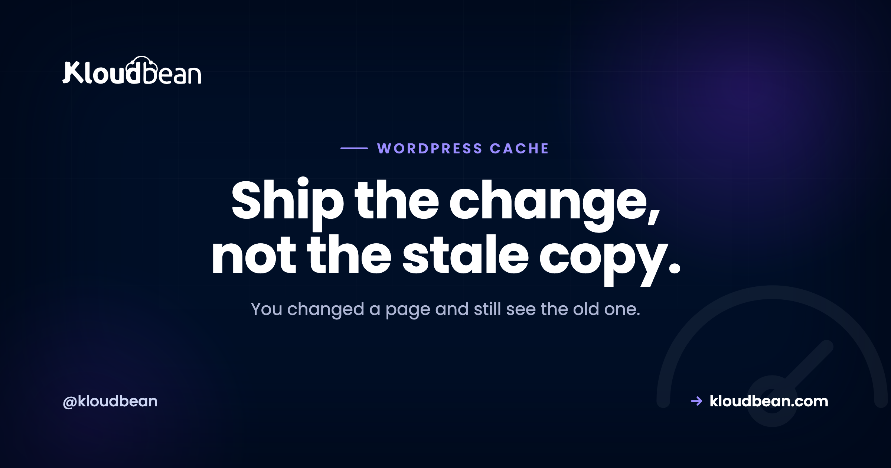
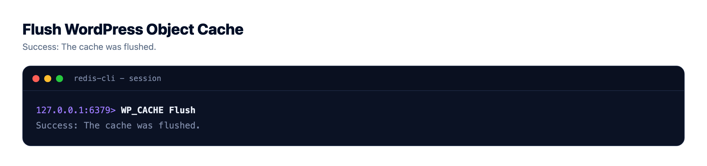
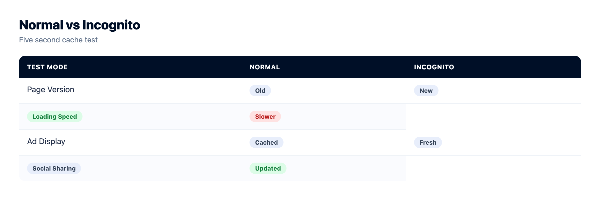
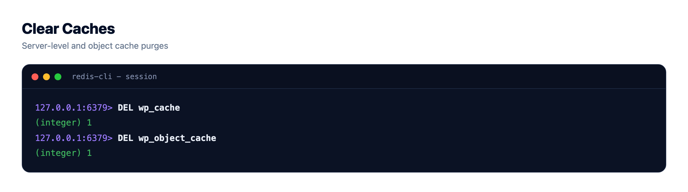

# How to Clear WordPress Cache: Every Layer, and Which One Is Actually Stale

You changed the headline. Saved it. Reloaded the page. Still the old headline. So you save again, harder this time, as if force helps. It doesn't. What you're fighting is a cache, and the annoying truth is that WordPress doesn't have one cache. It has a stack of them.

To clear WordPress cache properly you have to know which layer is holding the stale copy, because clearing the wrong one does absolutely nothing. Hit the purge button on your plugin while the real culprit is your CDN, and you'll swear the button is broken. It isn't. You just cleared a layer that was already fresh. So let's walk the layers a request actually passes through, clear each one, and figure out which is lying to you.

> **Short answer:** Don't nuke everything blindly. Find the stale layer and clear that one. Work from the outside in: open the page in a private window (rules out your browser), then check your CDN or Cloudflare, then your caching plugin, then the Redis object cache with `wp cache flush`. Doing a full refresh after a deploy? Purge the other way, origin first and browser last, so nothing re-caches a stale copy.

## Why clearing WordPress cache is so confusing

Caching exists because building a WordPress page is expensive. Every uncached view runs PHP, queries the MySQL database a few dozen times, assembles HTML, and ships it. A cache saves the finished result so the next visitor gets it instantly. Great for speed. Genuinely the difference between a site that handles a traffic spike and one that falls over.

The problem is that the saved copy lives in more than one place. Your browser keeps one. A CDN keeps one at the edge. A page-cache plugin keeps whole HTML pages. Redis keeps the results of database queries. Even PHP keeps compiled code in memory. When your edit "won't show up," one of those copies is stale and being served ahead of your change. So the real skill here isn't clearing cache. It's knowing which layer to clear.

```
A request travels down. A stale copy can hide at any layer.

  1. Browser cache            -> clear: hard reload / incognito
        |
  2. CDN / Cloudflare edge    -> clear: purge in CDN dashboard
        |
  3. Page cache (plugin/server) -> clear: plugin purge button
        |
  4. Object cache (Redis)     -> clear: wp cache flush
        |
  5. PHP opcache              -> clear: reload PHP
        |
  6. Database (MySQL)         -> the source of truth, never cached
```

## The layers a request passes through

Top to bottom, from the visitor's screen down to the database. A request hits each on the way in, and any of them can hand back an old copy.

### 1. Browser cache

Your browser saves images, CSS, and sometimes whole pages so a repeat visit loads fast. If you're the only person seeing the old version and everyone else is fine, this is almost always it. Hard reload with Ctrl+Shift+R (Cmd+Shift+R on a Mac), or just open the page in a private window. A private window ignores your cache entirely, which makes it the fastest test in this whole article.

### 2. CDN and the Cloudflare edge

A CDN keeps copies of your pages on servers around the world so a visitor in Sydney isn't waiting on a server in Virginia. That's a huge speed win, and it's also the layer people forget. The CDN has no idea you edited anything until you tell it, so it happily serves its cached copy until that copy expires or you purge it. If new content shows in some regions but not others, or your plugin purge did nothing, suspect the CDN. Purge it from wherever it's managed. On Cloudflare that's the caching section with its purge control.


### 3. Page cache (the plugin or server layer)

This is the big one, and the most common culprit by far. A page cache stores the entire rendered HTML of a page so WordPress skips the whole PHP-and-database rebuild. WP Rocket, W3 Total Cache, LiteSpeed Cache, WP Super Cache. They all do this, and each ships a "Clear cache" or "Purge" button, usually in the admin toolbar or the plugin settings. On managed hosting there's often a server-level page cache too (Varnish or an nginx cache), with its own purge control in your host's dashboard. Worth knowing you might have two page caches, a plugin and a server one, which is exactly the trap in the next section.

### 4. Object cache (Redis)

The object cache stores the results of database queries so WordPress doesn't ask MySQL the same question on every load. Most sites use Redis for this. When you flush it, stale query results stop feeding the page rebuild. The clean way is one command:

```
wp cache flush
```

That clears WordPress's object cache, Redis included when it's wired up. It's the single most reliable "clear the WordPress cache" action there is, because it goes straight at the data layer instead of a plugin's idea of it. If you run [managed Redis](https://www.kloudbean.com/blog/managed-redis-hosting/) as your object cache, this is the command that empties it. More on the tool itself in the [WP-CLI guide](https://www.kloudbean.com/blog/wordpress-cli-guide/).



### 5. PHP opcache

PHP compiles your code and keeps the compiled version in memory (opcache) so it isn't recompiling on every request. This rarely affects content, since your posts live in the database, not in code. But if you edited a theme or plugin PHP file and the change won't take, a stale opcache can be why. Reloading PHP clears it. On managed hosting that's usually a restart control or it clears on deploy.

## So which layer is actually stale?

Here's where most guides tell you to purge all of it and pray. Don't. Blowing away every cache means every visitor after you eats a slow, uncached page while the layers refill, and worse, you learn nothing, so you're back here next week. Diagnose instead. Work from the outside in, cheapest test first:

- **Only you see the old version, others see the new one.** It's your browser. Hard reload or use a private window. Done.
- **A private window on your machine shows the new version, normal window shows old.** Still your browser. Clear it and move on.
- **New content in some regions or devices, old in others.** That's the CDN. Purge the edge fully.
- **You purged the plugin and it's still stale.** Look for a second cache: a server-level page cache running alongside the plugin, or the object cache. Run `wp cache flush`.
- **Only a theme or plugin code change won't apply.** Suspect opcache, not content caching. Reload PHP.

A pattern we see constantly in support: someone spends twenty minutes hammering their caching plugin's purge button when the page was fine all along in an incognito window. It was their browser the whole time. The private-window test takes five seconds and saves you the other nineteen minutes. Do it first.



## When you do want to clear everything (after a deploy)

There's one time a full purge is the right call: you just shipped a real change, new theme, updated plugin, bulk content edit, and you want the whole site fresh now. In that case order matters, and it's the opposite of diagnosis. Purge from the origin outward.

Clear the deepest cache first, then work toward the visitor: object cache, then page cache, then CDN, then a hard reload. Why that direction? Because if you purge the CDN while your page cache is still stale, the CDN just re-fetches the stale page from your server and caches it again. You've made no progress. Clear the inside first and every outer layer repopulates from fresh content. In practice that's `wp cache flush`, your page-cache purge, a CDN purge, then Ctrl+Shift+R. Better still, wire that sequence into your deploy so it happens on every release and you never think about it. The [Git deploy flow](https://www.kloudbean.com/blog/ci-cd-auto-deploy-from-github/) is the natural home for it.

## Don't fix this by turning caching off

Tempting thought after an afternoon of this: "caching is the problem, I'll just disable it." Please don't. That's treating a headache with a guillotine. Without caching, every single visit rebuilds the page from the database, so your site is slower for everyone all the time, and it will crumble the moment traffic arrives. You'd trade a ten-second annoyance you hit occasionally for a permanent performance tax. The fix is never "no cache." It's "clear the right cache when I publish." If stale content genuinely keeps biting you, the honest problem is usually a missing purge-on-publish step, not the cache itself. There's more on doing caching right in the [speed up WordPress guide](https://www.kloudbean.com/blog/speed-up-wordpress/).

## Stop fighting this every week

Two habits kill most of the recurring pain. First, cache-bust your assets. When CSS, JS, and image files carry a version or hash in the name (`style.css?v=8` or `app.4f2a.js`), updating a file changes its name, so caches fetch the new one automatically and you never purge assets by hand. Most build tools and good themes do this for you. Second, purge on publish. If publishing a post or deploying code automatically flushes the page and object cache, "why won't my change show" mostly disappears.

This is a Linux and PHP stack underneath, and on managed WordPress the server page cache, the Redis object cache, and the Cloudflare edge (a paid add-on, free on Enterprise) are set up and sitting behind a purge control, so clearing the right layer is a button or a one-line `wp cache flush`. Managed means the server, stack, SSL, and backups are handled. Your content and your data stay yours, and clearing any cache never touches them. It only refreshes the copies.



<!-- cta:start -->
**WordPress, without the server admin.**

The stack, the patching, SSL, and backups are handled, so your work stays on the site rather than the box. Staging is one click, and the managed database sits right next to the app.

- Managed WordPress stack
- One-click staging
- Managed MySQL and MariaDB
- Automatic backups
- Free SSL
- Built-in load balancer

[Start free](https://console.kloudbean.com/register) · [See plans](https://www.kloudbean.com/pricing/)
<!-- cta:end -->

## FAQ

**How do I clear the WordPress cache?**
Find the stale layer and clear that one instead of purging everything. Work from the outside in: try a private window (rules out your browser), then purge your CDN or Cloudflare, then your caching plugin, then the Redis object cache with `wp cache flush`. If you're refreshing the whole site after a deploy, go the other direction and clear the object cache first, then page cache, CDN, and browser last.

**Why don't my WordPress changes show up after I save?**
A cached copy of the page is being served ahead of your edit. Your change is saved in the database, but one of the layers above it (page cache, object cache, CDN, or your browser) is still handing out the older version. Clear the layer that's stale and the change appears immediately.

**What are the layers of WordPress caching?**
From the visitor inward: browser cache, CDN or edge cache, page cache (whole rendered HTML from a plugin or the server), object cache (cached database queries, usually Redis), and PHP opcache (compiled code). The database underneath is the source of truth and is never cached. Stale content is stuck in one of the layers above it.

**How do I clear the WordPress cache from the command line?**
Use WP-CLI over SSH: `wp cache flush` clears WordPress's object cache, including Redis when it's configured. It's the most reliable single action because it targets the data layer directly. Many caching plugins add their own WP-CLI commands too, and you can script the flush into a deploy step so it runs on every release.

**What's the difference between page cache and object cache?**
A page cache stores the entire finished HTML of a page, so WordPress skips rebuilding it at all. An object cache stores the results of individual database queries, so a page that does rebuild doesn't re-ask MySQL the same things. Page cache is the bigger speed win for anonymous visitors; object cache helps logged-in users and dynamic pages that can't be fully page-cached.

**Does clearing the cache delete my content or settings?**
No. A cache only holds copies of already-saved content. Your posts, pages, and settings live in the database and are untouched by a cache flush. The worst that happens is the next few visitors get a slightly slower page while the caches refill, then it's fast again.

**Why is my site still cached after I purged the plugin?**
Almost always a second cache you forgot. The usual pair is a caching plugin plus a server-level page cache (Varnish or nginx), so the plugin purge clears one and the server one keeps serving old HTML. A CDN sitting in front does the same thing. Clear the server cache and purge the CDN, then recheck in a private window.

**Should I clear my browser cache or the server cache first?**
For diagnosis, test your browser first with a private window because it's the fastest way to rule yourself out. For a deliberate full refresh after publishing, clear the server side first (object cache, then page cache, then CDN) and your browser last, so outer layers don't re-cache a stale copy from an inner one you haven't cleared yet.

**How do I stop needing to clear the cache manually?**
Two habits handle most of it. Cache-bust your static assets so their filenames change when the file changes, which makes caches fetch the new version automatically. And wire a page and object cache purge into your publish or deploy step so fresh content goes out on every change. On managed WordPress the server and object caches are already set up behind a purge control, so it's a button or a scripted `wp cache flush`.

---

*By Kloudbean · Ship the change, not the stale copy.*
