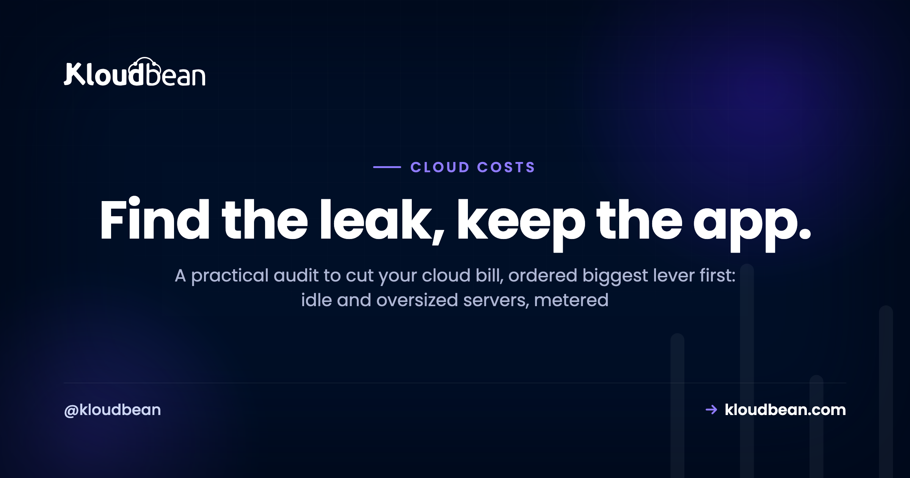

# How to Cut Your Cloud Bill: A Cost Audit

Cloud bills rarely spike. They creep. A server sized "to be safe," a volume nobody deleted, bandwidth climbing quietly with traffic, and one month the invoice is double what it should be. Then you go looking for a cloud cost calculator and realize the leak was never a mystery. It was six ordinary things.

This is the audit I'd run to cut your cloud bill, ordered by the size of the lever, not by how clever it feels. Work top to bottom and most people find real, recurring money in the first two items. Almost none of it degrades your app. It removes waste. Every figure below is illustrative, because your bill is yours, but the shape holds across most small setups.

> **The short version.** Open the itemized bill and attack the biggest line first. In order: right-size idle or oversized servers, consolidate scattered metered services onto one predictable server, plug egress with a CDN and object storage, delete zombie resources, prune old snapshots, and switch off dev environments overnight. Set a budget alert so it can't creep back. The two moves that pay most for small teams are right-sizing and consolidation.

## Before the checklist: find the single biggest leak

Don't start optimizing at random. Open the itemized bill and sort by cost. The biggest line is where your savings are, full stop. I've watched people spend an afternoon shaving a two-dollar line item while a ninety-dollar-ish egress charge sat three rows up, ignored (numbers illustrative). If you only have twenty minutes, spend them here: find the top line, and go straight at it. Usually that's an oversized server or bandwidth.

While you're in there, set a budget alert. Optimization isn't a one-time cleanup. A quick monthly glance is what keeps the next creep from becoming the next surprise.

(See the leaky-bucket diagram in the HTML version: six holes, one plug each, with metered sprawl flagged as the biggest win.)

## The audit, biggest lever first

### 1. Right-size what's idle or oversized

The most common waste is capacity you pay for and don't use. A box picked oversized "just in case," or sized for a traffic peak that never arrives, burns money every hour it runs. Check actual CPU and memory. If a server sits at, say, 8% CPU all day, it's too big. Resize it down to fit with a sensible buffer. On most platforms that's reversible in minutes, so there's little risk in trying a smaller size and watching it. This single step often trims the largest line on the bill.

### 2. Consolidate metered sprawl onto one server

This is the one I'd push hardest, and it's the biggest structural win for most small teams. Somewhere along the way you ended up with a database on one metered service, a cron worker on another, a queue somewhere else, three tiny apps each on their own lightly-used box, and a per-seat SaaS bill stapled to each. Every one of those carries its own baseline charge, and every one is another thing to watch. Individually they look cheap. Added up, they're the bill.

Most single-app servers sit mostly idle. So co-hosting a few apps, plus their databases, on one right-sized server uses hardware you already pay for instead of multiplying it. Keep them isolated with separate config and separate databases, and split anything that grows genuinely demanding. But the small stuff belongs together. There's a full walkthrough in [hosting multiple apps on one server](https://www.kloudbean.com/blog/host-multiple-apps-one-server/) and a wider case study in [cutting a SaaS bill down to size](https://www.kloudbean.com/blog/cut-saas-bill-4000-to-100/).

Consolidation is also where the pricing model matters. Scattered metered services give you a bill that moves every month. One server on a flat, predictable plan gives you a number you can actually budget, and it's often cheaper once you total all those little per-unit charges you stopped noticing.

<!-- ADD IMAGE: a simple before and after (a scatter of many small metered services on the left, one consolidated server on the right). Keep it abstract, no real vendor logos needed. -->

### 3. Plug the egress leak

For a lot of bills the biggest surprise isn't compute. It's egress, the charge for data leaving your servers. If you pay per gigabyte out and you serve media, downloads, or a busy site, that line can quietly dominate. Two plugs. Put a CDN in front so files are cached at the edge and hit your origin far less often. And move heavy files into S3-compatible [object storage](https://www.kloudbean.com/blog/s3-compatible-object-storage/) instead of serving them off the app server. On Kloudbean you can also add Cloudflare Enterprise edge caching to push more traffic to the edge (it's a paid add-on, and it's included for Enterprise). For anything media-heavy, egress is often the single biggest saving on this list.

### 4. Hunt the zombie resources

Cloud accounts collect ghosts. A server spun up for a test and never deleted. A storage volume detached from any server but still billing. A reserved IP attached to nothing. Each charges you for exactly nothing. Audit the account and delete the unused. Be careful and confirm before removing anything holding data, but a zombie hunt almost always turns up a line or two paying for air. Do it every few months and it stays clean.

<!-- ADD IMAGE: an itemized cloud bill with the biggest line and a couple of zombie line items highlighted. Blur account numbers. -->

### 5. Prune the snapshots and backups piling up

Snapshots are easy to create and even easier to forget. Take a manual one before every risky change, never delete any, and a year later you're paying to store a museum of old disk images. Set a retention policy so old snapshots age out automatically, and keep only what you'd actually restore from. Managed automatic backups help here, because a sensible retention window is handled for you instead of accreting by hand. Cold archives that you must keep can move to cheap object storage rather than sitting on premium disk.

### 6. Switch off non-production overnight

Your staging and dev environments probably don't need to run at 3am when nobody's touching them. If they're separate resources, shut them down outside working hours or put them on a schedule. A dev box that runs only during the workday costs a fraction of one that runs around the clock. It's a small lever per environment, but it's easy, and it stacks across a few of them.

## The leaks at a glance

If you want the whole audit on one screen:

| The leak | Typical size | The plug |
| --- | --- | --- |
| **Idle / oversized server** | Often the biggest single line | Right-size down to real usage |
| **Metered service sprawl** | Big once you total it | Consolidate onto one predictable server |
| **Egress / bandwidth** | Large if you serve media | CDN + object storage at the edge |
| **Zombie resources** | Small each, adds up | Audit and delete the unused |
| **Snapshot pile-up** | Creeps quietly | Set retention, archive cold data cheaply |
| **Non-prod running 24/7** | Small per env | Schedule it off out of hours |

<!-- ADD IMAGE: a cloud spend graph trending down after the audit, or the budget-alert settings screen. Blur real figures. -->

## A cheaper app that's also faster? Cache.

One lever cuts cost and improves speed at the same time, which is rare enough to call out on its own. Caching. Cached pages don't burn compute rebuilding themselves, and cached query results don't hammer your database. If your app recomputes the same things on every request, you're paying for work you could do once. Add a page cache, put a [managed Redis](https://www.kloudbean.com/blog/managed-redis-hosting/) in front of your hottest reads, and you often find you can run on a smaller server than before. That compounds with lever one.

## Keep it from creeping back

Two habits make the whole audit stick. Keep the budget alert on, so the next creep tells you early instead of ambushing the invoice. And do a brief monthly scan of the itemized bill to catch new waste, a forgotten test server or growing bandwidth, before it compounds. Predictable, flat pricing for steady workloads also removes the surprise element that lets bills creep unnoticed in the first place. If pricing models confuse you, [cloud hosting pricing explained](https://www.kloudbean.com/blog/cloud-hosting-pricing-explained/) untangles metered versus flat.

Honestly, on managed hosting there's simply less to hunt. Right-sized plans, included backups with sane retention, one dashboard instead of a dozen metered services, object storage for the heavy files. A lot of the efficiency this audit chases is already shaped for you, so the bill starts closer to what you actually use. If you're comparing that against a raw box, [the real cost of an unmanaged VPS](https://www.kloudbean.com/blog/the-real-cost-of-unmanaged-vps/) does the full math.

---

**Pay for what you use, not what you forgot.** Consolidate your apps and databases onto one server with predictable pricing, object storage for the heavy files, and included backups, all on one dashboard, at [kloudbean.com](https://www.kloudbean.com/). Plans on [pricing](https://www.kloudbean.com/pricing/), and migration help is free.

Predictable pricing · One dashboard · Object storage · Automatic backups · Free migration · Free trial

## FAQ

**How can I cut my cloud bill quickly?**
Open the itemized bill, find the biggest line, and go straight at it. Usually that's an oversized server (right-size it down) or bandwidth (add a CDN and object storage). Then consolidate scattered services onto one server, delete zombie resources, prune old snapshots, and switch off dev environments overnight. Start with the top line, not the small ones.

**What's usually the biggest waste on a cloud bill?**
Two things. Capacity you're not using (oversized or forgotten servers), and egress, the data-transfer-out charge that grows quietly with traffic. Right-sizing and addressing egress tend to deliver the largest savings, so check those before you optimize minor line items. For teams with sprawl, consolidation is close behind.

**Does cutting cloud costs make my app slower?**
Not if you do it right. Most of the savings come from removing waste, not capability. Deleting unused resources, pruning snapshots, and turning off idle dev environments never touch production. And caching actively makes your app faster while letting you run on a smaller server, so it cuts cost and improves speed at once.

**What are zombie cloud resources?**
Resources still billing you for nothing: servers spun up and forgotten, storage volumes detached from any server, reserved IPs attached to nothing, and old snapshots piling up. Accounts collect them over time. Auditing and deleting the unused ones, carefully and after confirming there's no data you need, almost always removes a few pointless charges.

**How do I reduce data egress or bandwidth costs?**
Put a CDN in front so files are cached at the edge and hit your origin far less, and move heavy media into object storage instead of serving it off the app server. On managed hosting you can also add edge caching (Cloudflare Enterprise on Kloudbean, a paid add-on) to push more traffic to the edge. For media-heavy sites this is often the single biggest saving.

**Is it cheaper to run one bigger server or many small services?**
For most small teams, one right-sized server wins. Many small metered services each carry a baseline charge and their own management overhead, and single-app boxes usually sit mostly idle. Co-hosting several apps and their databases on one server uses capacity you already pay for. Split out anything that grows genuinely demanding, but keep the small stuff together.

**How much can I realistically save?**
It depends entirely on where your waste is, so treat any single number as illustrative. That said, the pattern is consistent: the first two levers (right-sizing and consolidation) usually account for most of the savings, and egress can dominate for media-heavy sites. Attack the biggest line first and the rest is cleanup.

**Do cloud cost calculators and estimators help?**
They're useful for forecasting a new setup and comparing sizes before you commit, so you don't over-provision from day one. But for an existing bill, your own itemized invoice is the better tool. It shows real spend, not an estimate, and the biggest line on it is where the money actually is.

**How do I stop my cloud bill creeping up again?**
Set a budget alert so you're warned early, and do a quick monthly review of the itemized bill to catch new waste before it compounds. Predictable, flat pricing for steady workloads removes the surprise element, and consolidating onto fewer resources means there are simply fewer places for a creep to hide.

---

By Kloudbean · Find the leak, keep the app.
