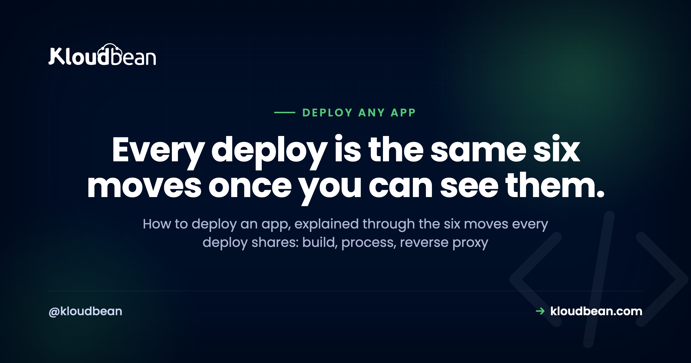

# How to Deploy an App: The Mental Model Behind Every Deploy

Learning how to deploy an app feels like ten different skills because every tutorial teaches a different tool. Docker here, Nginx there, a serverless YAML file somewhere else. It isn't ten skills. It's one model wearing ten costumes.

Under all the tooling, shipping any app to production is the same short chain of moves. You turn source into a build artifact, you run that artifact as a long-running process, you put a reverse proxy in front of it, you attach a domain with SSL, you make sure the process stays alive, and you decide where the data lives. That's it. Learn the chain once and every framework guide you read afterward slots into place. This page teaches the model, then points you to the exact steps for your stack.

> **The short answer:** To deploy an app: build it into an artifact, run that artifact as a long-running process on a server, put a reverse proxy in front so port 443 reaches your app's port, point a domain at it with an auto-renewing SSL certificate, run it under a supervisor that restarts it on crash or reboot, and keep state (database, uploads, cache) outside the app. Every framework is a variation on those six moves.

## The six moves every deployment shares

Start here, because this is the part that actually transfers. A Next.js app, a Django API, a Go binary, and a WordPress site look nothing alike in code. They deploy in almost exactly the same shape. Here's the whole chain in one picture, then we'll walk each link.

<!-- Inline SVG in the HTML version: a deployment pipeline. git push becomes a build artifact, runs as a long-running process on a port, sits behind a reverse proxy on 443, and is served on a domain with SSL. A green supervisor loop restarts the process, and a dashed state band (database, object storage, cache) sits outside the process. -->

Read that diagram top to bottom and you have deployment. Now the detail, because the detail is where first deploys go sideways.

### 1. Turn source into a build artifact

Your repository is not what runs in production. Something has to turn it into a runnable thing first, and what that "thing" is depends on the app. A React or Vue front end compiles to a folder of static HTML, CSS, and JavaScript. A Next.js or Nuxt app produces a server bundle plus static assets. A Go program compiles to a single binary. A Python or PHP app doesn't compile, so the artifact is really "your code plus its installed dependencies at pinned versions." The build step is where `npm run build`, `pip install`, `composer install`, or `go build` happens.

Why this matters: the artifact is what you want to be reproducible. Build it once, the same way every time, and you stop shipping "works on my machine" surprises. This is also why installing dependencies at build time (not hand-copying files) is the norm. It pins what runs.

### 2. Run the artifact as a long-running process

This is the concept that trips up the most people, so slow down here. In development you type `npm run dev` or `python manage.py runserver`, a process starts, and it lives as long as your terminal is open. Production needs the same idea, a process that listens for requests, but running permanently, in the background, on a machine that isn't your laptop.

That process binds to a **port** (say 3000 or 8000) and waits. It does not serve the public directly. It just answers whoever connects to that port on that machine. For Node that process is typically managed by PM2. For Python you're usually running Gunicorn or Uvicorn workers. For a Go binary, it's the binary itself. For PHP and WordPress, PHP-FPM plays this role behind the web server. Different words, same job: a program that stays up and listens.

> **The anti-pattern that eats a whole evening:** shipping the dev server to production. `next dev`, `vite`, and `runserver` are built for reloading your code as you type, not for serving real traffic. They're slower, chattier, and sometimes bind only to localhost so nothing outside can reach them. Build the artifact, then run the production start command (`next start`, Gunicorn, `node server.js`). If you're staring at a page that never loads, this is suspect number two.

### 3. Put a reverse proxy in front

Your app listens on port 3000. The web speaks to ports 80 (HTTP) and 443 (HTTPS). Something has to bridge that gap, and that something is a reverse proxy, usually Nginx. It listens on 443, terminates SSL, and forwards the request to your app on its internal port. On the way back it can gzip responses, serve static files directly, and shield your app from a class of malformed requests.

You rarely configure this by hand on managed hosting, but you should know it exists, because half of all "it works locally but 502s in production" reports trace back to a proxy pointed at the wrong port. When your runtime config asks which port your app listens on, this is why. The proxy needs to know where to forward.

### 4. Attach a domain and turn on SSL

Now make it findable. You point your domain's DNS at the server's public address (an A record for the apex, a CNAME for subdomains), then issue an SSL certificate so the site loads over HTTPS. Let's Encrypt made certificates free and automatic, so there's no excuse for shipping plain HTTP in 2026. The one detail people miss: certificates expire, so you want auto-renewal, not a reminder in your calendar. If you want the mechanics start to finish, we wrote them up in [custom domain and SSL for your app](https://www.kloudbean.com/blog/custom-domain-and-ssl-for-your-app/).

### 5. Keep it alive

Processes die. A bug throws an unhandled exception at 3 a.m., the server reboots after a kernel update, memory runs out. Without a supervisor, a dead process stays dead and your site is down until you notice. A process manager (PM2, systemd, or the platform's own supervisor) watches the process and restarts it: on crash, on reboot, and cleanly on each deploy. This is the difference between "a server" and "a service." A terminal window running your app is not a deployment. It's a demo that ends when you close the lid.

### 6. Decide where state lives

Last move, and the one that quietly ruins the most launches. Your app process should be disposable. You should be able to kill it, rebuild it, and start a fresh copy without losing anything. That's only true if the important stuff lives somewhere else: your database in a managed database, user uploads in [object storage](https://www.kloudbean.com/blog/s3-compatible-object-storage/), sessions and hot data in a cache like Redis.

The classic failure is a SQLite file or an `uploads/` folder sitting on the app server's local disk. It works right up until your first redeploy or a move to a second server, and then it's gone or out of sync. Treat the process as cattle, not a pet, and keep every byte you care about outside it. When you're ready for the real version, [adding a managed database to your app](https://www.kloudbean.com/blog/add-managed-database-to-your-app/) walks the whole thing.

## The one decision that changes everything: what kind of app is it?

The six moves are universal, but how much of each you need depends on one question: what shape is your app? Get this right and the rest of the choices fall out of it. There are really four shapes, and most apps are one of them or a combination.

| App type | What it produces | Needs a long-running process? | What it mostly needs |
|---|---|---|---|
| **Static site / SPA** | HTML, CSS, JS files | No | A web server or CDN, a domain, SSL |
| **Server-rendered (SSR)** | Server bundle + assets | Yes | A Node/PHP/Python process, proxy, domain, SSL |
| **API / backend** | An HTTP service | Yes | A process, a database, env vars, proxy |
| **Worker / background job** | No HTTP surface | Yes (no proxy) | A process + a queue or schedule; no public port |

A pure **static site** (a landing page, a docs site, a built React SPA with no server) is the easy case. There's no process to keep alive because there's nothing to run, just files to serve. You can host it almost anywhere, and Kloudbean's static hosting even bundles a domain, free SSL, and visit analytics at no cost. An **SSR app** like Next.js or a Laravel site does need a process, because pages are rendered on each request. An **API** is a process with no UI, usually the busiest relationship with your database. A **worker** (a queue consumer, a scheduled scraper, a Discord bot) is the odd one out: it needs a process that stays up but no reverse proxy and no public port, because nobody connects to it directly. It reaches out, or it pulls from a queue.

Most real products are a combination: a static or SSR front end, an API behind it, a database under that, and maybe a worker doing the slow jobs. The good news is they can all live on one server. You don't need a microservice diagram to ship your first version. Running [the app, its API, and the database on one server](https://www.kloudbean.com/blog/host-app-api-and-database-on-one-server/) is the sane default until one piece genuinely outgrows the box.

## Environment variables: the config that must not ship in code

Every one of those app types needs configuration that differs between your laptop and production: the database connection string, API keys, the public URL, secret tokens. These belong in **environment variables**, read by the app at runtime, never hard-coded and never committed to Git.

Two reasons this is non-negotiable. First, security: a secret in your repo is a secret in everyone's repo the moment it's cloned, forked, or leaked, and rotating it becomes a code change instead of a config change. Second, portability: the same artifact should run in staging and production unchanged, with only the environment differing. A build baked full of one environment's values can't do that. This is worth getting right early, and it's easy to get wrong in subtle ways, so we gave it a full guide: [environment variables done right](https://www.kloudbean.com/blog/environment-variables-done-right/).

> **A subtle one worth internalizing:** front-end frameworks read some variables at *build* time, not run time. If a Vite or Next.js public variable is missing when the build runs, it bakes in as undefined, and setting it afterward changes nothing until you rebuild. Set build-time variables before the build, not after. This is behind a surprising share of "I set the env var and it still doesn't work" tickets.

## The three ways people actually deploy (and the tradeoffs)

You've got the model. Where do you run it? There are three honest options, and each is right for someone.

**Stay on a platform-as-a-service.** Push to Git, the platform builds and runs it, you never see a server. Vercel, Netlify, Render, Railway, Heroku. This is the fastest way to a URL and genuinely great for front ends and prototypes. The tradeoff shows up later: pricing that scales with success (often per seat, per project, or per request), a backend and database that are the platform's product rather than yours, and limits you only discover when you hit them. Fine to start. Watch the bill and the lock-in.

**Rent a raw VPS.** A bare Linux box from any cloud, cheap and completely yours. The catch is that everything in this article becomes your job: installing the runtime, configuring Nginx, wiring up PM2 or systemd, issuing and renewing SSL, setting up a firewall, and making backups that actually run. It's a real education, and it's a real second job. Great if you want to learn the internals. Rough if you just want your app live and it's 11 p.m.

**Use a managed server.** The middle path, and the one I'd point most people to. You keep the ownership of a VPS (your code, your data, a standard Linux box, a flat price) but the tedious, easy-to-get-wrong parts are handled: the stack is provisioned, the process manager and proxy are set up, SSL is issued and auto-renews, and backups run on a schedule. You get the six moves without hand-rolling each one. That's the path the rest of this guide assumes.

Choosing between them is really a whole decision on its own. If you're weighing it seriously, we put the criteria side by side in [best managed cloud hosting](https://www.kloudbean.com/blog/best-managed-cloud-hosting/).

## How to deploy an app on Kloudbean, concretely

Theory's done. Here's the model made real, on a managed server, with the actual screens. It's the same six moves, most of them handled for you.

### Launch a server and pick your stack

From the dashboard, click **Add Server**. You choose a cloud provider (Kloudbean runs seven: AWS, Amazon Lightsail, Google Cloud, DigitalOcean, Vultr, Akamai Linode, and UpCloud), a location near your users, an application stack (Node, Next.js, React, Vue, Angular, Laravel, Django, Flask, FastAPI, Ruby, Java, WordPress, and more), and a size. Picking the stack here preloads the right runtime, so you're not installing Node or PHP by hand. A few minutes later the server is provisioned and ready.

### Add your application

If you chose a framework while provisioning, your app slot is already there. Need another (a second project, an API beside your front end, a tool like n8n)? Go to **Applications, Add Application** and pick the stack. Multiple apps per server is a first-class feature here, not a workaround, which is exactly how you run a front end, an API, and a worker on one box.

### Connect Git and set the runtime

Deploys come from Git, which is what you want: the repo is the source of truth, not a folder on your laptop. In **Code Delivery, Git Deployment**, connect GitHub (OAuth or an SSH key), paste the repo URL, choose a branch, and clone. Then set the runtime config: the app directory, the port your app listens on, the runtime version, and your install, build, and start commands. Those fields are moves one through three from the diagram, made explicit.

<!-- ADD IMAGE: the runtime configuration panel showing App Directory, Port, runtime version, and the Install / Build / Start commands. -->

### Set environment variables

In **Runtime Configuration, Environment Variables**, add your database URL, API keys, and public app URL. There's a **Paste .env Content** tab so you can drop your whole file in and convert it to key/value. Set them, save, and they're available to the process at runtime without ever touching your code.

### Add a database, then deploy

Move your data off any local file before you have users, not after. Open **Launch Database** and create a managed engine (Kloudbean runs seven: MySQL, MariaDB, PostgreSQL, Redis, Memcached, Elasticsearch, and MongoDB), then feed its credentials into your environment variables. Now click **Pull & Deploy**. Behind the scenes it pulls the code, installs dependencies, runs the build, starts the process under a supervisor, and puts it behind the proxy. That's moves one, two, three, five, and six, in one button.

### Point your domain, then watch it build

Add your custom domain in the app's domain settings, point its DNS at the server, and install a free auto-renewing SSL certificate. Every deploy shows up in **Build & Deployment History** with live logs, so you can watch pull, install, build, and start stream past. Turn on automated deployment and every `git push` ships itself. That's the CI/CD loop the big platforms sell, on a box you own. Automating the deploy earns its keep almost immediately, even solo, while automating the test run only pays off once you have tests worth running, which is the whole split in [whether you actually need CI/CD](https://www.kloudbean.com/blog/do-i-need-cicd/). If you want just that piece, see [CI/CD auto-deploy from GitHub](https://www.kloudbean.com/blog/ci-cd-auto-deploy-from-github/).

<!-- ADD IMAGE: Build & Deployment History with a deploy open and live logs streaming the pull, install, build, and start steps. -->

## When your first deploy breaks (it probably will)

Almost nobody nails a first deploy. That's fine, because the failures are predictable and the model tells you where to look. The single most common one is a **503**, and it's almost never a bug in your code. A 503 means the proxy is up but the process behind it isn't answering, which points straight at move two or the config around it: a missing environment variable, the wrong start command, or the app listening on a different port than the proxy forwards to.

On Kloudbean the answer is usually sitting in the logs at `app.error.log` (via the File Manager, or over SSH under the app's `app-logs` directory). Read the last error, fix the config, redeploy. Nine times out of ten it's one line. We wrote the full triage as [fix the 503 after deploying your app](https://www.kloudbean.com/blog/fix-503-after-deploying-your-app/) because it comes up that often. The habit to build: when something's down, read the process logs first. Guessing is slower.

## Deploy your framework: the route map

Now that the model's in your head, here's where to go for the exact commands for your stack. Each of these is the same six moves with framework-specific install, build, and start steps.

- **Node / Express:** the general case for a JavaScript backend, PM2 and all. Start with [deploy a Node app to managed cloud](https://www.kloudbean.com/blog/deploy-node-app-to-managed-cloud/).
- **Next.js:** SSR, a build step, and a running Node process. See [deploy a Next.js app to your own server](https://www.kloudbean.com/blog/deploy-nextjs-app-to-your-own-server/).
- **Vue:** static build or SSR depending on your setup. See [deploy a Vue app](https://www.kloudbean.com/blog/deploy-vue-app/).
- **Astro:** often static, sometimes hybrid. See [deploy an Astro app](https://www.kloudbean.com/blog/deploy-astro-app/).
- **Django:** Gunicorn, static files, and migrations. See [deploy a Django app](https://www.kloudbean.com/blog/deploy-django-app/).
- **Flask:** the minimal Python service, done right. See [deploy a Flask app](https://www.kloudbean.com/blog/deploy-flask-app/).
- **FastAPI:** Uvicorn workers and async. See [deploy a FastAPI app](https://www.kloudbean.com/blog/deploy-fastapi-app/).
- **Laravel:** PHP-FPM, the artisan migrate step, queues. See [deploy a Laravel app](https://www.kloudbean.com/blog/deploy-laravel-app/).
- **Rails:** Puma, asset precompile, ActiveRecord migrations. See [deploy a Rails app](https://www.kloudbean.com/blog/deploy-rails-app/).
- **Go:** a compiled binary you run on a managed server. See [deploy a Go app](https://www.kloudbean.com/blog/deploy-golang-app/).

Different commands, identical shape. JVM apps fit it too: you build a jar, then run it as a long-lived process behind the proxy, which is the whole of [deploying a Spring Boot app to production](https://www.kloudbean.com/blog/deploy-spring-boot-app/). Once you've done one, the next is mostly "which install and start command does this framework want?"

## The honest limits

Two things worth saying plainly. First, Kloudbean runs **Linux** stacks: Node, PHP, Python, Ruby, Java, Go binaries, and the frameworks built on them. A classic Windows or .NET app expecting IIS and SQL Server isn't a fit as-is; that's a porting conversation, not a deploy. The vast majority of modern apps are the Linux stacks above, so you're very likely fine. Just check before you assume.

Second, "managed" is a division of labor, not magic. The platform provisions the server, the stack, the process manager, the proxy, SSL, and backups. You still own your application: its logic, its data, its security decisions. That's the right split and a genuinely good deal, but it isn't the same as "nothing to think about." You still write the code and decide where the data goes.

---

**You learned the model. Now ship the app.** Deploy from Git onto a managed server you own, with the process manager, reverse proxy, SSL, and backups handled for you. Start at [kloudbean.com](https://www.kloudbean.com/); sizes and plans on [pricing](https://www.kloudbean.com/pricing/).

Seven clouds, one dashboard · Git deploy with live logs · Free auto-renewing SSL · Managed databases · Automatic backups · Free migration · Free trial

## FAQ

**What does it actually mean to deploy an app?**
Deploying an app means taking the code that runs on your machine and making it run for other people on the internet. Concretely: build it into an artifact, run that artifact as a long-running process on a server, put a reverse proxy in front, attach a domain with SSL, keep the process alive with a supervisor, and store your data in a real database rather than a local file. Every framework follows that same shape.

**What's the easiest way to deploy an app for a beginner?**
Start from Git on a platform that builds and runs your app for you, so you don't hand-configure a server. A managed server hits a nice balance: you connect your repo, set a few runtime fields, add environment variables, and click deploy, while the stack, SSL, and backups are handled. That teaches you the model without dropping you into Nginx config on day one.

**Do I need Docker to deploy my app?**
No. Docker packages your app and its dependencies into a container, which is useful for consistency, but it's one way to produce the build artifact, not a requirement. Plenty of production apps deploy straight from source with pinned dependencies and a start command. Learn the six moves first; reach for containers when you actually need the isolation or reproducibility they give you.

**Why does my app work locally but not in production?**
Usually one of three things: an environment variable that's set on your laptop but not on the server, the dev server running instead of the production start command, or the app listening on a different port than the reverse proxy forwards to. The logs almost always name it. Read the process error log first, then fix the config and redeploy.

**What is a reverse proxy and do I have to set one up?**
A reverse proxy (usually Nginx) listens on the public ports 80 and 443, handles SSL, and forwards requests to your app on its internal port. It's what lets a browser reach an app that's listening on, say, port 3000. On a raw VPS you configure it yourself; on managed hosting it's set up for you, and you just tell the platform which port your app uses.

**Where should my database and uploaded files live?**
Outside the app process. Put your data in a managed database and user uploads in object storage, never in a local SQLite file or an uploads folder on the app server's disk. If state lives on the app's local disk, it gets wiped on redeploy and can't be shared across servers. Keeping state external is what makes your app safe to rebuild and scale.

**How do I keep my app running after I close my terminal?**
Run it under a process manager or supervisor, not in a terminal window. PM2 is the common choice for Node, systemd for many others, and PHP-FPM handles this for PHP. The supervisor restarts the app if it crashes and starts it again after a reboot. On managed hosting this is configured for you, which is the difference between a service and a demo.

**Can I run my front end, API, and database on one server?**
Yes, and for most apps you should, at least to start. Add multiple applications to one server and launch a managed database beside them. It's simpler and cheaper than scattering pieces across separate services, and you split something out only when it genuinely outgrows the box. Premature microservices cost more than they save for a young app.

**How do static sites deploy differently from server-rendered apps?**
A static site is just files, so there's no long-running process to keep alive. You serve the built folder from a web server or CDN, attach a domain and SSL, and you're done. A server-rendered app (like Next.js or a Laravel site) renders pages on each request, so it needs a running process, a reverse proxy, and usually a database, the full six moves.

**How do I make my app deploy automatically on every push?**
Connect your Git repository and turn on automated deployment, so a push to your chosen branch triggers a build and ship. That's continuous deployment, and it turns releasing a change into a plain `git push`. On Kloudbean you get live build logs and a deployment history for every release, so you can see exactly what shipped.

---

*Kloudbean · Every deploy is the same six moves once you can see them.*
