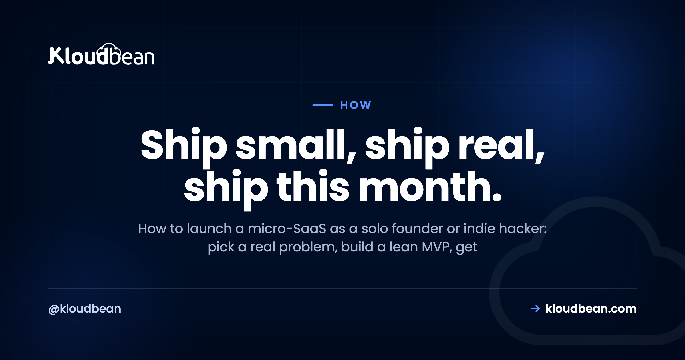

# How to Launch a Micro-SaaS: A Solo Founder's Playbook

By Kloudbean Engineering · Ship small, ship real, ship this month.

So you want to launch a micro-SaaS. One small, focused software product, built and run by a single person or a tiny team, solving a narrow problem for people who'll happily pay for the fix. That's the indie hacker dream, and it's more reachable than the online noise makes it feel. This playbook walks through how to launch a micro-SaaS end to end: finding a real problem, building the smallest thing that solves it, getting the unglamorous production layer right, launching, and earning your first paying customers. No hype, and no shortcuts that bite you three months in.

> **The short version.** Launching a micro-SaaS comes down to five moves: pick a problem you can clearly see, build the smallest version that solves it, put it on a stable setup with a real database and backups, launch before you feel ready, then charge money and improve from what paying users tell you. The order matters more than the tools.

## How to launch a micro-SaaS, in one honest sequence

Most guides make this sound like a growth-hacking funnel. It isn't. It's a short, stubborn loop: find a real problem, build a lean fix, put it somewhere it can run, launch, get people paying, then iterate. Five stages, in that order.

And the order is where people go wrong. The common failure is inverting it: months spent building in private, a beautiful product nobody asked for, then a scramble to find users who never show up. Flip that. The problem comes first, the customers come early, and the code is the part in the middle that you keep as small as you can get away with.

<!-- ADD IMAGE: a clean version of the loop diagram (Real problem -> Lean MVP -> Production layer -> Launch -> Paying users, with a dashed arrow looping back to iterate). Brand colors navy #000f27, purple #4F1AF3, green #40b75f. -->

*Most founders sprint straight to building. The sequence that works starts with a real problem and ends with people who pay, then loops back.*

## First, what a micro-SaaS actually is

A micro-SaaS is a small software-as-a-service product with a deliberately narrow scope, usually built and run by one person or a very small team. It solves one specific problem for one specific audience. Low overhead, tight feature set, no venture funding required. The word "micro" is the point, not a weakness.

This is the natural home of the indie hacker and the solo founder. It often starts as a side project, a thing you build on weekends because a task in your own work is annoying enough to fix. It doesn't need to become a unicorn to be worth doing. A product that quietly helps a few hundred people and pays its own way is a genuinely good outcome, and it's a far more realistic target than the pitch-deck version of a startup.

## Phase 1: Pick a problem you can actually see

Here's an opinion I'll stand behind: most micro-SaaS don't die from a bad tech stack or the wrong host. They die because the founder picked a crowded consumer idea nobody needed, or never shipped at all. Idea selection is where the real risk lives, so spend your judgment here.

The strongest ideas are boring and specific. A repetitive task in an industry you know. A workflow people currently duct-tape together with spreadsheets and copy-paste. A small pain that a particular group feels often enough to pay to remove. Scratch your own itch if you can, because you'll understand the problem without a research budget. Then go talk to five people who have that problem, before you write a line of code. If you can't find five, that tells you something too. If you're stuck for candidates, a walk through [SaaS ideas you can build with AI](https://www.kloudbean.com/blog/saas-ideas-you-can-build-with-ai/) is a decent way to prime the pump, as long as each one still faces the five-people test. A niche directory is one shape of this that works for the same reason, though [launching a directory website](https://www.kloudbean.com/blog/launch-a-directory-website/) lives or dies on whether you can seed the first listings by hand, not on the build.

Avoid the trap of chasing a huge, glamorous market. Big consumer ideas are crowded, hard to reach, and rarely pay per user. A narrow business problem with a clear buyer is a better bet for one person. The worry that "someone already built this" is usually backwards, existing tools mean the problem is real and the money is there. Your edge is focus. If you want a grounded sense of what a small launch really costs before you commit, [the cost of running a side project](https://www.kloudbean.com/blog/cost-of-running-a-side-project/) lays it out without the scare stories.

<!-- ADD IMAGE: a simple shortlist of candidate problems: the pain, who feels it, and how they solve it today. A screenshot of a notes doc or spreadsheet works well here. -->

## Phase 2: Build the smallest thing that solves it

Your MVP is not a smaller version of the grand vision. It's the single workflow that solves the one problem, and nothing else. If your product helps freelancers send reminders about unpaid invoices, the MVP is: import an invoice, set a reminder, send the email. Not teams, not dashboards, not dark mode, not a billing system with seven tiers.

This is the anti-pattern that catches almost everyone, so name it out loud: over-building before a single user exists. It feels productive. You're writing code, adding settings, polishing an admin panel, wiring up features you're sure people will want. But you're guessing, and every feature you add before validation is a feature you might have to rip out. Build the core, ship it ugly, and let real users tell you what's missing.

Use whatever tools get you there quickly. If you're building with AI assistants like Cursor, Lovable, or Bolt, that's fine, they're great for a first version. Just know that AI-generated code needs a real review before it faces users, and getting it live is its own step, which is why [deploying an AI-built app to production](https://www.kloudbean.com/blog/deploy-ai-built-app-to-production/) is worth reading before you ship. Speed to a working MVP beats elegance every time at this stage. And if you can't code at all, these tools are exactly why [building a SaaS without a technical cofounder](https://www.kloudbean.com/blog/how-to-build-a-saas-without-a-technical-cofounder/) is a workable path now, as long as you're honest about the parts that still need a careful review.

## Phase 3: The boring production layer that actually matters

This is the part nobody tweets about, and it's the part that decides whether your launch survives contact with real users. The shortcuts that felt clever in development quietly break in production. A local SQLite file that gets wiped on every redeploy. Secrets committed to your repo. No backups. A serverless setup that cold-starts and drops your background job halfway through.

You don't need much. You need a few things done properly.

| | Fine in development | What production actually needs |
| --- | --- | --- |
| Database | Local SQLite or a file | A managed database that persists and gets backed up |
| Secrets | Hard-coded or in the repo | Environment variables, kept out of your code |
| Process | Runs while your laptop is on | An always-on process that restarts on crash |
| Backups | None, you'll remember | Automatic, and tested at least once |
| HTTPS | Optional on localhost | SSL on your real domain, from day one |
| Deploys | Copy files by hand | A repeatable deploy from your Git repo |

Notice what's still not here: Kubernetes, autoscaling groups, a hand-built private network. You do not need raw cloud complexity to launch, and reaching for it early is its own time sink, which [do I need AWS to launch a SaaS](https://www.kloudbean.com/blog/do-i-need-aws-to-launch-a-saas/) unpacks honestly. The full pre-launch list lives in the [prototype to production checklist](https://www.kloudbean.com/blog/from-prototype-to-production-checklist/).

This right-hand column is exactly what a managed platform hands you, and it's where Kloudbean fits: one dashboard for your app server, a managed database, and object storage, with automatic backups and free SSL handled for you. Your app runs as a persistent process, so there's no cold start on the first request, and you can wire up managed CI/CD straight from GitHub so every push deploys itself. Pricing is flat and starts at $8/mo, which keeps the boring layer boring. If your product leans on AI, the same shape is covered in [hosting for an AI SaaS](https://www.kloudbean.com/blog/best-hosting-for-ai-saas/), and the database side is walked through in [adding a managed database to your app](https://www.kloudbean.com/blog/add-managed-database-to-your-app/). Automating deploys is covered in [CI/CD auto-deploy from GitHub](https://www.kloudbean.com/blog/ci-cd-auto-deploy-from-github/).

<!-- ADD IMAGE: launching a managed database from the dashboard: pick the engine, name it, create. Reuse ../assets/console/launch-database.png if you have it. -->

## Phase 4: Launch before you feel ready

You will not feel ready. Launch anyway. The instinct to polish for another week is almost always fear wearing a productivity costume. A launch isn't a finale, it's the first day your product meets reality, and reality is a better teacher than your own doubts.

Go where your specific audience already gathers. A niche subreddit, a Slack or Discord community, an industry forum, or people you can message one to one. Lead with the problem you solve, not a wall of features. And don't treat launch as a single event. Post again, in different places, over weeks. The first handful of engaged users who actually reply to you is worth more than a traffic spike that bounces.

## Phase 5: Charge from day one and talk to the humans who pay

Charge money sooner than feels comfortable. It's the clearest signal you have that the problem is real. Free users are polite and vague. Paying users are specific, because they've put skin in the game, and their feedback is sharper for it. A simple single plan is enough to start, you can refine pricing once you understand what people value.

Then talk to them. Actually talk. Ask what nearly stopped them from signing up, what they'd tell a colleague, what's missing. This is the loop the diagram at the top is about: paying users feed the next iteration. And it's fine, even good, to learn in week three that people won't pay. That's a cheap lesson early, and an expensive one to discover after six months of building in silence.

## Iterate without drowning in requests

Once users arrive, the requests pour in. Every one sounds reasonable. This is where the "micro" in micro-SaaS earns its keep: your job is to say no to most of it. A focused product that does one thing well beats a bloated one that does ten things adequately, and it's far easier for one person to maintain.

Watch for patterns, not one-off asks. If five different customers hit the same wall, that's a signal. If one loud user wants a feature that pulls you toward a different product, that's a distraction. Keep the scope tight on purpose. Growth for a micro-SaaS usually comes from serving your narrow audience better, not from bolting on adjacent products you can't support alone.

## The mistakes that quietly sink micro-SaaS

If you skim nothing else, remember the ways this goes wrong, because they're predictable. Building for months with no user in sight. Picking a crowded consumer idea because it sounds exciting, when a dull business problem would pay better. Never charging, so you never learn whether anyone values it. And ignoring the boring production layer until a redeploy eats your database on the worst possible day.

None of these are technical problems, really. They're discipline problems. The founders who launch aren't the ones with the cleanest code, they're the ones who kept the scope small, shipped early, and listened to people who paid. The infrastructure just needs to stay out of your way while you do that.

---

**Put your micro-SaaS somewhere it can just run.** When you're ready for the production layer, Kloudbean gives you a managed server, a managed database, backups, and SSL from one dashboard, with simple Git deploys. See [kloudbean.com](https://www.kloudbean.com/) and [pricing](https://www.kloudbean.com/pricing/). One dashboard · Managed databases · Automatic backups · Free SSL · Git deploys · Free trial.

## FAQ

**What is a micro-SaaS?**
A micro-SaaS is a small software-as-a-service product with a narrow focus, usually built and run by one person or a very small team. It solves a specific problem for a specific audience, keeps its feature set deliberately tight, and runs on low overhead. Think one clear job done well, not a sprawling platform.

**How do I come up with a micro-SaaS idea?**
Start from problems you can already see. Look at the annoying, repetitive tasks in your own work or a niche you know well, and notice where people cobble together spreadsheets and manual steps. The strongest ideas are boring and specific, a small pain a particular group feels often. Talk to a few of those people before you write any code.

**How much does it cost to launch a micro-SaaS?**
Less than most people fear. Your real early costs are usually a domain name each year and modest hosting that can start from a few dollars a month. You don't need paid ads, a fancy stack, or a big cloud account to begin. Keep spending lean until real usage tells you where it's worth investing.

**Do I need a co-founder to launch a micro-SaaS?**
No. The whole point of micro-SaaS is that one motivated person can build, ship, and run it. A co-founder can help with skills you lack or with staying motivated, but plenty of these products are solo efforts. Don't let the search for a co-founder become another reason not to start.

**What tech stack should I use for a micro-SaaS?**
The one you already know. Speed to launch matters more than any trendy framework, so reach for the language and tools you already move quickly in. A common, well-supported stack with a normal relational database will carry you a long way. Save the exotic choices for problems you actually hit.

**How long does it take to launch a micro-SaaS?**
It depends on scope, but a tight MVP is often a matter of weeks of focused work, not months. The trap is expanding the scope until launch keeps slipping. Fix a small, clear first version, ship it, and treat everything else as a later iteration.

**Where do I find my first users?**
Go where your specific audience already gathers. That might be a subreddit, a niche community, a Slack or Discord group, or people you can message directly. Show the problem you solve, not a feature list. Early on, a handful of engaged users who give real feedback beats a big anonymous traffic spike.

**When should I start charging for my micro-SaaS?**
Sooner than feels comfortable. Charging early is the clearest signal that you're solving a real problem, and paying users give sharper feedback than free ones. You can start with a simple plan and adjust later. A product nobody will pay for is better to learn about in week three than in month six.

**Do I need to worry about scaling before launch?**
Almost never. Most micro-SaaS products run comfortably on a single modest server for a long time, and premature scaling work is effort stolen from finding users. Get the basics right, a stable database and backups, then scale when real traffic gives you a reason. Solving imaginary scale is a classic way to never launch.

---

*Kloudbean Engineering · The product is the point. Keep the infrastructure quiet and out of your way.*
