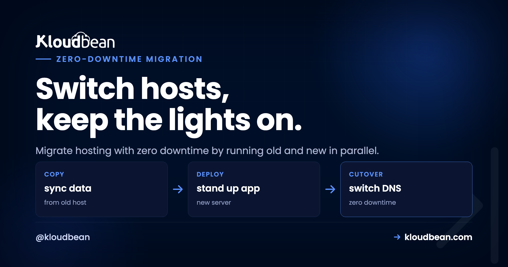
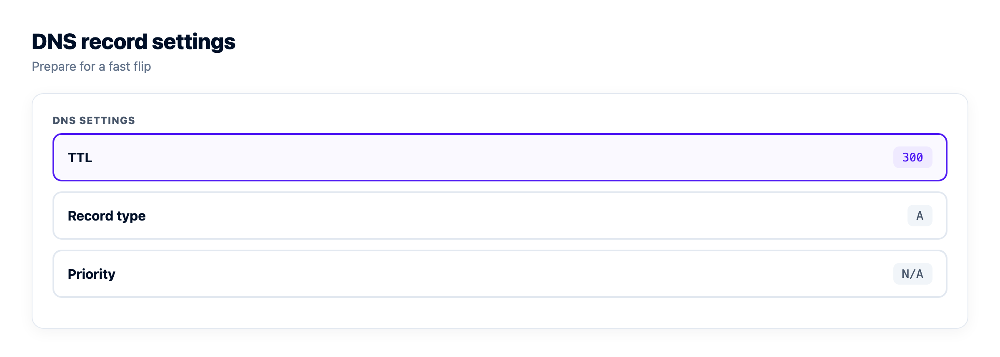
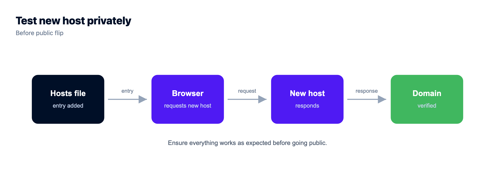
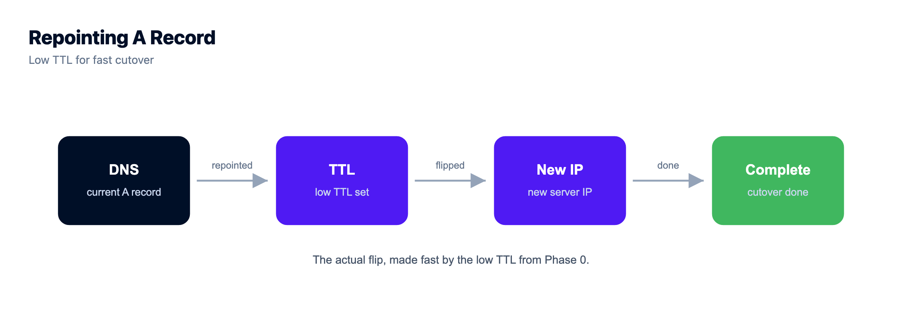

# How to Migrate to a New Host With Zero Downtime

Migrations feel scary for exactly one reason. Downtime. The fear is you'll flip a switch, something won't be ready, and your site sits dark while you sweat over a terminal. But downtime during a migration isn't inevitable. It's almost always the result of doing the steps in the wrong order, not of moving hosts at all.

Get the order right and you can migrate hosting with zero downtime. Your visitors never notice, because the old site keeps serving until the new one is fully proven and traffic quietly moves across. This is the parallel-run playbook, phase by phase, with the real commands and the gotchas that actually bite. Follow it top to bottom and you stay online the entire time.

> **The short version:** Lower your DNS TTL a day early. Build and test the new host in parallel while the old one keeps serving. Do a first data sync, then a final delta sync at cutover. Flip DNS. Keep the old host live through propagation, then decommission it. The secret to zero downtime is parallel-run plus a low TTL, never a big-bang cutover where you tear down the old before the new is proven.

## Why zero-downtime migration is about order, not luck

Almost every "the migration took us down" story is the same story. Someone pointed DNS at a new server that wasn't quite ready, or tore down the old host too soon, or forgot the TTL was set to a full day so the switch dragged on for hours. That's a big-bang cutover: flip everything at once and pray.

Parallel-run is the opposite, and honestly it's the only approach I'd trust on a site people are paying for. You stand up the new host *next to* the old one. Both exist at the same time. The old keeps taking real traffic while you build, load data, and test the new one in private. Only when the new host passes as if it were already live do you move traffic, and even then the old one stays up as a safety net. Nothing gets torn down until the new thing has clearly won.

```
Parallel-run cutover: nobody goes dark      [TTL lowered to 300s, a day early]

                                        | DNS FLIP
  OLD HOST  ##############################|#############=========>  retired
            (serving live traffic the whole time)    \
                                        |              \ traffic moves
  NEW HOST  - - -  building + testing  - |####################>  serving
            (no public traffic yet)      |
            +---------------------------+---------------------------+
              build + test in parallel      flip        propagation
              (old stays live)                         (both serve)
```

## Phase 0: Prep (do this a day early)

The single most important zero-downtime trick happens *before* migration day, not on it:

- [ ] **Lower your DNS TTL.** Find your domain's DNS records and drop the TTL (time to live) to something small. 300 seconds (5 minutes) is a common choice. Do this **at least a day ahead**, so the old, longer TTL has expired in caches everywhere by cutover time. This one step is what turns the final switch from a multi-hour wait into a few minutes.
- [ ] **Inventory what you're moving.** Write it down: application code, the database, uploaded files, environment variables and secrets, cron jobs, background workers. Migrations go wrong because someone forgets a piece, not because they fumble a big one.
- [ ] **Note your current versions.** Language runtime, database engine and version, key extensions. You want the new home to match, so nothing behaves differently after the move.

Ten minutes of inventory here saves the "oh no, the cron jobs" moment on cutover day. And the TTL change genuinely has to happen first, because a TTL is a promise you made to the world's DNS caches yesterday. You can't shorten it retroactively.



## Phase 1: Stand up the new host (in parallel)

Build the destination while the old site keeps running, untouched. Nothing here affects live traffic yet, so there's no clock ticking.

- [ ] **Provision the new server** and deploy your application code by connecting your Git repository.


- [ ] **Copy every environment variable and secret** to match the old host. This is the step most likely to be missed, and a missing secret is a silent failure you won't catch until something tries to use it.
- [ ] **Recreate cron jobs and background workers** so scheduled tasks and queues exist on the new side too.
- [ ] **Provision the database** at the matching engine and version, ready to receive data.


At the end of Phase 1 the new host is a complete, empty copy of your setup. Running, reachable by you, but not yet holding your data or seeing a single real visitor.

## Phase 2: Move the data (first pass)

Now load the data. This first pass can be slow, and that's completely fine, because it's happening in the background while the old site serves normally.

```bash
# PostgreSQL: dump from the old host, load into the new
pg_dump "$OLD_DATABASE_URL" > dump.sql
psql "$NEW_DATABASE_URL" < dump.sql

# MySQL / MariaDB
mysqldump -h OLD_HOST -u USER -p appdb > dump.sql
mysql -h NEW_HOST -u USER -p appdb < dump.sql
```

Then move the files. Sync uploads and any user-generated content across, or (better) point both hosts at the same object storage so there's nothing to sync at all:

```bash
# rsync uploaded files to the new host
rsync -avz ./uploads/ user@NEW_HOST:/var/www/app/uploads/
```

If you'd rather stop syncing files forever, moving uploads to [S3-compatible object storage](https://www.kloudbean.com/blog/s3-compatible-object-storage/) means both the old and new app read from the same bucket, and this whole step disappears.

## Phase 3: Test the new host *before* anyone uses it

This is the phase people skip and then regret. Test the new site as thoroughly as you can **without** touching public DNS.

- [ ] **Preview through your hosts file.** Point your own machine at the new server's IP for the real domain, or use a temporary URL the platform gives you. Now you see the new site exactly as visitors will, but only you can:

```bash
# /etc/hosts on your machine only (revert this after testing)
203.0.113.10   example.com www.example.com
```

- [ ] **Click through everything.** Homepage, logins, forms, checkout, admin, uploads, email sending. Confirm the database connection works and data reads and writes correctly.
- [ ] **Get SSL ready now.** Issue the certificate on the new host for your domain *before* the flip, so HTTPS works the instant traffic arrives. Verify it:

```bash
# confirm HTTPS responds and check the cert dates on the new host
curl -sI https://example.com | head -n 1
openssl s_client -connect example.com:443 -servername example.com </dev/null 2>/dev/null | openssl x509 -noout -dates
```

- [ ] **Fix anything broken now,** while it costs nothing. The old site is still the live one, so a bug you find here is a non-event.

Only move on when the new host passes as if it were already live. This phase is your safety net. Setting up the domain and certificate is covered step by step in [custom domain and SSL for your app](https://www.kloudbean.com/blog/custom-domain-and-ssl-for-your-app/).



## Phase 4: The cutover

Now the actual switch. Because of your prep, it's quick and calm rather than a white-knuckle moment.

- [ ] **Do a final delta sync.** Re-sync the database and files one last time to capture anything that changed since Phase 2 (new orders, new signups, fresh uploads). Briefly pausing writes on the old site during this final sync guarantees nothing is lost in the gap. This is the fix for *database drift*, the data that piles up on the old host while you were testing.
- [ ] **Flip the DNS** to point at the new server's IP. Because you lowered the TTL in Phase 0, the change propagates in minutes, not hours.
- [ ] **Watch both hosts.** Traffic shifts gradually as DNS updates around the world. Keep an eye on the new host's logs for errors as the first real visitors land.

There's no dark period. The old host answers until DNS moves each visitor over to the new one, which you already tested and know is ready.



## Phase 5: After the switch

- [ ] **Keep the old host running** for a few days. DNS caches linger, so a handful of stragglers may still hit the old server until propagation fully completes. Leaving it up means those visitors are served too, instead of hitting a dead address.
- [ ] **Confirm SSL** is valid on the new host and set to auto-renew.
- [ ] **Then decommission** the old host, once traffic there has dropped to zero and you've confirmed the new one is healthy.

Done. If you followed the order, your visitors experienced one continuously working website. They never saw the seam.

## The gotchas that actually bite

These are the specific traps that turn a smooth migration into a bad afternoon. All avoidable:

- **DNS TTL and propagation.** The number one cause of a slow cutover is forgetting to lower the TTL first. If it's still set to 86400 (a day), your flip takes up to a day to finish. Lower it early, always.
- **Database drift during cutover.** Real users keep writing to the old database while you test the new one. Without a final delta sync (and a brief write pause during it), you lose whatever came in during the gap. Do the delta sync last, right before the flip.
- **SSL not ready before the flip.** If the certificate isn't issued on the new host before DNS points at it, the first visitors get a scary browser warning. Issue and verify the cert during Phase 3, not after.
- **Mixed content.** Old sites often hard-code `http://` asset URLs or an old domain. After the move those can break or trigger "not secure" warnings. Grep for them before you flip:

```bash
# find hard-coded http links or the old domain in your code
grep -rn "http://" ./src
grep -rn "old-domain.com" .
```

## Migrating from Heroku (or any PaaS)

If you're doing a Heroku migration specifically, the phases are identical, with one extra thing to watch. A PaaS bundles managed add-ons (Postgres, Redis, a scheduler, workers) that feel invisible until you leave. The most common miss when people migrate from Heroku is forgetting one of those add-ons existed at all.

If you are an agency doing this repeatedly, [migration as a service](https://www.kloudbean.com/blog/agency-migration-service-guide/) covers running it as a scheduled wave and turning it into a client-acquisition wedge.

So during your Phase 0 inventory, list every add-on, not just the app. On the new side you recreate each as a real service: a [managed database](https://www.kloudbean.com/blog/add-managed-database-to-your-app/) for your Postgres, a managed Redis for your cache and queues, cron jobs for the scheduler. Then it's the same parallel-run cutover as everything else. The app code barely changes, because it was reading a `DATABASE_URL` from the environment the whole time.

## Where Kloudbean fits (and the free part)

A migration is a logistics exercise, not a lock-in trap. No good host holds your code or data hostage, and this whole playbook works leaving any host for any other. That said, a few things make the parallel-run approach easier on Kloudbean, and I'd be doing you a disservice not to mention them.

You can build the new home on any of **seven clouds** (AWS, Lightsail, Google Cloud, Linode, Vultr, DigitalOcean, UpCloud), deploy from Git with live build logs, and provision a matching [managed database](https://www.kloudbean.com/blog/managed-vs-unmanaged-hosting/) with automatic [backups](https://www.kloudbean.com/blog/server-backups-guide/) and free SSL, all from one dashboard. And the honest headline for a migration article: **free migration assistance**. You don't have to solo the cutover. If a delta sync or a DNS flip makes you nervous, the team will run it with you. There's related reading in [what a cloud SLA really means](https://www.kloudbean.com/blog/cloud-sla-explained/) and the myths piece on [managed cloud hosting](https://www.kloudbean.com/blog/managed-cloud-hosting-myths/) if lock-in was the worry keeping you put.

<!-- cta:start -->
**A rehoming, not a rewrite.**

Migration assistance is free and there is a free trial to prove the setup first. You keep Git-based deploys, get managed databases beside the app, and pay a flat monthly price on the cloud you choose.

- Free migration assistance
- Free trial
- Seven cloud providers
- Flat monthly price
- Managed databases
- Git deploy

[Start free](https://console.kloudbean.com/register) · [See plans](https://www.kloudbean.com/pricing/)
<!-- cta:end -->

## FAQ

**How do I migrate hosting without downtime?**
Build and fully test the new host before touching public DNS, then switch. The order is: lower your DNS TTL a day early, provision and deploy on the new host in parallel, copy the data, test privately through a hosts-file entry, do a final delta sync, then flip DNS. The old site keeps serving until traffic moves to the proven new one.

**Why do I need to lower the DNS TTL before migrating?**
TTL controls how long DNS answers stay cached. If it's high (say a day), your cutover could take that long to propagate. Lowering it to around 300 seconds a day ahead means the switch takes minutes. You have to do it early, because you can't shorten a TTL that caches already picked up.

**How do I avoid losing data during the cutover?**
Do an initial data copy early, then a final delta sync at cutover to capture anything that changed since. Briefly pausing writes on the old site during that final sync guarantees no new orders or signups are missed. This is what prevents database drift. Then flip DNS.

**Should I keep the old host running after switching?**
Yes, for a few days. DNS changes propagate gradually and some caches linger, so a few visitors may still reach the old server. Keeping it live means they're served normally until propagation completes. Decommission it only once traffic there has stopped and the new host looks healthy.

**Can I migrate a database to a new host without downtime?**
Yes. Load the bulk of the data ahead of time with pg_dump or mysqldump while the old site runs, then do a quick final sync of just the changes at cutover. Matching the database engine and version on the new host first avoids behavior differences. The heavy copy happens in the background, so it doesn't affect the live site.

**How do I migrate from Heroku?**
Use the same parallel-run playbook, and pay special attention to add-ons. List every managed service Heroku gave you (Postgres, Redis, scheduler, workers) during inventory, then recreate each as a real service on the new host. Because your app reads its connections from environment variables, the code barely changes. Then run the normal cutover.

**How long does DNS propagation take?**
With a low TTL set in advance (around 300 seconds), most resolvers pick up the new record within minutes. Without lowering it first, propagation can take as long as the old TTL, up to a full day. That's precisely why lowering the TTL a day early is the first step in the playbook.

**Does Kloudbean help with migration?**
Yes. Kloudbean offers free migration assistance, so you don't have to run the cutover alone. You can build the new host on any of seven clouds, deploy from Git, and provision a managed database with automatic backups and free SSL, then the team can help with the data sync and DNS flip if you want a hand.

---

*By Kloudbean · Switch hosts, keep the lights on.*
