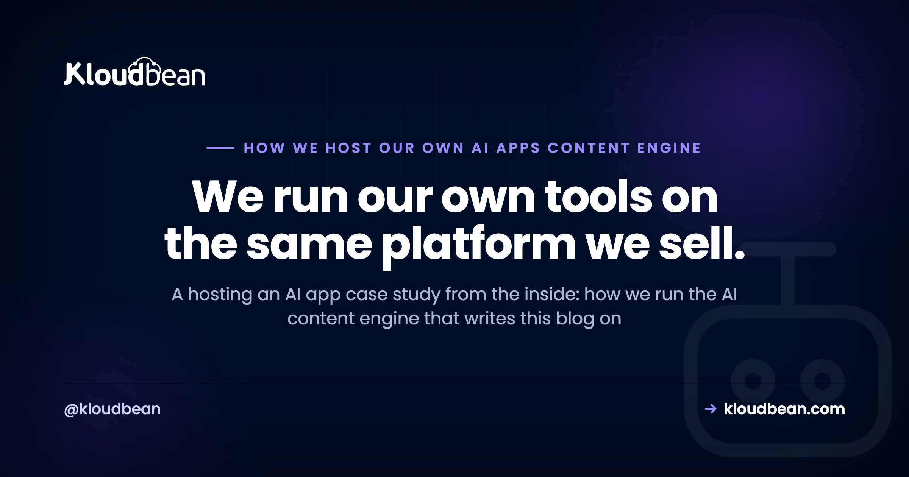

# How We Host Our Own AI Content Engine on Kloudbean: A Real Case Study

Most of the articles on this blog are about running AI apps in production. So it's only fair we show our own. What follows is a hosting an AI app case study told from the inside: the real system that drafts, checks, and ships the guides you're reading. We call it our AI content engine. It's an AI app in the exact sense this blog keeps writing about, and it runs on Kloudbean, so we hit the same problems we keep describing. This is how we host our own AI app, honestly, tradeoffs and all.

No invented numbers here. I'm not going to tell you it made us some percentage faster or saved a tidy dollar figure, because that's not the point and I'd be making it up. The point is the shape of the system: what it's built from, where its data lives, why it never sleeps, and how a git push turns into a published article. If you've read our reference architecture, you'll recognise most of it. This is that architecture, running, with our name on the invoice.

  <strong>The short version</strong>
  
Our AI content engine is an always-on Node app (TanStack Start) that holds the model key, drafts through an external model provider, stores everything in Postgres, and publishes to WordPress. It runs on Kloudbean, auto-deploys from Git, keeps its secrets in dashboard env vars, and stays awake because an autopilot loop runs on a schedule. It's the reference architecture we published, in production.

## The app: our own AI content engine

So what is it? It's the content and knowledge engine that generates and manages the articles on this blog. Give it a topic and some keyword data and it drafts a piece, runs it through a set of quality gates, and, once it clears the bar, publishes. Hundreds of the guides in this library came through it.

Two honest things up front. First, it's an AI app in the plainest sense. It calls an AI model to write drafts, then leans on deterministic checks and human review before anything goes live. It does not publish whatever the model spits out. There's a scored gate in the middle. Second, it was itself built with AI assistance, the same vibe-coded, get-it-working-then-harden-it path this blog keeps writing about in the [last mile of vibe coding](https://www.kloudbean.com/blog/last-mile-of-vibe-coding/). That makes it a fair example rather than a staged one. We didn't build a spotless demo to brag about. We built a tool we needed, shipped it, and have been running it since.

## The stack we chose, and why

The stack is deliberately boring, which is a compliment.

- **TanStack Start** for the app itself: a React frontend with server functions running on Node. One codebase, one process, front and back together.
- **PostgreSQL with the Drizzle ORM** for state. Topics, drafts, scores, publish history, all of it.
- **An OpenAI-compatible model reached through OpenRouter** for the actual drafting. That's the one external brain.
- **Keyword and search data from third-party SEO data APIs**, so topics are grounded in real demand rather than a hunch.
- **Publishing to WordPress through the WordPress REST API**, plus a small custom plugin we wrote for the bits the REST API doesn't cover cleanly.

Nothing here is exotic. That's the point. A React-and-Node app, a relational database, one model provider, a couple of outbound API calls. Squint, and it's the same shape as most of the AI apps we help people host.

<!-- ADD IMAGE: the engine's own dashboard, the topic queue and a draft with its quality score -->

## The architecture, mapped to our reference

We published [a reference architecture for production AI apps](https://www.kloudbean.com/blog/ai-app-reference-architecture/) a while back: a client that talks only to your always-on API, that API holding the model key and making one external hop to a model provider, with a managed database as the system of record. Our engine is a real instance of it. Here's the actual topology.

<!-- DIAGRAM: our AI content engine topology mapped to the reference architecture (rendered as an inline SVG in the .html) -->

Read it left to right. We operate the engine through a dashboard in the browser. The engine is the always-on Node process, and it's the only thing that holds the keys. When it drafts, it makes one call out to the model provider (OpenRouter) and gets tokens back. It calls a SEO data API for keyword numbers. When a draft clears the gate, it publishes to WordPress. Beside it sits Postgres, holding the state.

The key never touches the browser or the repo. It lives in an environment variable on the server, read at runtime, and that's the only place it exists. If you want the reasoning, we wrote it up in [deploying an AI agent without exposing your API keys](https://www.kloudbean.com/blog/deploy-ai-agent-without-exposing-api-keys/). Short version: the browser is public, your repo history is forever, and a leaked model key is someone else's free compute. So the engine is the trusted middle, and everything secret stays inside it.

## Where the data lives: PGlite or managed Postgres

This is a decision we actually had to make, and it's the one most AI-app builders trip on.

State has to live outside the app process. If it lives inside the process, the next deploy takes it with it. We say this constantly, so we hold ourselves to it.

We run it two ways, depending on the setup:

- For **local development and light self-hosting**, it uses PGlite, a file-based Postgres that persists to a directory on the server. That directory survives redeploys as long as you don't delete the app, which makes it genuinely convenient. The catch, plainly: it's lightweight, it lives with the app, and you have to back that directory up yourself. Lose the disk, lose the data.
- For a **sturdier setup**, it connects to a managed Kloudbean PostgreSQL instead. That's the choice we'd point most people to. The database lives on its own, survives anything you do to the app, and gets backups you didn't have to remember to run. See [managed PostgreSQL hosting](https://www.kloudbean.com/blog/managed-postgresql-hosting/) for what that involves.

The managed database is locked down by IP allow-listing. You whitelist the app server's IP so only the engine can connect, and public access is off by default. Not a private network in the fancy sense, just a firewall that says one address is allowed and the rest are refused. Simple, and it does the job.

Because the app opens a connection every time it reaches for the database, we keep a pool in front of Postgres rather than opening a fresh connection per query. [Connection pooling](https://www.kloudbean.com/blog/database-connection-pooling/) explains why that limit bites earlier than you'd expect.

<!-- ADD IMAGE: the Kloudbean console launching a managed PostgreSQL database, showing the connection details panel -->

## Why the engine has to stay always-on

The engine runs an autopilot loop. On a schedule it wakes up, picks work, drafts, scores, and, if a draft clears a minimum quality threshold, moves it toward publishing. There are caps, a daily one and a weekly one, so it can't run away with itself, and nothing passes the gate unless it beats the score bar.

That single design choice, scheduled autonomous work, is why it can't run on something that scales to zero. A function that sleeps when idle would be asleep exactly when the schedule fires. There'd be nothing there to wake itself up. So we need a process that's always running, holding the clock, doing the loop. We made the general argument in [move your AI app off serverless](https://www.kloudbean.com/blog/move-ai-app-off-serverless/), and our own engine is Exhibit A.

Before we let autopilot loose, we ran the same checks we'd tell anyone to run. The [production readiness checklist](https://www.kloudbean.com/blog/ai-app-production-readiness-checklist/) is the list we actually use, not a theoretical one.

## Deployment: the boring Git pipeline

Deployment is intentionally dull. We push to the main branch, and Kloudbean builds and redeploys from Git automatically. No manual copy step, no ssh-in-and-pull ritual.

The config is small enough to write on a napkin:

- Build command: `npm ci && npm run build`
- Start command: `node dist/server/server.js`
- Node version: 22
- The app listens on a port, and every secret (the model key in an `OPENAI_API_KEY`-style variable, the database URL, the SEO data credentials, the WordPress token) is set as an environment variable in the Kloudbean console.

That's it. A Docker option exists too, if you'd rather ship an image, but the plain Node app is what we run day to day. The auto-deploy-from-Git flow is written up in [CI/CD auto-deploy from GitHub](https://www.kloudbean.com/blog/ci-cd-auto-deploy-from-github/), and the discipline of keeping secrets in env vars, never in the code, is in [environment variables done right](https://www.kloudbean.com/blog/environment-variables-done-right/). We follow both because we got tired of the alternatives.

<!-- ADD IMAGE: the Kloudbean Git deployment view with build logs streaming after a push to main -->

## What this hosting an AI app case study taught us

A few things we'd pass on from running our own AI app, rather than just writing about other people's.

**Back up the file-based database, or use the managed one.** PGlite is lovely for getting going, but a file on a disk is a file on a disk. If the data matters, either automate a backup of that directory or move to the managed Postgres and let the platform handle it. We lean managed for anything we'd be sad to lose.

**Secrets belong in the dashboard, not the codebase.** Every key the engine holds is an env var set in the console. None of them live in the repo. This isn't paranoia. A repo gets cloned, shared, and kept forever, and a key in git history is a key you've effectively published.

**Treat the model provider as an external dependency that can be slow or down.** It's one hop out of your control. We wrap those calls in timeouts so a slow provider doesn't hang the whole loop, and we let the gate catch weak output instead of trusting the model blindly.

Now the one firm opinion, because a case study without a position is just a brochure. Run the boring always-on server. Most AI apps, ours included, don't need anything more exotic than a process that stays awake and a database that outlives a deploy. It doesn't need an autoscaling fleet or any serverless choreography. A single always-on Node process, a managed database next to it, secrets in env vars, deploys from Git. That's the whole thing, and it's enough to run a system that writes and ships content every day.

## Where Kloudbean fits, and where it doesn't

Kloudbean hosts the engine and, when we use it, the managed database. It runs the always-on Node process, terminates SSL, handles backups on the managed database, and patches the server underneath. We push code; it runs it.

What it doesn't do, and shouldn't: it doesn't run the model. That's an external API we call out to. And it doesn't write the articles or decide they're good enough. Our code does the drafting logic, the scoring gate, and the publishing, and our data stays ours. Managed means the platform takes the server, the stack, SSL, backups, and patching off our plate. The app and everything it thinks are still on us.

That boundary is the honest part. Kloudbean makes the running easy. It doesn't make a draft accurate or a gate strict. Those are our job, and they stay our job.

  
<strong>Run your own AI app the boring, reliable way: an always-on process with a database that outlives every deploy.</strong>

  
The engine you just read about runs on exactly this setup. Start free at <a href="https://www.kloudbean.com/">kloudbean.com</a>; see plans on <a href="https://www.kloudbean.com/pricing/">pricing</a>.

  
Always-on Node and Python · Managed PostgreSQL · Env vars in the dashboard · Git deploy · Free SSL · Automatic backups · IP allow-listing

## FAQ

**What is this AI content engine?**
It's the content and knowledge engine that drafts, checks, and manages the articles on this blog. It calls an AI model to write drafts, runs them through deterministic quality gates and human review, and publishes the ones that pass. It's an AI app, and it runs on Kloudbean, so it's a real example rather than a staged one.

**What stack does the AI content engine run on?**
It's a TanStack Start app: a React frontend with server functions on Node. State lives in PostgreSQL through the Drizzle ORM. Drafting goes through an OpenAI-compatible model reached via OpenRouter, keyword data comes from third-party SEO data APIs, and publishing happens through the WordPress REST API plus a small custom plugin.

**Why host it on an always-on server instead of serverless?**
Because it runs an autopilot loop on a schedule. A process that scales to zero would be asleep exactly when the schedule needs to fire, so nothing would be there to start the work. An always-on Node process holds the clock and does the loop. Scheduled autonomous work needs a server that never sleeps.

**Does the engine use a managed database or a file-based one?**
Both, depending on the setup. For local development and light self-hosting it uses PGlite, a file-based Postgres that persists to a directory and survives redeploys, though you have to back that directory up yourself. For a sturdier setup it connects to a managed Kloudbean PostgreSQL, which is the option we'd point most people to.

**How is the engine deployed to Kloudbean?**
It auto-deploys from Git. We push to the main branch and Kloudbean builds and redeploys. The build command is npm ci and npm run build, the start command is node dist/server/server.js, it runs on Node 22, and every secret is set as an environment variable in the console. A Docker option exists too.

**Does the engine publish articles automatically?**
Not blindly. It drafts with a model, but nothing goes live unless it clears a minimum quality score, and there are daily and weekly caps on how much it can do. Deterministic gates and human review sit between the model and publishing. Autopilot is gated, not a firehose.

**How do you keep the model API key safe?**
The key lives in an environment variable set in the Kloudbean console, read at runtime by the server. It never goes in the browser and never gets committed to the repo. The always-on engine is the only place that holds it, which is the whole reason the app sits in the middle instead of letting the client call the model.

**Can I self-host something similar?**
Yes. It's an ordinary Node app: build with npm, start the server, set Node 22, put your secrets in env vars, and deploy from Git. Use PGlite for a light setup or a managed PostgreSQL for something sturdier. There's a Docker option if you'd rather ship an image. Nothing about it needs a bespoke platform.

**Did you measure how much faster or cheaper this made things?**
We deliberately didn't publish figures. Any speed or cost number we quoted would be marketing, not measurement, so we left them out. The useful part of this case study is the architecture and the decisions, not a stat we can't stand behind. The system runs, ships content, and survives redeploys, and that's the claim we'll make.

---

*Kloudbean · We run our own tools on the same platform we sell.*
