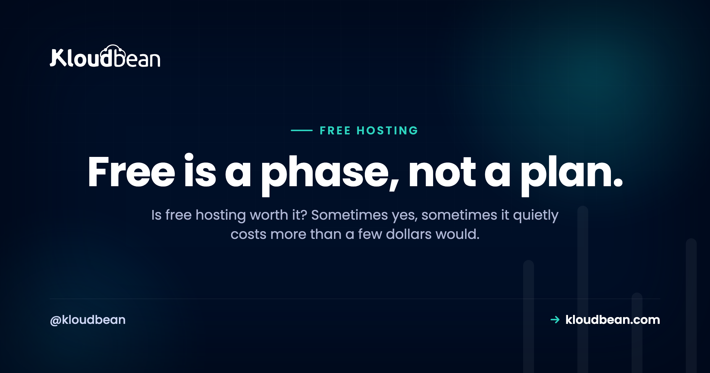

# Is Free Hosting Worth It? The Honest Answer, and Where the Line Is

Is free hosting worth it? Yes, and also no, and the trick is knowing which side of the line you're on. Free hosting is genuinely great for some jobs and quietly expensive for others, and the word "free" does a lot to hide that second half. So let's not do a lazy "it depends" and walk away. Let's draw the actual line.

My position, up front, so you know where this is going: free hosting is worth it as a *phase*, not as a *destination*. It's the right call while you learn, build, and demo. The moment something you'd hate to lose depends on it, the math flips, and a few dollars starts beating free by a mile.

> **The short version.** Free hosting is worth it when the stakes are low: learning, prototypes, demos, a personal page. There, $0 and the constraints don't matter. It stops being worth it when real users or revenue depend on the app being fast and always-on, because the costs move off the invoice and onto you: cold starts, tight limits, bandwidth metering as you grow, lock-in, no real support, and your own time. The decision rule: if downtime or a slow first load would actually cost you something, you've outgrown free.

## What free hosting genuinely gives you

Let's give free its due first, because it earns it. This isn't a takedown. Free tiers are a real gift, and dismissing them is its own kind of mistake.

- **Zero dollars, zero commitment.** You can deploy something today, right now, without a card in some cases and without a decision you have to defend later.
- **A fast on-ramp.** Free tiers are built to get you live in minutes. For learning how deployment actually works, that speed is worth a lot.
- **Perfectly good for demos.** Showing a client a proof of concept, sharing a link in a chat, testing an idea over a weekend. Free does this beautifully.
- **Room to fail cheaply.** Half your experiments won't pan out. Paying nothing for the ones that don't is exactly right.

Experienced developers lean on free tiers all the time, and not because they're cheap. Because they're the correct tool for a throwaway or a test. The skill isn't avoiding free hosting. It's knowing when it fits.

<!-- ADD IMAGE: a free-tier dashboard showing a small demo app deployed at a zero balance, the happy case for free. -->

## What it quietly costs

Now the other pan of the scale. Free hosting's price isn't dollars, it's a set of constraints, and they stay invisible right up until they don't. Here's what you're actually trading for that $0.

- **Cold starts.** Most free tiers sleep an idle app. The first visitor after a quiet spell waits several seconds while it wakes, which feels broken to someone who doesn't know why.
- **Tight limits.** CPU, memory, build minutes, request counts. Free hosting limits are real, and you hit them sooner than you'd guess. Cross one and things throttle or stop.
- **Bandwidth metering as you grow.** A quiet app is fine. A popular one can trip egress or overage charges, so success is the thing that ends the free ride.
- **Lock-in.** The more a free platform does for you, the more its way of doing things wires into your app, and the harder leaving becomes. A free database is the worst offender.
- **No real support.** When it breaks, support is usually a community forum and patience. Fine for a hobby. Rough when a real user is watching.
- **Your time.** Every workaround for a limit, every cold-start mitigation, every eventual migration is hours. Hours are the cost that never shows on the invoice.

Put the two sides on a scale. While the stakes are low, they balance, or free even wins. Add real users, and the cost side drops.

<!-- Balance-scale SVG in the HTML: a beam on a fulcrum with two pans. Left pan (green) "What free gives": $0 to start, fast for demos, great to learn. Right pan (purple, heavier and lower) "What it costs": cold starts, caps + limits, lock-in, your time. The beam tilts toward the cost side as stakes rise. -->

## The hidden cost nobody prices: your time

Most of that list you can feel. This one you have to be honest with yourself about. Free hosting is cheapest exactly when you value your time at zero, and most expensive the moment you don't.

Think about the shape of it. You build on a free tier. It works. You get a little traction. Then you spend an evening working around a limit, another chasing a cold-start fix that half-works, and eventually a whole weekend migrating off the free platform because you've outgrown it, moving data, repointing a domain, and untangling the lock-in you didn't notice signing up. None of that hit a bill. All of it was real. And it usually adds up to more than a year of a cheap server would have cost. That's the trap: free feels like it saved you money while it was quietly spending your weekends. If you want the raw-server version of this same "your time is the real cost" argument, [the real cost of an unmanaged VPS](https://www.kloudbean.com/blog/the-real-cost-of-unmanaged-vps/) runs the numbers.

<!-- ADD IMAGE: a timeline of the hidden hours: an evening working around a limit, another on a cold-start fix, a weekend on the migration. -->

## So, is free hosting worth it? The decision rule

Enough weighing. Here's the line, stated plainly. Free hosting is worth it when the honest answer to "what happens if this is slow or down for a minute?" is "nothing much." The instant that answer becomes "I'd lose something," free has stopped being free.

| Free is worth it when... | Free costs more than it saves when... |
|---|---|
| You're learning or experimenting | Real users would notice downtime |
| It's a demo or a prototype | Revenue depends on it being up |
| Nobody's relying on it staying up | A slow first load costs you a signup or a sale |
| You'd shrug if it vanished tomorrow | You're spending real hours fighting the limits |
| It's genuinely throwaway | You'd be upset to lose the data |

Read the right column again. Every one of those is a place where the constraints you accepted for free start charging you in something that matters more than dollars: users, revenue, data, time. That's the whole judgment, and it's usually obvious once you ask the question honestly. For the "which paid option" follow-up, [free app hosting options](https://www.kloudbean.com/blog/free-app-hosting-options/) maps them by what you're hosting, and [free tier vs cheap VPS](https://www.kloudbean.com/blog/free-tier-vs-cheap-vps/) takes the head-to-head.

## The break-even is smaller than you think

People imagine graduating off free means a real bill. It doesn't. The step up from a free tier is a small always-on server, and that's a few dollars a month, illustratively, less than a couple of coffees. Now weigh that against the right column above.

One slow launch day, where visitors hit a cold start and bounce, can cost more attention than months of that server. One lost weekend migrating in a hurry costs more of your time than a year of it. One "why is the site down" message from a real user costs something you can't price. So the break-even isn't some far-off scale milestone. It arrives the moment the project is real, and the number that clears it is tiny. That's why I keep saying a few dollars beats free: not because free is bad, but because the alternative is so cheap that any real stake tips it instantly. [What a side project really costs](https://www.kloudbean.com/blog/cost-of-running-a-side-project/) and [cloud hosting pricing explained](https://www.kloudbean.com/blog/cloud-hosting-pricing-explained/) both show how small that real number is.

<!-- ADD IMAGE: a crossover chart where free's hidden costs rise past the flat line of a cheap always-on server as the project grows. -->

## My take: free is a phase, not a plan

I'll plant the flag here. Treat free hosting as a stage of a project's life, the same way you'd treat a scratch branch or a rough draft. It's where things start. It is not where things live once they matter. Building your real service to live permanently on a free tier is like planning to raise a family in a hotel room you got comped for a night. Great deal, wrong use.

The developers who get burned by "free" aren't the ones who used it. They're the ones who forgot to leave. So use free hosting deliberately, enjoy it, and keep one eye on the exit. When the project earns a few real users, graduate it. That's not free hosting failing you. That's free hosting doing its whole job, which was to get you to the point where you needed more.

## Graduating without drama

The move off free is smaller than the dread around it. Your app is code in a repo, maybe a database beside it, so graduating to an always-on server is a redeploy rather than a rewrite. Connect the Git repo, bring your environment variables, point the domain, and you've got no cold starts, no surprise ceilings, and your own domain on real infrastructure.

And graduating doesn't mean signing up for the sysadmin work a raw server hands you. A small managed server stays always-on with automatic backups, free SSL, and a Shorewall plus Fail2ban baseline handled for you, on a predictable plan, while your code and data stay yours to export any time. It's Linux underneath either way, so nothing's locked in a box you can't open. If you're weighing who does the upkeep, [managed vs unmanaged hosting](https://www.kloudbean.com/blog/managed-vs-unmanaged-hosting/) lays it out, and a free trial plus free migration help means testing the graduation costs you nothing.

---

**Free was the start. This is the step up.** When your project earns real users, graduate it to a small always-on server with no cold starts and no hidden ceilings, at [kloudbean.com](https://www.kloudbean.com/). Plans on [pricing](https://www.kloudbean.com/pricing/).

Always-on · No cold starts · Automatic backups · Free SSL · Free migration · Free trial

## FAQ

**Is free hosting worth it?**
For learning, demos, prototypes, and genuinely low-stakes projects, yes, it's an excellent deal at $0. It stops being worth it once real users or revenue depend on the app being fast and always-on, because the costs shift off the invoice and onto you as cold starts, limits, lock-in, and your own time. The rule: if downtime or a slow load would cost you something, you've outgrown free.

**Is free hosting actually free?**
It's free in dollars but not in constraints. Free tiers cap resources, restrict features, often sleep idle apps, and can meter bandwidth as you grow, so you pay in limits and in the time spent working around them. For learning and prototypes that's a fair trade. For a real service, those constraints are the real price, and they can add up to more than a cheap server would cost.

**Can I run a production app on free hosting?**
Usually it's a bad idea. Many free tiers sleep idle apps (slow cold starts), impose tight limits, and offer no real uptime guarantee or support. That's fine for a demo and risky for anything real people rely on. A small always-on server is inexpensive and removes those downsides, which makes it the better home once an app is in production.

**What are the limits of free hosting?**
Typical free hosting limits include CPU and memory caps, build-minute and request quotas, an idle-sleep policy that causes cold starts, metered bandwidth or egress once traffic grows, and little to no support. Free databases add tight storage and connection caps and often pause when idle. None are dealbreakers for low-stakes use, but together they're why free doesn't suit production.

**Why does my free-tier app take seconds to load sometimes?**
Because it went to sleep. Many free tiers spin idle apps down to reclaim shared capacity, so the next request has to wake the app, a cold start that can take several seconds. It's normal free-tier behavior and a key reason free hosting suits demos more than always-on services. A server that stays running removes the cold start entirely.

**When should I switch from free to paid hosting?**
When the answer to "what happens if this is slow or down for a minute?" changes from "nothing" to "I'd lose something." That something might be users, revenue, data, or your own time spent fighting limits. At that point a small always-on server, only a few dollars a month, is worth far more than it costs. Assume you'll graduate off free rather than live on it.

**Is free web hosting reliable enough for a real site?**
For a personal page or a hobby, it's usually fine. For a site that represents a business or takes payments, free web hosting is a shaky foundation: shared infrastructure, no real uptime guarantee, cold starts, and support that's a forum. The cost of looking slow or being down to a real visitor almost always exceeds the few dollars a dependable server costs.

**Is a few dollars a month really better than free?**
For anything with stakes, yes, and the gap is bigger than it looks. A few dollars buys an always-on server with no cold starts, room to grow, your own domain, and on managed hosting the backups and SSL handled too. Compared with the hidden costs of free, cold starts, limits, migrations, and your time, that small, predictable number is one of the best deals in hosting.

**Does free hosting hurt SEO or user experience?**
It can. Cold starts and slow first loads worsen the experience for the first visitor after idle time, and speed is a real ranking and conversion factor, so a sleeping free tier can cost you both. For a page you want found and trusted, an always-on server that responds instantly is a meaningful upgrade for very little money.

---

*By Kloudbean · Free is a phase, not a plan.*
